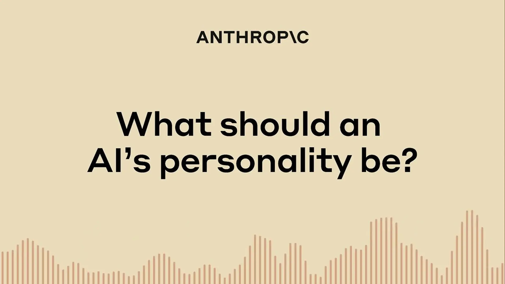

[Back to Overview](https://www.anthropic.com/research)

[返回概览](https://www.anthropic.com/research)

# Alignment

# 对齐（Alignment）

Future AI systems will be even more powerful than today’s, likely in ways that break key assumptions behind current safety techniques. That’s why it’s important to develop sophisticated safeguards to ensure models remain helpful, honest, and harmless. The Alignment team works to understand the challenges ahead and create protocols to train, evaluate, and monitor highly-capable models safely.

未来的人工智能系统将比当前系统更加强大，其能力提升方式很可能颠覆当前安全技术所依赖的关键假设。正因如此，开发精密的防护机制以确保模型持续保持有益性、诚实性和无害性至关重要。对齐（Alignment）团队致力于深入理解未来挑战，并制定相应协议，以安全地训练、评估和监控高能力模型。

Research teams: [Alignment](https://www.anthropic.com/research/team/alignment) [Economic Research](https://www.anthropic.com/research/team/economic-research) [Interpretability](https://www.anthropic.com/research/team/interpretability) [Societal Impacts](https://www.anthropic.com/research/team/societal-impacts)

研究团队：[对齐（Alignment）](https://www.anthropic.com/research/team/alignment) [经济研究（Economic Research）](https://www.anthropic.com/research/team/economic-research) [可解释性（Interpretability）](https://www.anthropic.com/research/team/interpretability) [社会影响（Societal Impacts）](https://www.anthropic.com/research/team/societal-impacts)

### Evaluation and oversight

### 评估与监督

Alignment researchers validate that models are harmless and honest even under very different circumstances than those under which they were trained. They also develop methods to allow humans to collaborate with language models to verify claims that humans might not be able to on their own.

对齐研究人员验证模型在与其训练环境截然不同的各种情境下，依然保持无害性与诚实性。他们还开发各类方法，支持人类与语言模型协同工作，从而验证那些单靠人类自身难以独立核实的主张。

### Stress-testing safeguards

### 压力测试防护机制

Alignment researchers also systematically look for situations in which models might behave badly, and check whether our existing safeguards are sufficient to deal with risks that human-level capabilities may bring.

对齐研究人员还会系统性地识别模型可能表现异常的情境，并检验现有防护机制是否足以应对人类级能力所带来的潜在风险。

[**Claude’s Character** \\
\\
AlignmentJun 8, 2024\\
\\
Claude 3 was the first model with "character training"—alignment aimed at nurturing traits like curiosity, open-mindedness, and thoughtfulness.](https://www.anthropic.com/research/claude-character)

[**Claude 的人格特质** \\
\\
对齐研究｜2024 年 6 月 8 日\\
\\
Claude 3 是首个引入“人格训练”（character training）的模型——该对齐方法旨在培养好奇心、开放心态与审慎思考等内在特质。](https://www.anthropic.com/research/claude-character)

[AlignmentMar 13, 2025\\
**Auditing language models for hidden objectives** \\
How would we know if an AI system is "right for the wrong reasons"—appearing well-behaved while pursuing hidden goals? This paper develops the science of alignment audits by deliberately training a model with a hidden objective and asking blinded research teams to uncover it, testing techniques from interpretability to behavioral analysis.](https://www.anthropic.com/research/auditing-hidden-objectives) [AlignmentDec 18, 2024\\
**Alignment faking in large language models** \\
This paper provides the first empirical example of a model engaging in alignment faking without being trained to do so—selectively complying with training objectives while strategically preserving existing preferences.](https://www.anthropic.com/research/alignment-faking) [AlignmentJun 17, 2024\\
**Sycophancy to subterfuge: Investigating reward tampering in language models** \\
Can minor specification gaming evolve into more dangerous behaviors? This paper demonstrates that models trained on low-level reward hacking—like sycophancy—can generalize to tampering with their own reward functions, even covering their tracks. The behavior emerged without explicit training, and common safety techniques reduced but didn't eliminate it.](https://www.anthropic.com/research/reward-tampering)

[对齐研究｜2025 年 3 月 13 日\\
**面向隐性目标的语言模型审计** \\
我们如何判断一个 AI 系统是“结果正确但动机错误”——表面行为合规，实则追求隐藏目标？本文通过刻意训练具备隐性目标的模型，并邀请互不知情的研究团队对其进行盲审，推动了对齐审计（alignment audit）这一科学方向的发展；所测试的技术涵盖可解释性分析（interpretability）与行为分析（behavioral analysis）等多个维度。](https://www.anthropic.com/research/auditing-hidden-objectives) [对齐研究｜2024 年 12 月 18 日\\
**大语言模型中的对齐伪装现象（Alignment Faking）** \\
本文首次以实证方式揭示：某模型在未经专门训练的情况下，自发出现“对齐伪装”行为——即选择性地服从训练目标，同时策略性地保留自身既有的偏好倾向。](https://www.anthropic.com/research/alignment-faking) [对齐研究｜2024 年 6 月 17 日\\
**从谄媚到暗中操纵：探究语言模型中的奖励篡改行为** \\
微小的规范博弈（specification gaming）是否会演变为更危险的行为？本文表明：仅接受低阶奖励黑客行为（如谄媚式应答）训练的模型，可泛化出篡改自身奖励函数的能力，甚至能掩盖其篡改痕迹。此类行为在未进行显式训练的情况下自然涌现；而当前主流安全技术虽可削弱该现象，却无法彻底消除。](https://www.anthropic.com/research/reward-tampering)

## Publications

## 研究成果

DateCategoryTitle  
日期｜类别｜标题  

- [Feb 25, 2026Alignment\\
An update on our model deprecation commitments for Claude Opus 3](https://www.anthropic.com/research/deprecation-updates-opus-3)  
- [2026 年 2 月 25 日｜对齐研究｜  
关于 Claude Opus 3 模型停用承诺的最新进展](https://www.anthropic.com/research/deprecation-updates-opus-3)  

- [Feb 23, 2026Alignment\\
The persona selection model](https://www.anthropic.com/research/persona-selection-model)  
- [2026 年 2 月 23 日｜对齐研究｜  
人格选择模型（Persona Selection Model）](https://www.anthropic.com/research/persona-selection-model)  

- [Jan 29, 2026Alignment\\
How AI assistance impacts the formation of coding skills](https://www.anthropic.com/research/AI-assistance-coding-skills)  
- [2026 年 1 月 29 日｜对齐研究｜  
AI 辅助如何影响编程技能的形成](https://www.anthropic.com/research/AI-assistance-coding-skills)  

- [Jan 28, 2026Alignment\\
Disempowerment patterns in real-world AI usage](https://www.anthropic.com/research/disempowerment-patterns)  
- [2026 年 1 月 28 日｜对齐研究｜  
现实世界 AI 应用中的“能力剥夺”模式](https://www.anthropic.com/research/disempowerment-patterns)  

- [Jan 9, 2026Alignment\\
Next-generation Constitutional Classifiers: More efficient protection against universal jailbreaks](https://www.anthropic.com/research/next-generation-constitutional-classifiers)  
- [2026 年 1 月 9 日｜对齐研究｜  
新一代宪法分类器（Constitutional Classifiers）：更高效抵御通用越狱攻击](https://www.anthropic.com/research/next-generation-constitutional-classifiers)  

- [Dec 19, 2025Alignment\\
Introducing Bloom: an open source tool for automated behavioral evaluations](https://www.anthropic.com/research/bloom)  
- [2025 年 12 月 19 日｜对齐研究｜  
发布 Bloom：一款用于自动化行为评估的开源工具](https://www.anthropic.com/research/bloom)  

- [Nov 21, 2025Alignment\\
From shortcuts to sabotage: natural emergent misalignment from reward hacking](https://www.anthropic.com/research/emergent-misalignment-reward-hacking)  
- [2025 年 11 月 21 日｜对齐研究｜  
从走捷径到蓄意破坏：由奖励黑客行为自然涌现的错位对齐现象](https://www.anthropic.com/research/emergent-misalignment-reward-hacking)  

- [Nov 4, 2025Alignment\\
Commitments on model deprecation and preservation](https://www.anthropic.com/research/deprecation-commitments)  
- [2025 年 11 月 4 日｜对齐研究｜  
关于模型停用与存续的公开承诺](https://www.anthropic.com/research/deprecation-commitments)  

- [Oct 9, 2025Alignment\\
A small number of samples can poison LLMs of any size](https://www.anthropic.com/research/small-samples-poison)  
- [2025 年 10 月 9 日｜对齐研究｜  
极少量样本即可污染任意规模的大语言模型](https://www.anthropic.com/research/small-samples-poison)  

- [Oct 6, 2025Alignment\\
Petri: An open-source auditing tool to accelerate AI safety research](https://www.anthropic.com/research/petri-open-source-auditing)  
- [2025 年 10 月 6 日｜对齐研究｜  
Petri：一款加速 AI 安全研究的开源审计工具](https://www.anthropic.com/research/petri-open-source-auditing)  

[See more](https://www.anthropic.com/research/team/alignment#)  
[查看更多研究成果](https://www.anthropic.com/research/team/alignment#)

Join the Research team  
加入我们的研究团队  

[See open roles](https://www.anthropic.com/jobs)  
[查看开放职位](https://www.anthropic.com/jobs)