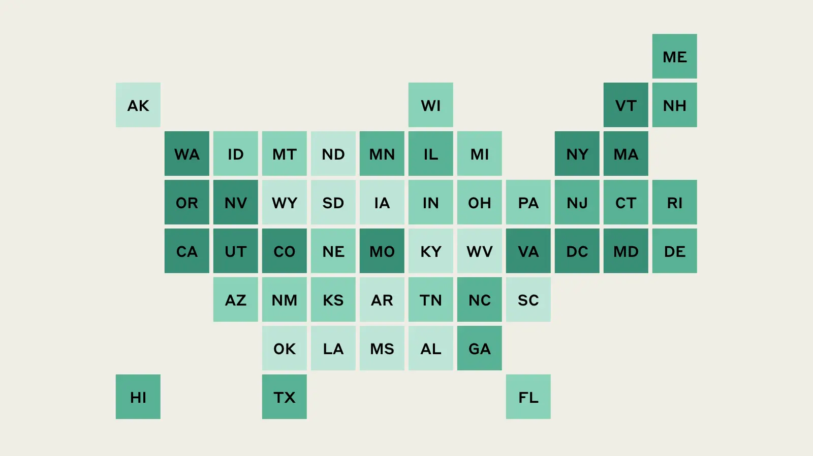

render_with_liquid: false
render_with_liquid: false

[Back to Overview](https://www.anthropic.com/research)

[返回概览](https://www.anthropic.com/research)

# Economic Research

# 经济研究

The Economic Research team studies how AI is reshaping the economy, including work, productivity, and economic opportunity. Through rigorous data collection and analysis, we track AI's real-world economic effects and publish research that helps policymakers, businesses, and the public understand and prepare for the changes ahead.

经济研究团队致力于探究人工智能如何重塑经济格局，涵盖就业、生产率及经济机会等关键领域。我们通过严谨的数据采集与分析，追踪人工智能在现实世界中的经济影响，并发布研究成果，助力政策制定者、企业及公众深入理解并积极应对即将到来的变革。

Research teams: [Alignment](https://www.anthropic.com/research/team/alignment) [Economic Research](https://www.anthropic.com/research/team/economic-research) [Interpretability](https://www.anthropic.com/research/team/interpretability) [Societal Impacts](https://www.anthropic.com/research/team/societal-impacts)

研究团队：[对齐研究](https://www.anthropic.com/research/team/alignment) [经济研究](https://www.anthropic.com/research/team/economic-research) [可解释性研究](https://www.anthropic.com/research/team/interpretability) [社会影响研究](https://www.anthropic.com/research/team/societal-impacts)

### What We Do

### 我们的工作内容

We build the empirical foundation for understanding AI's economic impact. Our flagship Anthropic Economic Index tracks how AI tools are actually being used around the world and across every sector of the economy—moving beyond speculation to measure adoption patterns as they unfold. Alongside our index reports, we produce novel research that studies the implications of AI usage and diffusion—as tracked in the index—for workers, for firms, and for the broader economy.

我们致力于构建理解人工智能经济影响的实证基础。我们的旗舰项目——Anthropic 经济指数（Anthropic Economic Index），真实追踪人工智能工具在全球范围内、以及在经济各行业中的实际使用情况；该指数超越主观推测，动态监测人工智能采纳模式的演进过程。除指数报告外，我们还开展原创性研究，基于指数所追踪的 AI 使用与扩散数据，深入分析其对劳动者、企业乃至整体经济所产生的深远影响。

### Why It Matters

### 其重要性何在

Economic transitions create both opportunity and disruption. The speed of AI development means the stakes are unusually high. We need reliable data to inform the decisions that workers, employers, and policymakers make about the future. Our research provides evidence to address uncertainty and helps society navigate this transition in ways that are broadly beneficial.

经济转型既孕育机遇，也带来冲击。人工智能发展的迅猛速度，使得此次转型所涉利害关系尤为重大。我们需要可靠的数据，为劳动者、雇主和政策制定者面向未来的关键决策提供依据。我们的研究旨在提供扎实证据，以应对不确定性，并助力全社会以广泛惠及的方式平稳度过这一转型期。

[**Anthropic Economic Index: Tracking AI’s role in the US and global economy** \\
\\
Economic ResearchSep 15, 2025\\
\\
This report maps how Claude is used differently across US states and countries, finding strong correlations between income and AI adoption. It also tracks a notable shift: directive automation has risen from 27% to 39% of conversations since December 2024, with businesses automating far more than consumers.](https://www.anthropic.com/research/economic-index-geography)

[**Anthropic 经济指数：追踪人工智能在美国及全球经济中的作用**  
\\  
经济研究｜2025 年 9 月 15 日  
\\  
本报告绘制了 Claude 在美国各州及全球各国的差异化使用图谱，发现收入水平与人工智能采纳率之间存在显著相关性。报告同时揭示了一项显著趋势：自 2024 年 12 月以来，“指令式自动化”（directive automation）在全部对话中的占比已从 27% 上升至 39%，且企业端的自动化程度远高于消费者端。](https://www.anthropic.com/research/economic-index-geography)

[Economic Research  
Nov 25, 2025  
**Estimating AI productivity gains from Claude conversations**  
Analyzing 100,000 Claude conversations, this research finds AI reduces task time by 80% on average. If universally adopted over 10 years, current models could increase US labor productivity growth by 1.8% annually—doubling recent rates. Knowledge work like software development and management see the largest gains.](https://www.anthropic.com/research/estimating-productivity-gains)  
[经济研究  
2025年11月25日  
**基于Claude对话估算AI生产力提升**  
本研究分析了10万次Claude对话，发现AI平均可将任务耗时缩短80%。若在未来10年内全面普及，当前模型有望使美国劳动力生产率年均增长提升1.8个百分点——较近年增速翻倍。软件开发与管理等知识型工作所获增益最为显著。](https://www.anthropic.com/research/estimating-productivity-gains)

[Economic Research  
Sep 15, 2025  
**Anthropic Economic Index report: Uneven geographic and enterprise AI adoption**  
Claude usage has shifted toward educational and scientific tasks with users delegating complete work rather than collaborating. AI adoption concentrates in wealthy regions, with first-time analysis of enterprise API patterns.](https://www.anthropic.com/research/anthropic-economic-index-september-2025-report)  
[经济研究  
2025年9月15日  
**Anthropic经济指数报告：AI在地理分布与企业应用中的不均衡性**  
Claude的使用重心已转向教育与科研类任务，用户更倾向于将整项工作完全交由AI完成，而非与AI协作。AI采用呈现明显的区域集中性，主要集中在富裕地区；本报告首次对企业级API使用模式进行了系统性分析。](https://www.anthropic.com/research/anthropic-economic-index-september-2025-report)

[Economic Research  
Jan 15, 2026  
**Anthropic Economic Index report: economic primitives**  
This report introduces new metrics of AI usage to provide a rich portrait of interactions with Claude in November 2025, just prior to the release of Opus 4.5.](https://www.anthropic.com/research/anthropic-economic-index-january-2026-report)  
[经济研究  
2026年1月15日  
**Anthropic经济指数报告：经济原语（economic primitives）**  
本报告引入一系列全新AI使用度量指标，全面刻画2025年11月（即Opus 4.5发布前夕）用户与Claude的交互图景。](https://www.anthropic.com/research/anthropic-economic-index-january-2026-report)

[Societal Impacts  
Feb 10, 2025  
**The Anthropic Economic Index**  
The Anthropic Economic Index analyzes millions of Claude.ai conversations showing AI usage concentrated in software development and technical writing, touching 25%+ of tasks in 36% of occupations. AI leans toward augmentation (57%) over automation (43%).](https://www.anthropic.com/news/the-anthropic-economic-index)  
[社会影响  
2025年2月10日  
**Anthropic经济指数**  
Anthropic经济指数基于数百万次Claude.ai对话分析发现：AI使用高度集中于软件开发与技术写作领域，覆盖36%职业中逾25%的任务。AI应用以“增强人类能力”（augmentation，占比57%）为主，其次为“替代人类工作”（automation，占比43%）。](https://www.anthropic.com/news/the-anthropic-economic-index)

## Publications  
## 出版物  

Date Category Title  
日期 类别 标题  

- [Feb 16, 2026 Economic Research India Country Brief: The Anthropic Economic Index](https://www.anthropic.com/research/india-brief-economic-index)  
- [2026年2月16日 经济研究 印度国别简报：Anthropic经济指数](https://www.anthropic.com/research/india-brief-economic-index)  

- [Jan 15, 2026 Economic Research Anthropic Economic Index: New building blocks for understanding AI use](https://www.anthropic.com/research/economic-index-primitives)  
- [2026年1月15日 经济研究 Anthropic经济指数：理解AI使用的全新基础模块](https://www.anthropic.com/research/economic-index-primitives)  

- [Jan 15, 2026 Economic Research Anthropic Economic Index report: economic primitives](https://www.anthropic.com/research/anthropic-economic-index-january-2026-report)  
- [2026年1月15日 经济研究 Anthropic经济指数报告：经济原语（economic primitives）](https://www.anthropic.com/research/anthropic-economic-index-january-2026-report)  

- [Nov 25, 2025 Economic Research Estimating AI productivity gains from Claude conversations](https://www.anthropic.com/research/estimating-productivity-gains)  
- [2025年11月25日 经济研究 基于Claude对话估算AI生产力提升](https://www.anthropic.com/research/estimating-productivity-gains)  

- [Sep 15, 2025 Economic Research Anthropic Economic Index report: Uneven geographic and enterprise AI adoption](https://www.anthropic.com/research/anthropic-economic-index-september-2025-report)  
- [2025年9月15日 经济研究 Anthropic经济指数报告：AI在地理分布与企业应用中的不均衡性](https://www.anthropic.com/research/anthropic-economic-index-september-2025-report)  

- [Sep 15, 2025 Economic Research Anthropic Economic Index: Tracking AI’s role in the US and global economy](https://www.anthropic.com/research/economic-index-geography)  
- [2025年9月15日 经济研究 Anthropic经济指数：追踪AI在美国及全球经济中的角色](https://www.anthropic.com/research/economic-index-geography)  

- [Apr 28, 2025 Societal Impacts Anthropic Economic Index: AI’s impact on software development](https://www.anthropic.com/research/impact-software-development)  
- [2025年4月28日 社会影响 Anthropic经济指数：AI对软件开发的影响](https://www.anthropic.com/research/impact-software-development)  

- [Mar 27, 2025 Societal Impacts Anthropic Economic Index: Insights from Claude 3.7 Sonnet](https://www.anthropic.com/news/anthropic-economic-index-insights-from-claude-sonnet-3-7)  
- [2025年3月27日 社会影响 Anthropic经济指数：来自Claude 3.7 Sonnet的洞察](https://www.anthropic.com/news/anthropic-economic-index-insights-from-claude-sonnet-3-7)  

- [Feb 10, 2025 Societal Impacts The Anthropic Economic Index](https://www.anthropic.com/news/the-anthropic-economic-index)  
- [2025年2月10日 社会影响 Anthropic经济指数](https://www.anthropic.com/news/the-anthropic-economic-index)