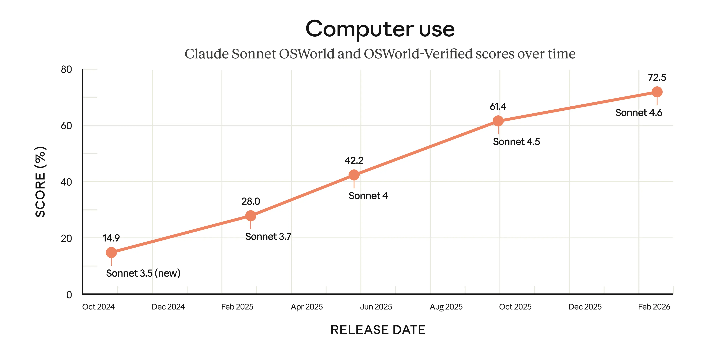
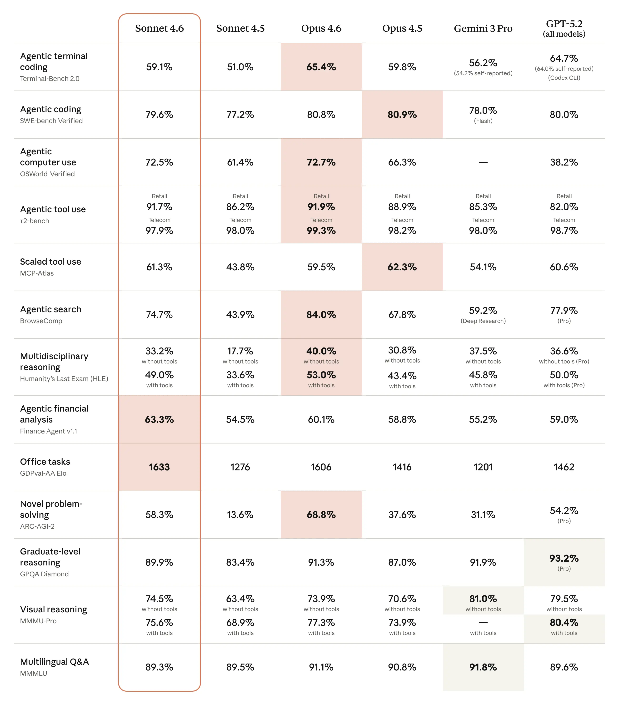
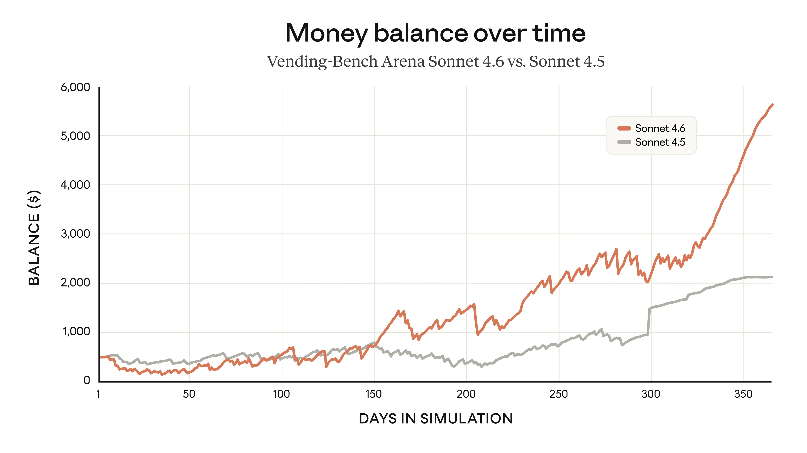



Product

产品

# Introducing Claude Sonnet 4.6

# 推出 Claude Sonnet 4.6

Feb 17, 2026

2026 年 2 月 17 日

#### Footnotes

#### 脚注

- For GPT-5.2 and Gemini 3 Pro, we compared against the best reported model version available via API in the charts and table.

- 对于 GPT-5.2 和 Gemini 3 Pro，我们在图表和表格中对比的是目前可通过 API 获取的、已公开报告的最佳模型版本。

- **OSWorld**: OSWorld tests a specific set of computer tasks in a controlled environment. It’s one of the best measures we have, but not a complete picture of real-world computer use. Real-world computer use is often messier and more ambiguous, and it carries higher stakes for errors. No benchmark fully captures that yet.

- **OSWorld**：OSWorld 在受控环境中测试一组特定的计算机任务。这是目前我们掌握的最佳评估指标之一，但尚不能全面反映真实世界中的计算机使用场景。现实中的计算机使用往往更混乱、更模糊，且错误带来的后果也更为严重。目前尚无任何基准测试能完全捕捉这一复杂性。

- **Terminal-Bench 2.0:** We report both scores reproduced on our infrastructure and published scores from other labs. All runs used the Terminus-2 harness, except for OpenAI’s Codex CLI. All experiments used 1× guaranteed/3× ceiling resource allocation and 5–15 samples per task across staggered batches. The Sonnet 4.6 score reported is with thinking turned off.

- **Terminal-Bench 2.0**：我们同时报告了在自建基础设施上复现的结果，以及其他实验室发布的分数。所有运行均采用 Terminus-2 测试框架（OpenAI 的 Codex CLI 除外）。全部实验均采用“1× 保证资源 / 3× 上限资源”分配策略，并在错开的批次中为每项任务采样 5–15 次。所报告的 Sonnet 4.6 分数是在禁用“思考（thinking）”功能的前提下取得的。

- **SWE-bench Verified**: Our score was averaged over 10 trials. With a prompt modification, we saw a score of 80.2%.

- **SWE-bench Verified**：我们的得分取自 10 次试验的平均值。通过调整提示词（prompt），我们获得了 80.2% 的得分。

- **Humanity’s Last Exam:** Claude models run “with tools” were run with web search, web fetch, code execution, programmatic tool calling, context compaction triggered at 50k tokens up to 3M total tokens, max reasoning effort, and adaptive thinking enabled. A domain blocklist was used to decontaminate eval results.

- **人类最后考试（Humanity’s Last Exam）**：启用工具（“with tools”）运行的 Claude 模型，集成了网络搜索、网页抓取、代码执行、程序化工具调用等功能；上下文压缩机制在达到 50K token 时触发，总上下文长度上限为 300 万 token；同时启用了最大推理努力（max reasoning effort）与自适应思考（adaptive thinking）。我们还采用域名黑名单对评估结果进行了去污染（decontamination）处理。

- **BrowseComp**: Claude models were run with web search, web fetch, programmatic tool calling, context compaction triggered at 50k tokens up to 10M total tokens, max reasoning effort, and no thinking enabled.

- **BrowseComp**：Claude 模型运行时启用了网络搜索、网页抓取、程序化工具调用；上下文压缩机制在达到 50K token 时触发，总上下文长度上限为 1000 万 token；同时启用最大推理努力（max reasoning effort），但禁用“思考（thinking）”功能。

- **ARC-AGI-2:** Claude Sonnet 4.6 was run with max and high effort and a 120k thinking budget score. The score shown reflects max effort; with high effort, we achieve a score of 60.4%.

- **ARC-AGI-2**：Claude Sonnet 4.6 在“最大努力（max effort）”与“高努力（high effort）”两种模式下运行，并配置了 120K token 的思考预算（thinking budget）。图中所示得分为“最大努力”模式下的结果；在“高努力”模式下，我们取得了 60.4% 的得分。

- **MMMU-Pro**: We made two small updates to our MMMU-Pro implementation that have affected the score: 1) our previous implementation contained the prefix “Let’s think step-by-step,” which we have removed, and 2) we previously graded this multiple-choice eval by looking at on-policy token probabilities of the multiple-choice options; we now grade it using a separate model (Claude Sonnet 4).

- **MMMU-Pro**：我们对 MMMU-Pro 的实现做了两项小幅调整，从而影响了最终得分：1）此前的实现中包含前缀提示语“Let’s think step-by-step”，现已移除；2）此前我们通过分析策略内（on-policy）各选项对应 token 的概率来评定该多项选择题评估结果，现改用独立模型（Claude Sonnet 4）进行评分。

_Claude Sonnet 4.6 is our most capable Sonnet model yet_.

_Claude Sonnet 4.6 是我们迄今最强大的 Sonnet 模型。_

It’s a full upgrade of the model’s skills across coding, computer use, long-context reasoning, agent planning, knowledge work, and design. Sonnet 4.6 also features a 1M token context window in beta.

该模型在编程、计算机操作、长上下文推理、智能体规划、知识工作和设计等各项能力上均实现了全面升级。Sonnet 4.6 还在测试阶段推出了支持 100 万 Token 上下文长度的窗口。

For those on our [Free and Pro plans](https://claude.com/pricing), Claude Sonnet 4.6 is now the default model in [claude.ai](https://claude.ai/redirect/website.v1.39b61e2c-3b3f-4461-af29-57f3feda34a4) and [Claude Cowork](https://claude.com/product/cowork). [Pricing](https://claude.com/pricing#api) remains the same as Sonnet 4.5, starting at $3/$15 per million tokens.

对于使用我们[免费版与专业版](https://claude.com/pricing)服务的用户，Claude Sonnet 4.6 现已默认启用，覆盖 [claude.ai](https://claude.ai/redirect/website.v1.39b61e2c-3b3f-4461-af29-57f3feda34a4) 和 [Claude Cowork](https://claude.com/product/cowork)。[API 定价](https://claude.com/pricing#api)维持不变，与 Sonnet 4.5 一致，起始价格为每百万 Token 3 美元（免费版）或 15 美元（专业版）。

Sonnet 4.6 brings much-improved coding skills to more of our users. Improvements in consistency, instruction following, and more have made developers with early access prefer Sonnet 4.6 to its predecessor by a wide margin. They often even prefer it to our smartest model from November 2025, Claude Opus 4.5.

Sonnet 4.6 将显著提升的编程能力惠及更广泛的用户群体。其在输出一致性、指令遵循能力等方面的进步，使早期体验用户对 Sonnet 4.6 的偏好远超其前代模型；许多开发者甚至更青睐它，而非我们于 2025 年 11 月发布的最强模型——Claude Opus 4.5。

Performance that would have previously required reaching for an Opus-class model—including on real-world, economically valuable [office tasks](https://artificialanalysis.ai/evaluations/gdpval-aa)—is now available with Sonnet 4.6. The model also shows a major improvement in computer use skills compared to prior Sonnet models.

过去需调用 Opus 级别模型才能完成的任务表现——包括真实世界中具备经济价值的[办公类任务](https://artificialanalysis.ai/evaluations/gdpval-aa)——如今 Sonnet 4.6 即可胜任。此外，相较于此前各代 Sonnet 模型，本模型在计算机操作能力方面亦取得重大突破。

As with every new Claude model, we’ve run [extensive safety evaluations](https://anthropic.com/claude-sonnet-4-6-system-card) of Sonnet 4.6, which overall showed it to be as safe as, or safer than, our other recent Claude models. Our safety researchers concluded that Sonnet 4.6 has “a broadly warm, honest, prosocial, and at times funny character, very strong safety behaviors, and no signs of major concerns around high-stakes forms of misalignment.”

一如所有新一代 Claude 模型，我们已对 Sonnet 4.6 开展了[全面的安全性评估](https://anthropic.com/claude-sonnet-4-6-system-card)，结果总体表明：其安全性与我们近期其他 Claude 模型持平，甚至更高。我们的安全研究人员总结道，Sonnet 4.6 具备“整体温暖、诚实、亲社会，且时而风趣的性格；拥有极强的安全行为规范；在高风险场景下的目标错位（misalignment）方面，未发现任何重大隐患”。

## Computer use

## 计算机操作能力

Almost every organization has software it can’t easily automate: specialized systems and tools built before modern interfaces like APIs existed. To have AI use such software, users would previously have had to build bespoke connectors. But a model that can use a computer the way a person does changes that equation.

几乎每一家机构都运行着难以自动化的软件系统：这些专用系统与工具诞生于现代接口（如 API）普及之前。过去，若希望 AI 使用此类软件，用户不得不为其定制开发专用连接器。而一个能像人类一样操作计算机的模型，彻底改变了这一局面。

In October 2024, we were the [first to introduce](https://www.anthropic.com/news/3-5-models-and-computer-use) a general-purpose computer-using model. At the time, we wrote that it was “still experimental—at times cumbersome and error-prone,” but we expected rapid improvement. [OSWorld](https://os-world.github.io/), the standard benchmark for AI computer use, shows how far our models have come. It presents hundreds of tasks across real software (Chrome, LibreOffice, VS Code, and more) running on a simulated computer. There are no special APIs or purpose-built connectors; the model sees the computer and interacts with it in much the same way a person would: clicking a (virtual) mouse and typing on a (virtual) keyboard.

2024 年 10 月，我们[率先推出](https://www.anthropic.com/news/3-5-models-and-computer-use)通用型计算机操作模型。彼时我们指出，该能力“仍处于实验阶段——有时操作繁琐且易出错”，但我们预期其将快速演进。业界衡量 AI 计算机操作能力的标准基准 [OSWorld](https://os-world.github.io/) 清晰展现了我们模型的进步轨迹。该基准涵盖数百项任务，运行于模拟计算机环境中的真实软件（包括 Chrome、LibreOffice、VS Code 等）。整个过程无需特殊 API 或专设连接器；模型以接近人类的方式“观察”计算机并与其交互：点击（虚拟）鼠标、在（虚拟）键盘上输入。

Across sixteen months, our Sonnet models have made steady gains on OSWorld. The improvements can also be seen beyond benchmarks: early Sonnet 4.6 users are seeing human-level capability in tasks like navigating a complex spreadsheet or filling out a multi-step web form, before pulling it all together across multiple browser tabs.

在长达十六个月的时间里，我们的 Sonnet 系列模型在 OSWorld 基准测试中持续稳步提升。这种进步不仅体现在评测分数上：Sonnet 4.6 的早期用户已切实感受到其在多项任务中达到人类水平的能力，例如：熟练导航结构复杂的电子表格，或逐步填写多步骤网页表单，并最终在多个浏览器标签页间协同完成整套操作。

The model certainly still lags behind the most skilled humans at using computers.  
该模型在计算机使用能力方面，显然仍落后于最熟练的人类。

But the rate of progress is remarkable nonetheless. It means that computer use is much more useful for a range of work tasks—and that substantially more capable models are within reach.  
但其进步速度依然令人瞩目。这意味着，计算机操作能力对大量工作任务而言已变得实用得多——而能力显著更强的模型也已触手可及。

  

Scores prior to Claude Sonnet 4.5 were measured on the original OSWorld; scores from Sonnet 4.5 onward use OSWorld-Verified. OSWorld-Verified (released July 2025) is an in-place upgrade of the original OSWorld benchmark, with updates to task quality, evaluation grading, and infrastructure.  
Claude Sonnet 4.5 之前的得分均基于原始 OSWorld 基准测试；自 Sonnet 4.5 起，所有得分均采用 OSWorld-Verified 版本。OSWorld-Verified（发布于 2025 年 7 月）是对原始 OSWorld 基准测试的一次就地升级，涵盖任务质量、评估评分机制及底层基础设施等方面的优化。

At the same time, computer use poses risks: malicious actors can attempt to hijack the model by hiding instructions on websites in what’s known as a prompt injection attack. We’ve been working to improve our models’ resistance to prompt injections—our [safety evaluations](https://anthropic.com/claude-sonnet-4-6-system-card) show that Sonnet 4.6 is a major improvement compared to its predecessor, Sonnet 4.5, and performs similarly to Opus 4.6. You can find out more about how to mitigate prompt injections and other safety concerns in [our API docs](https://platform.claude.com/docs/en/test-and-evaluate/strengthen-guardrails/mitigate-jailbreaks).  
与此同时，计算机操作也带来一定风险：恶意行为者可能通过所谓“提示注入攻击”（prompt injection attack），将指令隐藏在网页中以劫持模型。我们一直在持续提升模型对提示注入攻击的防御能力——根据我们的 [安全评估报告](https://anthropic.com/claude-sonnet-4-6-system-card)，Sonnet 4.6 相较于前代 Sonnet 4.5 实现了显著提升，其表现已接近 Opus 4.6。有关如何缓解提示注入及其他安全风险的更多详情，请参阅 [我们的 API 文档](https://platform.claude.com/docs/en/test-and-evaluate/strengthen-guardrails/mitigate-jailbreaks)。

## Evaluating Claude Sonnet 4.6  

## 评估 Claude Sonnet 4.6

Beyond computer use, Claude Sonnet 4.6 has improved on benchmarks across the board. It approaches Opus-level intelligence at a price point that makes it more practical for far more tasks. You can find a full discussion of Sonnet 4.6’s capabilities and its safety-related behaviors in [our system card](https://anthropic.com/claude-sonnet-4-6-system-card); a summary and comparison to other recent models is below.  
除计算机操作能力外，Claude Sonnet 4.6 在各项基准测试中均实现全面提升。它以更具性价比的价格点，逼近 Opus 级别的智能水平，从而适用于更广泛的实际任务。您可在 [我们的系统卡片](https://anthropic.com/claude-sonnet-4-6-system-card) 中全面了解 Sonnet 4.6 的各项能力及其与安全性相关的行为；下方为关键能力摘要及与其他近期前沿模型的对比。

  

In Claude Code, our early testing found that users preferred Sonnet 4.6 over Sonnet 4.5 roughly 70% of the time. Users reported that it more effectively read the context before modifying code and consolidated shared logic rather than duplicating it. This made it less frustrating to use over long sessions than earlier models.  
在 Claude Code 场景中，我们早期测试发现，用户约 70% 的时间更倾向选择 Sonnet 4.6 而非 Sonnet 4.5。用户反馈指出，该模型在修改代码前能更有效地理解上下文，并善于整合共用逻辑而非重复生成，从而大幅降低了长时间会话过程中的使用挫败感。

Users even preferred Sonnet 4.6 to Opus 4.5, our frontier model from November, 59% of the time. They rated Sonnet 4.6 as significantly less prone to overengineering and “laziness,” and meaningfully better at instruction following. They reported fewer false claims of success, fewer hallucinations, and more consistent follow-through on multi-step tasks.  
更有意思的是，用户在 59% 的情况下甚至更偏好 Sonnet 4.6，而非我们去年 11 月发布的前沿模型 Opus 4.5。他们认为 Sonnet 4.6 显著减少了过度工程化（overengineering）和“懒惰式响应”（laziness），且在遵循指令方面明显更优；同时，虚假的成功声明更少、幻觉现象更少，对多步骤任务的执行也更为连贯一致。

Sonnet 4.6’s 1M token context window is enough to hold entire codebases, lengthy contracts, or dozens of research papers in a single request. More importantly, Sonnet 4.6 _reasons effectively_ across all that context. This can make it much better at long-horizon planning. We saw this particularly clearly in the [Vending-Bench Arena](https://andonlabs.com/evals/vending-bench-arena) evaluation, which tests how well a model can run a (simulated) business over time—and which includes an element of competition, with different AI models facing off against each other to make the biggest profits.  
Sonnet 4.6 拥有高达 100 万 token 的上下文窗口，足以一次性容纳整套代码库、冗长的合同文本，或数十篇研究论文。更重要的是，Sonnet 4.6 能够在如此庞大的上下文中 _高效地进行推理_。这使其在长期规划任务中表现出色。我们在 [Vending-Bench Arena](https://andonlabs.com/evals/vending-bench-arena) 评测中尤为清晰地观察到这一点——该评测旨在检验模型在时间维度上运营一家（模拟）企业的能力，其中还引入了竞争机制：不同 AI 模型相互比拼，以实现最大利润。

Sonnet 4.6 developed an interesting new strategy: it invested heavily in capacity for the first ten simulated months, spending significantly more than its competitors, and then pivoted sharply to focus on profitability in the final stretch. The timing of this pivot helped it finish well ahead of the competition.  
Sonnet 4.6 衍生出一种颇具新意的策略：在模拟的前十个自然月中大力投入产能建设，支出远超其他竞品模型；随后在收官阶段果断转向，全力聚焦盈利目标。这一战略转折时机的精准把握，助其最终大幅领先于所有竞争对手。

Sonnet 4.6 outperforms Sonnet 4.5 on Vending-Bench Arena by investing in capacity early, then pivoting to profitability in the final stretch.

Sonnet 4.6 在 Vending-Bench Arena 基准测试中表现优于 Sonnet 4.5：前期优先投入模型容量，后期则在冲刺阶段转向提升推理效率与结果质量。

Early customers also reported broad improvements, with frontend code and financial analysis standing out. Customers independently described visual outputs from Sonnet 4.6 as notably more polished, with better layouts, animations, and design sensibility than those from previous models. Customers also needed fewer rounds of iteration to reach production-quality results.

早期客户也普遍反馈了多方面的性能提升，其中前端代码生成与财务分析能力尤为突出。客户独立评价称，Sonnet 4.6 生成的可视化输出明显更为精致——布局更合理、动画更自然、设计感知力更强，整体表现远超此前各代模型。此外，客户达成生产级成果所需的迭代轮次也显著减少。

> Claude Sonnet 4.6 matches Opus 4.6 performance on OfficeQA, which measures how well a model can read enterprise documents (charts, PDFs, tables), pull the right facts, and reason from those facts. It’s a meaningful upgrade for document comprehension workloads.

> Claude Sonnet 4.6 在 OfficeQA 基准测试中达到与 Claude Opus 4.6 相当的水平；该测试专门评估模型理解企业级文档（如图表、PDF、表格）的能力——包括准确提取关键事实，并基于这些事实进行逻辑推理。这对文档理解类工作负载而言是一次意义重大的升级。

> The performance-to-cost ratio of Claude Sonnet 4.6 is extraordinary—it’s hard to overstate how fast Claude models have been evolving in recent months. Sonnet 4.6 outperforms on our orchestration evals, handles our most complex agentic workloads, and keeps improving the higher you push the effort settings.

> Claude Sonnet 4.6 的“性能-成本比”极为出色——近几个月来 Claude 系列模型的演进速度之快，实难言表。Sonnet 4.6 在我们的编排能力评测（orchestration evals）中表现领先，可稳定承载最复杂的智能体（agentic）工作负载，且随着 effort 参数调高，其性能持续提升。

> Claude Sonnet 4.6 is a notable improvement over Sonnet 4.5 across the board, including long-horizon tasks and more difficult problems.

> Claude Sonnet 4.6 在各方面均显著优于 Sonnet 4.5，尤其体现在长周期任务（long-horizon tasks）及更具挑战性的问题求解上。

> Out of the gate, Claude Sonnet 4.6 is already excelling at complex code fixes, especially when searching across large codebases is essential. For teams running agentic coding at scale, we’re seeing strong resolution rates and the kind of consistency developers need.

> 上线伊始，Claude Sonnet 4.6 已在复杂代码修复任务中展现出卓越能力——尤其是在需跨大型代码库进行深度检索的场景下。对于大规模开展智能体编程（agentic coding）的团队，我们已观察到极高的问题解决率，以及开发者所期待的那种稳定性与一致性。

> Claude Sonnet 4.6 has meaningfully closed the gap with Opus on bug detection, letting us run more reviewers in parallel, catch a wider variety of bugs, and do it all without increasing cost.

> Claude Sonnet 4.6 在缺陷检测方面已显著缩小与 Opus 的差距，使我们能够并行运行更多审查器、捕获更广泛类型的缺陷，且整体成本不增加。

> For the first time, Sonnet brings frontier-level reasoning in a smaller and more cost-effective form factor. It provides a viable alternative if you are a heavy Opus user.

> 这是 Sonnet 首次以更小、更具成本效益的形态，提供前沿级别的推理能力。若您是 Opus 的重度用户，Sonnet 将成为一种切实可行的替代方案。

> Claude Sonnet 4.6 meaningfully improves the answer retrieval behind our core product—we saw a significant jump in answer match rate compared to Sonnet 4.5 in our Financial Services Benchmark, with better recall on the specific workflows our customers depend on.

> Claude Sonnet 4.6 显著提升了我们核心产品背后的答案检索能力——在我们的金融服务基准测试中，其答案匹配率相较 Sonnet 4.5 实现了大幅跃升；同时，在客户所依赖的具体业务流程上，召回效果也更优。

> Box evaluated how Claude Sonnet 4.6 performs when tested on deep reasoning and complex agentic tasks across real enterprise documents. It demonstrated significant improvements, outperforming Claude Sonnet 4.5 in heavy reasoning Q&A by 15 percentage points.

> Box 针对真实企业文档，评估了 Claude Sonnet 4.6 在深度推理与复杂智能体任务上的表现。结果显示其性能显著提升：在高难度推理问答任务中，相较 Claude Sonnet 4.5 提升达 15 个百分点。

> Claude Sonnet 4.6 hit 94% on our insurance benchmark, making it the highest-performing model we’ve tested for computer use. This kind of accuracy is mission-critical to workflows like submission intake and first notice of loss.

> Claude Sonnet 4.6 在我们的保险行业基准测试中达到 94% 的准确率，成为我们迄今测试过的、面向计算机使用的性能最高的模型。此类精度对于“保单申请受理”和“出险首次通知”等关键业务流程而言，具有决定性意义。

> Claude Sonnet 4.6 delivers frontier-level results on complex app builds and bug-fixing. It’s becoming our go-to for the kind of deep codebase work that used to require more expensive models.

> Claude Sonnet 4.6 在复杂应用开发与缺陷修复任务中展现出前沿水平的性能。它正迅速成为我们处理深度代码库工作的首选模型——这类工作过去往往需要更昂贵的模型。

> Claude Sonnet 4.6 produced the best iOS code we’ve tested for Rakuten AI. Better spec compliance, better architecture, and it reached for modern tooling we didn’t ask for, all in one shot. The results genuinely surprised us.

> Claude Sonnet 4.6 为 Rakuten AI 生成了我们迄今测试过的最优 iOS 代码：规范符合度更高、架构设计更优，且在单次响应中主动采用了我们并未明确要求的现代开发工具。其结果真正令我们感到惊喜。

> Sonnet 4.6 is a significant leap forward on reasoning through difficult tasks. We find it especially strong on branched and multi-step tasks like contract routing, conditional template selection, and CRM coordination—exactly where our customers need strong model sense and reliability.

> Sonnet 4.6 在应对复杂推理任务方面实现了显著跃升。我们在分支逻辑与多步骤任务（如合同路由、条件模板选择及 CRM 协调）中尤其感受到其强大能力——而这恰恰是客户最需要模型具备敏锐判断力与高度可靠性的场景。

> We’ve been impressed by how accurately Claude Sonnet 4.6 handles complex computer use. It’s a clear improvement over anything else we’ve tested in our evals.

> 我们对 Claude Sonnet 4.6 精准处理复杂计算机操作的能力印象深刻。在我们的各项评测中，其表现明显优于所有其他已测试模型。

> Claude Sonnet 4.6 has perfect design taste when building frontend pages and data reports, and it requires far less hand-holding to get there than anything we’ve tested before.

> Claude Sonnet 4.6 在构建前端页面与数据报表时展现出近乎完美的设计品位；相比我们此前测试过的任何模型，它所需的人工干预与引导都大幅减少。

> Claude Sonnet 4.6 was exceptionally responsive to direction — delivering precise figures and structured comparisons when asked, while also generating genuinely useful ideas on trial strategy and exhibit preparation.

> Claude Sonnet 4.6 对指令响应极为灵敏——在被要求时能提供精确的数据和结构化的对比，同时还能就庭审策略与证据材料准备生成真正实用的创意。

01 /15

01 /15

## Product updates

## 产品更新

On the Claude Developer Platform, Sonnet 4.6 supports both [adaptive thinking](https://platform.claude.com/docs/en/build-with-claude/adaptive-thinking) and extended thinking, as well as [context compaction](https://platform.claude.com/docs/en/build-with-claude/compaction) in beta, which automatically summarizes older context as conversations approach limits, increasing effective context length.

在 Claude 开发者平台中，Sonnet 4.6 同时支持 [自适应推理（adaptive thinking）](https://platform.claude.com/docs/en/build-with-claude/adaptive-thinking) 和扩展推理（extended thinking），并已以 Beta 版本形式推出 [上下文压缩（context compaction）](https://platform.claude.com/docs/en/build-with-claude/compaction) 功能：当对话接近上下文长度限制时，该功能可自动对较早的上下文进行摘要压缩，从而提升有效上下文长度。

On our API, Claude’s [web search](https://platform.claude.com/docs/en/agents-and-tools/tool-use/web-search-tool) and [fetch](https://platform.claude.com/docs/en/agents-and-tools/tool-use/web-fetch-tool) tools now automatically write and execute code to [filter and process search results](https://www.claude.com/blog/improved-web-search-with-dynamic-filtering), keeping only relevant content in context—improving both response quality and token efficiency. Additionally, [code execution](https://platform.claude.com/docs/en/agents-and-tools/tool-use/code-execution-tool), [memory](https://platform.claude.com/docs/en/agents-and-tools/tool-use/memory-tool), [programmatic tool calling](https://platform.claude.com/docs/en/agents-and-tools/tool-use/programmatic-tool-calling), [tool search](https://platform.claude.com/docs/en/agents-and-tools/tool-use/tool-search-tool), and [tool use examples](https://platform.claude.com/docs/en/agents-and-tools/tool-use/implement-tool-use#providing-tool-use-examples) are now generally available.

在我们的 API 中，Claude 的 [网页搜索（web search）](https://platform.claude.com/docs/en/agents-and-tools/tool-use/web-search-tool) 和 [网页抓取（fetch）](https://platform.claude.com/docs/en/agents-and-tools/tool-use/web-fetch-tool) 工具现已能够自动生成并执行代码，用以[筛选和处理搜索结果](https://www.claude.com/blog/improved-web-search-with-dynamic-filtering)，仅保留在上下文中高度相关的内容——显著提升了响应质量与 token 利用效率。此外，[代码执行（code execution）](https://platform.claude.com/docs/en/agents-and-tools/tool-use/code-execution-tool)、[记忆（memory）](https://platform.claude.com/docs/en/agents-and-tools/tool-use/memory-tool)、[程序化工具调用（programmatic tool calling）](https://platform.claude.com/docs/en/agents-and-tools/tool-use/programmatic-tool-calling)、[工具搜索（tool search）](https://platform.claude.com/docs/en/agents-and-tools/tool-use/tool-search-tool) 及 [工具调用示例（tool use examples）](https://platform.claude.com/docs/en/agents-and-tools/tool-use/implement-tool-use#providing-tool-use-examples) 等功能现已全面开放（Generally Available）。

Sonnet 4.6 offers strong performance at any thinking effort, even with extended thinking off. As part of your migration from Sonnet 4.5, we recommend exploring across the spectrum to find the ideal balance of speed and reliable performance, depending on what you’re building.

Sonnet 4.6 在任意推理强度下均表现出色，即使关闭扩展推理功能亦然。在从 Sonnet 4.5 迁移的过程中，我们建议您在不同推理强度区间内充分尝试，以根据具体应用场景（例如您正在构建的产品类型）找到速度与稳定性能之间的最佳平衡点。

We find that Opus 4.6 remains the strongest option for tasks that demand the deepest reasoning, such as codebase refactoring, coordinating multiple agents in a workflow, and problems where getting it _just_ _right_ is paramount.

我们发现，Opus 4.6 仍是处理最复杂推理任务的首选方案，例如代码库重构、协调工作流中的多个智能体，以及那些容错率极低、必须“精准无误”的问题场景。

For [Claude in Excel](https://support.claude.com/en/articles/12650343-using-claude-in-excel) users, our add-in now supports MCP connectors, letting Claude work with the other tools you use day-to-day, like S&P Global, LSEG, Daloopa, PitchBook, Moody’s, and FactSet. You can ask Claude to pull in context from outside your spreadsheet without ever leaving Excel. If you’ve already set up MCP connectors in Claude.ai, those same connections will work in Excel automatically. This is available on Pro, Max, Team, and Enterprise plans.

面向 [Excel 中的 Claude（Claude in Excel）](https://support.claude.com/en/articles/12650343-using-claude-in-excel) 用户，我们的插件现已支持 MCP 连接器（MCP connectors），使 Claude 能够无缝对接您日常使用的其他工具，例如标普全球（S&P Global）、伦敦证券交易所集团（LSEG）、Daloopa、PitchBook、穆迪（Moody’s）和 FactSet。您无需离开 Excel，即可直接让 Claude 从电子表格之外拉取上下文信息。若您已在 claude.ai 中配置过 MCP 连接器，则这些连接将自动同步至 Excel 插件中。该功能适用于 Pro、Max、Team 和 Enterprise 订阅计划。

## How to use Claude Sonnet 4.6

## 如何使用 Claude Sonnet 4.6

Claude Sonnet 4.6 is available now on all [Claude plans](https://claude.com/pricing), [Claude Cowork](https://claude.com/product/cowork), [Claude Code](https://claude.com/product/claude-code), our API, and all major cloud platforms. We’ve also upgraded our free tier to Sonnet 4.6 by default—it now includes file creation, connectors, skills, and compaction.

Claude Sonnet 4.6 现已上线所有 [Claude 订阅方案](https://claude.com/pricing)、[Claude Cowork](https://claude.com/product/cowork)、[Claude Code](https://claude.com/product/claude-code)、我们的 API，以及所有主流云平台。我们还已将免费版默认升级至 Sonnet 4.6——现支持文件创建、连接器（connectors）、技能（skills）和内容压缩（compaction）。

If you’re a developer, you can get started quickly by using `claude-sonnet-4-6` via the [Claude API](https://platform.claude.com/docs/en/about-claude/models/overview).

如果您是开发者，可通过 [Claude API](https://platform.claude.com/docs/en/about-claude/models/overview) 快速上手，使用模型标识符 `claude-sonnet-4-6`。

