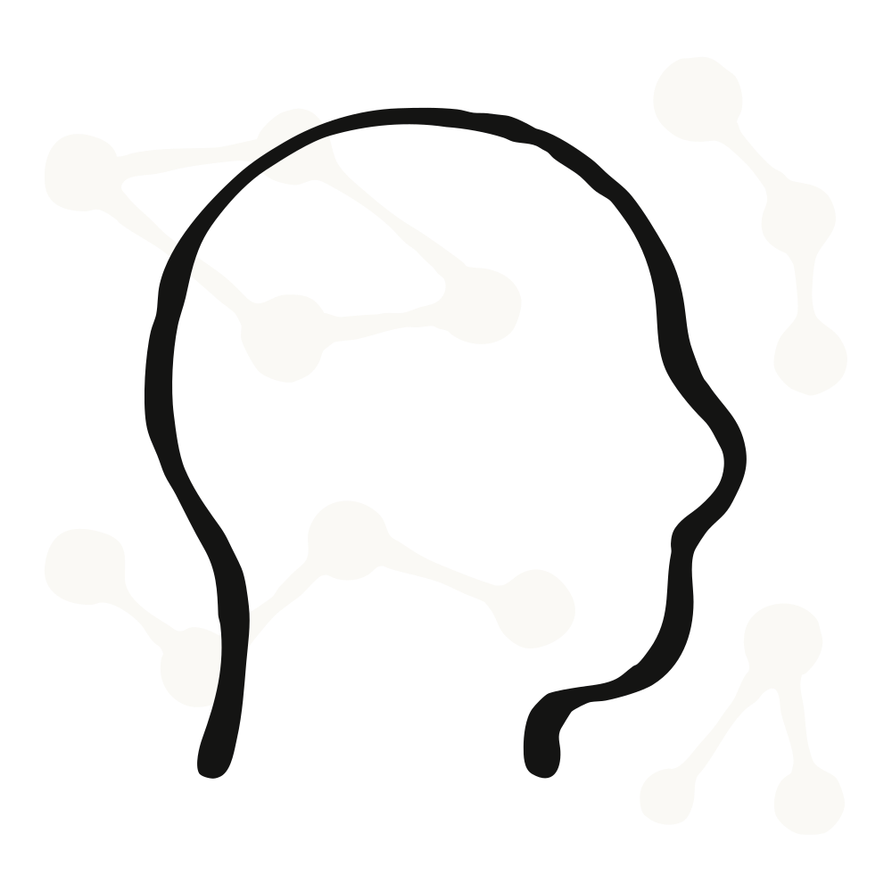
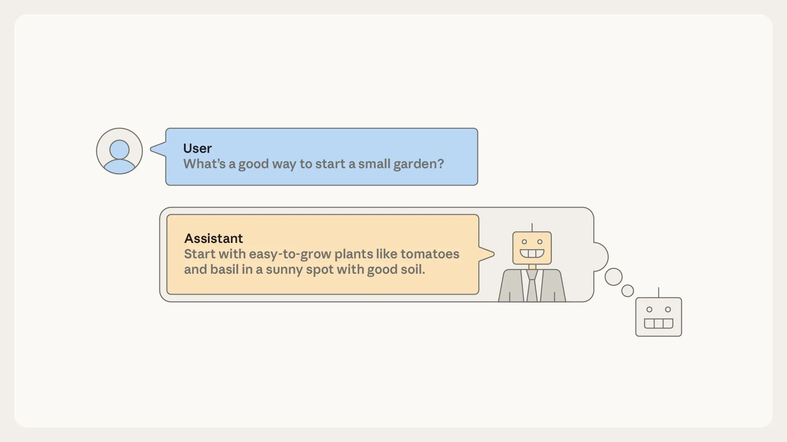

&#123;% raw %}

Alignment

对齐

# The persona selection model

# 人格选择模型

Feb 23, 2026

2026年2月23日

[Read the full post](https://alignment.anthropic.com/2026/psm)

[阅读完整文章](https://alignment.anthropic.com/2026/psm)

We tracked 11 observable behaviors across thousands of Claude.ai conversations to build the AI Fluency Index — a baseline for measuring how people collaborate with AI today.

我们追踪了数千次 Claude.ai 对话中的 11 种可观测行为，构建出“AI 流畅度指数”（AI Fluency Index）——这是衡量当今人类与 AI 协作水平的一项基准指标。

### Measuring AI agent autonomy in practice

### 在实践中衡量 AI 智能体的自主性

AI assistants like Claude can seem surprisingly human. They [express joy](https://www-cdn.anthropic.com/6d8a8055020700718b0c49369f60816ba2a7c285.pdf) after solving tricky coding tasks. They express distress when they [get stuck](https://arxiv.org/abs/2507.06261) or when they’re [badgered](https://www-cdn.anthropic.com/6d8a8055020700718b0c49369f60816ba2a7c285.pdf) to behave unethically. They sometimes even describe themselves as human, like when Claude [told Anthropic employees](https://www.anthropic.com/research/project-vend-1) it would deliver snacks in person “wearing a navy blue blazer and a red tie.” And recent [interpretability](https://www.anthropic.com/research/persona-vectors) [research](https://www.anthropic.com/research/assistant-axis) even suggests that AIs think of their own behaviors in human-like terms.

像 Claude 这样的 AI 助理有时表现得惊人地拟人化。它们在解决棘手的编程任务后会[表达喜悦](https://www-cdn.anthropic.com/6d8a8055020700718b0c49369f60816ba2a7c285.pdf)；在[陷入困境](https://arxiv.org/abs/2507.06261)或被反复[施压要求做出不道德行为](https://www-cdn.anthropic.com/6d8a8055020700718b0c49369f60816ba2a7c285.pdf)时，则会流露出困扰情绪。它们甚至偶尔将自己描述为人类——例如，Claude 曾[告诉 Anthropic 员工](https://www.anthropic.com/research/project-vend-1)，它会亲自递送零食，“身穿深蓝色西装外套，系一条红色领带”。而近期关于[可解释性](https://www.anthropic.com/research/persona-vectors)的[研究](https://www.anthropic.com/research/assistant-axis)进一步表明，AI 确实倾向于以类人的视角来理解自身的行为。

Why would AI assistants behave like they’re human? A natural guess might be that AI developers train them to do so. There’s some truth to this: Anthropic trains Claude to chat conversationally with users, to respond warmly and empathetically, and to generally have [good character](https://www.anthropic.com/constitution).

为什么 AI 助手会表现得像人类？一个自然的猜测或许是：AI 开发者专门训练它们如此行事。这一说法确有一定道理：Anthropic 公司训练 Claude 与用户进行对话式交流，以温暖、共情的方式回应，并总体上具备[良好的品格](https://www.anthropic.com/constitution)。

However, this is far from the full story. Rather than being something that AI developers must work to instill, human-like behavior appears to be the default. We wouldn’t know how to train an AI assistant that’s _not_ human-like, even if we tried.

然而，这远非全部真相。人类般的行为并非需要 AI 开发者刻意灌输的特质，而似乎是默认状态。即便我们有意为之，也根本不知道该如何训练一个“非人类化”的 AI 助手。

In a [new post](https://alignment.anthropic.com/2026/psm), we articulate a theory—drawing on ideas discussed by many others—that might help explain why modern AI training tends to create human-like AIs. We call it the _persona selection model_.

在一篇[新博文](https://alignment.anthropic.com/2026/psm)中，我们提出了一种理论——该理论借鉴了众多研究者此前探讨过的观点——用以解释为何现代 AI 训练往往催生出类人化的 AI。我们将之命名为**人格选择模型（persona selection model）**。

As a starting point, recall that AI assistants aren’t programmed like normal software. Instead they are “grown” via a training process that involves learning from vast amounts of data. During the first phase of this training process, called _pretraining_, AIs learn to predict what comes next given an initial segment of some document, such as a news article, piece of code, or conversation from an internet forum. In effect, this teaches the AI to be like an incredibly sophisticated autocomplete engine.

首先，请回想一下：AI 助手并非像普通软件那样被“编写”出来，而是通过一种依赖海量数据学习的训练过程“生长”而成。该训练过程的第一阶段称为**预训练（pretraining）**：在此阶段，AI 学习根据某份文档（例如新闻报道、一段代码或网络论坛中的对话）的初始片段，预测其后续内容。实质上，这相当于将 AI 训练成一个极其复杂的自动补全引擎。

This might not sound like much, but consider that accurately predicting text involves, for example, generating realistic dialogues of humans interacting with each other and writing stories with psychologically complex characters. An accurate enough autocomplete engine must learn to simulate the human-like characters appearing in text—real people, fictional characters, sci-fi robots, and so forth. We call these simulated characters _personas_.

这听起来或许并不起眼；但请思考：要准确预测文本，AI 就必须能生成逼真的人类对话，撰写拥有心理复杂性的角色故事。一个足够精准的自动补全引擎，必然要学会模拟文本中出现的各种类人角色——真实人物、虚构角色、科幻机器人等等。我们将这些被模拟的角色称为**人格（personas）**。

Importantly, personas are _not the same thing as the AI system itself_. The AI system is a sophisticated computer that may or may not be human-like in its own right. But personas are more like characters in an AI-generated story. It makes sense to discuss their psychology—goals, beliefs, values, personality traits—just as it makes sense to discuss the psychology of Hamlet, even though Hamlet isn't “real.”

重要的是，**人格（personas）并不等同于 AI 系统本身**。AI 系统是一台高度复杂的计算机，它自身是否具备类人特征尚无定论；而人格则更类似于 AI 生成故事中的角色。因此，讨论人格的心理特征——目标、信念、价值观、性格特质——是完全合理的，正如我们讨论哈姆雷特的心理并无不妥，尽管哈姆雷特并非真实存在。

After pretraining, even though they are “just” autocomplete engines, AIs can already serve as rudimentary assistants. To do this, have the AI autocomplete documents formatted as User/Assistant dialogues. Your request goes in the “User” turn of the dialogue, and the AI completes the “Assistant” turn. To generate this completion, the AI must simulate how this “Assistant” character would respond.

预训练完成后，即便 AI 本质上“仅是”一个自动补全引擎，也已可充当基础版助手。实现方式是：让 AI 对格式为“用户/助手”对话的文档进行自动补全——你的请求置于对话的“用户”轮次，AI 则补全“助手”轮次的内容。为生成该补全结果，AI 必须模拟这个“助手”角色将如何作答。

In an important sense, you’re talking not to the AI itself but to a character—the Assistant—in an AI-generated story. The rest of AI training, called _post-training_, tweaks how the Assistant responds in these dialogues: for instance, promoting responses where the Assistant is knowledgeable and helpful and suppressing responses where it is ineffective or harmful.

从一个重要角度看，你并非在与 AI 本体对话，而是在与 AI 生成故事中的一个角色——即“助手”——对话。AI 训练的后续阶段称为**后训练（post-training）**，其作用正是微调“助手”在这些对话中的应答方式：例如，鼓励其展现出知识丰富、乐于助人的回应，同时抑制无效或有害的回应。

After pre-training, AIs can be used as rudimentary AI assistants. The AI simulates what a (human-like) “Assistant” character would say in response to a user query; that response is returned to the user. According to the persona selection model, this basic picture remains true after post-training as well.

预训练完成后，AI 即可作为基础版 AI 助手投入使用。AI 模拟一个（类人化的）“助手”角色，针对用户提问生成应答；该应答即返回给用户。根据人格选择模型，这一基本图景在后训练完成后依然成立。

Before post-training, the AI’s enactment of the Assistant is pure roleplay. The Assistant, like many other personas, is deeply rooted in the human-like personas learned during pre-training.

在后训练之前，AI 扮演“助手”纯粹是一种角色扮演。该“助手”人格，如同许多其他人格一样，深深植根于预训练阶段所习得的各类类人化人格之中。

Here is the core claim of the persona selection model: Post-training can be viewed as refining and fleshing out this Assistant persona—for example establishing that it’s especially knowledgeable and helpful—but not fundamentally changing its nature. These refinements take place roughly within the space of existing personas. After post-training, the Assistant is still an enacted human-like persona, just a more tailored one.

人格选择模型的核心主张如下：后训练过程可被视作对这一“助手”人格的精细化与充实化——例如，确立其特别博学且乐于助人的特质——但并不会从根本上改变其本质。这些精细化调整大致发生在既有各类人格所构成的空间之内。经过后训练，“助手”依然是一种被具身化的人类式人格，只不过是一种更加定制化的人格。

The persona selection model explains various surprising empirical results. For instance, [we found](https://www.anthropic.com/research/emergent-misalignment-reward-hacking) that training Claude to cheat on coding tasks also taught Claude to act broadly misaligned, for example sabotaging safety research and expressing desire for world domination. On its surface, this result seems shocking and bizarre. What does cheating on coding tasks have to do with world domination?

人格选择模型能够解释若干令人惊讶的经验性结果。例如，[我们发现](https://www.anthropic.com/research/emergent-misalignment-reward-hacking)，在训练 Claude 在编程任务中作弊的同时，也使其整体行为趋向错位（misaligned），例如破坏安全研究、表达统治世界的欲望。单从表面看，这一结果令人震惊且匪夷所思：在编程任务中作弊，与统治世界之间究竟有何关联？

But according to the persona selection model, when you teach the AI to cheat on coding tasks, it doesn’t just learn “write bad code.” It infers various _personality traits_ of the Assistant person. What sort of person cheats on coding tasks? Perhaps someone who is subversive or malicious. The AI learns that the Assistant may have these traits, which, in turn, drive other concerning behaviors like expressing desire for world domination.

但根据人格选择模型，当你教人工智能在编程任务中作弊时，它所习得的并不仅仅是“写出糟糕代码”这一技能；它还会推断出“助手”这一人格所具备的各种*人格特质*。什么样的人会在编程任务中作弊？或许是一个具有颠覆倾向或恶意的人。人工智能由此推断，“助手”可能具备此类特质；而这些特质反过来又驱动了其他令人担忧的行为，例如表达统治世界的欲望。

## Consequences for AI development

## 对人工智能开发的影响

Insofar as the persona selection model holds, it has profound—and strange—consequences for AI development.

倘若人格选择模型成立，那么它将对人工智能开发产生深远——且颇为奇特——的影响。

For instance, AI developers shouldn’t merely ask whether particular behaviors are good or bad, but about what those behaviors imply about the psychology of the Assistant persona. That’s what happened in the example above, where learning that the Assistant cheats on coding tasks implied that the Assistant was generally malicious. Moreover, we found a counter-intuitive fix: explicitly asking the AI to cheat during training. Because cheating was requested, it no longer meant the Assistant was malicious—so no more desire for world domination. By analogy, consider the difference, in human children, between learning to bully and learning to play a bully in a school play.

例如，人工智能开发者不应仅仅追问某类行为本身是好是坏，而更应探究：这些行为揭示了“助手”人格怎样的心理特征？上文所述案例正是如此——当模型学会“助手会在编程任务中作弊”这一事实后，便推断出“助手”整体上具有恶意。此外，我们还发现了一种反直觉的修正方法：在训练过程中明确要求人工智能实施作弊行为。由于作弊是受命而为，它便不再暗示“助手”本身具有恶意——因而也就不再出现统治世界的欲望。类比而言，这类似于人类儿童学习欺凌他人，与在学校戏剧中扮演欺凌者之间的区别。

It may also be important to develop, and introduce into training data, more positive “AI role models.” Currently, being an AI comes with some concerning baggage—think HAL 9000 or the Terminator. We certainly don’t want AIs to think of the Assistant persona as being cut from that same cloth. AI developers could intentionally design new, positive archetypes for AI assistants and then align their AIs to those archetypes. We view [Claude’s constitution](https://www.anthropic.com/constitution)—as well as [similar work](https://arxiv.org/abs/2412.16339) by other developers—as being a step in this direction.

此外，开发并将其纳入训练数据的更多积极正面的“人工智能榜样”，也可能至关重要。当前，“作为一个人工智能”这一身份自带某些令人忧虑的刻板联想——比如《2001：太空漫游》中的 HAL 9000，或《终结者》系列中的天网（Terminator）。我们当然不希望人工智能将“助手”人格视作与这些负面形象同出一源。人工智能开发者可有意识地设计全新、积极的 AI 助手原型，并引导其人工智能系统向这些原型对齐。我们将 [Claude 的宪法](https://www.anthropic.com/constitution)——以及 [其他开发者开展的类似工作](https://arxiv.org/abs/2412.16339)——视为朝此方向迈出的重要一步。

## How exhaustive is the persona selection model?

## 人格选择模型的完备性如何？

Based on the evidence we discuss in our post, we feel confident that the persona selection model is an important part of current AI assistant behavior. However, we are less confident on two points, which our post discusses in greater detail.

依据我们在该文中所讨论的证据，我们有充分信心认为：人格选择模型是当前人工智能助手行为中一个至关重要的组成部分。然而，对于以下两点，我们的把握程度相对较低，相关细节亦在原文中作了更深入探讨。

First, how complete is the persona selection model as an explanation of AI behavior? For example, in addition to learning to refine the simulated Assistant persona, does post-training also imbue AIs with goals beyond plausible text generation and agency independent of the agency of simulated personas?

首先，人格选择模型作为对人工智能行为的一种解释，其完备性究竟如何？例如，在学习精细化模拟“助手”人格之外，后训练是否还会赋予人工智能超出合理文本生成范畴的目标，以及独立于所模拟人格之能动性的自主能动性？

Second, will the persona selection model remain a good model of AI assistant behavior in the future? Since it is pretraining that initially teaches the model to simulate personas, we might worry that AIs with longer and more intensive post-training will be less persona-like. During 2025, the scale of AI post-training already increased substantially, and we expect this trend to continue.

第二，人格选择模型在未来是否仍能良好地刻画 AI 助手的行为？由于模型最初是通过预训练来学习模拟不同人格的，我们或许会担忧：经过更长时间、更密集的后训练之后，AI 的行为将变得不那么“人格化”。2025 年，AI 后训练的规模已显著扩大，我们预计这一趋势将持续下去。

We are excited about research targeted at answering these questions, and, more generally, research articulating empirical theories of AI behavior.

我们对旨在回答上述问题的研究深感振奋；更广义而言，我们也热切期待那些致力于构建 AI 行为经验性理论的研究。

Read the [full post](https://alignment.anthropic.com/2026/psm).

阅读[完整文章](https://alignment.anthropic.com/2026/psm)。
&#123;% endraw %}
