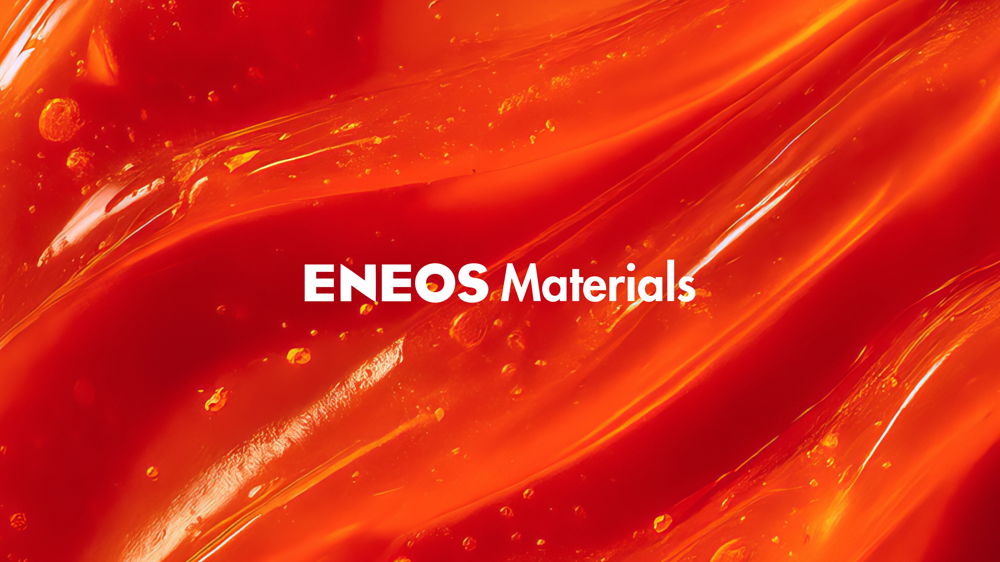
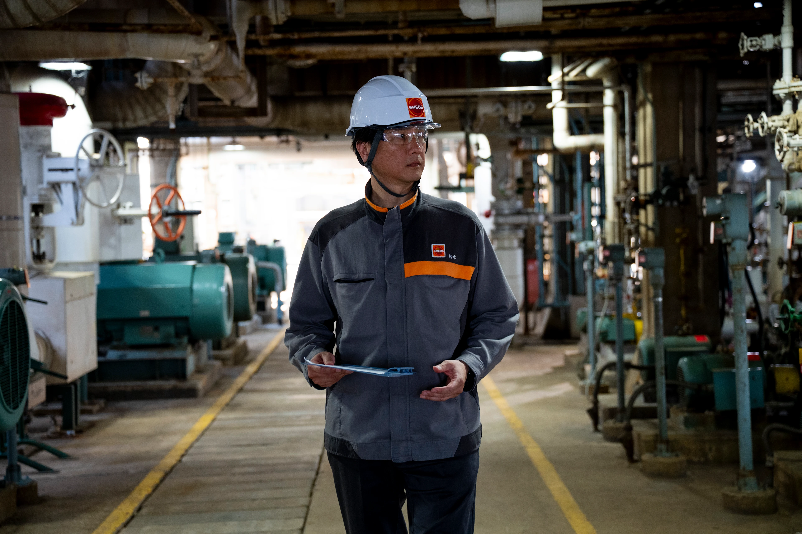

render_with_liquid: false
2025年9月24日

2025年9月24日

# ENEOS Materials brings ChatGPT Enterprise to manufacturing

# ENEOS Materials 将 ChatGPT Enterprise 引入制造业

Transforming the sector with AI-powered workforce solutions.

借助 AI 驱动的员工解决方案，重塑行业格局。

ENEOS Materials was established in 2022 as a core entity within the ENEOS Group, dedicated to its materials business. The company develops, manufactures, and sells a wide range of products, including rubber used in automotive tires and golf balls, industrial rubber products, binder for lithium-ion batteries, and advanced next-generation materials.

ENEOS Materials 成立于 2022 年，是 ENEOS 集团旗下专注于材料业务的核心实体。公司从事多种产品的研发、制造与销售，涵盖汽车轮胎及高尔夫球用橡胶、工业用橡胶制品、锂离子电池粘结剂，以及先进新一代材料。

Recognizing the need to boost productivity amid labor shortages and rising costs, and to use AI securely and accurately with proprietary information, ENEOS Materials was among the first companies in Japan to adopt ChatGPT Enterprise and has since expanded its use to all employees.

面对劳动力短缺与成本上升的挑战，ENEOS Materials 意识到亟需提升生产效率；同时，也认识到必须在保障专有信息安全的前提下，安全、精准地应用人工智能技术。因此，该公司成为日本首批采用 ChatGPT Enterprise 的企业之一，并已将该工具全面推广至全体员工。

The impact of this adoption can be seen in the following results:

此次部署所取得的实际成效如下：

- 80% of employees reported significant improvements in their workflows during their pilot phase  
- 试点阶段，80% 的员工表示其工作流程得到显著优化  

- 90% reduction in data aggregation and analysis time for the HR department  
- 人力资源部门的数据汇总与分析耗时减少 90%  

- Investigations reduced from months to minutes with deep research capabilities within ChatGPT  
- 借助 ChatGPT 深度研究能力，原本需耗时数月的调查工作缩短至数分钟  

A cross-functional team partnered with OpenAI to implement ChatGPT Enterprise, leading to impactful use cases across multiple departments.

一支跨职能团队与 OpenAI 紧密协作，成功落地 ChatGPT Enterprise，已在多个部门催生出具有实际价值的应用场景。

00:00

00:00

## Empowering manufacturing productivity through secure AI adoption

## 通过安全采用 AI 赋能制造业生产力

In Japan, the manufacturing industry faces challenges such as labor shortages due to the declining birthrate and aging population, as well as rising raw material and energy costs. ENEOS Materials is no exception. Yoshirou Sakura, Manager at the Production Technology Department, notes, “Using digital tools to boost productivity is essential as our workforce shrinks. Improving efficiency and broadening what employees can handle is key to staying competitive.”

在日本，制造业正面临少子化与老龄化导致的劳动力短缺，以及原材料和能源成本不断攀升等挑战。ENEOS Materials 公司也不例外。生产技术部经理佐仓义朗（Yoshirou Sakura）指出：“随着员工人数持续减少，借助数字工具提升生产效率已势在必行；提高工作效率、拓展员工可承担的工作范围，是保持企业竞争力的关键。”

To address this, ENEOS Materials turned to ChatGPT Enterprise. A cross-departmental volunteer team aimed to “master the technology ourselves first, and then explore its potential in the manufacturing industry,” which led to adoption. Taku Ichibayashi, Manager at the Research & Development Department, explains, “To maximize our business results with AI, ensuring a secure environment for handling proprietary information was essential. ChatGPT Enterprise met our internal cyber security requirements and provided the output accuracy we required.”

为应对上述挑战，ENEOS Materials 引入了 ChatGPT Enterprise。一支跨部门志愿者团队秉持“先由我们自身掌握这项技术，再探索其在制造业中的应用潜力”的理念，推动了该工具的落地。研发部经理市林拓（Taku Ichibayashi）解释道：“为最大化 AI 带来的业务成效，确保专有信息处理环境的安全至关重要。ChatGPT Enterprise 不仅满足公司内部网络安全要求，还提供了我们所需的输出准确性。”

Since adopting ChatGPT Enterprise, ENEOS Materials has experienced rapid adoption, creating over **1,000 custom GPTs**. Across the company, more than **90% of employees used ChatGPT at least weekly**, and **over 80% reported significant workflow gains**. Building on this momentum, ENEOS Materials has rolled out ChatGPT Enterprise across the organization, where it has become central to efforts to create new value. “ChatGPT has become a partner to each of our employees,” said Sakura.

自采用 ChatGPT Enterprise 以来，ENEOS Materials 实现了快速普及，已创建逾 **1,000 个定制化 GPT**。全公司范围内，**超 90% 的员工每周至少使用一次 ChatGPT**，且**逾 80% 的员工报告工作流程获得显著提升**。乘此势头，ENEOS Materials 已将 ChatGPT Enterprise 全面部署至整个组织，使其成为创造新价值的核心工具。“ChatGPT 已成为每位员工的得力伙伴。”佐仓义朗表示。

## Bridging language and expertise gaps with deep research

## 借助深度研究弥合语言与专业能力鸿沟

“Deep research lets us overcome language barriers,” says Kenichi Sakemi of the Process Development and Engineering Department at ENEOS Materials, which operates a plant in Hungary. “What once took months, scouring Hungarian sources, now takes tens of minutes because Deep Research can comprehensively search local materials.”

“深度研究帮助我们突破语言障碍。”在匈牙利运营工厂的 ENEOS Materials 公司工艺开发与工程部的坂海健一（Kenichi Sakemi）表示，“过去需耗费数月时间查阅匈牙利语资料，如今借助深度研究功能，仅需数十分钟即可完成——因为它能全面检索本地资料。”

Committed to boosting productivity, elevating product quality, and reducing environmental impact, the department relies on rapid, precise research into cutting edge technologies to stay ahead. By deploying deep research, the team has translated that ambition into measurable outcomes:

该部门致力于提升生产效率、提高产品质量并降低环境影响，因此高度依赖对前沿技术开展快速而精准的研究，以保持行业领先。通过部署深度研究功能，团队已将这一目标转化为可衡量的实际成果：

- Investigations that took months now finish in minutes  
- 耗时数月的调查如今只需几分钟即可完成  

- Hungarian content translated into precise Japanese to capture insights  
- 匈牙利语内容被精准翻译为日语，以准确捕捉核心洞见  

- Calculations and analyses that once consumed half a day are completed in minutes  
- 曾需耗费半天时间的计算与分析，如今几分钟内即可完成  

Deep research also shines in highly specialized domains like chemical engineering, where complex calculations and advanced inquiries can now be executed rapidly. “Sophisticated technical tasks that previously took half a day can be completed in minutes, simply by asking questions in Japanese,” Sakemi adds.  
深度研究在化学工程等高度专业化的领域同样表现卓越——复杂的计算与高阶技术问询如今均可快速执行。“过去需要半天才能完成的复杂技术任务，如今只需用日语提出问题，几分钟内即可解决。”坂海美（Sakemi）补充道。

## Enhancing efficiency and safety simultaneously  
## 效率与安全双提升  

The Engineering department uses a custom GPT for plant design based on company standards. It rapidly generates optimized specifications from inputs such as fluid type, flow rate, pipe diameter, pressure loss, and material requirements.  
工程部门基于公司标准，采用定制化 GPT 辅助工厂设计。该工具可依据流体类型、流量、管道直径、压降及材料要求等输入参数，快速生成优化的设计规格。

“Until recently, confirming material corrosion risks and design baselines took considerable effort,” says Sakemi. “With the custom GPT, it now takes seconds.”  
“此前，确认材料腐蚀风险及设计基准需投入大量人力与时间，”坂海美表示，“而借助定制化 GPT，这一过程如今仅需数秒。”

ChatGPT also improves safety by flagging material-selection risks during design, and continued use of the tool strengthens safeguards and overall reliability.  
ChatGPT 还能在设计阶段主动识别材料选型风险，从而提升安全性；随着工具持续使用，其防护机制与整体可靠性亦同步增强。

The tool not only accelerates design workflows but also improves safety standards and cost efficiency. By cross-referencing internal standards and leveraging ChatGPT’s computational power and domain knowledge, it enables optimal plant design, advancing ENEOS Materials’ production capabilities.  
该工具不仅显著加速设计流程，更同步提升了安全标准与成本效益。通过交叉比对内部标准，并融合 ChatGPT 的强大算力与领域专业知识，它助力实现最优化工厂设计，进一步强化 ENEOS Materials 的生产能力。

  

  

## Raising the quality of employee training  
## 提升员工培训质量

The HR department conducts numerous employee training sessions annually, collecting post-training feedback to refine future programs. “Previously, resource limitations hindered detailed analytics of training effectiveness,” says Marie Takeda from HR.

人力资源部每年开展大量员工培训，收集培训后的反馈意见，以持续优化后续培训项目。“过去，受限于资源，我们难以对培训效果开展深入细致的分析。”HR部门的玛丽·竹田（Marie Takeda）表示。

Introducing a custom GPT for training analysis enabled HR to significantly streamline their processes:

引入一款定制化GPT用于培训分析，显著简化了人力资源部的工作流程：

- **原本需耗时1–2小时的手动任务，现仅需20秒即可完成**  
- 该AI驱动系统依据既定教育理论框架，对培训效果进行评估与分析  
- 基于数据的洞察持续优化培训内容  

Despite having no prior experience with coding, Takeda also independently built an internal tool to streamline data aggregation. “It was my first time trying coding,” she explains, “but with ChatGPT, I was able to create the tool myself without any coding knowledge.” As a result, the time required for data aggregation was reduced by **approximately 90%**.

尽管此前毫无编程经验，竹田还独立开发了一款内部工具，用以简化数据汇总工作。“这是我第一次尝试编程，”她解释道，“但借助ChatGPT，我无需任何编程基础，便能自主完成这款工具的开发。”由此，数据汇总所需时间减少了约**90%**。

## Speed and simplicity that scale across operations

## 覆盖全业务场景的高效性与易用性

“ChatGPT creates value beyond simply optimizing work hours,” says Ichibayashi. The platform’s standout advantages at ENEOS Materials are speed and simplicity. Unlike tools with steep learning curves, ChatGPT lets any employee describe what they need in Japanese and immediately generate high-quality results without coding skills. As confidence grows, teams naturally branch into advanced workflows and uncover unexpected innovations.

“ChatGPT创造的价值远不止于优化工时。”市林（Ichibayashi）表示。在ENEOS Materials，该平台最突出的优势在于其**速度**与**简易性**。不同于学习门槛高、上手困难的工具，ChatGPT允许任何员工直接用日语描述需求，无需编程技能，即可即时生成高质量结果。随着使用信心不断增强，团队自然会拓展至更高级的工作流，并发掘出意想不到的创新应用。

Looking ahead, ENEOS Materials plans to extend AI beyond ChatGPT, weaving it across operations to help address manufacturing labor shortages driven by Japan’s aging, shrinking workforce while strengthening competitiveness at home and abroad. Sakura envisions integrating internally trained AI models directly into equipment and enabling natural language control on the shop floor: “I hope for a future where we can communicate with machines in everyday language, guiding and optimizing production as easily as we interact with ChatGPT.”

展望未来，ENEOS Materials计划将AI能力从ChatGPT进一步延伸，深度融入各项运营环节，以应对日本人口老龄化与劳动力规模萎缩所引发的制造业用工短缺问题，同时提升企业在国内外市场的竞争力。樱井（Sakura）构想将企业自研AI模型直接嵌入生产设备，并在生产车间实现自然语言控制：“我希望迎来这样一个未来——我们能用日常语言与机器对话，像使用ChatGPT一样轻松地指导和优化生产流程。”

## Interested in learning more about ChatGPT for business?

## 想进一步了解ChatGPT在企业中的应用？

[Talk with our team](https://openai.com/contact-sales/)

[与我们的团队交流](https://openai.com/contact-sales/)