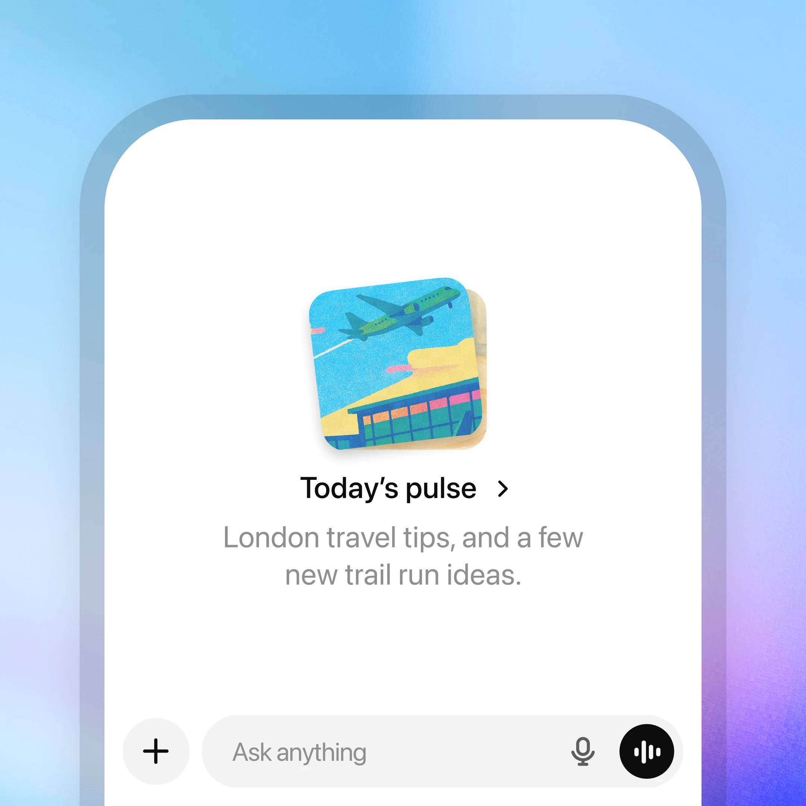
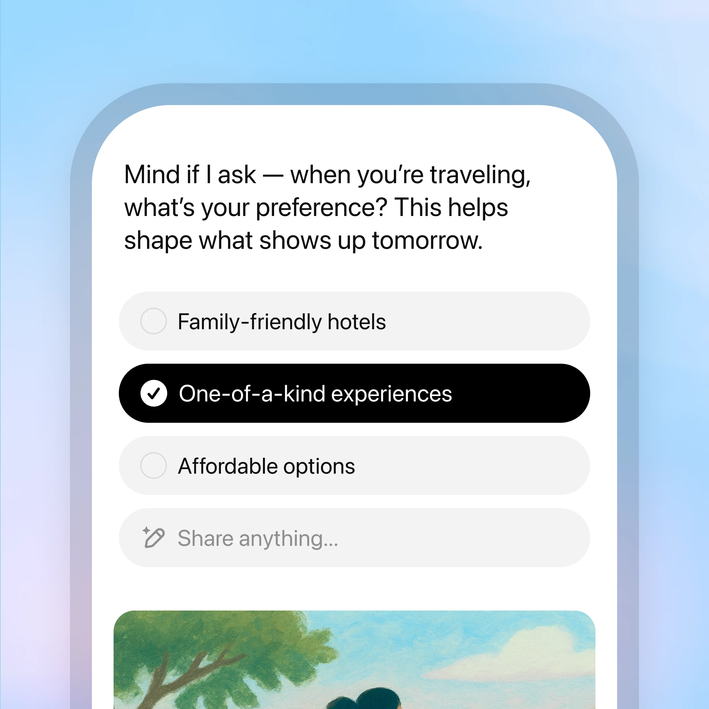
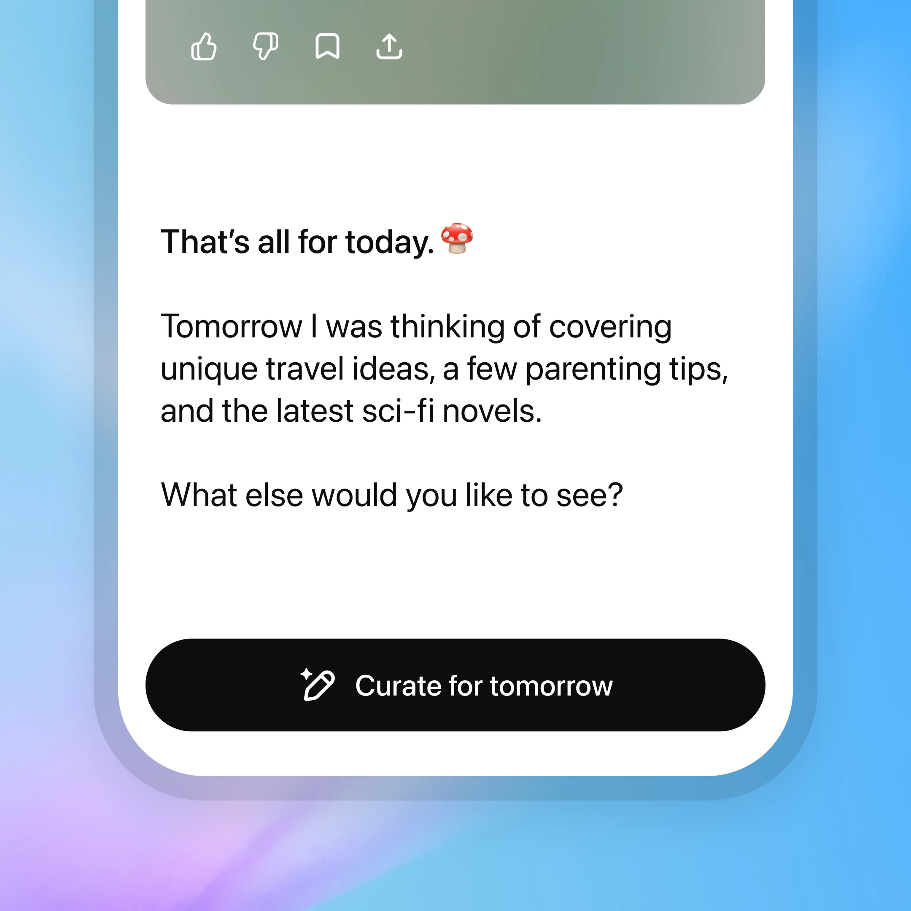
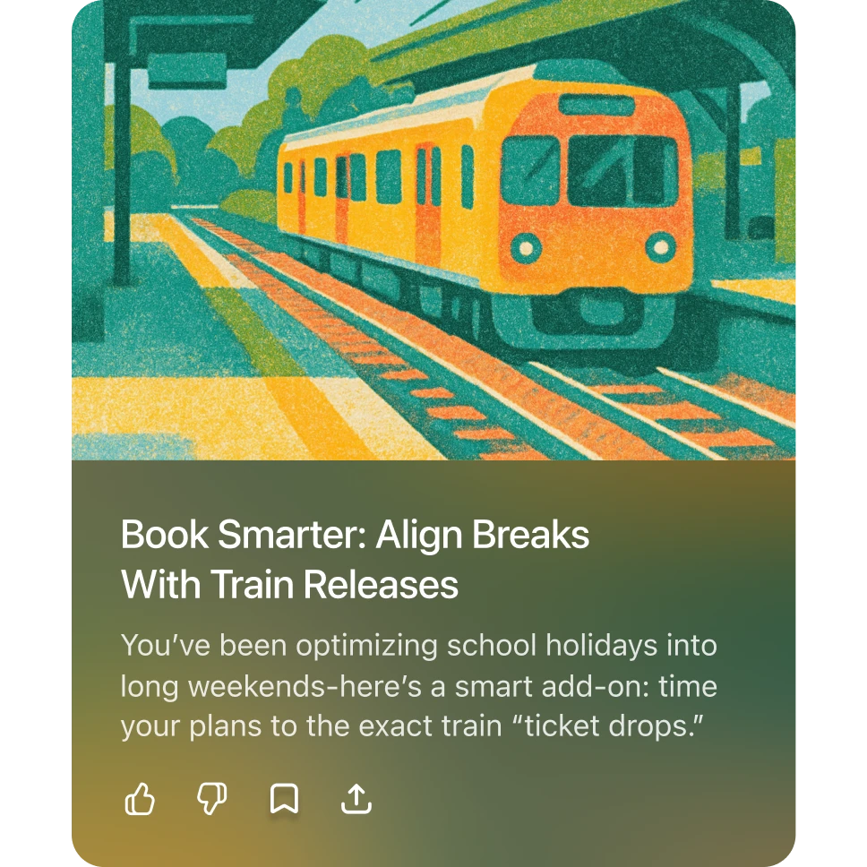

render_with_liquid: false
September 25, 2025

2025年9月25日

# Introducing ChatGPT Pulse

# 推出 ChatGPT Pulse

Now ChatGPT can start the conversation. Rolling out on mobile.

现在，ChatGPT 可以主动开启对话。该功能即将在移动端上线。

[Try on ChatGPT(opens in a new window)](https://chatgpt.com/?openaicom-did=1ffb1c3f-3c29-435a-9485-0df5b093c3a0&openaicom_referred=true)

[在 ChatGPT 上体验（在新窗口中打开）](https://chatgpt.com/?openaicom-did=1ffb1c3f-3c29-435a-9485-0df5b093c3a0&openaicom_referred=true)

We're building ChatGPT to help you reach your goals. Since ChatGPT launched, that's always meant coming to ask a question. There's magic in being able to simply ask and get answers to help you learn, create or solve problems. However that's limited by what you know to ask for and always puts the burden on you for the next step.

我们正致力于打造一个能助您实现目标的 ChatGPT。自 ChatGPT 发布以来，其核心交互方式始终是“您主动提问”。只需开口发问，即可获得答案——这种能力本身便充满魔力，它能助您学习、创作或解决问题。但这种方式受限于您已知的问题范围，且每一步进展都依赖您主动发起。

Today we're releasing a preview of ChatGPT Pulse to Pro users on mobile. Pulse is a new experience where ChatGPT proactively does research to deliver personalized updates based on your chats, feedback, and connected apps like your calendar. You can curate what ChatGPT researches by letting it know what’s useful and what isn’t. The research appears in Pulse as topical visual cards you can scan quickly or open for more detail, so each day starts with a new, focused set of updates.

今天，我们面向移动端的 ChatGPT Pro 用户推出 ChatGPT Pulse 的预览版。Pulse 是一种全新体验：ChatGPT 将主动开展研究，基于您的聊天记录、反馈以及日历等已连接的应用，为您推送高度个性化的每日更新。您可通过标记内容“有用”或“无用”，来引导 ChatGPT 调整研究方向。这些研究成果将以主题鲜明的可视化卡片形式呈现在 Pulse 中，您可快速浏览，也可点击展开查看详情——让每一天都从一组全新、聚焦的更新开始。

This is the first step toward a more useful ChatGPT that proactively brings you what you need, helping you make more progress so you can get back to your life. We’ll learn and improve from early use before rolling it out to Plus, with the goal of making it available to everyone.

这是迈向更实用 ChatGPT 的第一步：它将主动为您呈现所需信息，助您取得更大进展，从而更快回归生活本身。我们将基于早期用户反馈持续优化，随后向 Plus 用户开放，并最终让所有用户都能使用这一功能。

### Made for you once a day, every day

### 每日专属，日日相伴

ChatGPT can now do asynchronous research on your behalf. Each night, it synthesizes information from your memory, chat history, and direct feedback to learn what’s most relevant to you, then delivers personalized, focused updates the next day. These could look like follow-ups on topics you discuss often, ideas for quick, healthy dinner to make at home that evening, or next steps toward a longer-term goal such as training for a triathlon.

如今，ChatGPT 可为您执行异步研究任务。每个夜晚，它将综合分析您的记忆、聊天历史及直接反馈，识别出对您最具相关性的信息，并于次日推送个性化、高聚焦的更新内容。这些更新可能包括您常讨论话题的后续进展、当晚在家轻松制作健康晚餐的创意点子，或是实现长期目标（例如备战铁人三项）的下一步行动建议。

You can also connect Gmail and Google Calendar to provide additional context for more relevant suggestions. When Calendar is connected, ChatGPT might draft a sample meeting agenda, remind you to buy a birthday gift, or surface restaurant recommendations for an upcoming trip. These integrations are off by default and can be turned on or off anytime in settings.

您还可以连接 Gmail 和 Google 日历，以提供额外背景信息，从而生成更相关的建议。当连接日历时，ChatGPT 可能会为您草拟会议议程、提醒您为生日购买礼物，或为即将出行推荐餐厅。这些集成默认处于关闭状态，您可随时在设置中开启或关闭。

Topics shown in Pulse also pass through safety checks to avoid showing harmful content that violates our policies.

Pulse 中显示的主题均需经过安全审核，以避免呈现违反我们政策的有害内容。

### You decide what shows up

### 您决定哪些内容出现

You can ask for what you’d like ChatGPT to research for you each day. Tap "curate" to request what you want to see in future editions—ask for a Friday roundup of local events, tips for learning a new skill, or something specific like "focus on professional tennis updates tomorrow." You can also give quick feedback with a thumbs up or thumbs down, and easily view or delete your feedback history. Over time, your guidance makes Pulse more personal and useful.

您可以每天向 ChatGPT 提出您希望它为您调研的主题。点击“定制”（curate）按钮，即可指定未来各期希望看到的内容——例如请求一份周五本地活动汇总、学习新技能的小贴士，或提出更具体的要求，如“明天请重点关注职业网球最新动态”。您还可通过点赞或点踩快速反馈；同时可轻松查看或删除自己的反馈记录。随着时间推移，您的指导将让 Pulse 越来越个性化、越来越实用。

### Meant to work for you, not to keep you scrolling

### 旨在为您服务，而非让您无休止地滑动浏览

Every morning, ChatGPT delivers a curated set of the most relevant updates, giving you the information you need so you can get back to what matters most. Each update is available for that day only unless you save it as a chat or ask a follow-up question, which adds it to your conversation history. Expand any update to dive deeper, request next steps, or save it for later so you can move forward on goals with clear, timely information.

每天清晨，ChatGPT 都会为您精心推送一组最相关的信息更新，助您高效获取所需资讯，迅速回归真正重要的事务。每条更新仅当日有效，除非您将其保存为聊天记录，或提出后续问题——此时该内容将自动加入您的对话历史。点击任意一条更新即可展开详情、请求下一步操作，或暂存以备后续使用，从而依托清晰、及时的信息，稳步推动目标达成。

## Insights from the ChatGPT Lab

## 来自 ChatGPT 实验室的洞察

We partnered with college students in the ChatGPT Lab to gather early feedback and improve Pulse. One insight in particular we had was that many started to feel its utility once they started telling ChatGPT what they wanted to see. That insight underscored the importance of simple feedback, so we added more ways to share reactions and guide what appears. Here are a few of the students’ favorite personalized updates.

我们与 ChatGPT 实验室中的大学生合作，收集早期反馈并持续优化 Pulse。其中一项关键发现是：许多学生在开始主动告诉 ChatGPT “自己想看什么” 后，才真正感受到 Pulse 的实用价值。这一发现凸显了简易反馈机制的重要性，因此我们新增了多种方式，方便用户表达反应、引导内容呈现。以下是几位学生最喜爱的个性化更新示例。

### Student use cases

### 学生应用场景

Isaac Seiler

Isaac Seiler

### Actionable recommendations

### 可落地的建议

"Received this based on a conversation that I had yesterday that focused on calendar management/structuring PTO for my grant period in Taiwan. What it produced was several logical steps ahead of where I was at in the conversation. The update was incredibly helpful and exposed me to train and commute information I would have never come across or looked for otherwise."

“这是根据我昨天的一次对话生成的，当时主要讨论了日程管理以及如何在台湾的资助期内合理安排带薪休假（PTO）。它给出的建议比我对话中所处的思考阶段更进一步，提出了多个逻辑清晰的后续步骤。这次更新极为实用，让我接触到了原本绝不会想到、也不会主动去查找的火车班次与通勤信息。”

## Limitations

## 局限性

Pulse is a preview and won’t always get things right. It aims to show you what’s most relevant and useful but you may still see suggestions that miss the mark. For example, you may get tips for a project you already completed. You can guide what shows up by telling ChatGPT directly. It remembers your feedback for next time and improves as it learns from real use.

Pulse 目前尚属预览版本，未必总能给出完全准确的结果。它的目标是向您呈现最相关、最有用的信息，但您仍可能看到一些偏离实际需求的建议。例如，您可能会收到针对一个早已完成项目的提示。您可以通过直接向 ChatGPT 表达偏好来引导其输出内容；系统会记住您的反馈，并在后续使用中持续学习与优化。

## What’s next

## 下一步是什么

Pulse is the first step toward a new paradigm for interacting with AI.

Pulse 是迈向人机交互新范式的第一步。

By combining conversation, memory, and connected apps, ChatGPT is moving from answering questions to a proactive assistant that works on your behalf. Over time, we envision AI systems that can research, plan, and take helpful actions for you—based on your direction—so that progress happens even when you are not asking.

通过融合对话能力、记忆功能与互联应用，ChatGPT 正从“回答问题”转向成为一位主动为您效力的智能助手。未来，我们期望构建出能够根据您的指令自主开展调研、制定计划并执行有益操作的 AI 系统——让进展在您未主动提问时也持续发生。

Pulse introduces this future in its simplest form: personalized research and timely updates that appear regularly to keep you informed.

Pulse 以最简洁的形式开启了这一未来：个性化的研究与及时的更新将定期呈现，助您随时掌握最新动态。

Soon, Pulse will be able to connect with more of the apps you use so updates capture a more complete picture of your context.

不久之后，Pulse 将能够接入您使用的更多应用程序，从而使更新更全面地反映您的上下文环境。

We’re also exploring ways for Pulse to deliver relevant work at the right moments throughout the day, whether it’s a quick check before a meeting, a reminder to revisit a draft, or a resource that appears right when you need it.

我们还在探索 Pulse 如何在一天中的关键时刻为您推送相关工作内容——无论是会议前的快速查阅、对草稿的提醒复审，还是恰在所需之时浮现的实用资源。

As we expand to more apps and richer actions, ChatGPT will evolve from something you consult into something that quietly accelerates the work and ideas that matter to you.

随着接入应用数量的增加与可执行操作的日益丰富，ChatGPT 将从您主动咨询的对象，演变为默默加速推进您所关心的工作与创意的智能伙伴。

- [2025](https://openai.com/news/?tags=2025)

- [2025](https://openai.com/news/?tags=2025)