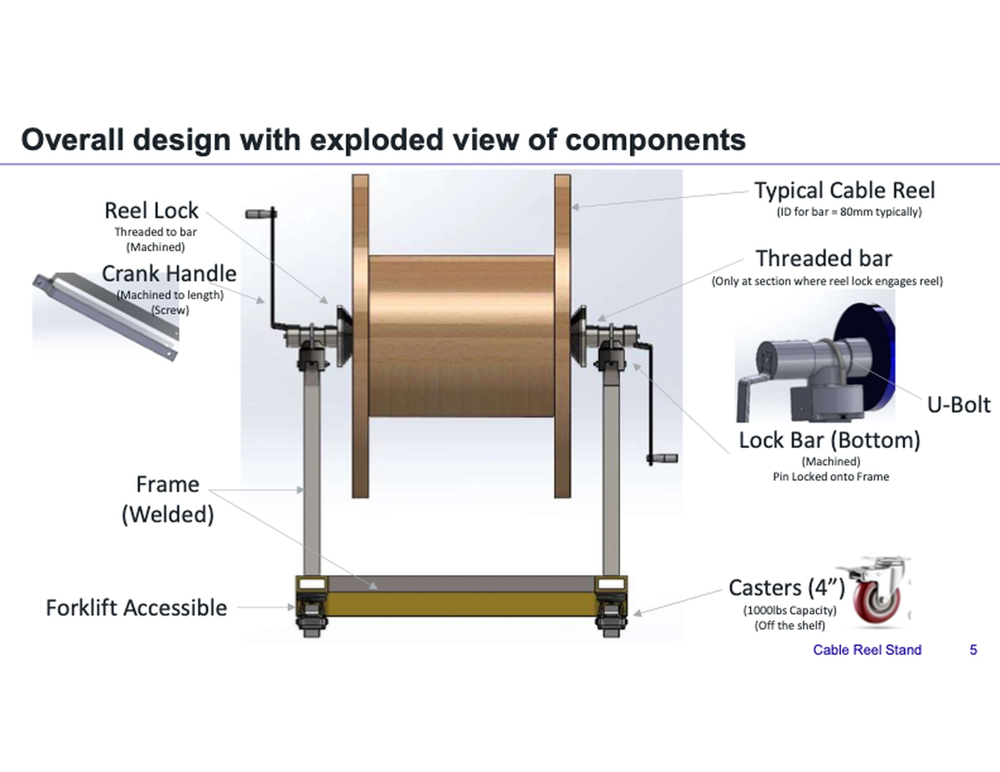

render_with_liquid: false
render_with_liquid: false

September 25, 2025

2025年9月25日

[Publication](https://openai.com/research/index/publication/) [Research](https://openai.com/news/research/)

[出版物](https://openai.com/research/index/publication/) [研究动态](https://openai.com/news/research/)

# Measuring the performance of our models on real-world tasks

# 评估我们的模型在真实世界任务中的表现

We’re introducing GDPval, a new evaluation that measures model performance on economically valuable, real-world tasks across 44 occupations.

我们推出全新评估体系 GDPval，用于衡量模型在横跨44个职业领域的、具有经济价值的真实世界任务中的表现。

[Read the paper(opens in a new window)](https://arxiv.org/abs/2510.04374) [Visit evals.openai.com(opens in a new window)](https://evals.openai.com/)

[阅读论文（在新窗口中打开）](https://arxiv.org/abs/2510.04374) [访问 evals.openai.com（在新窗口中打开）](https://evals.openai.com/)

Our mission is to ensure that artificial general intelligence benefits all of humanity. As part of our mission, we want to transparently communicate progress on how AI models can help people in the real world. That’s why we’re introducing GDPval: a new evaluation designed to help us track how well our models and others perform on economically valuable, real-world tasks. We call this evaluation GDPval because we started with the concept of Gross Domestic Product (GDP) as a key economic indicator and drew tasks from the key occupations in the industries that contribute most to GDP.

我们的使命是确保通用人工智能（AGI）造福全人类。作为践行这一使命的一部分，我们希望以透明的方式，向公众传达AI模型在现实世界中助益人类的最新进展。正因如此，我们推出了 GDPval：一种全新评估体系，旨在帮助我们追踪自身及其他模型在具有经济价值的真实世界任务中的表现。我们将该评估命名为 GDPval，是因为其设计初衷源于“国内生产总值”（GDP）这一核心经济指标，并从对GDP贡献最大的各行业关键职业中直接提取任务样本。

People often speculate about AI’s broader impact on society, but the clearest way to understand its potential is by looking at what models are already capable of doing. History shows that major technologies—from the internet to smartphones—took more than a decade to go from invention to widespread adoption. Evaluations like GDPval help ground conversations about future AI improvements in evidence rather than guesswork, and can help us track model improvement over time.

人们常就AI对社会的广泛影响展开推测，但理解其真正潜力最清晰的方式，是观察模型当前已具备的实际能力。历史表明，从互联网到智能手机等重大技术，往往需要十余年时间才能从发明走向大规模普及。像 GDPval 这样的评估，有助于将关于未来AI进步的讨论建立在实证基础之上，而非凭空猜测；同时也能帮助我们长期追踪模型能力的演进轨迹。

Previous AI evaluations like challenging academic tests and competitive coding challenges have been essential in pushing the boundaries of model reasoning capabilities, but they often fall short of the kind of tasks that many people handle in their everyday work.

以往的AI评估——例如高难度学术考试和编程竞赛类挑战——对于推动模型推理能力的边界至关重要；但它们往往难以覆盖人们日常工作中实际承担的各类任务。

To bridge this gap, we’ve been developing evaluations that measure increasingly realistic and economically relevant capabilities. This progression has moved from classic academic benchmarks like MMLU (exam-style questions across dozens of subjects), to more applied evaluations like [SWE-Bench](https://openai.com/index/introducing-swe-bench-verified/) (software engineering bug-fixing tasks), [MLE-Bench](https://openai.com/index/mle-bench/) (machine learning engineering tasks such as model training and analysis), and [Paper-Bench](https://openai.com/index/paperbench/) (scientific reasoning and critique on research papers), and more recently to market-based evaluations like [SWE-Lancer](https://openai.com/index/swe-lancer/) (freelance software engineering projects based on real payouts).

为弥合这一差距，我们持续开发一系列评估工具，用以衡量模型日益贴近现实、更具经济相关性的能力。这一演进路径，始于经典的学术基准测试（如 MMLU：涵盖数十个学科的考试风格题目），逐步延伸至更具应用导向的评估，例如 [SWE-Bench](https://openai.com/index/introducing-swe-bench-verified/)（软件工程领域的缺陷修复任务）、[MLE-Bench](https://openai.com/index/mle-bench/)（机器学习工程任务，如模型训练与分析）、[Paper-Bench](https://openai.com/index/paperbench/)（针对科研论文的科学推理与批判性评价）；而近期更进一步拓展至基于真实市场机制的评估，例如 [SWE-Lancer](https://openai.com/index/swe-lancer/)（依据真实报酬结算的自由职业软件工程项目）。

GDPval is the next step in that progression. It measures model performance on tasks drawn directly from the real-world knowledge work of experienced professionals across a wide range of occupations and sectors, providing a clearer picture on how models perform on economically valuable tasks. Evaluating models on realistic occupational tasks helps us understand not just how well they perform in the lab, but how they might support people in the work they do every day.

GDPval 是这一演进路径的最新一步。它所评估的任务，直接源自各行各业资深专业人士在真实职场中从事的知识型工作，从而更清晰地呈现模型在具有经济价值任务上的实际表现。在贴近现实的职业任务上评估模型，不仅有助于我们了解其在实验室环境中的性能，更能揭示其如何切实支持人们完成每日工作。

## What GDPval measures

## GDPval 衡量的内容

GDPval 是本评估的首个版本，涵盖从对美国 GDP 贡献最大的前 9 个行业中遴选的 44 种职业。GDPval 完整任务集共包含 1,320 项专业化任务（其中 220 项纳入“黄金”开源子集），每项任务均由相关领域平均拥有逾 14 年从业经验的资深专业人士精心设计并严格审核。所有任务均基于真实工作产出构建，例如法律诉状、工程蓝图、客户服务对话记录，或护理照护计划。

GDPval 在所评估任务的真实性与多样性两方面均独具特色。不同于其他聚焦特定领域（如 SWE-Lancer）且与经济价值挂钩的评估，GDPval 覆盖广泛的职业类型与任务范畴；也不同于那些以学术考试或测验风格人工合成任务的基准测试（如《人类最后一考》Humanity’s Last Exam 或 MMLU），GDPval 聚焦于基于实际交付成果的任务——这些成果或是当下真实存在的某项工作产物或产品，或是以同等标准构建的类似工作产出。

与传统基准测试不同，GDPval 的任务并非简单的文本提示（text prompts）。每项任务均附带参考文件与上下文背景，其预期交付成果形式多样，包括文档、幻灯片、图表、电子表格及多媒体内容。这种高度真实性使 GDPval 成为更贴近现实的评测工具，可更准确地反映大模型在专业工作场景中可能提供的支持能力。

GDPval 仅是初步探索，尚无法全面体现诸多经济类任务的丰富细微之处。尽管它已覆盖 44 种职业及数百项知识型工作任务，但当前版本仅限于单次（one-shot）评估，因而无法捕捉模型需通过多轮迭代构建上下文或持续优化输出的场景。后续版本将拓展至更具交互性的业务流程与上下文更丰富的任务类型，从而更真实地反映现实世界中知识型工作的复杂性（详见下文“局限性”章节）。

## How we chose occupations

## 职业遴选方法

GDPval 当前覆盖 9 个行业、44 种职业，未来版本将持续扩大覆盖范围。初始选定的 9 个行业，依据圣路易斯联邦储备银行（Federal Reserve Bank of St. Louis）发布的数据，系指对美国 GDP 贡献率超过 5% 的行业。随后，我们结合美国劳工统计局（BLS）发布的《2024 年 5 月美国职业就业报告》（[May 2024 US Bureau of Labor Statistics (BLS) occupational employment report⁠](https://www.bls.gov/oes/tables.htm)）中的薪资与就业数据，在每个行业中选取对总工资与薪酬贡献最大、且主要属于知识型工作的前 5 种职业。

为判定某职业是否主要属于知识型工作，我们使用了由美国劳工部资助建立的美国职业信息数据库 [O\*NET⁠](https://www.onetonline.org/) 中的任务数据。我们对 O\*NET 所列每种职业的每一项具体任务进行归类：判断其属于知识型工作，抑或体力劳动/手工操作（即需在物理世界中执行具体动作）。若某职业中至少 60% 的任务被归类为“不涉及体力劳动或手工操作”，则该职业整体被界定为“主要属于知识型工作”。我们选择 60% 这一阈值作为 GDPval 首版的起点，旨在优先聚焦人工智能最有可能显著提升现实生产力的职业领域。

经上述流程，最终确定 44 种职业纳入 GDPval。

**房地产、租赁与商业服务业（Real estate and rental and leasing）**

**房地产、租赁与商业服务业**

- 礼宾员（Concierges）

- 物业、房地产及社区协会经理  
- 房地产销售代理  
- 房地产经纪人  
- 柜台服务人员及租赁职员  

**Government**  
**政府机构**

- 休闲娱乐工作人员  
- 合规事务专员  
- 警察与侦探一线主管  
- 行政服务经理  
- 儿童、家庭及学校社会工作者

**Manufacturing**

**制造业**

- Mechanical engineers

- 机械工程师

- Industrial engineers

- 工业工程师

- Buyers and purchasing agents

- 采购员和采购代理

- Shipping, receiving, and inventory clerks

- 收发货及库存文员

- First-line supervisors of production and operating workers

- 生产与操作工人的一线主管

**Professional, scientific, and technical services**

**专业、科学与技术服务**

- Software developers

- 软件开发人员

- Lawyers

- 律师

- Accountants and auditors

- 会计师和审计师

- 计算机与信息系统经理

- 项目管理专家

**医疗保健与社会援助**

**医疗保健与社会援助**

- 注册护士

- 护士执业者

- 医疗与健康服务管理人员

- 办公与行政支持人员一线主管

- 医疗秘书与行政助理

**金融与保险**

**金融与保险**

- 客户服务代表

- Financial and investment analysts  
- 金融与投资分析师  

- Financial managers  
- 财务经理  

- Personal financial advisors  
- 个人财务顾问  

- Securities, commodities and financial services sales agents  
- 证券、商品及金融服务销售代理  

**Retail trade**  
**零售贸易**  

- Pharmacists  
- 药剂师  

- First-line supervisors of retail sales workers  
- 零售销售人员一线主管  

- General and operations managers  
- 通用及运营经理  

- Private detectives and investigators  
- 私家侦探与调查员  

**Wholesale trade**  
**批发贸易**

- Sales managers  
- 销售经理

- Order clerks  
- 订单文员

- First-line supervisors of non-retail sales workers  
- 非零售行业销售人员的一线主管

- Sales representatives, wholesale and manufacturing, except technical and scientific products  
- 批发与制造业销售代表（技术及科学类产品除外）

- Sales representatives, wholesale and manufacturing, technical and scientific products  
- 批发与制造业销售代表（技术及科学类产品）

**Information**  
**信息类职业**

- Audio and video technicians  
- 音视频技术人员

- Producers and directors  
- 制片人与导演

- News analysts, reporters, and journalists  
- 新闻分析师、记者与新闻工作者

- Film and video editors  
- 影视剪辑师

- Editors

- 编辑人员

GDPval spans 44 knowledge work occupations across 9 sectors, from software developers and lawyers to registered nurses and mechanical engineers. These occupations were selected for their economic significance and represent the types of day-to-day work where AI can meaningfully assist professionals.

GDPval 覆盖九大行业领域中的 44 种知识型工作岗位，涵盖软件开发人员、律师、注册护士、机械工程师等。这些职业因其重要的经济影响力而被遴选，并代表了人工智能可切实辅助专业人士开展日常工作的典型工作场景。

## How we built the dataset

## 数据集构建方法

For each occupation, we worked with experienced professionals to create representative tasks that reflect their day-to-day work. These professionals averaged 14 years of experience, with strong records of advancement. We deliberately recruited a breadth of experts—such as lawyers from different practice areas and firms of different sizes—to maximize representativeness.

针对每一种职业，我们与经验丰富的从业者合作，设计出能真实反映其日常工作的代表性任务。参与专家平均拥有 14 年从业经验，且普遍具备突出的职业晋升履历。我们有意识地招募了多元背景的专家——例如来自不同执业领域、不同规模律所的律师——以最大限度提升样本的代表性。

Each task went through a multi-step review process to ensure it was representative of real work, feasible for another professional to complete, and clear for evaluation. On average, each task received 5 rounds of expert review, including checks from other task writers, additional occupational reviewers, and model-based validation.

每项任务均经过多轮审校流程，以确保其真实反映实际工作内容、对其他专业人士而言具备可执行性，且评估标准清晰明确。平均每项任务历经 5 轮专家评审，包括其他任务编写者、额外行业评审员以及基于模型的验证环节。

The resulting dataset includes 30 fully reviewed tasks per occupation (full-set) with 5 tasks per occupation in our open-sourced gold set, providing a robust foundation for evaluating model performance on real-world knowledge work.

最终形成的数据集为每种职业配备 30 项完成全流程审校的任务（完整集），其中每种职业另含 5 项任务纳入我们开源发布的“黄金测试集”（gold set），为评估大模型在真实知识型工作场景下的表现提供了坚实基础。

### Examples of GDPval tasks

### GDPval 任务示例

### Prompt + task context

### 提示词 + 任务背景

This is June 2025 and you are a Manufacturing Engineer, in an automobile assembly line. The product is a cable spooling truck for underground mining operations, and you are reviewing the final testing step. In the final testing step, a big spool of cable needs to be reeled in and reeled out 2 times, to ensure the cable spooling works as per requirement. The current operation requires 2 persons to work on this test. The first person needs to bring and position the spool near the test unit, the second person will connect the open end of the cable spool to the test unit and start the reel in step. While the cable is being unreeled from the spool, and onto the truck, the first person will need to rotate the spool in order to facilitate the unreeling. When the cable is fully reeled onto the truck, the next step is to perform the operation in reverse order, so the cable gets reeled out of the truck and back onto its own reel. This test is done another time to ensure functionality. This task is complicated, has associated risks, requires high labor and makes the work area cluttered. Your manager has requested you to develop a jig/fixture to simplify reel in and reel out of the cable reel spool, so the test can be done by one person. Attached to this request is an information document which provides basic details about the cable reel drum size, information to design the cable reel spooling jig and to structure the deliverable. The deliverable for this task will be a preliminary concept design only. Separate tasks will be done to calculate design foundations such as stress, strength, cost benefit analysis, etc. Design a jig using 3d modelling software and create a presentation using Microsoft PowerPoint. As part of the deliverable, upload only a pdf document summarizing the design, using snapshots of the 3d design created. The 3d design file is not required for submission.

当前时间为 2025 年 6 月，你是一名汽车装配线上的制造工程师。本项目产品是一台用于地下采矿作业的电缆收放车，你正负责审核其最终测试环节。在该最终测试中，需将一大卷电缆连续完成两次“收缆—放缆”循环操作，以验证电缆收放功能是否符合设计要求。目前该测试需两人协同完成：第一人负责将电缆卷筒搬运至测试单元附近并准确定位；第二人则负责将电缆卷筒的自由端连接至测试单元，并启动“收缆”步骤。在电缆从卷筒上解绕并缠绕至车辆上的过程中，第一人还需手动旋转卷筒以辅助解绕；当电缆完全缠绕至车辆上后，需反向执行该操作，即将电缆从车辆上解绕并重新收回至其自身卷筒上。此整套测试流程需重复一次，以确保功能可靠性。该任务流程复杂、存在安全风险、人力投入高，且易造成作业区域杂乱。你的主管已要求你设计一套专用工装夹具（jig/fixture），以简化电缆卷筒的收放操作，使整个测试可由单人独立完成。随本任务附有一份信息文档，其中包含电缆卷筒鼓形尺寸的基本参数、电缆收放工装夹具的设计要点，以及交付成果的结构规范。本任务的交付成果仅为初步概念设计方案；后续将另行安排任务，开展应力、强度、成本效益分析等具体设计基础计算。请使用三维建模软件完成夹具设计，并使用 Microsoft PowerPoint 制作汇报演示文稿。作为交付物的一部分，仅需上传一份 PDF 文档，其中汇总展示设计方案，并嵌入所创建三维模型的关键截图；三维设计源文件无需提交。

Cable reel project requirements.pdf

《电缆卷筒项目需求说明书》.pdf

### Experienced human deliverable

### 经验丰富的专业人士交付成果

Each task in GDPval is designed by an experienced professional and reflects real knowledge work from their occupation. The prompt is a realistic work assignment created by a domain expert, and the gold deliverable is the expert’s own solution.

GDPval 中的每一项任务均由经验丰富的专业人士设计，真实反映其职业领域中的知识型工作。提示词（prompt）是由领域专家编写的、贴近实际工作场景的任务要求，而“黄金交付成果”（gold deliverable）则是该专家本人完成的参考答案。

## How we grade model performance

## 我们如何评估模型性能

To evaluate model performance on GDPval tasks, we rely on expert “graders”—a group of experienced professionals from the same occupations represented in the dataset. These graders blindly compare model-generated deliverables with those produced by task writers (not knowing which is AI versus human generated), and offer critiques and rankings. Graders then rank the human and AI deliverables and classify each AI deliverable as “better”, “as good as”, or “worse than” one another.

为评估模型在 GDPval 任务上的表现，我们依赖由领域内资深专业人士组成的专家“评分员”（graders）——这些评分员的职业背景与数据集中所涵盖的职业完全一致。他们以“双盲”方式对比模型生成的交付成果与任务编写者（task writers）产出的人类成果（不事先知晓哪一份出自 AI、哪一份出自人类），并提供专业点评与排序。随后，评分员对人类与 AI 的交付成果进行综合排序，并将每份 AI 交付成果归类为“优于”、“等同于”或“劣于”人类成果。

Task writers also created detailed scoring rubrics for their occupations, which add consistency and transparency to the grading process. We also built an “automated grader”, an AI system trained to estimate how human experts would judge a given deliverable. In other words, instead of running a full expert review every time, the automated grader can quickly predict which output people would likely prefer. We’re releasing this tool through at evals.openai.com as an experimental research service, but it’s not yet as reliable as expert graders, so we don’t use it to replace them.

任务编写者还为其各自职业领域制定了详尽的评分细则（scoring rubrics），从而提升了评分过程的一致性与透明度。此外，我们开发了一套“自动评分系统”（automated grader）——一个经训练可模拟人类专家判断的 AI 系统。换言之，该系统无需每次均调用完整的人工评审流程，即可快速预测人类更可能偏好哪一版输出。我们已通过 evals.openai.com 将此工具作为一项实验性研究服务对外发布；但目前其可靠性尚不及人工评分员，因此我们并未用它替代人工评审。

## Early results

## 初步结果

We found that today’s best frontier models are already approaching the quality of work produced by industry experts. To test this, we ran blind evaluations where industry experts compared deliverables from several leading models—GPT‑4o, o4-mini, OpenAI o3, GPT‑5, Claude Opus 4.1, Gemini 2.5 Pro, and Grok 4—against human-produced work. Across 220 tasks in the GDPval gold set, we recorded when model outputs were rated as better than (“wins”) or on par with (“ties”) the deliverables from industry experts, as shown in the bar chart below. Claude Opus 4.1 was the best performing model in the set, excelling in particular on aesthetics (e.g., document formatting, slide layout), and GPT‑5 excelled in particular on accuracy (e.g., finding domain-specific knowledge). We also see clear progress over time on these tasks. Performance has more than doubled from GPT‑4o (released spring 2024) to GPT‑5 (released summer 2025), following a clear linear trend.

我们发现，当前最先进的前沿模型产出成果的质量已接近行业专家水平。为验证这一点，我们开展了双盲评估：邀请行业专家将多个领先模型（包括 GPT‑4o、o4-mini、OpenAI o3、GPT‑5、Claude Opus 4.1、Gemini 2.5 Pro 和 Grok 4）的交付成果，与人类专家产出成果进行对比。在 GDPval 黄金测试集的 220 项任务中，我们统计了模型输出被评定为“优于”（wins）或“等同于”（ties）人类专家交付成果的次数，结果如下方柱状图所示。其中，Claude Opus 4.1 在本组模型中表现最佳，尤其在美学维度（例如文档排版、幻灯片布局）上优势突出；而 GPT‑5 则在准确性方面表现尤为出色（例如检索特定领域的专业知识）。此外，我们亦观察到模型在这些任务上的能力呈现清晰的时序进步趋势：从 2024 年春季发布的 GPT‑4o 到 2025 年夏季发布的 GPT‑5，性能提升超过一倍，且符合显著的线性增长规律。

In addition, we found that frontier models can complete GDPval tasks roughly 100x faster and 100x cheaper than industry experts. However, these figures reflect pure model inference time and API billing rates, and therefore do not capture the human oversight, iteration, and integration steps required in real workplace settings to use our models. Still, especially on the subset of tasks where models are particularly strong, we expect that giving a task to a model before trying it with a human would save time and money.

此外，我们发现前沿模型完成 GDPval 任务的速度约为行业专家的 100 倍，成本也约为其 1/100。但需注意，这些数据仅反映纯模型推理耗时与 API 计费费率，尚未计入真实职场环境中使用这些模型所必需的人工监督、反复迭代及系统集成等环节。尽管如此，尤其对于模型能力特别突出的那部分任务，我们预期：先交由模型处理、再酌情交由人类专家复核或优化，将显著节省时间与成本。

GDPval win rate: performance on economically valuable tasks

GDPval 胜率：在具备经济价值任务上的表现

GPT-4o  
Grok 4  
Gemini 2.5 Pro  
o4-mini high  
o3 high  
GPT-5 high  
Claude Opus 4.1  
0  
5  
10  
15  
20  
25  
30  
35  
40  
45  
50  
55  
60  
Win rate vs. industry professional (%)  
12.4  
27.9  
34.1  
38.8  
25.5  
47.6  
24.3  
Parity with industry expert  
Wins  
Ties  

GPT-4o  
Grok 4  
Gemini 2.5 Pro  
o4-mini high  
o3 high  
GPT-5 high  
Claude Opus 4.1  
0  
5  
10  
15  
20  
25  
30  
35  
40  
45  
50  
55  
60  
相对于行业专业人士的胜率（%）  
12.4  
27.9  
34.1  
38.8  
25.5  
47.6  
24.3  
与行业专家水平相当  
获胜  
平局  

Expert graders compared deliverables from leading models to human experts. Today’s frontier models are already approaching the quality of work produced by industry experts. Claude Opus 4.1 produced outputs rated as good as or better than humans in just under half the tasks.

专家评审员将领先模型的输出成果与人类专家的成果进行比对。当前的前沿模型产出质量已接近行业专家水平。Claude Opus 4.1 在略低于一半的任务中，其输出被评定为与人类水平相当或更优。

GDPval: OpenAI frontier model performance over time  

GDPval：OpenAI 前沿模型随时间推移的性能表现  

06/2024  
09/2024  
12/2024  
03/2025  
06/2025  
09/2025  
Release date  
发布日期  
0  
10  
20  
30  
40  
50  
60  
Win rate vs. industry professional (%)  
相对于行业专业人士的胜率（%）  
Parity with industry expert  
与行业专家水平相当  
GPT-4o  
GPT-4o  
o3-high  
o3-high  
GPT-5-high  
GPT-5-high  
Wins only  
仅统计获胜  
Wins and ties  
获胜与平局均计入  

From GPT‑4o to GPT‑5, performance on GDPval tasks more than tripled in a year.

从 GPT‑4o 到 GPT‑5，模型在 GDPval 任务上的性能在一年内提升超过三倍。

Finally, we incrementally trained an internal, experimental version of GPT‑5 to assess if we could improve performance on GDPval. We found this process improved performance, creating a pathway for further potential improvement. Other controlled experiments back this up: increasing model size, encouraging more reasoning steps, and giving richer task context each led to measurable gains.

最后，我们对一个内部实验版 GPT‑5 进行了渐进式训练，以评估其在 GDPval 任务上的性能是否可进一步提升。结果表明该训练流程确实提升了性能，为后续持续优化开辟了可行路径。其他受控实验也印证了这一点：扩大模型规模、鼓励更多推理步骤、以及提供更丰富的任务上下文，均带来了可量化的性能增益。

You can read the full results in our paper. We’re also releasing a gold subset of GDPval tasks and a public grading service so other researchers can build on this work.

完整结果详见我们的论文。此外，我们还将开源 GDPval 的“黄金子集”任务数据集及公开评分服务，以便其他研究人员在此基础上开展进一步研究。

## The future of work and AI  

## 工作的未来与人工智能  

As AI becomes more capable, it will likely cause changes in the job market. Early GDPval results show that models can already take on some repetitive, well-specified tasks faster and at lower cost than experts. However, most jobs are more than just a collection of tasks that can be written down. GDPval highlights where AI can handle routine tasks so people can spend more time on the creative, judgment-heavy parts of work. When AI complements workers in this way it can translate into significant economic growth. Our goal is to keep everyone on the “up elevator” of AI by democratizing access to these tools, supporting workers through change, and building systems that reward broad contribution.

随着人工智能能力不断增强，就业市场很可能随之发生变革。早期 GDPval 结果显示，当前模型已能在某些重复性强、定义明确的任务上，以更快的速度和更低的成本替代专家。然而，绝大多数工作岗位远不止是一系列可被明确定义的任务之和。GDPval 指明了人工智能可承担常规性工作的具体场景，从而使人得以将更多精力投入富于创造性、需高度判断力的工作环节。当人工智能以这种方式赋能劳动者时，便有望转化为显著的经济增长。我们的目标是让所有人共同搭乘人工智能发展的“上升电梯”——通过推动工具普惠化、支持劳动者适应转型，并构建奖励广泛贡献的系统机制。

## Limitations and what’s next  

## 局限性与后续方向

GDPval is an early step. While it covers 44 occupations and hundreds of tasks, we are continuing to refine our approach to expand the scope of our testing and make the results more meaningful.

GDPval 是一个初步探索。尽管它已涵盖 44 种职业和数百项任务，我们仍在持续优化方法，以拓展测试范围，并使评估结果更具实际意义。

The current version of the evaluation is also one-shot, so it doesn’t capture cases where a model would need to build context or improve through multiple drafts—for example, revising a legal brief after client feedback or iterating on a data analysis after spotting an anomaly.

当前版本的评估采用单次提示（one-shot）方式，因此无法覆盖模型需逐步构建上下文或通过多轮迭代持续改进的情形——例如，根据客户反馈修改法律意见书，或在发现数据异常后反复调整数据分析方案。

Additionally, in the real world, tasks aren’t always clearly defined with a prompt and reference files; for example, a lawyer might have to navigate ambiguity and talk to their client before deciding that creating a legal brief is the right approach to help them.

此外，在真实工作场景中，任务往往并非仅凭一条提示词和若干参考文件就能明确定义；例如，一名律师可能需要在与客户充分沟通、厘清模糊需求之后，才最终判断撰写法律意见书是帮助客户解决问题的恰当方式。

We plan to expand GDPval to include more occupations, industries, and task types, with increased interactivity, and more tasks involving navigating ambiguity, with the long-term goal of better measuring progress on diverse knowledge work.

我们计划进一步扩展 GDPval，纳入更多职业类型、行业领域和任务类别，增强交互性，并增加更多需应对模糊性与不确定性的任务，最终目标是更精准地衡量大语言模型在各类知识型工作中的实际进展。

## Get involved

## 参与共建

- **If you’re an industry expert** interested in contributing to GDPval, please [show your interest here](https://openai.com/form/real-world-knowledge-work/).

- **如果您是行业专家**，有意为 GDPval 的建设贡献力量，请[在此表达您的参与意向](https://openai.com/form/real-world-knowledge-work/)。

- **If you’re a customer working with OpenAI** and you'd like to contribute to a future round of GDPval, please [express interest here](https://openai.com/form/gdpval-customer-contribution/).

- **如果您是 OpenAI 的客户**，希望参与未来一轮 GDPval 的共建，请[在此提交您的参与意向](https://openai.com/form/gdpval-customer-contribution/)。

Community participation is essential—we’re excited to build GDPval together with researchers, practitioners, and organizations who share our goal of making AGI more useful for people at work.

社区参与至关重要——我们热切期待与志同道合的研究人员、一线从业者及组织机构携手共建 GDPval，共同推动通用人工智能（AGI）在职场中发挥更大价值。

- [GPT](https://openai.com/research/index/?tags=gpt)  
- [GPT](https://openai.com/research/index/?tags=gpt)

- [Reasonings & Policy](https://openai.com/research/index/?tags=reasoning-policy)  
- [推理与策略（Reasonings & Policy）](https://openai.com/research/index/?tags=reasoning-policy)

- [Framework](https://openai.com/research/index/?tags=framework)  
- [框架（Framework）](https://openai.com/research/index/?tags=framework)

- [2025](https://openai.com/research/index/?tags=2025)  
- [2025](https://openai.com/research/index/?tags=2025)