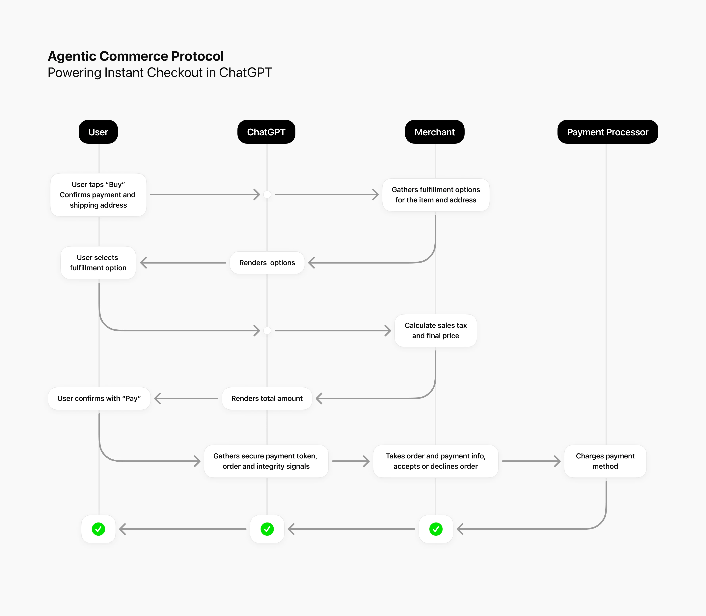



September 29, 2025

2025年9月29日

# Buy it in ChatGPT: Instant Checkout and the Agentic Commerce Protocol

# 在 ChatGPT 中购买：即时结账与智能体商务协议

We’re taking first steps toward agentic commerce in ChatGPT with new ways for people, AI agents, and businesses to shop together.

我们正迈出在 ChatGPT 中实现智能体商务（agentic commerce）的第一步——通过全新方式，让人、AI 智能体与企业共同完成购物。

More than 700 million people turn to ChatGPT each week for help with everyday tasks, including finding products they love. Starting today, we’re taking the first steps toward ChatGPT helping people buy them too—beginning with Instant Checkout, powered by the Agentic Commerce Protocol, built with Stripe.

每周有超过 7 亿人使用 ChatGPT 获取日常任务协助，包括寻找心仪商品。即日起，我们正式启动 ChatGPT 协助用户完成购买的新阶段——首项功能为“即时结账”（Instant Checkout），该功能由 OpenAI 与 Stripe 共同打造的“智能体商务协议”（Agentic Commerce Protocol）提供支持。

U.S. ChatGPT Plus, Pro, and Free users can now buy directly from U.S. Etsy sellers right in chat, with over a million Shopify merchants, like Glossier, SKIMS, Spanx and Vuori, coming soon. Today, Instant Checkout supports single-item purchases. Next, we’ll add multi-item carts and expand merchants and regions.

目前，美国地区的 ChatGPT Plus、Pro 及免费用户已可在聊天界面中直接向美国 Etsy 卖家下单购买；而包括 Glossier、SKIMS、Spanx 和 Vuori 在内的超百万 Shopify 商户也即将接入。现阶段，“即时结账”仅支持单件商品购买；下一步，我们将上线多商品购物车功能，并持续拓展合作商户与覆盖地区。

We’re also [open-sourcing⁠(opens in a new window)](https://agenticcommerce.dev/) the technology that powers Instant Checkout, the Agentic Commerce Protocol, so that more merchants and developers can begin building their integrations. The Agentic Commerce Protocol is an open standard for AI commerce that lets AI agents, people, and businesses work together to complete purchases. We co-developed it with [Stripe⁠(opens in a new window)](https://docs.stripe.com/agentic-commerce) and leading merchant partners to be powerful, secure, and easy to adopt.

我们还正式[开源⁠(在新窗口中打开)](https://agenticcommerce.dev/)驱动“即时结账”的底层技术——即“智能体商务协议”。此举旨在帮助更多商家与开发者快速启动集成开发。“智能体商务协议”是一项面向 AI 商务场景的开放标准，使 AI 智能体、用户与企业能够协同完成交易。该协议由 OpenAI 联合[Stripe⁠(在新窗口中打开)](https://docs.stripe.com/agentic-commerce)及多家头部商户合作伙伴共同研发，兼具强大能力、高安全性与易用性。

This marks the next step in agentic commerce, where ChatGPT doesn’t just help you find what to buy, it also helps you buy it. For shoppers, it’s seamless: go from chat to checkout in just a few taps. For sellers, it’s a new way to reach hundreds of millions of people while keeping full control of their payments, systems, and customer relationships.

这标志着智能体商务迈入全新阶段：ChatGPT 不再仅限于帮你“找商品”，更进一步助你“买商品”。对消费者而言，体验无缝流畅——仅需数次轻点，即可从对话直达结账；对商家而言，这是触达数亿用户的全新渠道，同时完全保有支付流程、自有系统及客户关系的自主控制权。

We’re making this protocol and [our documentation⁠(opens in a new window)](https://developers.openai.com/commerce) available today so interested merchants and developers can begin building integrations. When you’re ready to make your products available for purchase through ChatGPT, you can [apply here⁠(opens in a new window)](https://chatgpt.com/merchants?openaicom-did=a3674f47-ac6a-4604-a6d0-6f0e87fe4ffc&openaicom_referred=true).

我们今日同步发布该协议及[配套文档⁠(在新窗口中打开)](https://developers.openai.com/commerce)，欢迎感兴趣的商家与开发者立即着手集成开发。当您准备好让自家商品通过 ChatGPT 开放购买时，可[在此提交申请⁠(在新窗口中打开)](https://chatgpt.com/merchants?openaicom-did=a3674f47-ac6a-4604-a6d0-6f0e87fe4ffc&openaicom_referred=true)。

## How Instant Checkout works

## “即时结账”如何运作

When someone asks a shopping question—“best running shoes under $100” or “gifts for a ceramics lover” — ChatGPT shows the most relevant products from across the web. Product results are organic and unsponsored, ranked purely on relevance to the user.

当用户提出购物类问题——例如“100 美元以下的最佳跑鞋”或“适合陶瓷爱好者的礼物”——ChatGPT 会从全网呈现最相关的产品。所有商品结果均为自然展示、非赞助内容，其排序完全基于与用户需求的相关性。

If a product supports Instant Checkout, users can tap “Buy,” confirm their order, shipping, and payment details, and complete the purchase without ever leaving the chat. Existing ChatGPT subscribers can pay with their card on file, or other card and express payment options.

若某商品支持“即时结账（Instant Checkout）”，用户只需点击“购买（Buy）”，确认订单、收货地址及付款信息，即可在不离开当前对话界面的情况下完成购买。现有 ChatGPT 订阅用户可使用已绑定的信用卡支付，也可选择其他信用卡或快捷支付方式。

Orders, payments, and fulfillment are handled by the merchant using their existing systems. ChatGPT simply acts as the user’s AI agent—securely passing information between user and merchant, just like a digital personal shopper would.

订单处理、付款结算与履约发货均由商家通过其现有系统完成。ChatGPT 仅作为用户的 AI 助理，安全地在用户与商家之间传递信息，其作用正如一位数字化的私人购物顾问。

Merchants pay a small fee on completed purchases, but the service is free for users, doesn’t affect their prices, and doesn’t influence ChatGPT’s product results. Instant Checkout items are not preferred in product results. When ranking multiple merchants that sell the same product, ChatGPT considers factors like availability, price, quality, whether a merchant is the primary seller, and whether Instant Checkout is enabled, to optimize the user experience.

商家仅需就成功完成的交易支付少量费用；而该服务对用户完全免费，不会影响商品标价，也不会干扰 ChatGPT 的商品结果排序。“即时结账”商品在结果中不享有优先展示权。当多个商家销售同一款商品时，ChatGPT 在排序中综合考量库存可用性、价格、品质、商家是否为该商品的主售方，以及是否支持“即时结账”等因素，以优化用户体验。

## The Agentic Commerce Protocol

## 代理式商务协议（Agentic Commerce Protocol）

At the core of this experience is the [Agentic Commerce Protocol⁠(opens in a new window)](https://developers.openai.com/commerce) which provides the language that lets AI agents and businesses work together to complete a purchase for a user.

这一体验的核心是 [代理式商务协议（Agentic Commerce Protocol）⁠(在新窗口中打开)](https://developers.openai.com/commerce)，它提供了一套标准化通信语言，使 AI 助理与企业能够协同协作，为用户完成购买流程。

We built the Agentic Commerce Protocol with Stripe and leading merchants to:

我们联合 Stripe 及多家头部商家共同构建了代理式商务协议，旨在实现：

- Work across platforms, payment processors, and business types.  
- 兼容各类平台、支付服务商及企业类型；  

- Integrate quickly without changing their backend systems.  
- 快速集成，无需改造其后端系统；  

- Keep merchants in control of the customer relationship as the merchant of record across the purchase journey–from fulfillment and returns to support and communication.  
- 确保商家全程作为“交易主体（merchant of record）”，主导客户关系管理——涵盖履约发货、退换货、客户服务及沟通等全部环节。

When someone places an order, ChatGPT sends the necessary details to the merchant’s backend using Agentic Commerce Protocol. The merchant accepts or declines the order, processes the payment via their existing provider, and handles fulfillment and customer support exactly as they do today.

当用户下单时，ChatGPT 将必要订单信息通过代理式商务协议发送至商家后端系统。商家可自主决定接受或拒绝该订单，并通过其现有支付服务商完成付款处理，同时按当前既定流程执行履约发货与客户服务。

If a merchant already processes payments with [Stripe⁠(opens in a new window)](https://docs.stripe.com/agentic-commerce), they can enable agentic payments in as little as one line of code. If they use another payment processor, they can still participate in Instant Checkout and accept agentic payments either by using Stripe’s new [Shared Payment Token API⁠(opens in a new window)](https://docs.stripe.com/agentic-commerce/concepts/shared-payment-tokens) or adopting the Delegated Payments Spec in the Agentic Commerce Protocol—all without changing their existing payment processor.

若商家已使用 [Stripe⁠(在新窗口中打开)](https://docs.stripe.com/agentic-commerce) 处理支付，则仅需一行代码即可启用代理式支付功能。若商家采用其他支付服务商，仍可参与“即时结账”，并接受代理式支付：可通过接入 Stripe 全新推出的 [共享支付令牌 API（Shared Payment Token API）⁠(在新窗口中打开)](https://docs.stripe.com/agentic-commerce/concepts/shared-payment-tokens)，或采用代理式商务协议中的“委托支付规范（Delegated Payments Spec）”——全程无需更换其现有支付服务商。

## Built for trust

## 以信任为基石而构建

We believe agentic commerce should be built for trust. In this early stage of the AI commerce future:

我们坚信，智能体商务（agentic commerce）必须以信任为基石。在人工智能商务这一未来形态的早期阶段：

- Users stay in control — they explicitly confirm each step before any action is taken.  
- 用户始终掌握主动权——任何操作执行前，均需用户明确确认每一步骤。

- Payment is secure — encrypted payment tokens are only authorized for specific amounts and specific merchants with the user’s permission.  
- 支付安全可靠——经加密的支付令牌仅在获得用户授权的前提下，针对特定金额与特定商家生效。

- Data sharing is minimal — only the information required to complete the order is shared with the merchant, with the user’s permission.  
- 数据共享精简可控——仅在用户授权前提下，向商家共享完成订单所必需的最少信息。

### Partner perspectives

### 合作伙伴观点

> "Stripe is building the economic infrastructure for AI. That means re-architecting today’s commerce systems and creating new AI-powered experiences for billions of people. We’re proud to power Instant Checkout in ChatGPT and co-develop the Agentic Commerce Protocol to help businesses and AI platforms build the future of commerce."

> “Stripe 正在为人工智能构建经济基础设施。这意味着重构当今的商务系统，并为全球数十亿人打造全新的人工智能驱动体验。我们很荣幸为 ChatGPT 的‘即时结账’功能提供支持，并与各方共同开发‘智能体商务协议’，助力企业与 AI 平台共建商业的未来。”

– Will Gaybrick, President, Technology and Business, Stripe  
– 威尔·盖布里克（Will Gaybrick），Stripe 公司技术与业务总裁

## Just the start

## 一切才刚刚开始

This launch is just the beginning. As AI becomes a key interface for how people discover, decide, and buy, the Agentic Commerce Protocol provides a foundation that connects people and businesses for the next era of commerce.

本次发布仅是开端。随着人工智能日益成为人们发现商品、做出决策与完成购买的关键交互界面，“智能体商务协议”将为连接用户与企业、开启下一代商业时代奠定坚实基础。

- [2025](https://openai.com/news/?tags=2025)  
- [2025](https://openai.com/news/?tags=2025)

- [ChatGPT](https://openai.com/news/?tags=chatgpt)  
- [ChatGPT](https://openai.com/news/?tags=chatgpt)

