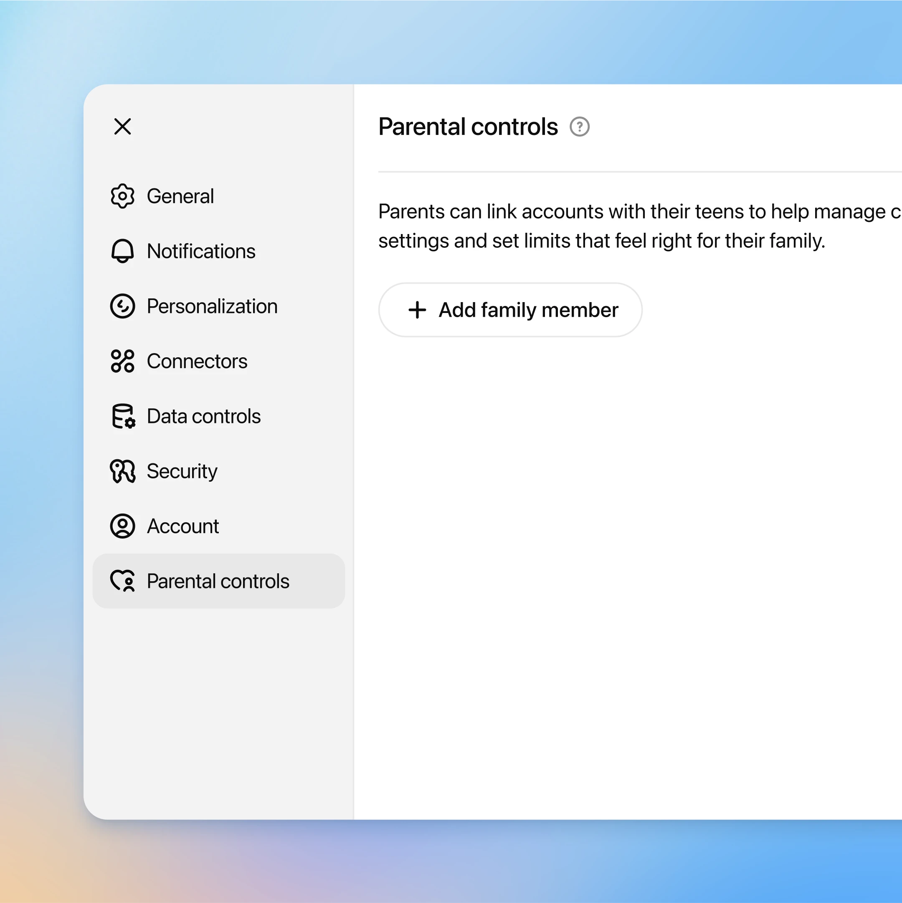
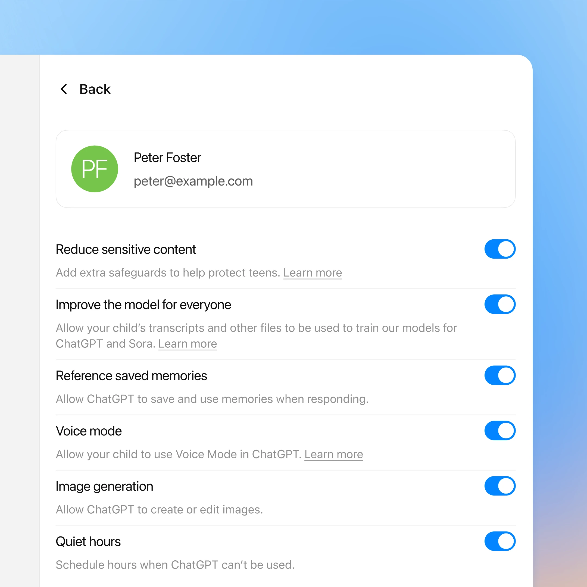
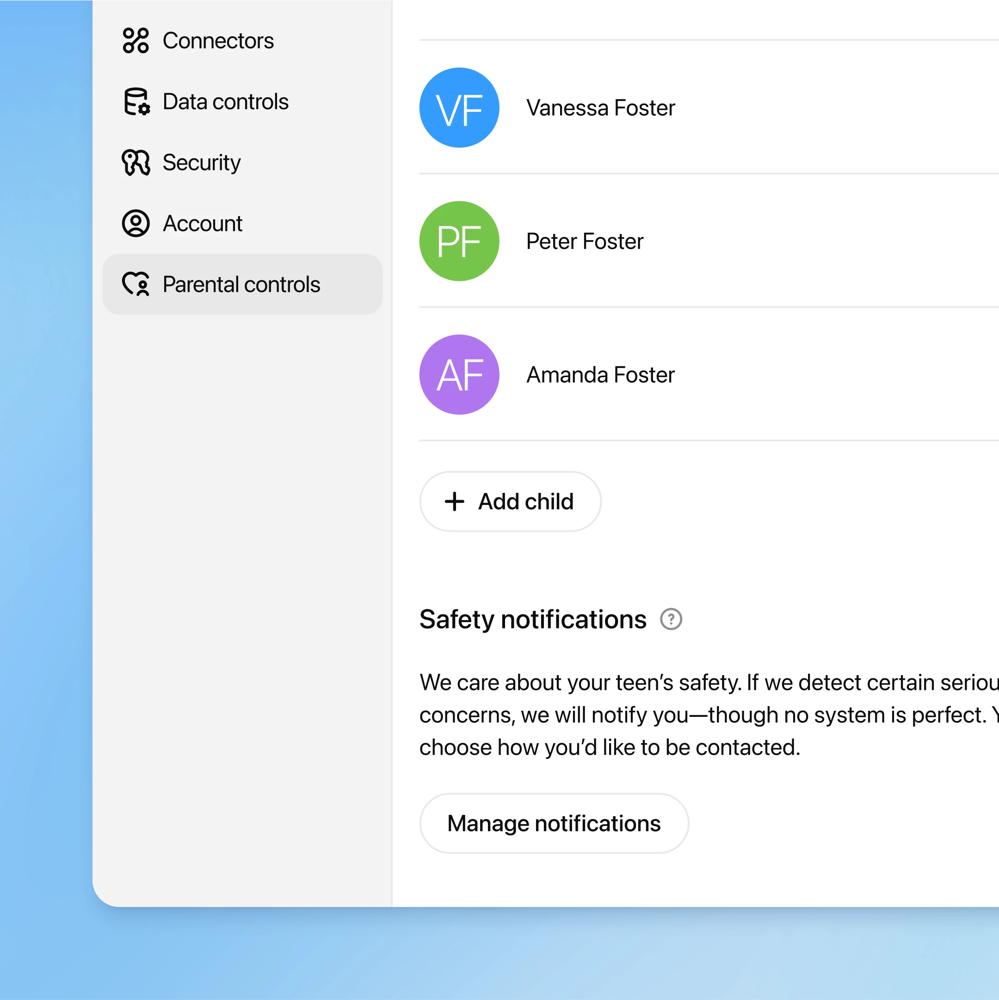



2025年9月29日

[产品动态](https://openai.com/news/product-releases/) [安全与对齐](https://openai.com/news/safety-alignment/)

# 推出家长控制功能

支持家庭的新工具与资源，以及保障青少年安全的通知机制

_**2025年9月30日更新：**_ _我们已正式上线配备家长控制功能的 Sora 应用。家长可在 ChatGPT 中为已关联的青少年账户调整 Sora 设置，包括选择启用非个性化内容流、决定青少年是否可收发私信，以及控制滚动浏览时是否呈现不间断的内容流。更多详情请参阅_[《Sora 2 博客》](https://openai.com/index/sora-2/)。

我们正全面推出家长控制功能，并同步上线全新的[家长资源页面⁠（在新窗口中打开）](https://chatgpt.com/parent-resources?openaicom-did=7f2ea5cd-0025-4868-b856-4892545e4f27&openaicom_referred=true)，以帮助家庭引导 ChatGPT 在自家环境中的使用方式。自即日起，所有 ChatGPT 用户均可使用该功能：家长可将自己的账户与青少年账户进行绑定，并自定义设置，从而为青少年提供安全、适龄的使用体验。

此项工作是我们持续推进“[让 ChatGPT 对所有人更有帮助⁠](https://openai.com/index/building-more-helpful-chatgpt-experiences-for-everyone/)”这一目标的重要组成部分，也是我们为家庭提供支持工具、助力青少年负责任地使用 AI 的关键举措。此前，我们曾公开表示，正在致力于构建一套长期的[年龄预测系统⁠](https://openai.com/index/building-towards-age-prediction/)，以便自动识别用户是否未满18周岁，从而令 ChatGPT 能够自动启用适配青少年的设置。而家长控制功能，正是赋予家长掌控权、管理青少年 ChatGPT 使用体验的重要一步。

在制定该方案过程中，我们与多位专家、倡导组织（包括“常识媒体”Common Sense Media）以及政策制定者（如加利福尼亚州与特拉华州总检察长办公室）密切合作，广泛听取意见；未来，我们也将持续优化并拓展这些控制功能。

“这些家长控制功能为家长管理青少年使用 ChatGPT 提供了一个良好的起点。不过需要指出的是，家长控制只是保障青少年网络安全的拼图之一——它只有与持续开展的关于负责任使用 AI 的对话、明确的家庭技术使用规则，以及家长主动了解青少年在线活动的积极参与相结合时，才能发挥最大效用。”  
—— **罗比·托尔尼（Robbie Torney），常识媒体（Common Sense Media）AI 项目高级总监**

## Getting started

## 入门指南

To set up parental controls, a parent or guardian sends an invite to their teen to connect accounts. After the teen accepts, the parent can manage the teen’s settings from their own account. Teens can also invite a parent to connect.

要设置家长控制功能，家长或监护人需向其青少年子女发送账户关联邀请。待青少年接受邀请后，家长即可通过自己的账户管理该青少年的设置。青少年也可主动邀请家长进行账户关联。

Once linked, parents can customize their teen’s experience in ChatGPT in a simple control page in account settings. If a teen unlinks their account, their parent will be notified.

账户关联成功后，家长可在账户设置中一个简洁的控制页面内，自定义青少年在 ChatGPT 中的使用体验。若青少年主动解除账户关联，系统将通知其家长。

## Stronger safeguards for linked teen accounts

## 针对已关联青少年账户的强化保护措施

As part of parental controls, we’re rolling out enhanced safeguards for linked teen accounts. Once parents and teens connect their accounts, the teen account will automatically get additional content protections, including reduced graphic content, viral challenges, sexual, romantic or violent roleplay, and extreme beauty ideals, to help keep their experience age-appropriate.

作为家长控制功能的一部分，我们正为已关联的青少年账户推出更严格的保护机制。一旦家长与青少年完成账户关联，该青少年账户将自动启用额外的内容保护措施，包括减少露骨内容、规避网络流行挑战、限制涉及性、浪漫或暴力的角色扮演，以及弱化极端审美标准等，从而确保其使用体验更符合其年龄阶段的发展需求。

These safeguards were guided by careful review of existing research to understand teens’ unique developmental differences.

上述保护措施的制定，基于对现有研究的审慎梳理，旨在深入理解青少年在成长过程中所具有的独特发展特征。

Parents will have the option to turn this setting off if they choose, but teen users cannot make changes.

家长可根据自身判断选择关闭此项设置，但青少年用户无权修改该设置。

Guardrails help, but they’re not foolproof and can be bypassed if someone is intentionally trying to get around them. We will continue to thoughtfully iterate and improve over time. We recommend parents talk with their teens about healthy AI use and what that looks like for their family.

防护机制虽有助益，但并非万无一失——若有人刻意尝试绕过这些限制，仍有可能突破防线。我们将持续审慎地迭代优化相关机制。同时，我们建议家长与青少年就“健康使用人工智能”展开坦诚交流，并共同探讨这一理念在各自家庭语境下的具体体现。

## Customizing your teen’s experience

## 自定义青少年的使用体验

We’re also giving parents additional features they can customize for their teens. From a simple control page, parents can:

我们还为家长提供了更多可为其青少年子女自定义的功能。通过一个简洁的控制页面，家长可以：

- **Set quiet hours**, or specific times when ChatGPT can’t be used.  
- **设置免打扰时段**，即 ChatGPT 无法使用的特定时间段。

- **Turn off voice mode**, to remove the option to use voice mode in ChatGPT.  
- **关闭语音模式**，从而移除在 ChatGPT 中使用语音功能的选项。

- **Turn off memory**, so ChatGPT won’t save and use memories when responding.  
- **关闭记忆功能**，使 ChatGPT 在回应时不会保存或调用过往对话记忆。

- **Remove image generation**, so ChatGPT won’t have the ability to create or edit images.  
- **移除图像生成功能**，使 ChatGPT 不具备创建或编辑图像的能力。

- **Opt out of model training,** so their teen’s conversations won’t be used to improve models powering ChatGPT.  
- **退出模型训练**，确保其子女的对话内容不会被用于改进驱动 ChatGPT 的模型。

These settings are optional and flexible so families can choose what works best for them.

上述设置均为可选且灵活，以便各家庭根据自身需求选择最适合的配置。

## Notifications in parental controls

## 家长控制中的通知机制

We know some teens turn to ChatGPT during hard moments, so we’ve built a new notification system to help parents know if something may be seriously wrong.

我们深知，部分青少年会在情绪低落或面临困境时向 ChatGPT 寻求帮助。因此，我们构建了一套全新的通知系统，以便家长及时了解孩子是否可能正经历严重问题。

We’ve added protections that help ChatGPT recognize potential signs that a teen might be thinking about harming themselves. If our systems detect potential harm, a small team of specially trained people reviews the situation. If there are signs of acute distress, we will contact parents by email, text message and push alert on their phone, unless they have opted out.

我们新增了多项保护机制，协助 ChatGPT 识别青少年可能存在自伤倾向的潜在迹象。一旦系统检测到潜在风险，将由一支经过专门培训的小型人工团队对情况进行复核。若确认存在急性心理危机迹象，我们将通过电子邮件、短信及手机推送通知联系家长——除非家长此前已明确选择不接收此类通知。

We are working with mental health and teen experts to design this because we want to get it right. No system is perfect, and we know we might sometimes raise an alarm when there isn’t real danger, but we think it’s better to act and alert a parent so they can step in than to stay silent.

我们在设计该机制过程中，持续与心理健康专家及青少年发展领域专家合作，力求做到审慎周全。没有任何系统是完美的；我们清楚，有时可能会在并无真实危险的情况下触发警报。但我们坚信：主动发出提醒、让家长及时介入，远胜于保持沉默。

We are also working on the right process and circumstances in which to reach law enforcement or other emergency services, for example if we detect an imminent threat to life and are unable to reach a parent.

此外，我们正在制定一套严谨的流程与适用情形，以决定何时应联系执法部门或其他紧急服务机构——例如，当我们检测到迫在眉睫的生命威胁，却无法及时联系上家长时。

Even in these rare situations, we take teen privacy seriously, and will only share the information needed for parents or emergency responders to protect a teen’s safety.

即便在这些极为罕见的情形下，我们依然高度重视青少年的隐私权，仅会共享为保障其人身安全所必需的最少信息。

![App settings screen with the left-hand menu showing options such as General, Notifications, Personalization, Connectors, Data controls, Security, Account, and Parental controls (selected). The main panel is titled ‘Parental controls’ with text: ‘Parents can link accounts with their teens to help manage settings and set limits that feel right for their family.’ Below is a ‘Family members’ list displaying: Vanessa Foster (blue icon with initials VF), Peter Foster (green icon with initials PF), and Amanda Foster (purple icon with initials AF). At the bottom is a button labeled ‘+ Add child.’](images/introducing-parental-controls-openai/img_003.png)

## Resources for parents

## 致家长的资源

Families are finding more ways to bring ChatGPT into daily life, whether it’s tackling schoolwork with study mode, brainstorming weekend ideas, or just answering quick questions. For some, it’s also a first step into exploring AI together. So we want to give parents the information they need about ChatGPT and how to guide their teen toward safe and positive use.

越来越多的家庭正以多种方式将 ChatGPT 融入日常生活——无论是借助“学习模式”完成课业、头脑风暴周末活动创意，还是快速解答日常疑问。对一些家庭而言，这更是亲子共同探索人工智能的第一步。因此，我们希望为家长提供关于 ChatGPT 的必要信息，并指导他们帮助青少年实现安全、积极的使用。

We’ve created a [new parent resource page⁠(opens in a new window)](https://chatgpt.com/parent-resources?openaicom-did=7f2ea5cd-0025-4868-b856-4892545e4f27&openaicom_referred=true) to bring everything together in one place. It explains how ChatGPT works, the parental controls available, and offers ideas for how teens can use it for learning, creativity, and everyday life. This is just a starting point and we expect to regularly update it with tips, guides, expert advice, and conversation starters so parents feel supported as their family’s use of AI grows.

我们已推出一个[全新的家长资源页面⁠（在新窗口中打开）](https://chatgpt.com/parent-resources?openaicom-did=7f2ea5cd-0025-4868-b856-4892545e4f27&openaicom_referred=true)，将所有相关信息整合于一处。该页面阐释了 ChatGPT 的工作原理、当前可用的家长控制功能，并提供了青少年如何将其运用于学习、创意表达及日常生活的实用建议。这仅是一个起点；我们将持续更新该页面，定期加入实用技巧、操作指南、专家建议以及亲子对话切入点，助力家长在家庭AI使用不断深入的过程中获得切实支持。

## Looking ahead

## 展望未来

Over the coming months, we’re building an [age prediction system⁠](https://openai.com/index/building-towards-age-prediction/) that will help us predict whether a user is under 18 so that ChatGPT can automatically apply teen-appropriate settings. In instances where we’re unsure of a user’s age, we’ll take the safer route and apply teen settings proactively. In the meantime, parental controls will be the most effective way for parents to ensure their teens are opted into our age-appropriate teen experience.

在接下来的数月内，我们正在开发一套[年龄预测系统⁠](https://openai.com/index/building-towards-age-prediction/)，用以辅助判断用户是否未满18周岁，从而让 ChatGPT 自动启用适配青少年的设置。当无法明确判定用户年龄时，我们将采取更审慎的做法，主动为其启用青少年适用设置。在此期间，家长控制功能仍是确保青少年顺利接入我们专为青少年优化的体验的最有效方式。

This is an important step forward, but our work isn’t done. We’ll continue to invest in features that help parents and teens use ChatGPT safely and confidently, and share our progress.

这是迈向未来的重要一步，但我们的工作远未结束。我们将持续投入资源，开发更多有助于家长与青少年安全、自信地使用 ChatGPT 的功能，并及时向公众分享进展。

- [2025](https://openai.com/news/?tags=2025)  
- [2025](https://openai.com/news/?tags=2025)  

- [ChatGPT](https://openai.com/news/?tags=chatgpt)  
- [ChatGPT](https://openai.com/news/?tags=chatgpt)

