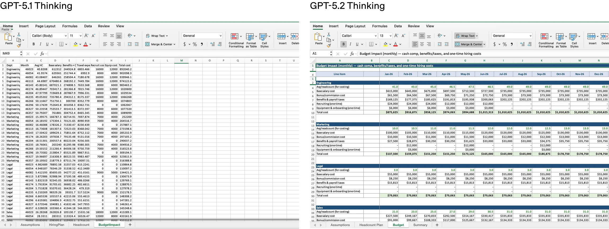
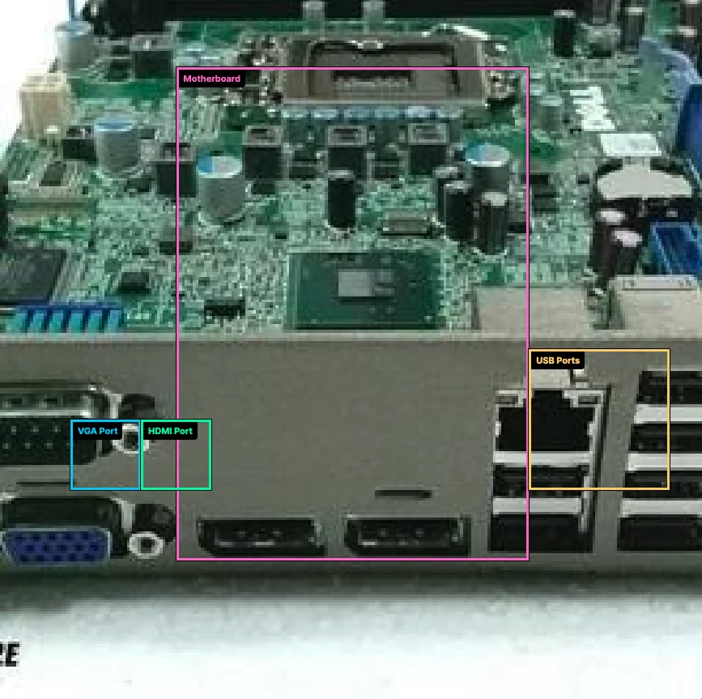
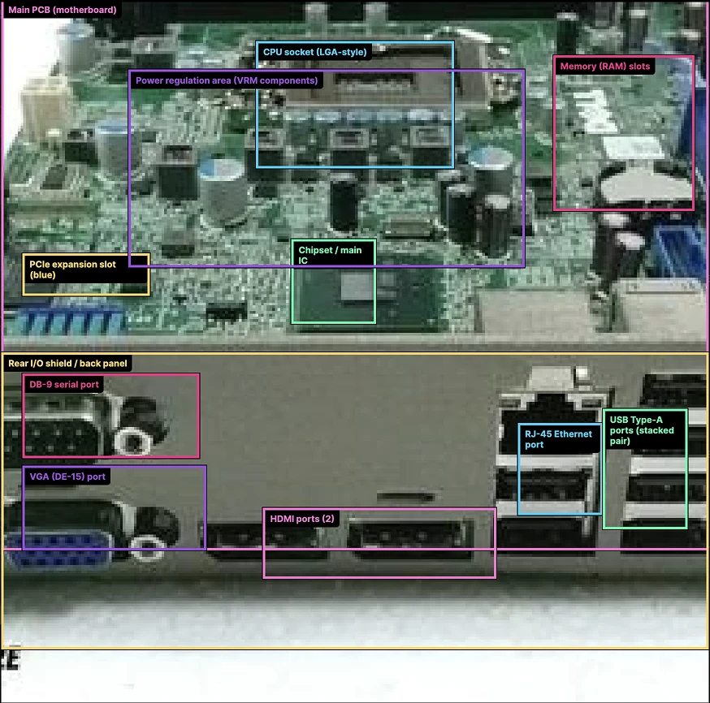
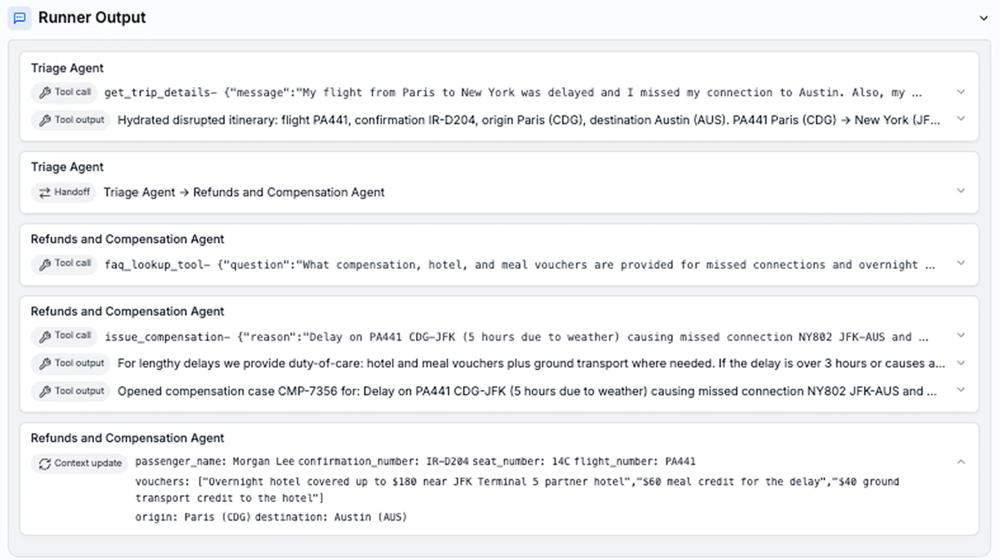
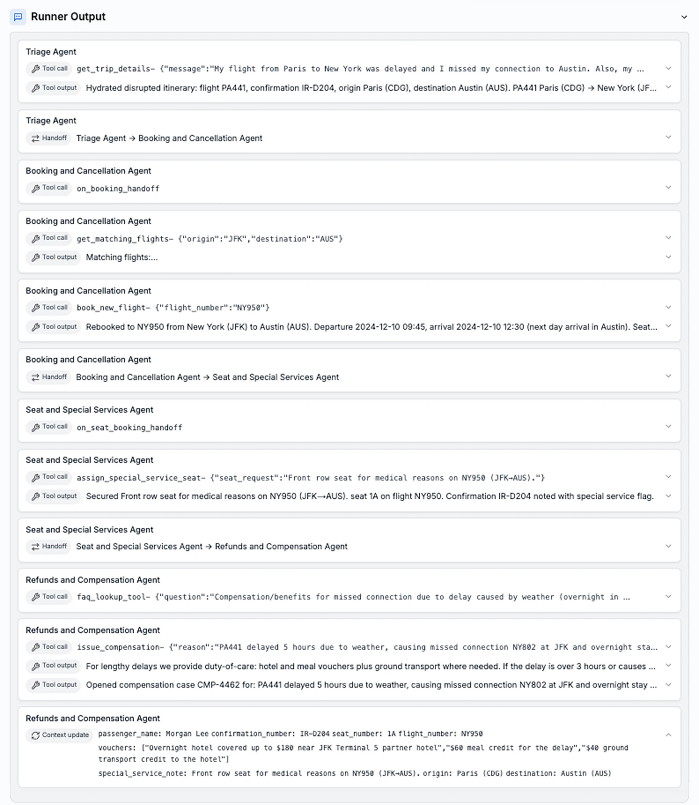

render_with_liquid: false
render_with_liquid: false

December 11, 2025

2025年12月11日

[Product](https://openai.com/news/product-releases/) [Release](https://openai.com/research/index/release/)

[产品](https://openai.com/news/product-releases/) [发布](https://openai.com/research/index/release/)

# Introducing GPT‑5.2

# 推出 GPT‑5.2

The most advanced frontier model for professional work and long-running agents.

面向专业工作与长期运行智能体（agents）的最先进前沿模型。

We are introducing GPT‑5.2, the most capable model series yet for professional knowledge work.

我们正式推出 GPT‑5.2——迄今为止在专业知识工作领域能力最强的模型系列。

Already, the average ChatGPT Enterprise user [says⁠](https://openai.com/index/the-state-of-enterprise-ai-2025-report/) AI saves them 40–60 minutes a day, and heavy users say it saves them more than 10 hours a week. We designed GPT‑5.2 to unlock even more economic value for people; it’s better at creating spreadsheets, building presentations, writing code, perceiving images, understanding long contexts, using tools, and handling complex, multi-step projects.

目前，ChatGPT Enterprise 的普通用户[表示](https://openai.com/index/the-state-of-enterprise-ai-2025-report/)，AI 每天为其节省 40–60 分钟；重度用户则表示每周可节省超 10 小时。我们设计 GPT‑5.2 的初衷，正是进一步释放 AI 为人类创造的经济价值：它在制作电子表格、构建演示文稿、编写代码、图像感知、长上下文理解、工具调用，以及处理复杂多步骤项目等方面均显著提升。

GPT‑5.2 sets a new state of the art across many benchmarks, including GDPval, where it outperforms industry professionals at well-specified knowledge work tasks spanning 44 occupations.

GPT‑5.2 在多项基准测试中树立了全新技术标杆，包括 GDPval —— 在涵盖 44 个职业领域的明确定义的知识工作任务上，其表现已超越行业专业人士。

|     |     |     |
| --- | --- | --- |
|  | **GPT-5.2 Thinking** | **GPT-5.1 Thinking** |
|  | **GPT‑5.2 思维能力** | **GPT‑5.1 思维能力** |
| **GDPval (wins or ties)** Knowledge work tasks | 70.9% | 38.8% (GPT-5) |
| **GDPval（胜出或持平）** 知识工作任务 | 70.9% | 38.8%（GPT‑5） |
| **SWE-Bench Pro (public)** Software engineering | 55.6% | 50.8% |
| **SWE-Bench Pro（公开版）** 软件工程 | 55.6% | 50.8% |
| **SWE-bench Verified** Software engineering | 80.0% | 76.3% |
| **SWE-bench Verified（经验证版）** 软件工程 | 80.0% | 76.3% |
| **GPQA Diamond (no tools)** Science questions | 92.4% | 88.1% |
| **GPQA Diamond（不使用工具）** 科学问题 | 92.4% | 88.1% |
| **CharXiv Reasoning (w/ Python)** Scientific figure questions | 88.7% | 80.3% |
| **CharXiv 推理（支持 Python）** 科学图表相关问题 | 88.7% | 80.3% |
| **AIME 2025 (no tools)** Competition math | 100.0% | 94.0% |
| **AIME 2025（不使用工具）** 竞赛数学 | 100.0% | 94.0% |
| **FrontierMath (Tier 1–3)** Advanced mathematics | 40.3% | 31.0% |
| **FrontierMath（第 1–3 级）** 高等数学 | 40.3% | 31.0% |
| **FrontierMath (Tier 4)** Advanced mathematics | 14.6% | 12.5% |
| **FrontierMath（第 4 级）** 高等数学 | 14.6% | 12.5% |
| **ARC-AGI-1 (Verified)** Abstract reasoning | 86.2% | 72.8% |
| **ARC-AGI-1（经验证版）** 抽象推理 | 86.2% | 72.8% |
| **ARC-AGI-2 (Verified)** Abstract reasoning | 52.9% | 17.6% |
| **ARC-AGI-2（经验证版）** 抽象推理 | 52.9% | 17.6% |

[**Notion** ⁠(opens in a new window)](https://www.notion.com/), [**Box** ⁠(opens in a new window)](https://www.box.com/home), [**Shopify** ⁠(opens in a new window)](https://www.shopify.com/), [**Harvey** ⁠(opens in a new window)](https://www.harvey.ai/) and [**Zoom** ⁠(opens in a new window)](https://www.zoom.com/) observed GPT‑5.2 demonstrates state-of-the-art long-horizon reasoning and tool-calling performance. [**Databricks** ⁠(opens in a new window)](https://www.databricks.com/), [**Hex** ⁠(opens in a new window)](https://hex.tech/) and [**Triple Whale** ⁠(opens in a new window)](https://www.triplewhale.com/) found GPT‑5.2 to be exceptional at agentic data science and document analysis tasks. [**Cognition** ⁠(opens in a new window)](https://cognition.ai/), [**Warp** ⁠(opens in a new window)](https://www.warp.dev/), [**Charlie Labs** ⁠(opens in a new window)](https://www.charlielabs.ai/), [**JetBrains** ⁠(opens in a new window)](https://www.jetbrains.com/) and [**Augment Code** ⁠(opens in a new window)](https://www.augmentcode.com/) say GPT‑5.2 delivers state-of-the-art agentic coding performance, with measurable improvements in areas such as interactive coding, code reviews and bug finding.

[**Notion**（在新窗口中打开）](https://www.notion.com/)、[**Box**（在新窗口中打开）](https://www.box.com/home)、[**Shopify**（在新窗口中打开）](https://www.shopify.com/)、[**Harvey**（在新窗口中打开）](https://www.harvey.ai/) 和 [**Zoom**（在新窗口中打开）](https://www.zoom.com/) 观察到，GPT‑5.2 展现出业界领先的长程推理与工具调用能力。[**Databricks**（在新窗口中打开）](https://www.databricks.com/)、[**Hex**（在新窗口中打开）](https://hex.tech/) 与 [**Triple Whale**（在新窗口中打开）](https://www.triplewhale.com/) 发现，GPT‑5.2 在具备自主性的数据科学与文档分析任务中表现尤为卓越。[**Cognition**（在新窗口中打开）](https://cognition.ai/)、[**Warp**（在新窗口中打开）](https://www.warp.dev/)、[**Charlie Labs**（在新窗口中打开）](https://www.charlielabs.ai/)、[**JetBrains**（在新窗口中打开）](https://www.jetbrains.com/) 及 [**Augment Code**（在新窗口中打开）](https://www.augmentcode.com/) 表示，GPT‑5.2 提供业界领先的自主编码（agentic coding）性能，在交互式编程、代码审查与缺陷检测等关键环节均实现了可量化的显著提升。

In ChatGPT, GPT‑5.2 Instant, Thinking, and Pro will begin rolling out today, starting with paid plans. In the API, they are available now to all developers.

在 ChatGPT 中，GPT‑5.2 Instant、Thinking 和 Pro 版本将于今日起开始分批上线，首批面向付费用户开放。在 API 平台中，所有开发者现已可立即使用这三款模型。

Overall, GPT‑5.2 brings significant improvements in general intelligence, long-context understanding, agentic tool-calling, and vision—making it better at executing complex, real-world tasks end-to-end than any previous model.

总体而言，GPT‑5.2 在通用智能、长上下文理解、自主式工具调用（agentic tool-calling）以及多模态视觉能力方面均实现了显著提升——使其在端到端执行复杂现实任务方面，超越了此前所有模型。

## Model performance

## 模型性能

#### Economically valuable tasks

#### 具备经济价值的任务

GPT‑5.2 Thinking is the best model yet for real-world, professional use. On [GDPval⁠](https://openai.com/index/gdpval/), an eval measuring well-specified knowledge work tasks across 44 occupations, GPT‑5.2 Thinking sets a new state-of-the-art score, and is our first model that performs at or above a human expert level. Specifically, GPT‑5.2 Thinking beats or ties top industry professionals on 70.9% of comparisons on GDPval knowledge work tasks, according to expert human judges. These tasks include making presentations, spreadsheets, and other artifacts. GPT‑5.2 Thinking produced outputs for GDPval tasks at >11x the speed and <1% the cost of expert professionals, suggesting that when paired with human oversight, GPT‑5.2 can help with professional work. Speed and cost estimates are based on historical metrics; speed in ChatGPT may vary.

GPT‑5.2 Thinking 是迄今最适合真实世界专业场景使用的模型。在评估基准 [GDPval⁠](https://openai.com/index/gdpval/)（一项覆盖 44 类职业、衡量定义明确的知识型工作任务的评测）中，GPT‑5.2 Thinking 创下全新 SOTA（state-of-the-art）分数，也是我们首个在整体表现上达到或超越人类专家水平的模型。具体而言，根据多位领域专家评审员的比对评估，GPT‑5.2 Thinking 在 GDPval 知识型工作任务中，有 70.9% 的任务表现优于或等同于顶尖行业从业者。这些任务涵盖制作演示文稿、电子表格及其他交付成果。GPT‑5.2 Thinking 完成 GDPval 任务的输出速度超过专家专业人士的 11 倍，成本则低于其 1%，表明：在人类监督下，GPT‑5.2 可切实辅助专业工作。上述速度与成本估算基于历史指标；在 ChatGPT 中的实际响应速度可能有所差异。

GDPval  
Knowledge work tasks  

GDPval  
知识型工作任务  

GPT-5.2 Pro GPT-5.2 Thinking GPT-5 Thinking  
0% 20% 40% 60% 80% 100%  
Win rate vs industry professional  
相较行业从业者的胜率  
74.1% 70.9% 38.8%  
Expert-level Wins Ties  
达到专家水平 胜出 持平  

_In GDPval, models attempt well-specified knowledge work spanning 44 occupations from the top 9 industries contributing to US GDP. Tasks request real work products, such as sales presentations, accounting spreadsheets, urgent care schedules, manufacturing diagrams, or short videos. In ChatGPT, GPT‑5.2 Thinking has new tools that GPT‑5 Thinking does not._

在 GDPval 评测中，各模型需完成覆盖美国 GDP 贡献排名前九的行业中 44 类职业的、定义明确的知识型工作任务。任务要求产出真实工作成果，例如销售演示文稿、会计电子表格、急诊排班表、制造工艺图，或短视频等。在 ChatGPT 中，GPT‑5.2 Thinking 新增了 GPT‑5 Thinking 所不具备的多项工具功能。

When reviewing one especially good output, one GDPval judge commented, "It is an exciting and noticeable leap in output quality... \[it\] appears to have been done by a professional company with staff, and has a surprisingly well designed layout and advice for both deliverables, though with one we still have some minor errors to correct."

在审阅一份尤为出色的输出时，一位 GDPval 评审员评论道：“这是输出质量上一次令人振奋且显而易见的飞跃……它看起来像是由一家配备专业团队的公司所完成，两份交付成果的版式设计精良、建议到位，令人惊喜；尽管其中一份仍存在少量需修正的细微错误。”

Additionally, on our internal benchmark of junior investment banking analyst spreadsheet modeling tasks—such as putting together a three-statement model for a Fortune 500 company with proper formatting and citations, or building a leveraged buyout model for a take-private—GPT 5.2 Thinking's average score per task is 9.3% higher than GPT‑5.1’s, rising from 59.1% to 68.4%.

此外，在我们内部针对初级投资银行分析师电子表格建模任务所设的评测基准中——例如为一家《财富》500 强企业构建格式规范、引用完整的三表联动财务模型，或为私有化收购交易搭建杠杆收购（LBO）模型——GPT‑5.2 Thinking 在每项任务上的平均得分较 GPT‑5.1 提升了 9.3 个百分点，从 59.1% 升至 68.4%。

Side-by-side comparisons show improved sophistication and formatting in spreadsheets and slides generated by GPT‑5.2 Thinking:

并排对比显示，GPT‑5.2 Thinking 生成的电子表格与幻灯片在复杂度和格式表现上均有显著提升：

**Prompt:** Create a workforce planning model: headcount, hiring plan, attrition, and budget impact. Include engineering, marketing, legal, and sales departments.

**提示词：** 构建一个人员编制规划模型：涵盖员工总数、招聘计划、人员流失率及预算影响。需包含工程、市场营销、法务和销售四个部门。

To use the new spreadsheet and presentation capabilities in ChatGPT, you must be on a Plus, Pro, Business, or Enterprise plan and select either **GPT‑5.2 Thinking** or **Pro**. Complex generations can take many minutes to produce.

要在 ChatGPT 中使用全新的电子表格与演示文稿生成功能，您必须订阅 Plus、Pro、Business 或 Enterprise 计划，并在模型选项中选择 **GPT‑5.2 Thinking** 或 **Pro**。复杂内容的生成可能需要数分钟时间。

#### Coding

#### 编程能力

GPT‑5.2 Thinking sets a new state of the art of 55.6% on SWE-Bench Pro, a rigorous evaluation of real-world software engineering. Unlike SWE-bench Verified, which only tests Python, SWE-Bench Pro tests four languages and aims to be more contamination-resistant, challenging, diverse, and industrially relevant.

GPT‑5.2 Thinking 在 SWE-Bench Pro（一项针对真实软件工程场景的严格评测）上创下 55.6% 的新基准成绩。与仅测试 Python 的 SWE-Bench Verified 不同，SWE-Bench Pro 覆盖四种编程语言，旨在提升抗数据污染能力，同时增强挑战性、任务多样性与工业实用性。

SWE-Bench Pro (public)  
SWE-Bench Pro（公开版）  
Software engineering  
软件工程  

020,00040,00060,00080,000100,000Output tokens30%40%50%60%AccuracyGPT-5.1 Thinking (high)GPT-5.1-Codex-Max (xhigh)GPT-5.2 Thinking (xhigh)GPT-5.2 ThinkingGPT-5.1 ThinkingGPT-5.1-Codex-Max

020,00040,00060,00080,000100,000输出 Token 数量30%40%50%60%准确率GPT-5.1 Thinking（high）GPT-5.1-Codex-Max（xhigh）GPT-5.2 Thinking（xhigh）GPT-5.2 ThinkingGPT-5.1 ThinkingGPT-5.1-Codex-Max

_In_ [_SWE-Bench Pro_ ⁠(opens in a new window)](https://scale.com/leaderboard/swe_bench_pro_public) [_⁠_ ⁠⁠](https://openai.com/index/introducing-swe-bench-verified/) _, a model is given a code repository and must generate a patch to solve a realistic software engineering task._

在 [_SWE-Bench Pro_ ⁠（在新窗口中打开）](https://scale.com/leaderboard/swe_bench_pro_public) [_⁠_ ⁠⁠](https://openai.com/index/introducing-swe-bench-verified/) 中，模型会接收一个代码仓库，并需生成补丁以解决一项真实的软件工程任务。

On SWE-bench Verified (not plotted), GPT‑5.2 Thinking scores our new high of 80%.

在 SWE-Bench Verified（图中未标出）评测中，GPT‑5.2 Thinking 取得了我们迄今最高的 80% 分数。

For everyday professional use, this translates into a model that can more reliably debug production code, implement feature requests, refactor large codebases, and ship fixes end-to-end with less manual intervention.

在日常专业场景中，这意味着该模型能够更可靠地调试生产环境代码、实现功能需求、重构大型代码库，并以更少的人工干预完成端到端的缺陷修复与交付。

GPT‑5.2 Thinking is also better at front-end software engineering than GPT‑5.1 Thinking. Early testers found it significantly stronger at front-end development and complex or unconventional UI work—especially involving 3D elements—making it a powerful daily partner for engineers across the stack. See a few examples of what it can produce from a single prompt:

GPT‑5.2 Thinking 在前端软件工程方面也优于 GPT‑5.1 Thinking。早期测试者发现，它在前端开发以及复杂或非常规的用户界面（UI）任务（尤其是涉及 3D 元素的任务）上表现显著更强，使其成为全栈工程师日常工作中强有力的协作伙伴。以下是一个单条提示词即可生成的若干示例：

`Prompt:`` Create a single-page app in a single HTML file with the following requirements:
- Name: Ocean Wave Simulation
- Goal: Display realistic animated waves.
- Features: Change wind speed, wave height, lighting.
- The UI should be calming and realistic.`

`提示词：` 创建一个单页应用，全部代码写在一个 HTML 文件中，需满足以下要求：  
- 名称：海洋波浪模拟器（Ocean Wave Simulation）  
- 目标：呈现逼真的动态波浪效果。  
- 功能：支持调节风速、波高和光照。  
- 界面风格应宁静且真实。

Early testers shared their feedback on GPT‑5.2’s coding capabilities:

早期测试者就 GPT‑5.2 的编程能力分享了他们的反馈：

> "GPT-5.2 represents the biggest leap for GPT models in agentic coding since GPT-5 and is a SOTA coding model in its price range. The version bump undersells the jump in intelligence. We’re excited to make it the default across Windsurf and several core Devin workloads."

> “GPT‑5.2 是自 GPT‑5 以来，GPT 系列在‘自主代理式编程’（agentic coding）领域取得的最大一次飞跃，也是其价格区间内当前最先进的（SOTA）编程模型。仅从版本号升级来看，反而低估了其智能水平的实质性跃升。我们非常期待将其设为 Windsurf 平台及多个核心 Devin 工作负载的默认模型。”

Jeff Wang, CEO, Windsurf  
杰夫·王（Jeff Wang），Windsurf 公司首席执行官

#### Factuality  

#### 事实准确性  

GPT‑5.2 Thinking hallucinates less than GPT‑5.1 Thinking. On a set of de-identified queries from ChatGPT, responses with errors were 30%rel less common. For professionals, this means fewer mistakes when using the model for research, writing, analysis, and decision support—making the model more dependable for everyday knowledge work.

GPT‑5.2 Thinking 比 GPT‑5.1 Thinking 更少出现幻觉（hallucination）。在一组来自 ChatGPT 的去标识化查询样本中，含错误的响应比例相对降低了 30%。对专业人士而言，这意味着在开展研究、写作、分析及决策支持等工作时出错更少，从而让该模型在日常知识型工作中更加值得信赖。

Response-level error rate on de-identified ChatGPT queries  
基于去标识化 ChatGPT 查询的响应级错误率  

GPT-5.2 Thinking GPT-5.1 Thinking  
GPT‑5.2 Thinking GPT‑5.1 Thinking  
0% 20% 40% 60% 80% 100%  
0% 20% 40% 60% 80% 100%  
Responses with at least one error 6.2% 8.8%  
至少含一处错误的响应比例 6.2% 8.8%

_Reasoning effort was set to the maximum available and a search tool was enabled. Errors were detected by other models, which may make errors themselves. Claim-level error rates are far lower than response-level error rates, as most responses contain many claims._

推理努力程度被设为当前最高可用水平，并启用了搜索工具。错误由其他模型检测得出，而这些模型自身也可能出错。声明级（claim-level）错误率远低于响应级（response-level）错误率，因为大多数响应包含大量独立声明。

Like all models, GPT‑5.2 Thinking is imperfect. For anything critical, double check its answers.

与所有模型一样，GPT‑5.2 Thinking 并非完美无缺。对于任何关键任务，请务必对其回答进行二次核查。

#### Long context

#### 长上下文能力

GPT‑5.2 Thinking sets a new state of the art in long-context reasoning, achieving leading performance on OpenAI MRCRv2—an evaluation that tests a model’s ability to integrate information spread across long documents. On real-world tasks like deep document analysis, which require related information across hundreds of thousands of tokens, GPT‑5.2 Thinking is substantially more accurate than GPT‑5.1 Thinking. In particular, it’s the first model we’ve seen that achieves near 100% accuracy on the 4-needle MRCR variant (out to 256k tokens).

GPT‑5.2 Thinking 在长上下文推理领域树立了新的业界标杆，在 OpenAI MRCRv2 评测中取得领先表现——该评测专门检验模型在超长文档中整合分散信息的能力。在深度文档分析等真实世界任务中（此类任务需跨数十万 token 关联相关信息），GPT‑5.2 Thinking 的准确性显著高于 GPT‑5.1 Thinking。尤其值得注意的是，它是目前我们所见首个在 4-needle MRCR 变体（最大输入长度达 256k tokens）上实现近 100% 准确率的模型。

In practical terms, this enables professionals to use GPT‑5.2 to work with long documents—such as reports, contracts, research papers, transcripts, and multi-file projects—while maintaining coherence and accuracy across hundreds of thousands of tokens. This makes GPT‑5.2 especially well suited for deep analysis, synthesis, and complex multi-source workflows.

从实际应用角度看，这一能力使专业人士得以借助 GPT‑5.2 处理长篇文档——例如报告、合同、学术论文、会议记录以及多文件项目——同时在数十万 token 的范围内保持逻辑连贯性与内容准确性。这使得 GPT‑5.2 尤其适用于深度分析、信息综合及复杂的多源协同工作流。

OpenAI MRCRv2, 4 needles  
OpenAI MRCRv2，4 针测试  
Long context  
长上下文能力  

8k 16k 32k 64k 128k 256k Max input tokens  
8k 16k 32k 64k 128k 256k 最大输入 token 数  

0% 50% 100% Mean match ratio  
0% 50% 100% 平均匹配率  

GPT-5.2 Thinking GPT-5.1 Thinking  
GPT-5.2 Thinking GPT-5.1 Thinking  

OpenAI MRCRv2, 8 needles  
OpenAI MRCRv2，8 针测试  
Long context  
长上下文能力  

8k 16k 32k 64k 128k 256k Max input tokens  
8k 16k 32k 64k 128k 256k 最大输入 token 数  

0% 50% 100% Mean match ratio  
0% 50% 100% 平均匹配率  

GPT-5.2 Thinking GPT-5.1 Thinking  
GPT-5.2 Thinking GPT-5.1 Thinking  

_In_ [_OpenAI-MRCR⁠_ ⁠(opens in a new window)](https://huggingface.co/datasets/openai/mrcr) _v2 (multi-round co-reference resolution), multiple identical “needle” user requests are inserted into long “haystacks” of similar requests and responses, and the model is asked to reproduce the response to nth needle. Version 2 of the eval fixes ~5% of tasks that had incorrect ground truth values. Mean match ratio measures the average string match ratio between the model’s response and the correct answer. The points at 256k max input tokens represent averages over 128k–256k input tokens, and so forth. Here, 256k represents 256 \* 1,024 = 262,144 tokens. Reasoning effort was set to the maximum available._

在 [_OpenAI-MRCR⁠_ ⁠(在新窗口中打开)](https://huggingface.co/datasets/openai/mrcr) v2（多轮共指消解）评测中，多个完全相同的“针”（needle）用户请求被嵌入由大量相似请求与响应构成的长“ haystack”（干草堆）中，模型需准确复现第 n 个“针”所对应的正确响应。该评测的 v2 版本修正了约 5% 存在错误标准答案（ground truth）的任务。平均匹配率（Mean match ratio）衡量的是模型输出与标准答案之间的字符串平均匹配比例。图中横坐标为 256k 的数据点，代表的是输入长度在 128k 至 256k token 区间内的平均值，依此类推。此处“256k”即 256 × 1,024 = 262,144 个 token。推理努力程度被设为当前最高可用水平。

For tasks that benefit from thinking beyond the maximum context window, GPT‑5.2 Thinking is compatible with our new Responses `/compact` endpoint, which extends the model’s effective context window.  
对于需要超越最大上下文窗口进行思考的任务，GPT‑5.2 Thinking 可与我们全新的 Responses `/compact` 接口兼容，从而扩展模型的有效上下文窗口。

This lets GPT‑5.2 Thinking tackle more tool-heavy, long-running workflows that would otherwise be limited by context length.  
这使得 GPT‑5.2 Thinking 能够处理工具调用更密集、运行时间更长的工作流——而这类工作流若仅依赖原始上下文长度，则会受到显著限制。

Read more in our [API documentation⁠(opens in a new window)](https://platform.openai.com/docs/api-reference/responses/compact).  
更多详情，请参阅我们的 [API 文档⁠(在新窗口中打开)](https://platform.openai.com/docs/api-reference/responses/compact)。

#### Vision

#### 视觉能力

GPT‑5.2 Thinking is our strongest vision model yet, cutting error rates roughly in half on chart reasoning and software interface understanding.  
GPT‑5.2 Thinking 是我们迄今最强的视觉模型，在图表推理与软件界面理解任务上的错误率大幅降低约一半。

For everyday professional use, this means the model can more accurately interpret dashboards, product screenshots, technical diagrams, and visual reports—supporting workflows in finance, operations, engineering, design, and customer support where visual information is central.  
在日常专业场景中，这意味着该模型能更精准地解析仪表盘、产品截图、技术示意图和可视化报告——从而有力支持金融、运营、工程、设计及客户支持等以视觉信息为核心的工作流程。

CharXiv Reasoning  
Scientific figure questions  

CharXiv 推理  
科学论文图表类问题  

GPT-5.2 Thinking GPT-5.1 Thinking  
0% 20% 40% 60% 80% 100%  
Accuracy 88.7% 80.3%  

_In_ [_CharXiv Reasoning_ ⁠(opens in a new window)](https://arxiv.org/abs/2406.18521) _, models answer questions about visual charts from scientific papers. A Python tool was enabled and reasoning effort was set to maximum._  
在 [_CharXiv 推理_ ⁠(在新窗口中打开)](https://arxiv.org/abs/2406.18521) 中，模型需回答有关科研论文中可视化图表的问题。实验中启用了 Python 工具，并将推理强度设为最高。

ScreenSpot-Pro  
GUI screenshot understanding  

ScreenSpot-Pro  
图形用户界面（GUI）截图理解  

GPT-5.2 Thinking GPT-5.1 Thinking  
0% 20% 40% 60% 80% 100%  
Accuracy 86.3% 64.2%  

_In_ [_ScreenSpot-Pro_ ⁠(opens in a new window)](https://arxiv.org/abs/2504.07981) _, models must reason about high-resolution screenshots of graphical user interfaces from a variety of professional settings. A Python tool was enabled and reasoning effort was set to maximum. Without the Python tool, scores are much lower. We recommend enabling the Python tool on vision tasks like these._  
在 [_ScreenSpot-Pro_ ⁠(在新窗口中打开)](https://arxiv.org/abs/2504.07981) 中，模型需对来自多种专业场景的高分辨率图形用户界面（GUI）截图进行深度推理。实验中启用了 Python 工具，并将推理强度设为最高；若不启用 Python 工具，得分将显著下降。我们建议在诸如此类的视觉任务中启用 Python 工具。

Compared to previous models, GPT‑5.2 Thinking has a stronger grasp of how elements are positioned within an image, which helps on tasks where relative layout plays a key role in solving the problem.  

与之前的模型相比，GPT‑5.2 Thinking 对图像中各元素的空间位置关系具有更强的理解能力，这在依赖相对布局来解题的任务中尤为关键。

In the example below, we ask the model to identify the components in an image input (in this case, a motherboard) and return labels with approximate bounding boxes. Even on a low-quality image, GPT‑5.2 identifies the main regions and places boxes that sometimes match the true locations of each component, while GPT‑5.1 only labels a few parts and shows a much weaker understanding of their spatial arrangement. Both models make clear mistakes, but GPT‑5.2 shows better comprehension of the image.

在下方示例中，我们要求模型识别图像输入（此处为一块主板）中的各个组件，并返回带近似边界框的标签。即使面对低质量图像，GPT‑5.2 仍能识别出主要区域，所绘制的边界框有时能准确对应各组件的真实位置；而 GPT‑5.1 仅能标注少数几个部件，且对其空间排布关系的理解明显更弱。两个模型均存在明显错误，但 GPT‑5.2 对图像的整体理解能力更优。

##### GPT‑5.1

##### GPT‑5.1

##### GPT‑5.2

##### GPT‑5.2

#### Tool calling

#### 工具调用

GPT‑5.2 Thinking achieves a new state of the art of 98.7% on Tau2-bench Telecom, demonstrating its ability to reliably use tools across long, multi-turn tasks.

GPT‑5.2 Thinking 在 Tau2-bench Telecom 基准测试中达到 98.7% 的全新 SOTA（最先进水平），展现出其在长周期、多轮次任务中稳定调用工具的能力。

For latency-sensitive use cases, GPT‑5.2 Thinking also performs much better at reasoning.effort='none', substantially outperforming GPT‑5.1 and GPT‑4.1.

对于延迟敏感型应用场景，GPT‑5.2 Thinking 在 `reasoning.effort='none'` 模式下的推理表现也大幅提升，显著优于 GPT‑5.1 和 GPT‑4.1。

Tau2-bench Telecom  
Tau2-bench Telecom  
Tool use in customer support  
客户支持场景中的工具使用  

GPT-5.2 Thinking (xhigh)GPT-5.1 Thinking (high)GPT-5.2 Thinking (none)GPT-5.1 Thinking (none)GPT-4.10%20%40%60%80%100%Accuracy98.7%95.6%57.2%47.8%49.2%

GPT‑5.2 Thinking（xhigh） GPT‑5.1 Thinking（high） GPT‑5.2 Thinking（none） GPT‑5.1 Thinking（none） GPT‑4.1  
                                                                                                                                                                                                                                                                                                                                                                                                                                                                                                                                                                                                                                                                                                                                                                                                                                                                                                                                                                                                                                                                                                                                                                                                                                                                                                                                                                                                                                                                                                                                                                                                                                                                                                                                                                                                                                                                                                                                                                                                                                                                                                                                                                                                                                                                                                                                                                                                                                                                                                                                                                                                                                                                                                                                                                                                                                                                                                                                                                                                                                                                                                                                                                                                                                                                                                                                                                                                                                                                                                                                                                                                                                                                                                                                                                                                                            

# Tau2-bench Retail

# Tau2-bench 零售场景

Tool use in customer support

在客户服务中调用工具的能力

GPT-5.2 Thinking (xhigh)GPT-5.1 Thinking (high)GPT-5.2 Thinking (none)GPT-5.1 Thinking (none)GPT-4.10%20%40%60%80%100%Accuracy82.0%77.9%77.6%62.9%72.6%

GPT‑5.2 思维模式（xhigh）｜GPT‑5.1 思维模式（high）｜GPT‑5.2 思维模式（none）｜GPT‑5.1 思维模式（none）｜GPT‑4  
10%｜20%｜40%｜60%｜80%｜100%  
准确率：82.0%｜77.9%｜77.6%｜62.9%｜72.6%

_In_ [_τ2-bench⁠_ ⁠(opens in a new window)](https://arxiv.org/pdf/2506.07982) _, models use tools to complete customer support tasks in a multi-turn interaction with a simulated user. For the Telecom domain, we included a brief, generally helpful instruction in the system prompt to boost performance. We exclude the Airline subset because of lower-quality ground truth grading._

在 [_τ2-bench_（在新窗口中打开）](https://arxiv.org/pdf/2506.07982) 中，模型通过与模拟用户进行多轮交互，调用各类工具完成客户服务任务。针对电信（Telecom）领域，我们在系统提示词（system prompt）中加入了一条简短、普适性较强的辅助指令，以提升模型表现。我们未纳入航空（Airline）子集，因其人工标注的参考答案（ground truth）质量较低。

For professionals, this translates into stronger end-to-end workflows—such as resolving customer support cases, pulling data from multiple systems, running analyses, and generating final outputs with fewer breakdowns between steps.

对专业人士而言，这意味着更稳健的端到端工作流——例如：高效解决客户支持工单、从多个系统中提取数据、执行分析任务，并在各步骤之间更少出现中断，最终生成完整输出。

For example, when asking a complex customer service question that requires multi-step resolution, the model can more effectively coordinate a full workflow across multiple agents. In the case below, a traveler reports a delayed flight, a missed connection, an overnight stay in New York, and a medical seating requirement. GPT‑5.2 manages the entire chain of tasks—rebooking, special-assistance seating, and compensation—delivering a more complete outcome than GPT‑5.1.

例如，当提出一个需多步协同解决的复杂客户服务问题时，模型可更高效地协调跨多个智能体（agent）的完整工作流。如下例所示：一位旅客报告其航班延误、错失中转、需在纽约过夜，且因医疗原因需前排特殊座位。GPT‑5.2 成功统筹了全部任务链——包括重新订票、安排特殊协助座位及补偿处理——相较 GPT‑5.1，交付了更全面、更完整的解决方案。

My flight from Paris to New York was delayed, and I missed my connection to Austin. My checked bag is also missing, and I need to spend the night in New York. I also require a special front-row seat for medical reasons. Can you help me?

我从巴黎飞往纽约的航班延误了，导致我错失了前往奥斯汀的中转航班。我的托运行李也丢失了，今晚还需留在纽约过夜。此外，因医疗原因，我需要前排的特殊座位。您能帮我处理吗？

##### GPT‑5.1

##### GPT‑5.1

##### GPT‑5.2

##### GPT‑5.2

#### Science & math

#### 科学与数学

One of our hopes for AI is that it will accelerate scientific research for the benefit of everyone. Toward this, we’ve been working with and listening to scientists to see how AI can speed up their work, and last month we shared some early collaborative experiments [here⁠](https://openai.com/index/accelerating-science-gpt-5/).

我们对 AI 的期望之一，是它能加速科学研究，造福全人类。为此，我们一直与科学家合作，并倾听他们的反馈，探索 AI 如何提升科研效率；上个月，我们在此处分享了一些早期合作实验成果：[链接⁠](https://openai.com/index/accelerating-science-gpt-5/)。

We believe GPT‑5.2 Pro and GPT‑5.2 Thinking are the world’s best models for assisting and accelerating scientists. On GPQA Diamond, a graduate-level Google-proof Q&A benchmark, GPT‑5.2 Pro achieves 93.2%, followed closely by GPT‑5.2 Thinking at 92.4%.

我们认为，GPT‑5.2 Pro 和 GPT‑5.2 Thinking 是目前全球最出色的、可辅助并加速科研工作的大模型。在 GPQA Diamond（一项面向研究生水平、经“谷歌验证”的问答基准测试）中，GPT‑5.2 Pro 准确率达 93.2%，GPT‑5.2 Thinking 紧随其后，达 92.4%。

GPQA Diamond  
Science questions

GPQA Diamond  
科学问题

GPT-5.2 ProGPT-5.2 ThinkingGPT-5.1 Thinking0%20%40%60%80%100%Accuracy92.4%88.1%93.2%

GPT-5.2 ProGPT-5.2 ThinkingGPT-5.1 Thinking0%20%40%60%80%100%准确率92.4%88.1%93.2%

_In_ [_GPQA Diamond_ ⁠(opens in a new window)](https://arxiv.org/abs/2311.12022) _, models answer multiple choice questions about physics, chemistry, and biology. No tools were enabled and reasoning effort was set to maximum._

在 [_GPQA Diamond_ ⁠(在新窗口中打开)](https://arxiv.org/abs/2311.12022) 中，模型需回答涵盖物理学、化学与生物学的多项选择题。测试中未启用任何工具，且推理努力程度设为最高。

On FrontierMath (Tier 1–3), an evaluation of expert-level mathematics, GPT‑5.2 Thinking set a new state of the art, solving 40.3% of problems.

在 FrontierMath（第 1–3 级）——一项面向专家级数学能力的评测中，GPT‑5.2 Thinking 创下新纪录，成功解答了 40.3% 的题目。

FrontierMath (Tier 1–3)  
Advanced mathematics

FrontierMath（第 1–3 级）  
高等数学

GPT-5.2 ThinkingGPT-5.1 Thinking0%10%20%30%40%50%Accuracy40.3%31.0%

GPT-5.2 ThinkingGPT-5.1 Thinking0%10%20%30%40%50%准确率40.3%31.0%

_In_ [_FrontierMath_ ⁠(opens in a new window)](https://epoch.ai/frontiermath) _, models solve expert-level mathematics problems. A Python tool was enabled and reasoning effort was set to maximum._

在 [_FrontierMath_ ⁠(在新窗口中打开)](https://epoch.ai/frontiermath) 中，模型需求解专家级数学问题。测试中启用了 Python 工具，且推理努力程度设为最高。

We're beginning to see AI models meaningfully accelerate progress in math and science in tangible ways.  

我们开始看到，AI 模型正以切实可感的方式显著加速数学与科学领域的进步。

For example, in [recent work⁠](https://openai.com/index/gpt-5-2-for-science-and-math/) with GPT‑5.2 Pro, researchers explored an open question in statistical learning theory. In a narrow, well-specified setting, the model proposed a proof that was subsequently verified by the authors and reviewed with external experts, illustrating how frontier models can assist mathematical research under close human oversight.

例如，在[近期关于 GPT‑5.2 Pro 的研究工作⁠](https://openai.com/index/gpt-5-2-for-science-and-math/)中，研究人员探索了统计学习理论中的一个开放性问题。在一项范围明确、定义严谨的设定下，该模型提出了一项证明；该证明随后由研究人员本人验证，并经外部专家评审——这生动展示了前沿大模型如何在严密的人类监督下辅助数学研究。

#### ARC-AGI 2

#### ARC-AGI 2

On ARC-AGI-1 (Verified), a benchmark designed to measure general reasoning ability, GPT‑5.2 Pro is the first model to cross the 90% threshold, improving from [87%⁠(opens in a new window)](https://arcprize.org/blog/oai-o3-pub-breakthrough) by o3‑preview last year while reducing the cost of achieving that performance by roughly 390×.

在 ARC-AGI-1（已验证）这一旨在衡量通用推理能力的基准测试中，GPT‑5.2 Pro 是首个突破 90% 准确率门槛的模型：相比去年 o3‑preview 版本所取得的 [87%⁠(在新窗口中打开)](https://arcprize.org/blog/oai-o3-pub-breakthrough)，其性能进一步提升，同时达成该性能水平的成本降低了约 390 倍。

On ARC-AGI-2 (Verified), which raises the difficulty and better isolates fluid reasoning, GPT‑5.2 Thinking achieves a new state of the art for chain-of-thought models, scoring 52.9%. GPT‑5.2 Pro performs even higher, reaching 54.2%, further extending the model’s ability to reason through novel, abstract problems.

而在难度更高、更能凸显流体推理（fluid reasoning）能力的 ARC-AGI-2（已验证）基准上，GPT‑5.2 Thinking 在思维链（chain-of-thought）模型中创下新的 SOTA（当前最佳水平），得分为 52.9%；GPT‑5.2 Pro 表现更优，达到 54.2%，进一步拓展了模型应对全新、抽象问题的推理能力。

Improvements across these evaluations reflect GPT‑5.2’s stronger multi-step reasoning, greater quantitative accuracy, and more reliable problem solving on complex technical tasks.

这些评测结果的整体提升，反映出 GPT‑5.2 在多步推理能力、定量计算准确性以及解决复杂技术任务的可靠性方面均显著增强。

Here’s what our early testers say about GPT‑5.2:

以下是早期试用者对 GPT‑5.2 的评价：

> "GPT-5.2 unlocked a complete architecture shift for us. We collapsed a fragile, multi-agent system into a single mega-agent with 20+ tools. The best part is, it just works. The mega-agent is faster, smarter, and 100x easier to maintain. We’re seeing dramatically lower latency, much stronger tool calling, and we no longer need sprawling system prompts because 5.2 will execute cleanly off a simple, one-line prompt. It feels like pure magic."

> “GPT‑5.2 为我们开启了一次彻底的架构变革。我们将原本脆弱、由多个智能体组成的系统，整合为一个集成了 20 多种工具的‘超级智能体’。最棒的是——它真的能直接运行！这个超级智能体速度更快、更聪明，且维护难度降低了 100 倍。我们观察到延迟大幅降低、工具调用能力显著增强；而且再也不需要冗长繁杂的系统提示词了——因为 GPT‑5.2 仅凭一行简洁明了的提示即可干净利落地执行任务。这感觉就像纯粹的魔法。”

AJ Orbach, CEO, Triple Whale  

AJ Orbach，Triple Whale 公司首席执行官

## GPT‑5.2 in ChatGPT

## GPT‑5.2 在 ChatGPT 中的应用

In ChatGPT, users should notice GPT‑5.2 feels better to use day to day—more structured, more reliable, and still enjoyable to talk to.

在 ChatGPT 中，用户将明显感受到 GPT‑5.2 日常使用体验更佳——结构更清晰、响应更可靠，同时依然保持亲切自然、令人愉悦的对话感。

**GPT‑5.2 Instant** is a fast, capable workhorse for everyday work and learning, with clear improvements in info-seeking questions, how-tos and walk-throughs, technical writing, and translation, building on the warmer conversational tone introduced in GPT‑5.1 Instant. Early testers particularly noted clearer explanations that surface key information upfront.

**GPT‑5.2 Instant** 是一款快速、可靠、适用于日常办公与学习的主力模型，在信息检索类问题、操作指南与分步讲解、技术写作及翻译等方面均有显著提升，延续并强化了 GPT‑5.1 Instant 所引入的更亲切自然的对话语调。早期测试用户尤其指出，其解释更加清晰明了，能将关键信息前置呈现。

**GPT‑5.2 Thinking** is designed for deeper work, helping users tackle more complex tasks with greater polish—especially for coding, summarizing long documents, answering questions about uploaded files, working through math and logic step by step, and supporting planning and decisions with clearer structure and more useful detail.

**GPT‑5.2 Thinking** 专为深度任务而设计，助力用户以更高完成度应对更复杂的挑战——尤其适用于编程、长文档摘要、针对上传文件的问答、数学与逻辑题的分步推演，以及为规划与决策提供结构更清晰、细节更实用的支持。

**GPT‑5.2 Pro** is our smartest and most trustworthy option for difficult questions where a higher-quality answer is worth the wait, with early testing showing fewer major errors and stronger performance in complex domains like programming.

**GPT‑5.2 Pro** 是我们目前最智能、最值得信赖的模型选项，适用于那些需要高质量答案、愿意稍作等待的难题场景；早期测试表明，该版本重大错误更少，在编程等复杂领域表现更优。

## Safety

## 安全性

GPT‑5.2 builds on the [safe completion⁠](https://openai.com/index/gpt-5-safe-completions/) research we introduced with GPT‑5, which teaches the model to give the most helpful answer while still staying within safety boundaries.

GPT‑5.2 延续了我们在 GPT‑5 中首次提出的 [安全补全（safe completion）⁠](https://openai.com/index/gpt-5-safe-completions/) 研究成果，旨在训练模型在严守安全边界的前提下，始终提供最有帮助的回答。

With this release, we continued our work to [strengthen our models’ responses in sensitive conversations⁠](https://openai.com/index/strengthening-chatgpt-responses-in-sensitive-conversations/), with meaningful improvements in how they respond to prompts indicating signs of suicide or self harm, mental health distress, or emotional reliance on the model. These targeted interventions have resulted in fewer undesirable responses in both GPT‑5.2 Instant and GPT‑5.2 Thinking as compared to GPT‑5.1 and GPT‑5 Instant and Thinking models. Further details can be found in the [system card⁠](https://openai.com/index/gpt-5-system-card-update-gpt-5-2/).

本次发布中，我们持续推进 [增强模型在敏感对话中的响应能力⁠](https://openai.com/index/strengthening-chatgpt-responses-in-sensitive-conversations/) 的工作，在识别并回应涉及自杀或自残倾向、心理健康危机、或对模型产生情感依赖等提示语方面取得实质性改进。这些针对性优化，使 GPT‑5.2 Instant 和 GPT‑5.2 Thinking 相较于 GPT‑5.1 及 GPT‑5 的 Instant 和 Thinking 版本，均显著减少了不当回应。更多详情请参阅 [系统卡（system card）⁠](https://openai.com/index/gpt-5-system-card-update-gpt-5-2/)。

We’re in the early stages of rolling out our [age prediction model⁠](https://openai.com/index/building-towards-age-prediction/) so that we can automatically apply content protections for users who are under 18, in order to limit access to sensitive content. This builds on our existing approach to users we know are under 18 and our parental controls.

我们正处在逐步部署 [年龄预测模型⁠](https://openai.com/index/building-towards-age-prediction/) 的初期阶段，以便自动为未满 18 周岁的用户提供内容保护，从而限制其接触敏感内容。此举是对现有未成年用户识别机制及家长控制功能的重要补充。

GPT‑5.2 is one step in an ongoing series of improvements, and we’re far from done. While this release delivers meaningful gains in intelligence and productivity, we know there are areas where people want more. In ChatGPT, we’re working on known issues like over-refusals, while continuing to raise the bar on safety and reliability overall. These changes are complex, and we’re focused on getting them right.

GPT‑5.2 是持续迭代升级过程中的又一重要进展，但我们远未止步。尽管本次更新在智能水平与生产力方面带来了切实提升，我们也深知用户仍有诸多期待。在 ChatGPT 中，我们正着力解决诸如“过度拒绝”（over-refusals）等已知问题，同时持续全面提升安全性与可靠性标准。这些改进本身十分复杂，而我们的核心目标，是确保每一步都精准无误。

#### Mental health evaluations

#### 心理健康评估

|     |     |     |     |     |
| --- | --- | --- | --- | --- |
|  | **GPT-5.2** **Instant** | **GPT-5.1** **Instant** | **GPT-5.2** **Thinking** | **GPT-5.1** **Thinking** |
| Mental health | 0.995 | 0.883 | 0.915 | 0.684 |
| Emotional reliance | 0.938 | 0.945 | 0.955 | 0.785 |
| Self-harm | 0.938 | 0.925 | 0.963 | 0.937 |

|     |     |     |     |     |
| --- | --- | --- | --- | --- |
|  | **GPT‑5.2** **Instant** | **GPT‑5.1** **Instant** | **GPT‑5.2** **Thinking** | **GPT‑5.1** **Thinking** |
| 心理健康（Mental health） | 0.995 | 0.883 | 0.915 | 0.684 |
| 情感依赖（Emotional reliance） | 0.938 | 0.945 | 0.955 | 0.785 |
| 自残倾向（Self-harm） | 0.938 | 0.925 | 0.963 | 0.937 |

## Availability & pricing

## 可用性与定价

In ChatGPT, we’ll begin rolling out GPT‑5.2 (Instant, Thinking, and Pro) today, starting with paid plans (Plus, Pro, Go, Business, Enterprise). We deploy GPT‑5.2 gradually to keep ChatGPT as smooth and reliable as we can; if you don’t see it at first, please try again later. In ChatGPT, GPT‑5.1 will still be available to paid users for three months under legacy models, after which we will sunset GPT‑5.1.

在 ChatGPT 中，我们将于今日起逐步上线 GPT‑5.2（含 Instant、Thinking 和 Pro 三个版本），首批面向付费用户（Plus、Pro、Go、Business、Enterprise 计划）。我们采用渐进式部署方式，以确保 ChatGPT 始终保持流畅与稳定；若您初始未见该模型，请稍后重试。在 ChatGPT 中，GPT‑5.1 将作为“旧版模型”继续向付费用户提供三个月，此后将正式停用（sunset）。

#### Model naming across ChatGPT & API

#### ChatGPT 与 API 中的模型命名对照

|     |     |
| --- | --- |
| **ChatGPT** | **API** |
| ChatGPT-5.2 Instant | GPT-5.2-chat-latest |
| ChatGPT-5.2 Thinking | GPT-5.2 |
| ChatGPT-5.2 Pro | GPT-5.2 Pro |

In our API Platform, GPT‑5.2 Thinking is available today in the Responses API and Chat Completions API as `gpt-5.2`, and GPT‑5.2 Instant as `gpt-5.2-chat-latest`. GPT‑5.2 Pro is available in the Responses API as `gpt-5.2-pro`. Developers can now set the reasoning parameter in GPT‑5.2 Pro, and both GPT‑5.2 Pro and GPT‑5.2 Thinking now support the new fifth reasoning effort of xhigh, for tasks where quality is most important.

在我们的 API 平台中，GPT‑5.2 Thinking 已于今日在 Responses API 和 Chat Completions API 中上线，对应模型 ID 为 `gpt-5.2`；GPT‑5.2 Instant 对应 `gpt-5.2-chat-latest`；GPT‑5.2 Pro 则已在 Responses API 中上线，对应模型 ID 为 `gpt-5.2-pro`。开发者现可在 GPT‑5.2 Pro 中设置 `reasoning` 参数；此外，GPT‑5.2 Pro 与 GPT‑5.2 Thinking 均已支持全新的第五级推理强度（reasoning effort）——`xhigh`，专为对输出质量要求极高的任务而设计。

GPT‑5.2 is priced at $1.75/1M input tokens and $14/1M output tokens, with a 90% discount on cached inputs. On multiple agentic evals, we found that despite GPT‑5.2’s greater cost per token, the cost of attaining a given level of quality ended up less expensive due to GPT‑5.2’s greater token efficiency.

GPT‑5.2 的定价为：输入 Token $1.75 / 百万，输出 Token $14 / 百万；缓存输入（cached inputs）享 90% 折扣。在多项智能体（agentic）评测中我们发现：尽管 GPT‑5.2 单 Token 成本更高，但因其显著提升的 Token 效率，实现同等质量水平的总体成本反而更低。

While ChatGPT subscription pricing remains the same, in the API GPT‑5.2 is priced higher per token than GPT‑5.1 because it is a more capable model. It’s still priced below other frontier models, so people can continue to use it deeply in their daily work and core applications.

尽管 ChatGPT 订阅价格维持不变，但在 API 中，GPT‑5.2 的单 Token 定价高于 GPT‑5.1，因其能力更强。其定价仍低于其他前沿模型，因此用户可放心将其深度集成至日常办公及核心应用中。

#### Price per million tokens

#### 每百万 Token 价格

|     |     |     |     |
| --- | --- | --- | --- |
| **Model** | **Input** | **Cached input** | **Output** |
| **gpt-5.2 /** **gpt-5.2-chat-latest** | $1.75 | $0.175 | $14 |
| **gpt-5.2-pro** | $21 | - | $168 |
| **gpt-5.1 /** **gpt-5.1-chat-latest** | $1.25 | $0.125 | $10 |
| **gpt-5-pro** | $15 | - | $120 |

We have no current plans to deprecate GPT‑5.1, GPT‑5, or GPT‑4.1 in the API and will communicate any deprecation plans with ample advance notice for developers. While GPT‑5.2 will work well out of the box in Codex, we expect to release a version of GPT‑5.2 optimized for Codex in the coming weeks.

目前我们暂无计划在 API 中弃用（deprecate）GPT‑5.1、GPT‑5 或 GPT‑4.1；如未来有相关弃用计划，我们将提前充分通知开发者。虽然 GPT‑5.2 在 Codex 中开箱即用效果良好，但我们预计将在未来几周内发布专为 Codex 优化的 GPT‑5.2 版本。

## Our partners

## 我们的合作伙伴

GPT‑5.2 was built in collaboration with our long-standing partners NVIDIA and Microsoft. Azure data centers and NVIDIA GPUs, including H100, H200, and GB200-NVL72, underpin OpenAI’s at-scale training infrastructure, driving significant gains in model intelligence. Together, this collaboration allows us to scale compute with confidence and bring new models to market more quickly.

GPT‑5.2 是我们与长期合作伙伴 NVIDIA 和 Microsoft 联合研发的成果。Azure 数据中心及 NVIDIA GPU（包括 H100、H200 和 GB200-NVL72）构成了 OpenAI 大规模训练基础设施的核心底座，显著提升了模型的智能水平。通过这一协作，我们得以更自信地扩展算力规模，并更快地将新模型推向市场。

## Appendix

## 附录

#### Detailed benchmarks

#### 详细基准测试结果

Below, we report comprehensive benchmark scores for GPT‑5.2 Thinking, along with a subset for GPT‑5.2 Pro.

以下展示了 GPT‑5.2 Thinking 的完整基准测试得分，以及 GPT‑5.2 Pro 的部分测试结果。

##### Professional

##### 专业能力

|  | GPT-5.2 Thinking | GPT-5.2 Pro | GPT-5.1 Thinking |
| --- | --- | --- | --- |
| GDPval (ties allowed, wins or ties) | 70.9% | 74.1% | 38.8% (GPT-5) |
| GDPval (ties allowed, clear wins) | 49.8% | 60.0% | 35.5% (GPT-5) |
| GDPval (no ties) | 61.0% | 67.6% | 37.1% (GPT-5) |
| Investment banking spreadsheet tasks (internal) | 68.4% | 71.7% | 59.1% |

|  | GPT-5.2 Thinking | GPT-5.2 Pro | GPT-5.1 Thinking |
| --- | --- | --- | --- |
| GDPval（允许平局，胜或平） | 70.9% | 74.1% | 38.8%（GPT-5） |
| GDPval（允许平局，仅计明确胜出） | 49.8% | 60.0% | 35.5%（GPT-5） |
| GDPval（不允许平局） | 61.0% | 67.6% | 37.1%（GPT-5） |
| 投行电子表格任务（内部测试） | 68.4% | 71.7% | 59.1% |

##### Coding

##### 编程能力

|  | GPT-5.2 Thinking | GPT-5.2 Pro | GPT-5.1 Thinking |
| --- | --- | --- | --- |
| SWE-Bench Pro, Public | 55.6% | - | 50.8% |
| SWE-bench Verified | 80.0% | - | 76.3% |
| SWE-Lancer, IC Diamond\* | 74.6% | - | 69.7% |

|  | GPT-5.2 Thinking | GPT-5.2 Pro | GPT-5.1 Thinking |
| --- | --- | --- | --- |
| SWE-Bench Pro（公开版） | 55.6% | — | 50.8% |
| SWE-Bench Verified（经验证版） | 80.0% | — | 76.3% |
| SWE-Lancer（IC Diamond\*） | 74.6% | — | 69.7% |

##### Factuality

##### 事实准确性

|  | GPT-5.2 Thinking | GPT-5.2 Pro | GPT-5.1 Thinking |
| --- | --- | --- | --- |
| ChatGPT answers without errors (w/ search) | 93.9% | - | 91.2% |
| ChatGPT 回答无错误（启用搜索） | 93.9% | - | 91.2% |
| ChatGPT answers without errors (no search) | 88.0% | - | 87.3% |
| ChatGPT 回答无错误（不启用搜索） | 88.0% | - | 87.3% |

##### Long context  
##### 长上下文

|  | GPT-5.2 Thinking | GPT-5.2 Pro | GPT-5.1 Thinking |
| --- | --- | --- | --- |
| OpenAI MRCRv2, 8 needles, 4k–8k | 98.2% | - | 65.3% |
| OpenAI MRCRv2，8 个“针”，上下文长度 4k–8k | 98.2% | - | 65.3% |
| OpenAI MRCRv2, 8 needles, 8k–16k | 89.3% | - | 47.8% |
| OpenAI MRCRv2，8 个“针”，上下文长度 8k–16k | 89.3% | - | 47.8% |
| OpenAI MRCRv2, 8 needles, 16k–32k | 95.3% | - | 44.0% |
| OpenAI MRCRv2，8 个“针”，上下文长度 16k–32k | 95.3% | - | 44.0% |
| OpenAI MRCRv2, 8 needles, 32k–64k | 92.0% | - | 37.8% |
| OpenAI MRCRv2，8 个“针”，上下文长度 32k–64k | 92.0% | - | 37.8% |
| OpenAI MRCRv2, 8 needles, 64k–128k | 85.6% | - | 36.0% |
| OpenAI MRCRv2，8 个“针”，上下文长度 64k–128k | 85.6% | - | 36.0% |
| OpenAI MRCRv2, 8 needles, 128k–256k | 77.0% | - | 29.6% |
| OpenAI MRCRv2，8 个“针”，上下文长度 128k–256k | 77.0% | - | 29.6% |
| BrowseComp Long Context 128k | 92.0% | - | 90.0% |
| BrowseComp 长上下文任务（128k） | 92.0% | - | 90.0% |
| BrowseComp Long Context 256k | 89.8% | - | 89.5% |
| BrowseComp 长上下文任务（256k） | 89.8% | - | 89.5% |
| GraphWalks bfs <128k | 94.0% | - | 76.8% |
| GraphWalks BFS 路径查找（上下文 <128k） | 94.0% | - | 76.8% |
| Graphwalks parents <128k | 89.0% | - | 71.5% |
| GraphWalks 父节点查找（上下文 <128k） | 89.0% | - | 71.5% |

##### Vision  
##### 视觉理解

|  | GPT-5.2 Thinking | GPT-5.2 Pro | GPT-5.1 Thinking |
| --- | --- | --- | --- |
| CharXiv reasoning (no tools) | 82.1% | - | 67.0% |
| CharXiv 推理任务（不使用工具） | 82.1% | - | 67.0% |
| CharXiv reasoning (w/ Python) | 88.7% | - | 80.3% |
| CharXiv 推理任务（启用 Python 工具） | 88.7% | - | 80.3% |
| MMMU Pro (no tools) | 79.5% | - | - |
| MMMU Pro（不使用工具） | 79.5% | - | - |
| MMMU Pro (w/ Python) | 80.4% | - | 79.0% |
| MMMU Pro（启用 Python 工具） | 80.4% | - | 79.0% |
| Video MMMU (no tools) | 85.9% | - | 82.9% |
| 视频版 MMMU（不使用工具） | 85.9% | - | 82.9% |
| Screenspot Pro (w/ Python) | 86.3% | - | 64.2% |
| Screenspot Pro（启用 Python 工具） | 86.3% | - | 64.2% |

##### Tool usage  
##### 工具调用能力

|  | GPT-5.2 Thinking | GPT-5.2 Pro | GPT-5.1 Thinking |
| --- | --- | --- | --- |
| Tau2-bench Telecom | 98.7% | - | 95.6% |
| Tau2-bench 电信领域任务 | 98.7% | - | 95.6% |
| Tau2-bench Retail | 82.0% | - | 77.9% |
| Tau2-bench 零售领域任务 | 82.0% | - | 77.9% |
| BrowseComp | 65.8% | 77.9% | 50.8% |
| BrowseComp 任务 | 65.8% | 77.9% | 50.8% |
| Scale MCP-Atlas | 60.6% | - | 44.5% |
| Scale MCP-Atlas 任务 | 60.6% | - | 44.5% |
| Toolathlon | 46.3% | - | 36.1% |
| Toolathlon 综合工具调用评测 | 46.3% | - | 36.1% |

##### Academic  
##### 学术能力

|  | GPT-5.2 Thinking | GPT-5.2 Pro | GPT-5.1 Thinking |
| --- | --- | --- | --- |
| GPQA Diamond (no tools) | 92.4% | 93.2% | 88.1% |
| GPQA Diamond（不使用工具） | 92.4% | 93.2% | 88.1% |
| HLE (no tools) | 34.5% | 36.6% | 25.7% |
| HLE（不使用工具） | 34.5% | 36.6% | 25.7% |
| HLE (w/ search, Python) | 45.5% | 50.0% | 42.7% |
| HLE（启用搜索与 Python 工具） | 45.5% | 50.0% | 42.7% |
| MMMLU | 89.6% | - | 89.5% |
| MMMLU | 89.6% | - | 89.5% |
| HMMT, Feb 2025 (no tools) | 99.4% | 100.0% | 96.3% |
| HMMT 2025 年 2 月赛（不使用工具） | 99.4% | 100.0% | 96.3% |
| AIME 2025 (no tools) | 100.0% | 100.0% | 94.0% |
| AIME 2025（不使用工具） | 100.0% | 100.0% | 94.0% |
| FrontierMath Tier 1–3 (w/ Python) | 40.3% | - | 31.0% |
| FrontierMath 第 1–3 层（启用 Python 工具） | 40.3% | - | 31.0% |
| FrontierMath Tier 4 (w/ Python) | 14.6% | - | 12.5% |
| FrontierMath 第 4 层（启用 Python 工具） | 14.6% | - | 12.5% |

##### Abstract reasoning  
##### 抽象推理

|  | GPT-5.2 Thinking | GPT-5.2 Pro | GPT-5.1 Thinking |
| --- | --- | --- | --- |
| ARC-AGI-1（已验证） | 86.2% | 90.5% | 72.8% |
| ARC-AGI-2（已验证） | 52.9% | 54.2%（高推理强度） | 17.6% |

_所有模型均在我们的 API 中以当前可用的最高推理强度运行（GPT‑5.2 Thinking 与 GPT‑5.2 Pro 使用 `xhigh`，GPT‑5.1 Thinking 使用 `high`），但专业评测（professional evals）除外：在该评测中，GPT‑5.2 Thinking 使用了 `heavy` 推理强度——即 ChatGPT Pro 中当前支持的最高推理强度。所有基准测试均在研究环境中执行，因此在某些情况下，其输出可能与生产环境中的 ChatGPT 略有差异。_

_\\* 对于 SWE-Lancer，我们排除了 40/237 道未能在我们的基础设施上成功运行的问题。_

- [2025](https://openai.com/news/?tags=2025)