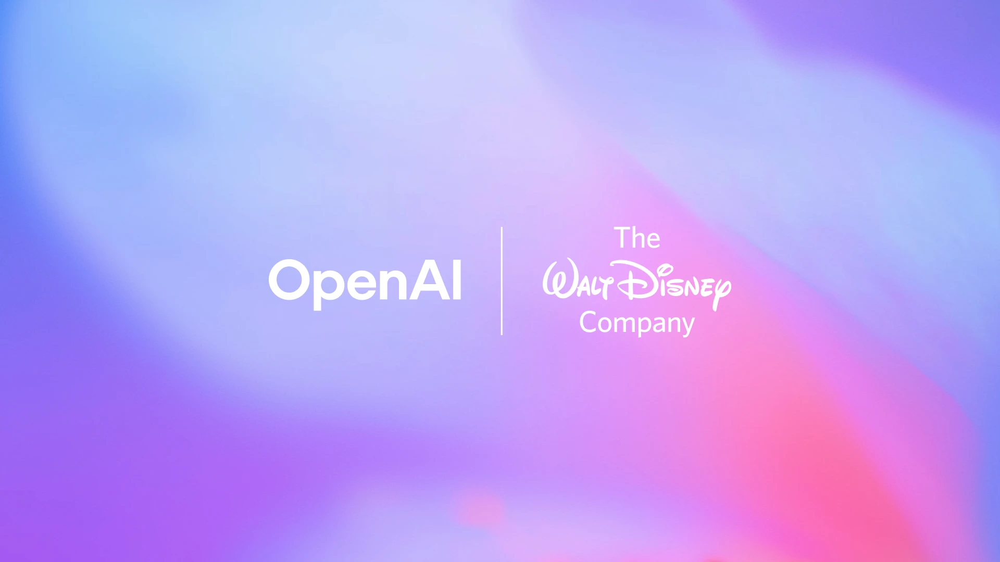

render_with_liquid: false
December 11, 2025

2025年12月11日

[Product](https://openai.com/news/product-releases/) [Sora](https://openai.com/stories/sora/) [Global Affairs](https://openai.com/news/global-affairs/)

[产品](https://openai.com/news/product-releases/) [Sora](https://openai.com/stories/sora/) [全球事务](https://openai.com/news/global-affairs/)

# The Walt Disney Company and OpenAI reach landmark agreement to bring beloved characters from across Disney’s brands to Sora

# 华特迪士尼公司与 OpenAI 达成里程碑式协议，将迪士尼旗下各品牌广受喜爱的角色引入 Sora

Agreement marks a significant step in setting meaningful standards for responsible AI in entertainment.

该协议标志着在娱乐领域为负责任的人工智能确立切实可行标准的重要一步。

- _As part of this three-year licensing agreement, Sora will be able to generate short, user-prompted social videos that can be viewed and shared by fans, drawing on more than 200 Disney, Marvel, Pixar and Star Wars characters._

- 此次为期三年的授权许可协议规定，Sora 将可生成由用户提示驱动的短视频，供粉丝观看与分享；内容素材涵盖迪士尼、漫威、皮克斯及《星球大战》旗下逾 200 个动画角色、面具角色与生物角色。

- _Agreement will make a selection of these fan-inspired Sora short form videos available to stream on Disney+._

- 根据协议，部分由粉丝创意启发的 Sora 短视频将上线 Disney+ 平台供流媒体播放。

- _Disney and OpenAI affirm a shared commitment to responsible use of AI that protects the safety of users and the rights of creators._

- 迪士尼与 OpenAI 共同承诺以负责任的方式使用人工智能，切实保障用户安全与创作者权益。

- _Alongside the licensing agreement, Disney will become a major customer of OpenAI, using its APIs to build new products, tools, and experiences, including for Disney+, and deploying ChatGPT for its employees._

- 除授权许可协议外，迪士尼还将成为 OpenAI 的重要客户，利用其 API 开发新产品、工具与体验（包括面向 Disney+ 的应用），并为其员工部署 ChatGPT。

- _As part of the agreement, Disney will make a $1 billion equity investment in OpenAI, and receive warrants to purchase additional equity._

- 作为本协议的一部分，迪士尼将向 OpenAI 注资 10 亿美元，并获得认购额外股权的认股权证。

The Walt Disney Company and OpenAI have reached an agreement for Disney to become the first major content licensing partner on Sora, OpenAI’s short-form generative AI video platform, bringing these leaders in creativity and innovation together to unlock new possibilities in imaginative storytelling.

华特迪士尼公司与 OpenAI 已达成协议：迪士尼将成为 OpenAI 短视频生成式人工智能平台 Sora 的首个重大内容授权合作伙伴。此举将两大创意与创新领域的领军者汇聚一堂，共同开启富于想象力的叙事新可能。

As part of this new, three-year licensing agreement, Sora will be able to generate short, user-prompted social videos that can be viewed and shared by fans, drawing from a set of more than 200 animated, masked and creature characters from Disney, Marvel, Pixar and Star Wars, including costumes, props, vehicles, and iconic environments. In addition, ChatGPT Images will be able to turn a few words by the user into fully generated images in seconds, drawing from the same intellectual property. The agreement does not include any talent likenesses or voices.

根据此项全新为期三年的授权许可协议，Sora 将可基于用户提示生成短视频，供粉丝观看与分享；所用素材涵盖迪士尼、漫威、皮克斯及《星球大战》旗下逾 200 个动画角色、面具角色与生物角色，包括其服装、道具、载具及标志性场景。此外，ChatGPT Images 功能亦可将用户输入的寥寥数语，在数秒内转化为完整生成的图像，同样基于上述知识产权。需特别说明的是，本协议不涉及任何真人演员的肖像或声音授权。

As part of the agreement, Disney will make a $1 billion equity investment in OpenAI, and receive warrants to purchase additional equity.

根据协议，迪士尼将向 OpenAI 注资 10 亿美元，并获得认购额外股权的认股权证。

Under the agreement, Disney and OpenAI are affirming a shared commitment to the responsible use of AI that protects user safety and the rights of creators. Together, the companies will advance human-centered AI that respects the creative industries and expands what is possible for storytelling.

根据该协议，迪士尼与 OpenAI 共同重申对人工智能负责任使用的承诺——这一承诺以保障用户安全及创作者权益为前提。双方将携手推进以人为本的人工智能，尊重创意产业，并拓展叙事表达的边界与可能性。

The transaction is subject to the negotiation of definitive agreements, required corporate and board approvals, and customary closing conditions.

本交易尚需完成最终协议的谈判、相关公司及董事会的必要批准，以及满足惯常的交割条件。

“Technological innovation has continually shaped the evolution of entertainment, bringing with it new ways to create and share great stories with the world,” said Robert A. Iger, CEO, The Walt Disney Company. “The rapid advancement of artificial intelligence marks an important moment for our industry, and through this collaboration with OpenAI we will thoughtfully and responsibly extend the reach of our storytelling through generative AI, while respecting and protecting creators and their works. Bringing together Disney’s iconic stories and characters with OpenAI’s groundbreaking technology puts imagination and creativity directly into the hands of Disney fans in ways we’ve never seen before, giving them richer and more personal ways to connect with the Disney characters and stories they love.”

罗伯特·A·艾格（Robert A. Iger），华特迪士尼公司首席执行官表示：“技术创新持续塑造着娱乐产业的演进历程，不断为全球带来创作与分享精彩故事的全新方式。人工智能的迅猛发展，标志着我们行业一个至关重要的历史时刻；通过此次与 OpenAI 的合作，我们将以审慎且负责任的方式，借助生成式人工智能进一步拓展叙事的影响力，同时尊重并保护创作者及其作品。将迪士尼标志性故事与角色，同 OpenAI 开创性的技术相结合，前所未有地将想象力与创造力直接交到迪士尼粉丝手中，赋予他们更丰富、更具个性化的途径，去联结自己所热爱的迪士尼角色与故事。”

“Disney is the global gold standard for storytelling, and we’re excited to partner to allow Sora and ChatGPT Images to expand the way people create and experience great content,” said Sam Altman, co-founder and CEO of OpenAI. “This agreement shows how AI companies and creative leaders can work together responsibly to promote innovation that benefits society, respect the importance of creativity, and help works reach vast new audiences.”

OpenAI 联合创始人兼首席执行官萨姆·阿尔特曼（Sam Altman）表示：“迪士尼是全球叙事艺术的黄金标准；我们非常高兴能与之合作，让 Sora 和 ChatGPT Images 拓展人们创作与体验优质内容的方式。本协议彰显了人工智能企业与创意领军者如何以负责任的方式协同合作——推动惠及社会的创新、尊重创造力的核心价值，并助力优秀作品触达前所未有的广阔新受众。”

Under the license, fans will be able to watch curated selections of Sora-generated videos on Disney+, and OpenAI and Disney will collaborate to utilize OpenAI’s models to power new experiences for Disney + subscribers, furthering innovative and creative ways to connect with Disney’s stories and characters. Sora and ChatGPT Images are expected to start generating fan-inspired videos with Disney’s multi-brand licensed characters in early 2026.

根据授权协议，粉丝将可在 Disney+ 平台上观看经精选的、由 Sora 生成的视频内容；OpenAI 与迪士尼还将携手合作，利用 OpenAI 的模型为 Disney+ 订阅用户提供全新体验，进一步以创新且富创意的方式，强化用户与迪士尼故事及角色之间的联结。Sora 与 ChatGPT Images 预计将于 2026 年初起，开始生成以迪士尼跨品牌授权角色为灵感的粉丝共创视频。

Among the characters fans will be able to use in their creations are Mickey Mouse, Minnie Mouse, Lilo, Stitch, Ariel, Belle, Beast, Cinderella, Baymax, Simba, Mufasa, as well as characters from the worlds of Encanto, Frozen, Inside Out, Moana, Monsters Inc., Toy Story, Up, Zootopia, and many more; plus iconic animated or illustrated versions of Marvel and Lucasfilm characters like Black Panther, Captain America, Deadpool, Groot, Iron Man, Loki, Thor, Thanos, Darth Vader, Han Solo, Luke Skywalker, Leia, the Mandalorian, Stormtroopers, Yoda and more.

粉丝可在其创作中使用的角色包括：米老鼠（Mickey Mouse）、米妮老鼠（Minnie Mouse）、莉萝（Lilo）、史迪奇（Stitch）、爱丽儿（Ariel）、贝儿（Belle）、野兽（Beast）、灰姑娘（Cinderella）、大白（Baymax）、辛巴（Simba）、木法沙（Mufasa），以及《魔法满屋》（Encanto）、《冰雪奇缘》（Frozen）、《头脑特工队》（Inside Out）、《海洋奇缘》（Moana）、《怪兽电力公司》（Monsters Inc.）、《玩具总动员》（Toy Story）、《飞屋环游记》（Up）、《疯狂动物城》（Zootopia）等作品中的众多角色；此外还包括漫威（Marvel）与卢卡斯影业（Lucasfilm）旗下标志性角色的动画或插画版本，例如黑豹（Black Panther）、美国队长（Captain America）、死侍（Deadpool）、格鲁特（Groot）、钢铁侠（Iron Man）、洛基（Loki）、雷神（Thor）、灭霸（Thanos）、达斯·维达（Darth Vader）、汉·索罗（Han Solo）、卢克·天行者（Luke Skywalker）、莱娅公主（Leia）、曼达洛人（the Mandalorian）、冲锋队员（Stormtroopers）、尤达大师（Yoda）等。

As part of the agreement, OpenAI has committed to continuing its industry leadership in implementing responsible measures to further address trust and safety, including age-appropriate policies and other reasonable controls across the service. In addition, OpenAI and Disney have affirmed a shared commitment to maintaining robust controls to prevent the generation of illegal or harmful content, to respect the rights of content owners in relation to the outputs of models, and to respect the rights of individuals to appropriately control the use of their voice and likeness.

作为本协议的一部分，OpenAI 承诺将继续发挥行业领导作用，持续落实负责任措施，进一步提升可信度与安全性，包括制定适龄政策，以及在服务全范围内实施其他合理管控机制。此外，OpenAI 与迪士尼共同重申：双方将坚定维护强有力的管控体系，以防止非法或有害内容的生成；尊重内容所有者对其模型输出成果所享有的各项权利；并尊重个人对其声音与肖像被使用方式的正当控制权。

- [Partnerships](https://openai.com/news/?tags=partnerships)  
- [合作伙伴关系](https://openai.com/news/?tags=partnerships)

- [Sora](https://openai.com/news/?tags=sora)  
- [Sora](https://openai.com/news/?tags=sora)

- [2025](https://openai.com/news/?tags=2025)  
- [2025](https://openai.com/news/?tags=2025)