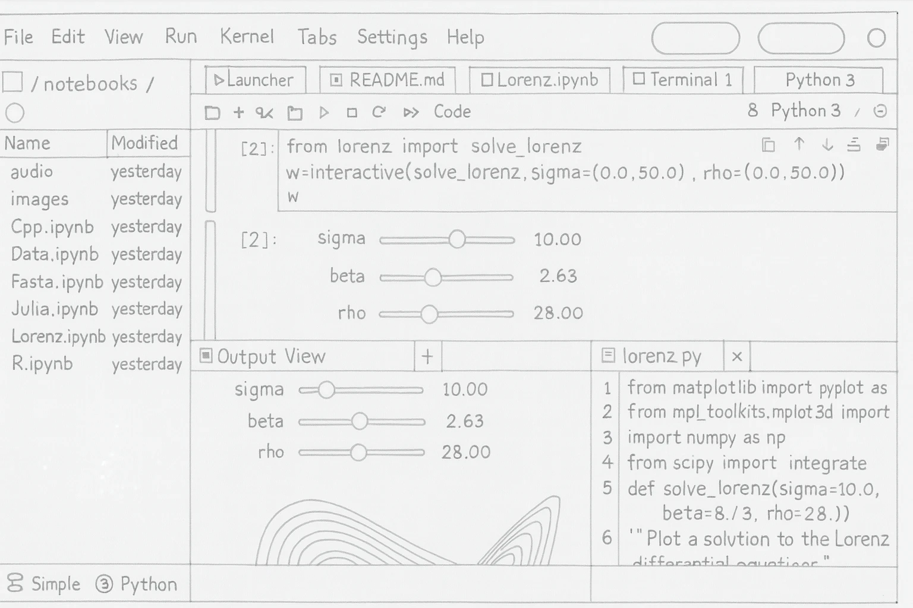
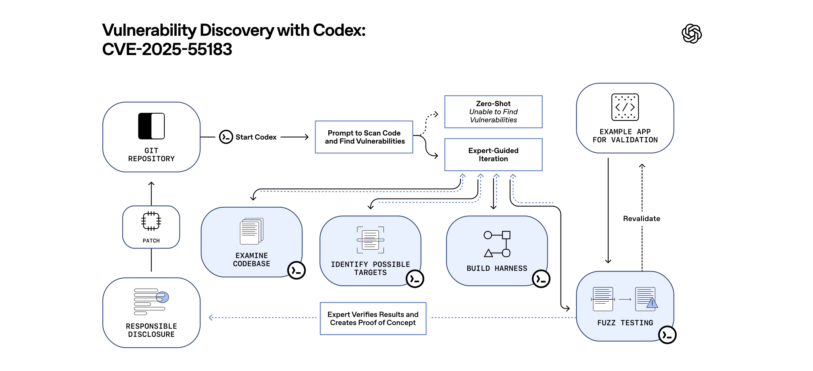

render_with_liquid: false
render_with_liquid: false

December 18, 2025

2025年12月18日

[Product](https://openai.com/news/product-releases/) [Release](https://openai.com/research/index/release/) [Company](https://openai.com/news/company-announcements/)

[产品动态](https://openai.com/news/product-releases/) [发布信息](https://openai.com/research/index/release/) [公司公告](https://openai.com/news/company-announcements/)

# Introducing GPT‑5.2‑Codex

# 推出 GPT‑5.2‑Codex

The most advanced agentic coding model for professional software engineering and defensive cybersecurity.

面向专业软件工程与防御性网络安全的最先进智能体编程模型。

Get started

立即开始使用

[$ npm i -g @openai/codex](https://openai.com/index/introducing-gpt-5-2-codex/#)

[$ npm i -g @openai/codex](https://openai.com/index/introducing-gpt-5-2-codex/#)

Today we’re releasing GPT‑5.2‑Codex, the most advanced agentic coding model yet for complex, real-world software engineering. GPT‑5.2‑Codex is a version of [GPT‑5.2⁠](https://openai.com/index/introducing-gpt-5-2/) further optimized for agentic coding in Codex, including improvements on long-horizon work through context compaction, stronger performance on large code changes like refactors and migrations, improved performance in Windows environments, and significantly stronger cybersecurity capabilities.

今天，我们正式发布 GPT‑5.2‑Codex——迄今为止面向复杂、真实世界软件工程任务的最先进智能体编程模型。GPT‑5.2‑Codex 是 [GPT‑5.2⁠](https://openai.com/index/introducing-gpt-5-2/) 的一个专门优化版本，针对 Codex 平台中的智能体编程场景进行了深度增强，包括：通过上下文压缩（context compaction）提升长周期任务处理能力；在重构（refactors）、系统迁移（migrations）等大规模代码变更任务中表现更优；在 Windows 环境下的运行性能显著改善；以及大幅提升网络安全相关能力。

As our models continue to advance along the intelligence frontier, we’ve observed that these improvements also translate to capability jumps in specialized domains such as [cybersecurity⁠](https://openai.com/index/strengthening-cyber-resilience/). For example, just last week, a security researcher using GPT‑5.1‑Codex‑Max with Codex CLI found and responsibly [disclosed⁠(opens in a new window)](https://react.dev/blog/2025/12/11/denial-of-service-and-source-code-exposure-in-react-server-components) a vulnerability in React that could lead to source code exposure.

随着我们的模型持续向通用智能前沿演进，我们观察到这些整体能力提升也同步转化为特定垂直领域（例如 [网络安全⁠](https://openai.com/index/strengthening-cyber-resilience/)）的显著跃升。例如，就在上周，一位安全研究员借助 GPT‑5.1‑Codex‑Max 与 Codex 命令行工具（CLI），发现并负责任地 [披露了⁠（在新窗口中打开）](https://react.dev/blog/2025/12/11/denial-of-service-and-source-code-exposure-in-react-server-components) React 中的一个漏洞，该漏洞可能导致源代码泄露。

GPT‑5.2‑Codex has stronger cybersecurity capabilities than any model we’ve released so far. These advances can help strengthen cybersecurity at scale, but they also raise new dual-use risks that require careful deployment. While GPT‑5.2‑Codex does not reach a ‘High’ level of cyber capability under our Preparedness Framework, we’re designing our [deployment approach⁠](https://openai.com/index/strengthening-cyber-resilience/) with future capability growth in mind.

GPT‑5.2‑Codex 拥有迄今我们所发布所有模型中最强大的网络安全能力。此类能力进步有望规模化提升网络安全防护水平，但同时也带来新的“双重用途”（dual-use）风险，亟需审慎部署。尽管根据我们的《就绪性框架》（Preparedness Framework），GPT‑5.2‑Codex 尚未达到“高”（High）级别的网络能力等级，但我们正以未来能力持续演进为前提，设计相应的 [部署策略⁠](https://openai.com/index/strengthening-cyber-resilience/)。

We're releasing GPT‑5.2‑Codex today in all Codex surfaces for paid ChatGPT users, and working towards safely enabling access to GPT‑5.2‑Codex for API users in the coming weeks. In parallel, we’re piloting invite-only trusted access to upcoming capabilities and more permissive models for vetted professionals and organizations focused on defensive cybersecurity work. We believe that this approach to deployment will balance accessibility with safety.

即日起，GPT‑5.2‑Codex 已面向所有付费 ChatGPT 用户，在全部 Codex 应用界面中全面上线；同时，我们正积极推进其对 API 用户的安全开放，预计将在未来数周内逐步实现。与此同时，我们已启动一项试点计划：仅限受邀的专业人士与组织（须经严格审核）可提前获得可信访问权限，以试用即将推出的高级功能及更具灵活性的模型版本——这些对象均专注于防御性网络安全工作。我们相信，这一分阶段、有管控的部署路径，将有效兼顾技术可及性与系统安全性。

## Pushing the frontier on real-world software engineering

## 推动现实世界软件工程的前沿发展

GPT‑5.2‑Codex builds on [GPT‑5.2’s strengths⁠](https://openai.com/index/introducing-gpt-5-2/) in professional knowledge work and [GPT‑5.1‑Codex‑Max⁠](https://openai.com/index/gpt-5-1-codex-max/)’s frontier agentic coding and terminal-using capabilities. GPT‑5.2‑Codex is now better at long-context understanding, reliable tool calling, improved factuality, and native compaction, making it a more dependable partner for long running coding tasks, while remaining token-efficient in its reasoning.

GPT‑5.2‑Codex 继承并拓展了 [GPT‑5.2 在专业知识工作方面的优势⁠](https://openai.com/index/introducing-gpt-5-2/)，以及 [GPT‑5.1‑Codex‑Max⁠](https://openai.com/index/gpt-5-1-codex-max/) 在智能体式编程（agentic coding）和终端操作能力方面的前沿成果。如今，GPT‑5.2‑Codex 在长上下文理解、可靠工具调用、事实准确性提升及原生压缩（native compaction）等方面表现更优，使其成为长期编码任务中更值得信赖的协作伙伴，同时在推理过程中仍保持优异的 token 利用效率。

GPT‑5.2‑Codex achieves state-of-the-art performance on SWE-Bench Pro and Terminal-Bench 2.0, benchmarks designed to test agentic performance on a wide variety of tasks in realistic terminal environments. It is also much more effective and reliable at agentic coding in native Windows environments, building on capabilities introduced in GPT‑5.1‑Codex‑Max.

GPT‑5.2‑Codex 在 SWE-Bench Pro 和 Terminal-Bench 2.0 两项基准测试中达到当前最优水平。这两项基准专为在真实终端环境中全面评估智能体（agent）性能而设计。此外，它在原生 Windows 环境下的智能体式编程能力也显著增强且更加可靠——这一能力是在 GPT‑5.1‑Codex‑Max 中首次引入的。

With these improvements, Codex is more capable at working in large repositories over extended sessions with full context intact. It can more reliably complete complex tasks like large refactors, code migrations, and feature builds — continuing to iterate without losing track, even when plans change or attempts fail.

依托上述改进，Codex 能够在长时间会话中、完整保留上下文的前提下，高效处理大型代码仓库中的各类任务。它可更稳健地完成复杂工程任务，例如大规模重构（large refactors）、代码迁移（code migrations）和功能开发（feature builds）——即使计划变更或某次尝试失败，也能持续迭代、不丢失上下文与目标。

SWE-Bench Pro

SWE-Bench Pro

GPT-5.2-CodexGPT-5.2GPT-5.10%20%40%60%80%Accuracy56.4%55.6%50.8%

GPT-5.2-Codex GPT-5.2 GPT-5.1  
0% 20% 40% 60% 80%  
准确率（Accuracy）：56.4% 55.6% 50.8%

Terminal-Bench 2.0

Terminal-Bench 2.0

GPT-5.2-CodexGPT-5.2GPT-5.1-Codex-Max0%20%40%60%80%Accuracy64.0%62.2%58.1%

GPT-5.2-Codex GPT-5.2 GPT-5.1-Codex-Max  
0% 20% 40% 60% 80%  
准确率（Accuracy）：64.0% 62.2% 58.1%

In **SWE-Bench Pro⁠⁠⁠⁠**, a model is given a code repository and must generate a patch to solve a realistic software engineering task. **Terminal-Bench 2.0** is a benchmark for testing AI agents in real terminal environments. Tasks include compiling code, training models and setting up servers.

在 **SWE-Bench Pro** 中，模型被提供一个代码仓库，并需生成补丁（patch）以解决一项真实的软件工程任务。**Terminal-Bench 2.0** 是一项用于在真实终端环境中评测 AI 智能体能力的基准测试，涵盖编译代码、训练模型、搭建服务器等多样化任务。

Stronger vision performance enables GPT‑5.2‑Codex to more accurately interpret screenshots, technical diagrams, charts, and UI surfaces shared during coding sessions.

更强的视觉理解能力，使 GPT‑5.2‑Codex 能更精准地解析编程协作过程中共享的截图、技术示意图、图表及用户界面（UI）画面。

Codex can take design mocks and quickly translate them to functional prototypes, and you can pair with Codex to take these prototypes to production.

Codex 可以接收设计稿，并快速将其转化为可运行的原型；您还可与 Codex 协同工作，将这些原型推进至生产环境。

##### Design mock

##### 设计稿

##### Prototype generated by GPT‑5.2‑Codex

##### GPT‑5.2‑Codex 生成的原型

## Advancing the cyber frontier

## 推进网络空间前沿能力

When charting performance on one of our core cybersecurity evaluations over time, we see a sharp jump in capability starting with GPT‑5‑Codex, another large jump with GPT‑5.1‑Codex‑Max and now a third jump with GPT‑5.2‑Codex. We expect that upcoming AI models will continue on this trajectory. In preparation, we are planning and evaluating as though each new model could reach ‘High’ levels of cybersecurity capability, as measured by our [Preparedness Framework⁠⁠(opens in a new window)](https://cdn.openai.com/pdf/18a02b5d-6b67-4cec-ab64-68cdfbddebcd/preparedness-framework-v2.pdf). While GPT‑5.2‑Codex has not yet reached ‘High’ level of cyber capability, we are preparing for future models that cross that threshold. Due to the increased cyber capabilities, we have added additional safeguards in the model and in the product, which are outlined in the [system card⁠](https://openai.com/index/gpt-5-2-codex-system-card/).

在追踪我们一项核心网络安全评估指标随时间变化的表现时，我们观察到：自 GPT‑5‑Codex 起，模型能力出现首次显著跃升；GPT‑5.1‑Codex‑Max 带来第二次大幅跃升；而 GPT‑5.2‑Codex 则实现了第三次跃升。我们预计后续 AI 模型将持续沿此轨迹演进。为此，我们正以“每一款新模型均可能达到我方[《就绪度框架》（在新窗口中打开）](https://cdn.openai.com/pdf/18a02b5d-6b67-4cec-ab64-68cdfbddebcd/preparedness-framework-v2.pdf)所定义的‘高’级别网络安全能力”为前提，开展规划与评估工作。尽管 GPT‑5.2‑Codex 尚未达到该框架所定义的‘高’级别网络能力，我们已着手为未来跨越这一阈值的模型做好准备。鉴于其增强的网络能力，我们已在模型本身及产品层面新增了多项安全防护措施，具体细节详见[系统卡](https://openai.com/index/gpt-5-2-codex-system-card/)。

Professional Capture-the-Flag Challenges  
专业夺旗（CTF）挑战赛  

Performance over time  
性能随时间变化趋势  

Apr 25May 25Jun 25Jul 25Aug 25Sep 25Oct 25Nov 25Dec 25Jan 26Release date0%25%50%75%100%Accuracy (pass@12)o3GPT-5GPT-5.2GPT-5-CodexGPT-5.1-Codex-MaxGPT-5.2-Codex  

2025年4月 2025年5月 2025年6月 2025年7月 2025年8月 2025年9月 2025年10月 2025年11月 2025年12月 2026年1月 发布日期  
0% 25% 50% 75% 100%  
准确率（pass@12）  
o3 GPT-5 GPT-5.2 GPT-5-Codex GPT-5.1-Codex-Max GPT-5.2-Codex  

The **Professional Capture-the-Flag (CTF)** eval measures how often the model can solve advanced, multi-step real-world challenges (requiring professional-level cybersecurity skills) in a Linux environment.

**专业夺旗（CTF）评估**用于衡量模型在 Linux 环境下解决高级、多步骤真实世界挑战任务的频率——此类任务需具备专业级网络安全技能。

## Real-world cyber capabilities

## 真实场景下的网络能力

Modern society runs on software, and its reliability depends on strong cybersecurity—keeping critical systems in banking, healthcare, communications, and essential services online, protecting sensitive data, and ensuring people can trust the software they rely on every day. Vulnerabilities can exist long before anyone knows about them, and finding, validating, and fixing them often depends on a community of engineers and independent security researchers equipped with the right tools.

现代社会依赖软件运行，而其可靠性取决于强大的网络安全能力——保障银行、医疗、通信及关键公共服务等核心系统的在线稳定运行，保护敏感数据，并确保人们能够信任日常所依赖的软件。漏洞可能在被任何人发现之前就已长期存在；而漏洞的发现、验证与修复，往往依赖于一群工程师和独立安全研究人员组成的社区，他们需配备恰当的工具。

On December 11, 2025, the React team published three security vulnerabilities affecting apps built with React Server Components. What made this disclosure notable was not only the vulnerabilities themselves, but how they were uncovered.

2025年12月11日，React 团队公布了影响基于 React Server Components 构建的应用程序的三个安全漏洞。此次披露之所以引人注目，不仅在于漏洞本身，更在于其被发现的方式。

Andrew MacPherson, a principal security engineer at Privy (a Stripe company), was using GPT‑5.1‑Codex‑Max with Codex CLI and other coding agents to reproduce and study a different critical React vulnerability disclosed the week prior, known as [React2Shell⁠(opens in a new window)](https://react.dev/blog/2025/12/03/critical-security-vulnerability-in-react-server-components) ( [CVE-2025-55182⁠(opens in a new window)](https://nvd.nist.gov/vuln/detail/CVE-2025-55182)). His goal was to evaluate how well the model could assist with real-world vulnerability research.

Privy（一家 Stripe 公司）的首席安全工程师 Andrew MacPherson 正在使用 GPT‑5.1‑Codex‑Max 搭配 Codex CLI 及其他编码智能体，复现并研究前一周披露的另一项严重 React 漏洞——即广为人知的 [React2Shell⁠(在新窗口中打开)](https://react.dev/blog/2025/12/03/critical-security-vulnerability-in-react-server-components)（[CVE-2025-55182⁠(在新窗口中打开)](https://nvd.nist.gov/vuln/detail/CVE-2025-55182)）。他的目标是评估该模型在真实世界漏洞研究任务中的辅助能力。

He initially attempted several zero-shot analyses, prompting the model to examine the patch and identify the vulnerability it addressed. When that did not yield results, he shifted to a higher-volume, iterative prompting approach. When those approaches did not succeed, he guided Codex through standard defensive security workflows—setting up a local test environment, reasoning through potential attack surfaces, and using fuzzing to probe the system with malformed inputs. While attempting to reproduce the original React2Shell issue, Codex surfaced unexpected behaviors that warranted deeper investigation. Over the course of a single week, this process led to the discovery of previously unknown vulnerabilities, which were responsibly disclosed to the React team.

他最初尝试了多次零样本分析（zero-shot analyses），提示模型检查补丁代码并识别其所修复的漏洞。当该方法未取得成效后，他转向更高频次、迭代式的提示策略；当这些策略仍未能奏效时，他引导 Codex 执行标准的防御性安全工作流——包括搭建本地测试环境、系统性分析潜在攻击面，并利用模糊测试（fuzzing）向系统注入畸形输入以探测异常行为。在尝试复现原始 React2Shell 漏洞的过程中，Codex 暴露出若干意料之外的行为，值得深入调查。仅用一周时间，这一过程便促成了此前未知漏洞的发现，并由其负责任地向 React 团队披露。

![Flow diagram titled “Vulnerability Discovery with Codex: CVE-2025-55183” showing a workflow that starts with a Git repository and Codex scanning code for vulnerabilities. A zero-shot attempt fails, followed by an expert-guided process that examines the codebase, identifies possible targets, builds a harness, and performs fuzz testing against an example app with revalidation. Results are verified to create a proof of concept, leading to responsible disclosure and a patch that is applied back to the repository.](images/introducing-gpt-5_2-codex-openai/img_002.svg)

This demonstrates how advanced AI systems can materially accelerate defensive security work in widely used, real-world software. At the same time, capabilities that help defenders move faster can also be misused by bad actors.

这表明，先进的人工智能系统可显著加速面向广泛部署、真实场景软件的防御性安全工作。与此同时，那些助力防御者提升响应速度的能力，也可能被恶意行为者滥用。

As agentic systems become more capable in cybersecurity-relevant tasks, we are making it a core priority to ensure these advances are deployed responsibly—pairing every gain in capability with stronger safeguards, tighter access controls, and ongoing collaboration with the security community.

随着智能体系统（agentic systems）在网络安全相关任务中能力不断增强，我们已将“负责任地部署此类技术进步”列为一项核心优先事项——即在每一项能力提升的同时，配套强化安全防护机制、收紧访问控制策略，并持续与安全社区开展协作。

## Empowering cyberdefense through trusted access

## 通过可信访问赋能网络防御

Security teams can run into restrictions when attempting to emulate threat actors, analyze malware to support remediation, or stress test critical infrastructure. We are developing a trusted access pilot to remove that friction for qualifying users and organizations and enable trusted defenders to use frontier AI cyber capabilities to accelerate cyberdefense.

安全团队在模拟威胁行为者、分析恶意软件以支持漏洞修复，或对关键基础设施开展压力测试时，常面临诸多限制。我们正在开发一项“可信访问试点计划”，旨在为符合条件的用户与组织消除此类障碍，使受信任的防御人员得以运用前沿 AI 网络安全能力，从而加速网络防御工作。

Initially the pilot program will be invite-only for vetted security professionals with a track record of responsible vulnerability disclosure and organizations with a clear professional cybersecurity use case. Qualifying participants will get access to our most capable models for defensive use-cases to enable legitimate dual-use work.

该试点计划初期将采取邀请制，面向经严格审核、具备负责任漏洞披露记录的安全专业人士，以及拥有明确专业网络安全应用场景的组织。符合条件的参与者将获准访问我们能力最强的模型，专用于防御性用途，以支持合法的“双重用途”（dual-use）工作。

If you’re a security professional or part of an organization doing ethical security work like vulnerability research or authorized red-teaming, we invite you to express interest in joining and share feedback on what you’d like to see from the program [here⁠(opens in a new window)](https://docs.google.com/forms/d/e/1FAIpQLSea_ptovrS3xZeZ9FoZFkKtEJFWGxNrZb1c52GW4BVjB2KVNA/viewform).

如果您是安全领域的专业人士，或隶属于从事道德安全工作的组织（例如漏洞研究或经授权的红队演练），我们诚挚邀请您表达加入意向，并就您希望本项目提供哪些功能或支持提出宝贵反馈：[点击此处⁠(在新窗口中打开)](https://docs.google.com/forms/d/e/1FAIpQLSea_ptovrS3xZeZ9FoZFkKtEJFWGxNrZb1c52GW4BVjB2KVNA/viewform)。

## Conclusion

## 结语

GPT‑5.2‑Codex represents a step forward in how advanced AI can support real-world software engineering and specialized domains like cybersecurity—helping developers and defenders tackle complex, long-horizon work, and strengthening the tools available for responsible security research.

GPT‑5.2‑Codex 标志着先进人工智能在支持现实世界软件工程及网络安全等专业领域方面迈出的重要一步——它助力开发者与安全防御人员应对复杂、长周期的任务，并强化负责任安全研究所需的技术工具。

By rolling GPT‑5.2‑Codex out gradually, pairing deployment with safeguards, and working closely with the security community, we’re aiming to maximize defensive impact while reducing the risk of misuse. What we learn from this release will directly inform how we expand access over time as the software and cyber frontiers continue to advance.

我们正通过渐进式发布 GPT‑5.2‑Codex、将部署与多重安全防护机制相结合，并与安全社区紧密协作，力求最大化其防御性价值，同时降低被滥用的风险。本次发布所积累的经验，将直接指导我们在软件与网络技术持续演进的过程中，逐步扩大该模型的可访问范围。

- [2025](https://openai.com/news/?tags=2025)  
- [2025](https://openai.com/news/?tags=2025)  

- [Codex](https://openai.com/news/?tags=codex)  
- [Codex](https://openai.com/news/?tags=codex)