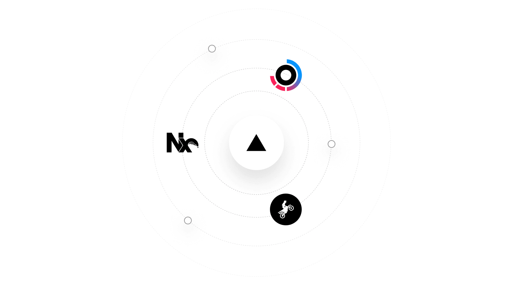
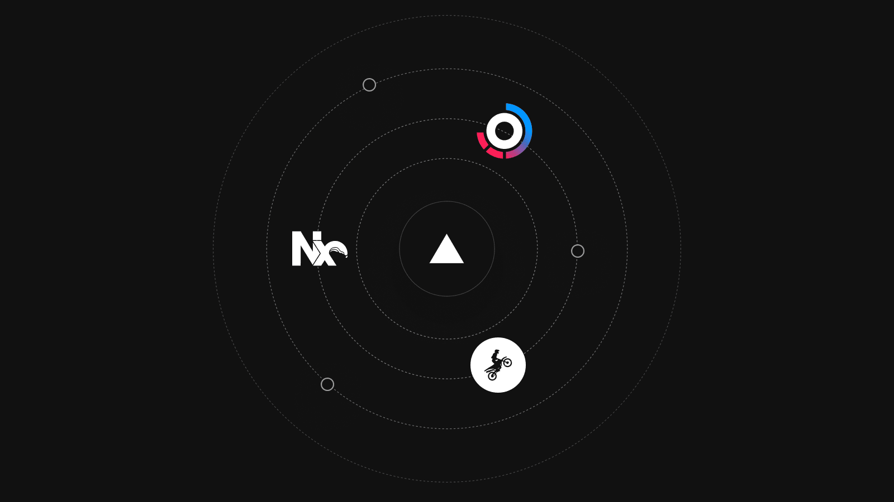

&#123;% raw %}

Nov 15, 2022

2022 年 11 月 15 日

You can now import your [Turborepo](https://turborepo.org/), [Nx](https://nx.dev/), and [Rush](https://rushjs.io/) projects to Vercel without configuration.

您现在可以无需任何配置，直接将 [Turborepo](https://turborepo.org/)、[Nx](https://nx.dev/) 和 [Rush](https://rushjs.io/) 项目导入 Vercel。

Try it now by [importing a new project](https://vercel.com/new) or [cloning an example project](https://github.com/vercel/remote-cache/tree/main/examples/turborepo). The generated configurations will be seen when expanding the "Build and Output Settings" section. In addition, we have also shipped an [Nx guide](https://vercel.com/docs/concepts/monorepos/nx) and [template](https://vercel.com/templates/next.js/monorepo-nx) to help you get started quickly.

立即尝试：[导入一个新项目](https://vercel.com/new)，或 [克隆一个示例项目](https://github.com/vercel/remote-cache/tree/main/examples/turborepo)。生成的配置将在展开“构建与输出设置”（Build and Output Settings）区域后显示。此外，我们还推出了 [Nx 使用指南](https://vercel.com/docs/concepts/monorepos/nx) 和 [模板](https://vercel.com/templates/next.js/monorepo-nx)，助您快速上手。
&#123;% endraw %}
