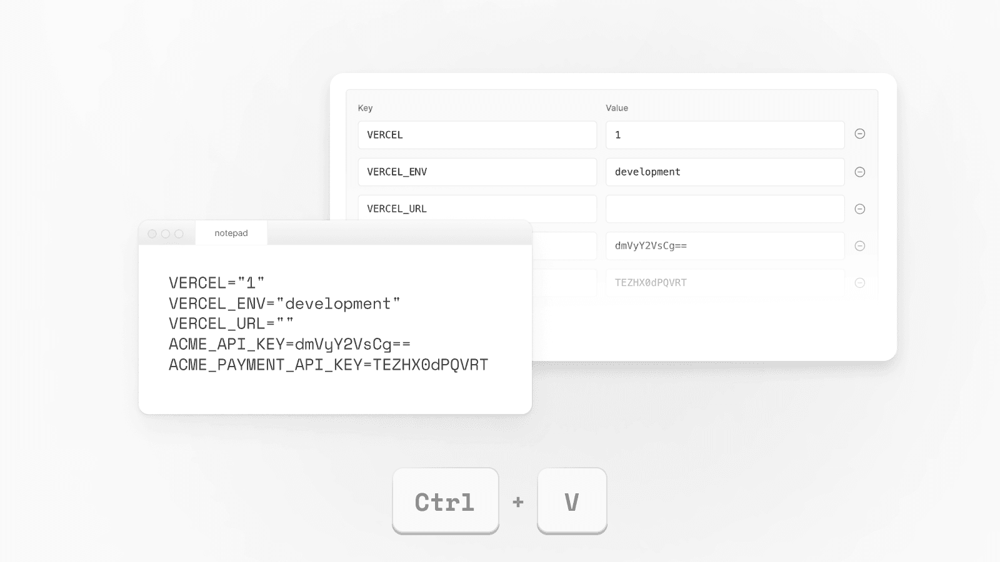
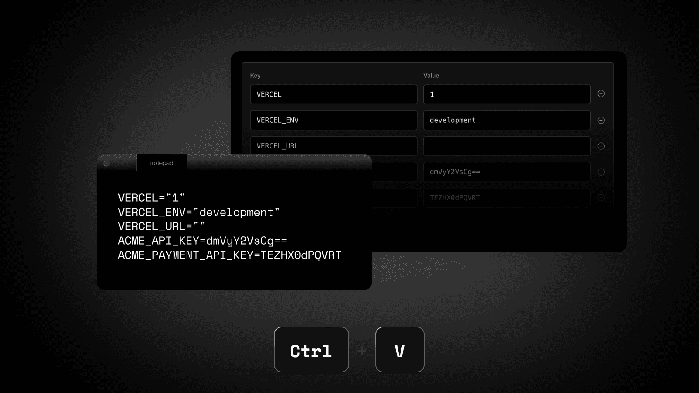

Nov 17, 2022

2022 年 11 月 17 日

You can now more easily add Environment Variables to your projects using bulk upload. Import a `.env` file or paste multiple environment variables directly from the UI.

现在，您可以通过批量上传更便捷地为项目添加环境变量（Environment Variables）。您可以导入一个 `.env` 文件，或直接在用户界面中粘贴多个环境变量。

Check out the [documentation](https://vercel.com/docs/concepts/projects/shared-environment-variables#creating-shared-environment-variables) to learn more.

请查阅[相关文档](https://vercel.com/docs/concepts/projects/shared-environment-variables#creating-shared-environment-variables)以了解更多信息。