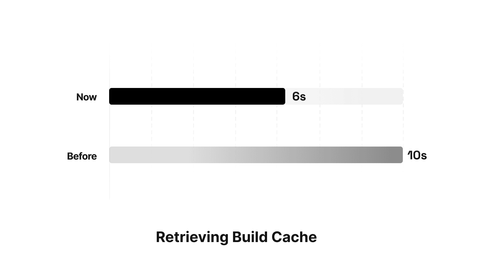
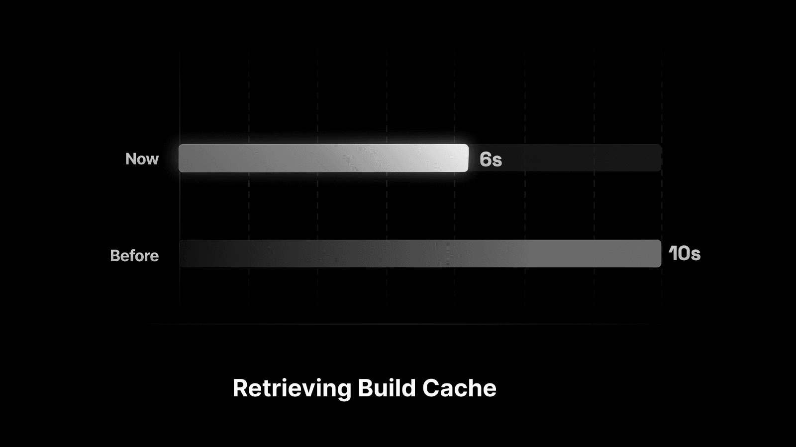

Nov 18, 2022

2022 年 11 月 18 日

通过优化构建缓存的获取方式，部署速度在 p90 指标下**平均提升 15 秒**（即 90% 用户的构建耗时，已排除最慢的 10% 异常值）。

该优化主要惠及大型应用，构建速度**最高可提升 45 秒**。

详情请参阅[文档](https://vercel.com/docs/concepts/deployments/troubleshoot-a-build#what-is-cached)。