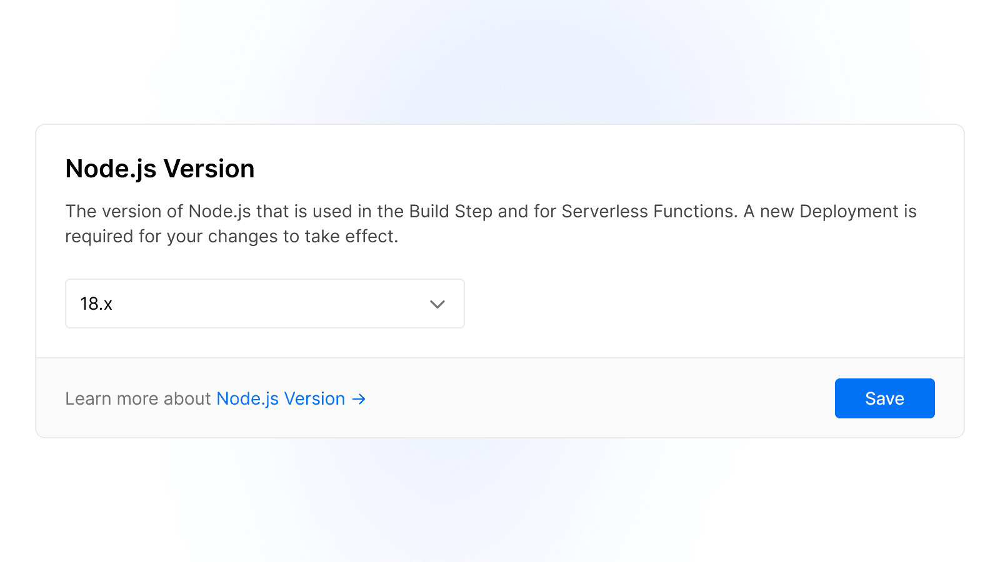
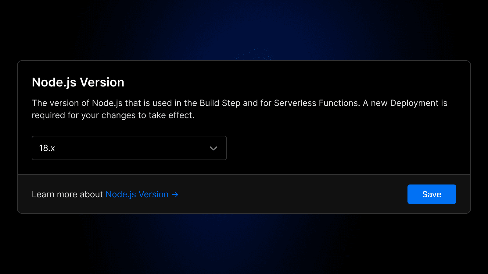

&#123;% raw %}

Nov 18, 2022

2022 年 11 月 18 日

自即日起，您可在 **Project Settings**（项目设置）的 **General**（常规）页面中的 **Node.js Version**（Node.js 版本）部分选择 Node.js 18 版本。新创建的项目将默认使用此版本。

该新版本引入了多项 [新特性](https://nodejs.org/en/blog/announcements/v18-release-announce/)，包括：

- ECMAScript 正则表达式匹配索引（RegExp Match Indices）

- `Blob`

- `fetch`

- `FormData`

- `Headers`

- `Request`

- `Response`

- `Response`

- `ReadableStream`

- `ReadableStream`

- `WritableStream`

- `WritableStream`

- `import test from 'node:test'`

- `import test from 'node:test'`

Node.js 18 includes substantial improvements to align the Node.js runtime with the [Edge Runtime](https://vercel.com/docs/concepts/functions/edge-functions/edge-functions-api), including alignment with Web Standard APIs.

Node.js 18 对运行时进行了大量改进，以使其与 [Edge Runtime](https://vercel.com/docs/concepts/functions/edge-functions/edge-functions-api) 保持一致，包括对 Web 标准 API 的兼容性支持。

The exact version used today is [18.12.1](https://nodejs.org/en/blog/release/v18.12.1/) and will automatically update minor and patch releases. Therefore, only the major version (`18.x`) is guaranteed.

当前使用的具体版本为 [18.12.1](https://nodejs.org/en/blog/release/v18.12.1/)，且系统将自动更新次要版本（minor）和补丁版本（patch）。因此，仅主版本号（`18.x`）可确保稳定。

[Read the documentation](https://vercel.com/docs/concepts/functions/serverless-functions/runtimes/node-js) for more.

[查阅文档](https://vercel.com/docs/concepts/functions/serverless-functions/runtimes/node-js) 了解更多信息。
&#123;% endraw %}
