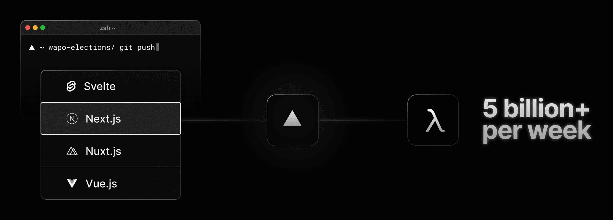
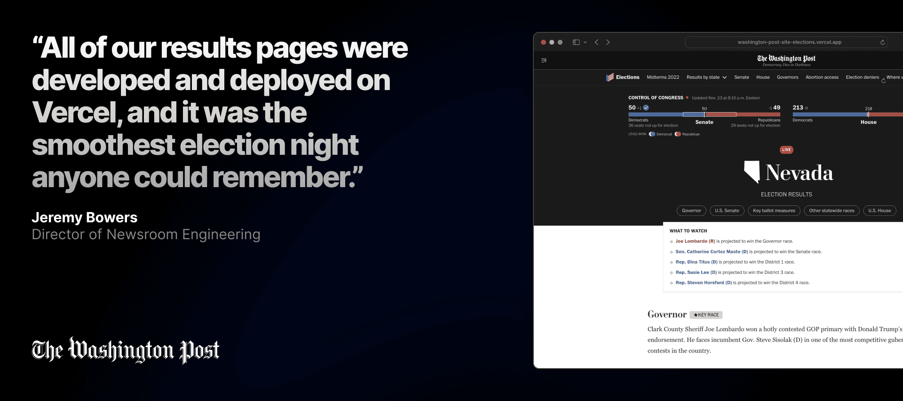

render_with_liquid: false
render_with_liquid: false

Dec 6, 2022

2022 年 12 月 6 日

Last week, I joined Holly Mesrobian, AWS VP of Serverless Compute, on stage at AWS re:Invent in Las Vegas. We discussed our shared vision of accelerating innovation with serverless computing, and how Vercel has leveraged AWS Lambda over the years.

上周，我与 AWS 无服务器计算副总裁 Holly Mesrobian 一同登上了在拉斯维加斯举办的 AWS re:Invent 大会舞台。我们共同探讨了双方对“借助无服务器计算加速创新”的一致愿景，以及 Vercel 多年来如何深度运用 AWS Lambda。

## **Making the Web faster**— **in development and production**

## **让 Web 更快**——**贯穿开发与生产全流程**

I’m passionate about [digital transformation](https://vercel.com/resources/how-vercel-powers-digital-transformation-for-enterprise-teams), and what it means for our customers—and their customers. We pride ourselves on creating the ultimate experience for developers and their users alike.

我对[数字化转型](https://vercel.com/resources/how-vercel-powers-digital-transformation-for-enterprise-teams)充满热忱，也深知它对我们客户、乃至他们自身客户的意义所在。我们始终以打造开发者与终端用户双方都臻于极致的体验为荣。

As you would expect from a developer-first platform, it all starts with pushing code to the cloud, while ensuring the workflow is optimized for developer productivity.

作为一款以开发者为先的平台，一切始于将代码推送至云端——同时确保整个工作流经过高度优化，以最大化提升开发者生产力。

To deliver world-class sites in production, we've turned lambda into an edge-first compute layer. We've also added globally distributed caching, which gets automatically purged from any data source, whether it's a database like DynamoDB or a composable commerce platform like Sitecore, BigCommerce, or Salesforce Commerce Cloud.​ With this model, our customers get optimal performance and infinite scale—at a fraction of the cost and overhead of manually provisioning servers or configuring a litany of cloud services.​

为在生产环境中交付世界级网站，我们将 Lambda 打造为以边缘为中心的计算层；同时引入了全球分布式缓存机制——该缓存可自动从任意数据源（无论是 DynamoDB 等数据库，还是 Sitecore、BigCommerce 或 Salesforce Commerce Cloud 等可组合式电商平台）中清除。依托这一架构，我们的客户得以获得卓越性能与无限扩展能力，而所需成本和运维开销，仅为手动配置服务器或繁杂云服务的极小一部分。

Because of these powerful DX and UX elements, Holly and I agree that the easiest, fastest, most effective way to modernize is to go serverless.

正因这些强大的开发者体验（DX）与用户体验（UX）要素，Holly 与我一致认为：实现现代化转型最简单、最快捷、最高效的方式，就是全面采用无服务器架构。

Vercel takes advantage of AWS Lambda to give our customers the tools to iterate and scale quickly. We now deploy millions of functions that get invoked over five billion times per week.

Vercel 充分利用 AWS Lambda，为客户提供快速迭代与弹性扩展的工具。目前，我们已部署数百万个函数，每周调用次数逾五十亿次。

### Take The Washington Post

### 案例：《华盛顿邮报》（The Washington Post）

As leaders in digital content production, their engineering team needed to "match the speed of The Post's formidable newsroom," according to their Director of Newsroom Engineering, Jeremy Bowers. They started out by using Next.js and Vercel to collaborate and launch code quickly using [Preview Deployments](https://vercel.com/features/previews), establishing an internal engine for innovation that enabled "lightning-fast turnaround on developing new features."

作为数字内容生产的行业领导者，《华盛顿邮报》工程团队亟需“匹配《邮报》强大新闻编辑部的节奏”，正如其新闻编辑部工程总监 Jeremy Bowers 所言。他们最初即采用 Next.js 与 Vercel，借助[预览部署（Preview Deployments）](https://vercel.com/features/previews)功能实现高效协作与快速上线，由此构建起一套内部创新引擎，从而实现“新功能开发的闪电式交付”。

The team realized the benefits of the serverless model extended to production, and when coupled with Vercel’s Edge Network, provided the optimal performance and scale to meet high-traffic moments.  
团队意识到，无服务器（serverless）模型的优势不仅体现在开发阶段，更延伸至生产环境；当与 Vercel 的边缘网络（Edge Network）相结合时，该架构便能提供最优的性能与弹性伸缩能力，从容应对高流量峰值时刻。

That’s why they chose Vercel as their frontend for their [US Midterm Elections Results pages](https://www.washingtonpost.com/election-results/2022/nevada/).  
正因如此，他们选择 Vercel 作为其[美国中期选举结果页面](https://www.washingtonpost.com/election-results/2022/nevada/)的前端平台。

The Washington Post handled this high-traffic moment flawlessly, making it “the smoothest election night anyone could remember” says Jeremy.  
《华盛顿邮报》（The Washington Post）完美应对了此次高流量访问，Jeremy 评价道：“这是人们所能记住的最顺畅的一次选举之夜。”

## **Get started with serverless**

## **开启无服务器之旅**

Vercel helps users take advantage of best-in-class AWS infrastructure with zero configuration.  
Vercel 让用户无需任何配置，即可充分利用业界领先的 AWS 基础设施。

Our customers are transforming their digital presence through their frontend—and accelerating the world's adoption of serverless technology.  
我们的客户正以前端为支点重塑其数字形象——同时加速全球对无服务器技术的采用。

I am constantly in awe of our customers’ achievements with this platform, and I can’t wait to see how they'll continue to drive innovation on the Web.  
我始终为我们的客户借助这一平台所取得的成就深感钦佩；更迫不及待想看到他们未来如何持续推动 Web 领域的创新。

- [Take a tour of Vercel](https://vercel.com/product-tour)  
- [体验 Vercel 产品导览](https://vercel.com/product-tour)

- [Check out Preview Deployments](https://vercel.com/docs/concepts/deployments/preview-deployments)  
- [了解预览部署（Preview Deployments）](https://vercel.com/docs/concepts/deployments/preview-deployments)

- [See why a serverless infrastructure is best on Vercel](https://vercel.com/features/infrastructure)  
- [了解为何 Vercel 是运行无服务器基础设施的最佳平台](https://vercel.com/features/infrastructure)