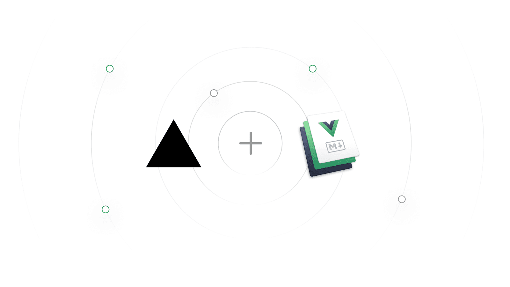
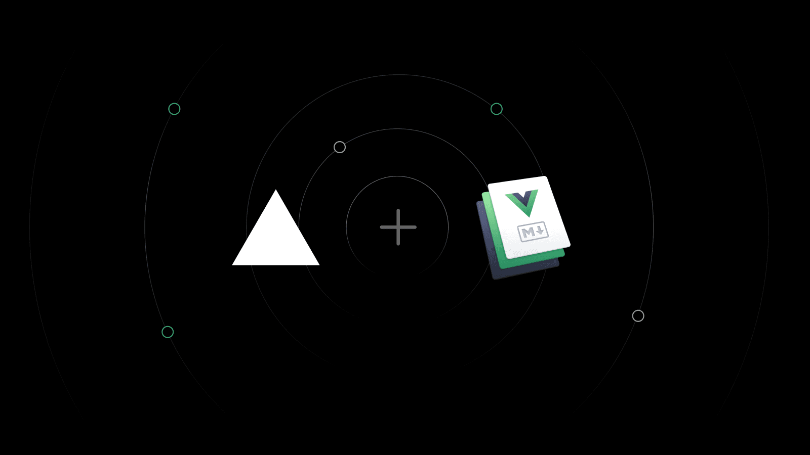

render_with_liquid: false
render_with_liquid: false

Dec 13, 2022

2022年12月13日

Vercel now automatically optimizes your [VuePress](https://vuepress.vuejs.org/) projects. When importing a new project, it will detect VuePress and configure the right settings for optimal performance — including automatic `immutable` HTTP caching headers for JavaScript and CSS assets.

Vercel 现已支持自动优化您的 [VuePress](https://vuepress.vuejs.org/) 项目。在导入新项目时，Vercel 将自动识别 VuePress，并为其配置最佳性能所需的各项设置——包括为 JavaScript 和 CSS 资源自动添加 `immutable` HTTP 缓存响应头。

Deploy the [VuePress template](https://vercel.com/new/clone?s=https%3A%2F%2Fgithub.com%2Fvercel%2Fvercel%2Ftree%2Fmain%2Fexamples%2Fvuepress&template=vuepress&id=67753070&b=main&from=templates) to get started.

点击此处部署 [VuePress 模板](https://vercel.com/new/clone?s=https%3A%2F%2Fgithub.com%2Fvercel%2Fvercel%2Ftree%2Fmain%2Fexamples%2Fvuepress&template=vuepress&id=67753070&b=main&from=templates) 快速开始。