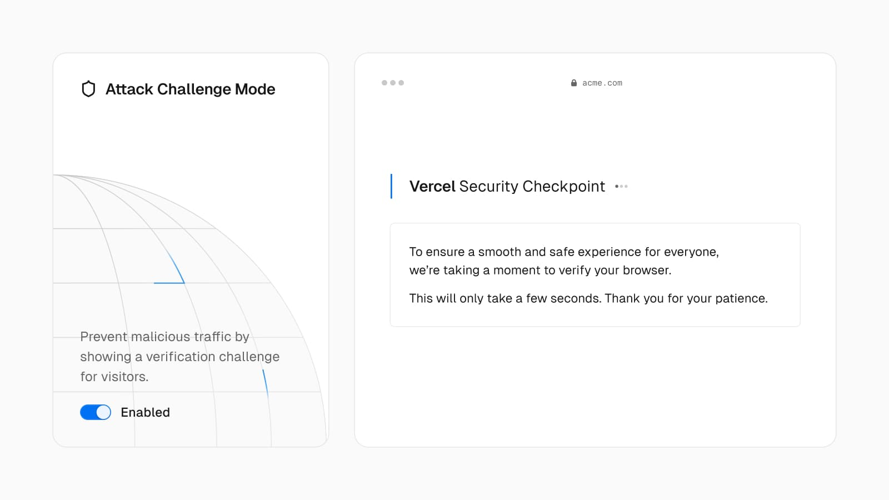
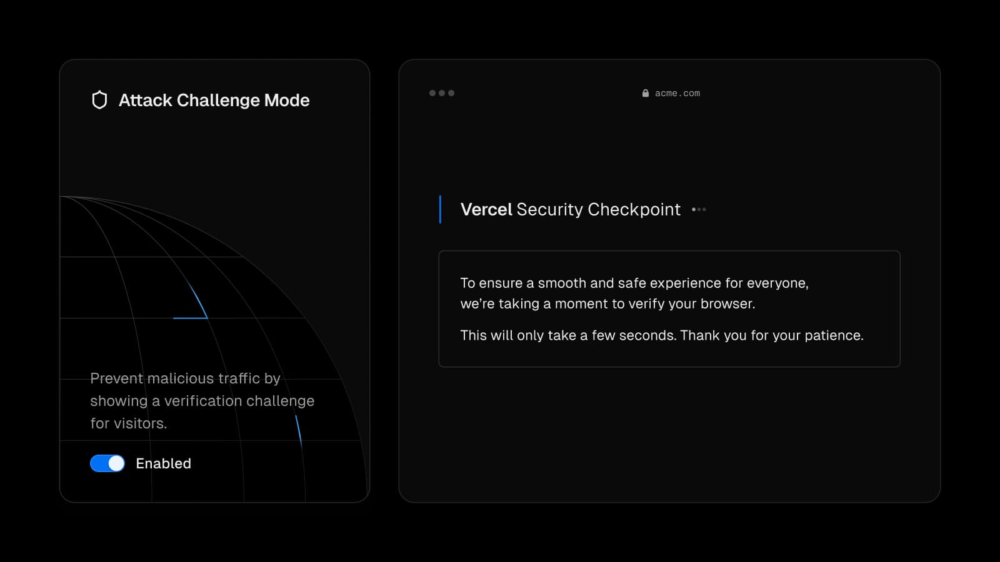

render_with_liquid: false
Feb 29, 2024

2024 年 2 月 29 日

[Vercel Firewall](https://vercel.com/docs/security/vercel-firewall)

[Vercel 防火墙](https://vercel.com/docs/security/vercel-firewall)

Vercel Firewall protects your application from DDoS attacks.

Vercel 防火墙可保护您的应用免受 DDoS 攻击。

Spikes in high volumes of traffic sometimes indicate malicious activity on your site. Customers can now quickly lock down traffic and further protect against DDoS attacks by challenging requests, minimizing the chance that malicious bots get through.

流量激增有时表明您的网站正遭受恶意活动。现在，客户可通过向请求发起验证挑战，快速限制流量并进一步防范 DDoS 攻击，从而最大限度降低恶意机器人绕过防护的风险。

**Attack Challenge Mode is now available for all Vercel customers at no additional cost**. When temporarily enabled, all visitors to your site will see a challenge screen before they are allowed through.

**攻击挑战模式（Attack Challenge Mode）现已面向所有 Vercel 客户免费开放**。该模式临时启用后，所有访问您网站的用户均需先通过验证挑战页面，方可继续访问。

Learn how to [enable Attack Challenge Mode](https://vercel.com/docs/security/attack-challenge-mode) and protect your site.

了解如何[启用攻击挑战模式](https://vercel.com/docs/security/attack-challenge-mode)，以保护您的网站。