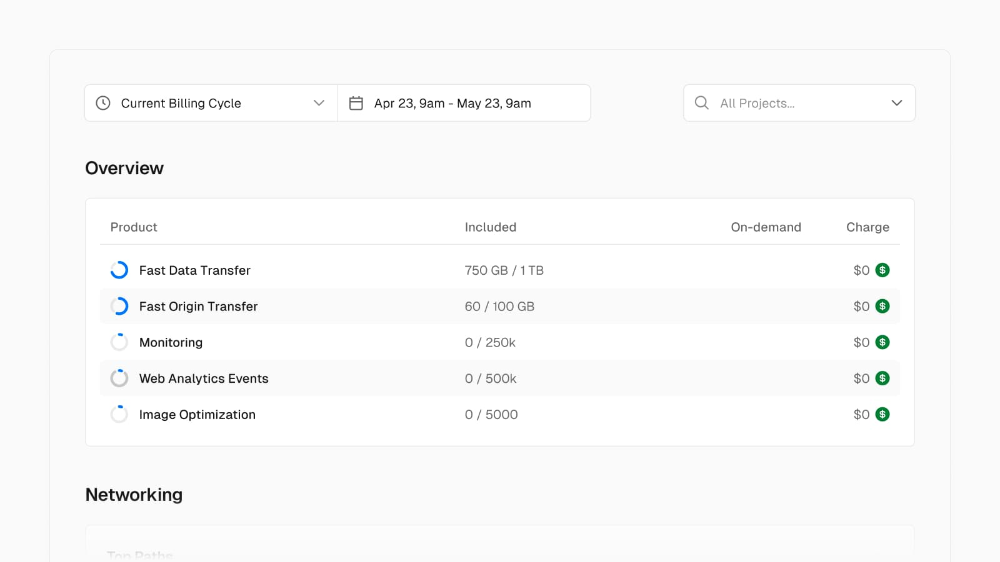
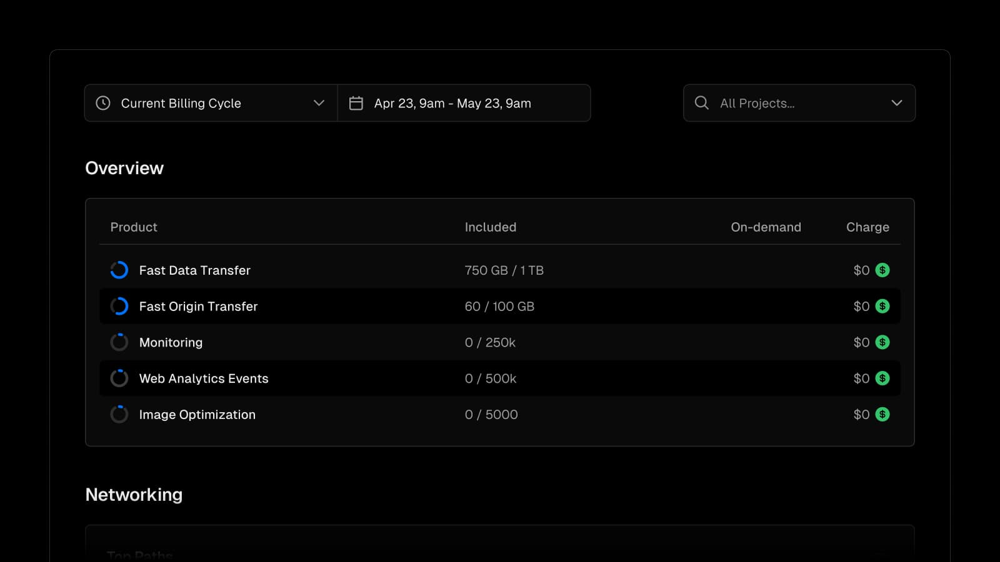

render_with_liquid: false
Apr 25, 2024

2024 年 4 月 25 日

Earlier this month, we announced our [improved infrastructure pricing](https://vercel.com/blog/improved-infrastructure-pricing), which is **active for new customers starting today**.

本月早些时候，我们宣布了[优化后的基础设施定价方案](https://vercel.com/blog/improved-infrastructure-pricing)，该方案**自今日起正式面向新客户生效**。

Billing for existing customers begins between June 25 and July 24. For more details, please reference the email with next steps sent to your account. Existing Enterprise contracts are unaffected.

现有客户的计费将于 6 月 25 日至 7 月 24 日期间陆续启动。更多详情，请查阅发送至您账户邮箱的、含后续操作指引的邮件。当前有效的 Enterprise（企业级）合同不受本次调整影响。

Our previous combined metrics (bandwidth and functions) are now more granular, and have reduced base prices. These new metrics can be viewed and optimized from our improved Usage page.

我们此前合并统计的指标（带宽与函数调用）现已细化为更精细的独立维度，且基础价格已下调。您可在升级后的“用量”（Usage）页面中查看并优化这些新指标。

These pricing improvements build on recent platform features to help automatically prevent runaway spend, including [hard spend limits](https://vercel.com/changelog/improved-hard-caps-for-spend-management), [recursion protection](https://vercel.com/changelog/automatic-recursion-protection-for-vercel-serverless-functions), [improved function defaults](https://vercel.com/changelog/serverless-functions-can-now-run-up-to-5-minutes), [Attack Challenge Mode](https://vercel.com/changelog/prevent-malicious-traffic-with-attack-challenge-mode-for-vercel-firewall), and more.

此次定价优化，依托平台近期推出的多项功能，可帮助您自动防止费用失控，包括：[硬性支出上限](https://vercel.com/changelog/improved-hard-caps-for-spend-management)、[递归调用防护](https://vercel.com/changelog/automatic-recursion-protection-for-vercel-serverless-functions)、[优化的函数默认配置](https://vercel.com/changelog/serverless-functions-can-now-run-up-to-5-minutes)（无服务器函数最长运行时间提升至 5 分钟）、[攻击挑战模式](https://vercel.com/changelog/prevent-malicious-traffic-with-attack-challenge-mode-for-vercel-firewall)（用于 Vercel 防火墙，以拦截恶意流量），以及更多功能。