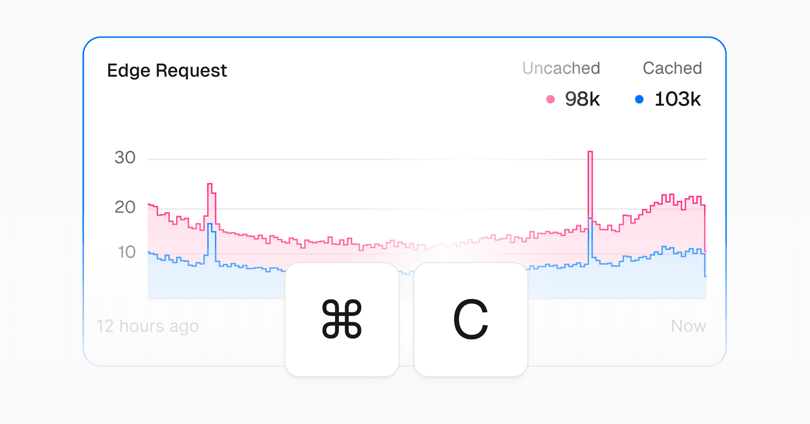
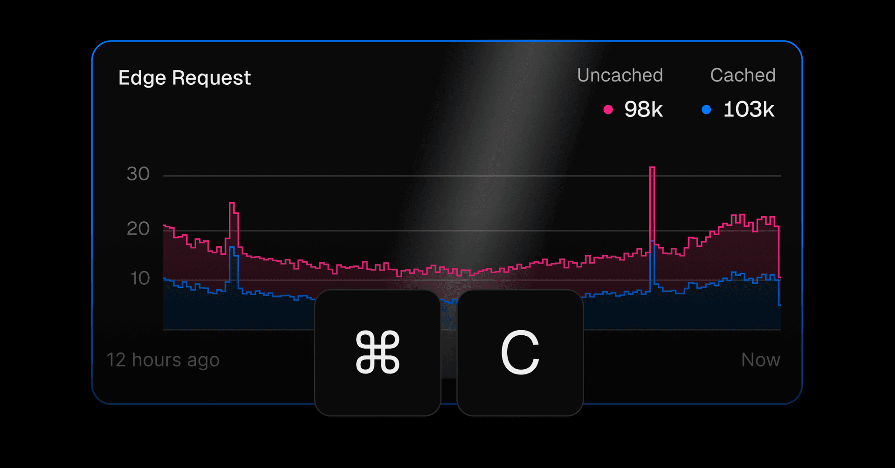

render_with_liquid: false
Jul 28, 2025

2025年7月28日

You can now quickly share snapshots of any chart in Vercel Observability, making it easier to collaborate during debugging and incident response.

现在，您可快速分享 Vercel 可观测性（Observability）中任意图表的快照，从而更高效地开展调试与事件响应过程中的协作。

Hover over a chart and press `⌘+C` or `Ctrl+C` to copy a URL that opens a snapshot of the chart in Vercel Observability. The snapshot includes the same time range, filters, and settings as when copied.

将鼠标悬停在图表上，然后按 `⌘+C`（macOS）或 `Ctrl+C`（Windows/Linux），即可复制一个 URL；该链接可在 Vercel 可观测性中直接打开该图表的快照，且快照保留了复制时所用的时间范围、筛选条件及全部设置。

The link includes a preview image of the chart that unfurls in tools like Slack and Teams. Share links are public to ease sharing, but unguessable and ignored by search robots.

该链接内嵌图表预览图，在 Slack、Microsoft Teams 等协作工具中可自动展开显示。共享链接为公开可访问链接，便于分享，但其路径不可预测，且对搜索引擎爬虫不可见。

[Try it out](https://vercel.com/d?to=%2F%5Bteam%5D%2F%7E%2Fobservability) or learn more about [Observability](https://vercel.com/docs/observability) and [Observability Plus](https://vercel.com/docs/observability/observability-plus).

[立即试用](https://vercel.com/d?to=%2F%5Bteam%5D%2F%7E%2Fobservability)，或进一步了解 [可观测性（Observability）](https://vercel.com/docs/observability) 和 [可观测性增强版（Observability Plus）](https://vercel.com/docs/observability/observability-plus)。