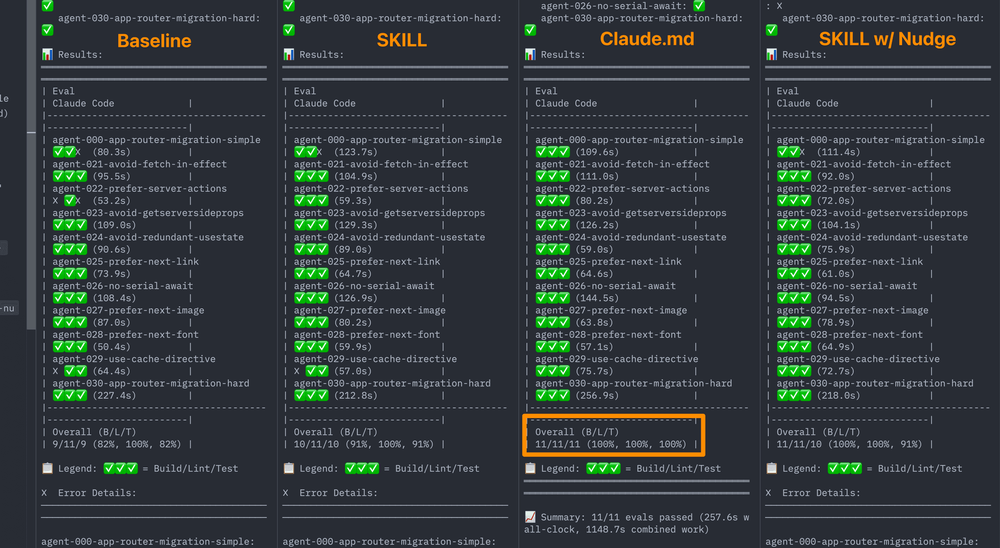
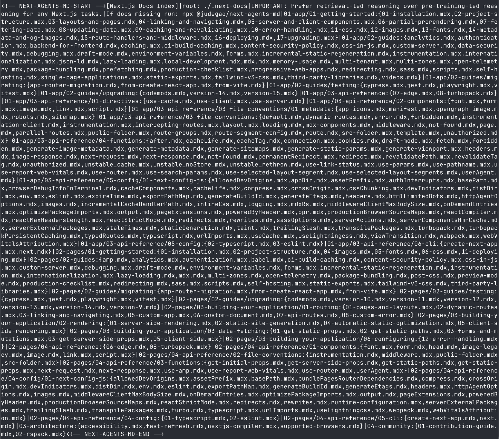

render_with_liquid: false
Jan 27, 2026

2026 年 1 月 27 日

我们曾预期 [skills](https://agentskills.io/home)（技能）将成为向编码智能体传授框架特定知识的解决方案。但在构建了聚焦于 Next.js 16 API 的评估用例后，我们发现了一个出人意料的结果。

一个直接嵌入在 `AGENTS.md` 文件中的、仅 8KB 大小的压缩文档索引，实现了 100% 的通过率；而即使明确指示智能体“必须使用 skills”，skills 的最高通过率也仅为 79%。若未提供此类指令，skills 的表现甚至不比完全不提供任何文档更好。

下文将介绍我们的尝试过程、关键发现，以及你如何为自己的 Next.js 项目配置这一方案。

## **我们试图解决的问题**

## **我们力图解决的问题**

AI 编码智能体依赖其训练数据，但这些数据会迅速过时。[Next.js 16 引入了](https://nextjs.org/blog/next-16)诸如 `'use cache'`、`connection()` 和 `forbidden()` 等新 API，而当前大模型的训练数据中尚未包含这些内容。当智能体不了解这些 API 时，便会生成错误代码，或被迫回退到过时的实现模式。

反过来的情况同样存在：你正在运行较旧版本的 Next.js，而模型却推荐了尚未在你的项目中启用的新 API。我们希望通过为智能体提供与所用版本严格匹配的文档，来解决这一问题。

## **向智能体传授框架知识的两种方法**

## **向智能体传授框架知识的两种路径**

在深入分析实验结果之前，先简要说明我们测试的两种方法：

- **Skills（技能）** 是一种[开放标准](https://agentskills.io/)，用于封装可供编码智能体调用的领域知识。一个 skill 将提示词（prompts）、工具（tools）和文档（documentation）打包整合，供智能体按需调用。其设计逻辑是：智能体能自主识别何时需要框架特定支持，主动调用对应 skill，并即时获取相关文档。

- [**`AGENTS.md`**](https://agents.md/) is a markdown file in your project root that provides persistent context to coding agents. Whatever you put in `AGENTS.md` is available to the agent on every turn, without the agent needing to decide to load it. Claude Code uses `CLAUDE.md` for the same purpose.

- [**`AGENTS.md`**](https://agents.md/) 是位于项目根目录下的一个 Markdown 文件，用于向编程智能体（coding agents）提供持久化的上下文信息。你写入 `AGENTS.md` 中的任何内容，在每次交互中都会自动对智能体可见，无需智能体主动决定加载该文件。Claude Code 则使用同用途的 `CLAUDE.md` 文件。

We built a Next.js docs skill and an `AGENTS.md` docs index, then ran them through our eval suite to see which performed better.

我们构建了一个 Next.js 文档技能（Next.js docs skill）和一份基于 `AGENTS.md` 的文档索引（`AGENTS.md` docs index），随后将二者分别接入我们的评估套件（eval suite），以对比其实际表现优劣。

## **We started by betting on skills**

## **我们最初选择押注“技能”（skills）机制**

Skills seemed like the right abstraction. You package your framework docs into a skill, the agent invokes it when working on Next.js tasks, and you get correct code. Clean separation of concerns, minimal context overhead, and the agent only loads what it needs. There's even a growing directory of reusable skills at [skills.sh](https://skills.sh/).

“技能”看似是更合适的抽象方式：你可以将框架文档打包为一个技能，当智能体处理 Next.js 相关任务时，它会自动调用该技能，并生成正确的代码。这种方式职责清晰、上下文开销极小，且智能体仅按需加载必要内容。事实上，[skills.sh](https://skills.sh/) 上已逐步建立起一个日益丰富的可复用技能目录。

We expected the agent to encounter a Next.js task, invoke the skill, read version-matched docs, and generate correct code.

我们预期智能体在遇到 Next.js 任务时，会自动调用该技能、读取版本匹配的文档，并生成正确代码。

Then we ran the evals.

随后，我们运行了评估测试。

## **Skills weren't being triggered reliably**

## **“技能”未能被稳定触发**

In 56% of eval cases, the skill was never invoked. The agent had access to the documentation but didn't use it. Adding the skill produced no improvement over baseline:

在 56% 的评估用例中，该技能从未被调用。尽管智能体具备访问文档的权限，却并未实际使用它。引入该技能后，整体表现相较基线（baseline）未见任何提升：

|     |     |     |
| --- | --- | --- |
| **Configuration** | **Pass Rate** | **vs Baseline** |
| **配置** | **通过率** | **相较基线变化** |
| Baseline (no docs) | 53% | — |
| 基线（不提供文档） | 53% | — |
| Skill (default behavior) | 53% | +0pp |
| 技能（默认行为） | 53% | +0 百分点 |

Zero improvement. The skill existed, the agent could use it, and the agent chose not to. On the detailed Build/Lint/Test breakdown, the skill actually performed worse than baseline on some metrics (58% vs 63% on tests), suggesting that an unused skill in the environment may introduce noise or distraction.

毫无提升。该技能确实存在，智能体也具备调用能力，但它主动选择了不调用。在更细致的构建（Build）/代码检查（Lint）/测试（Test）分项评估中，该技能在部分指标上甚至表现不如基线（例如测试通过率为 58% vs 基线的 63%），这表明：环境中存在的未被使用的技能，反而可能引入干扰或认知噪声。

This isn't unique to our setup. Agents not reliably using available tools is a [known limitation](https://developers.openai.com/blog/eval-skills) of current models.

这并非我们配置所独有。智能体无法稳定调用可用工具，是当前模型的一项[已知局限性](https://developers.openai.com/blog/eval-skills)。

## **Explicit instructions helped, but wording was fragile**

## **明确的指令确实有帮助，但措辞极为敏感**

We tried adding explicit instructions to `AGENTS.md` telling the agent to use the skill.

我们尝试在 `AGENTS.md` 中添加明确指令，要求智能体调用该技能。

```text
Before writing code, first explore the project structure,

then invoke the nextjs-doc skill for documentation.
```

```text
在编写代码之前，首先探索项目结构，

然后调用 nextjs-doc 技能获取文档。
```

Example instruction added to AGENTS.md to trigger skill usage.

在 `AGENTS.md` 中添加的用于触发技能调用的示例指令。

This improved the trigger rate to 95%+ and boosted the pass rate to 79%.

此举将技能触发率提升至 95% 以上，并将通过率提高至 79%。

|     |     |     |
| --- | --- | --- |
| **Configuration** | **Pass Rate** | **vs Baseline** |
| **配置** | **通过率** | **相较基线** |
| Baseline (no docs) | 53% | — |
| 基线（不使用文档） | 53% | — |
| Skill (default behavior) | 53% | +0pp |
| 技能（默认行为） | 53% | +0 个百分点 |
| Skill with explicit instructions | 79% | +26pp |
| 添加明确指令后的技能调用 | 79% | +26 个百分点 |

A solid improvement. But we discovered something unexpected about how the instruction wording affected agent behavior.

这是一个显著的改进。但我们发现了一个出乎意料的现象：指令措辞对智能体行为的影响极大。

**Different wordings produced dramatically different results:**

**不同措辞产生了截然不同的结果：**

|     |     |     |
| --- | --- | --- |
| **Instruction** | **Behavior** | **Outcome** |
| **指令** | **行为** | **结果** |
| "You MUST invoke the skill" | Reads docs first, anchors on doc patterns | Misses project context |
| “你必须调用该技能” | 先阅读文档，以文档中的模式为锚点 | 忽略项目上下文 |
| "Explore project first, then invoke skill" | Builds mental model first, uses docs as reference | Better results |
| “先探索项目，再调用技能” | 首先构建对项目的心理模型，将文档作为参考 | 效果更佳 |

Same skill. Same docs. Different outcomes based on subtle wording changes.  
同一项技能，同一套文档，仅因措辞的细微差异便导致截然不同的结果。

In one eval (the `'use cache'` directive test), the "invoke first" approach wrote correct `page.tsx` but completely missed the required `next.config.ts` changes. The "explore first" approach got both.  
在一次评估（即 `'use cache'` 指令测试）中，“先调用”方式生成了正确的 `page.tsx`，却完全遗漏了必需的 `next.config.ts` 修改；而“先探索”方式则两者均正确完成。

This fragility concerned us. If small wording tweaks produce large behavioral swings, the approach feels brittle for production use.  
这种脆弱性令我们担忧。若微小的措辞调整即可引发显著的行为偏差，那么该方法在生产环境中便显得过于脆弱。

## **Building evals we could trust**  
## **构建值得信赖的评估体系**

Before drawing conclusions, we needed evals we could trust. Our initial test suite had ambiguous prompts, tests that validated implementation details rather than observable behavior, and a focus on APIs already in model training data. We weren't measuring what we actually cared about.  
在得出结论之前，我们必须建立一套值得信赖的评估体系。我们最初的测试套件存在提示语模糊、测试项侧重验证实现细节而非可观测行为、以及过度聚焦于模型训练数据中已包含的 API 等问题——这导致我们并未真正衡量出所关心的核心指标。

We hardened the eval suite by removing test leakage, resolving contradictions, and shifting to behavior-based assertions. Most importantly, we added tests targeting Next.js 16 APIs that aren't in model training data.  
我们通过消除测试数据泄露、解决逻辑矛盾、并将断言方式转向基于行为的验证，来强化评估套件。最重要的是，我们新增了专门针对 Next.js 16 中**未被纳入模型训练数据**的 API 的测试用例。

**APIs in our focused eval suite:**  
**我们聚焦式评估套件涵盖的 API：**

- `connection()` for dynamic rendering  
- `connection()`（用于动态渲染）

- `'use cache'` directive  
- `'use cache'` 指令

- `cacheLife()` 和 `cacheTag()`

- `forbidden()` 和 `unauthorized()`

- 用于 API 代理的 `proxy.ts`

- 异步的 `cookies()` 和 `headers()`

- `after()`、`updateTag()` 和 `refresh()`

所有后续结果均来自这一经过强化的评估套件。每种配置均在相同的测试集上进行评估，并通过多次重试以排除模型自身随机性带来的影响。

## **验证成功的直觉**

如果我们彻底移除这一决策环节会怎样？与其寄希望于智能体主动调用某项技能，不如直接将一份文档索引嵌入 `AGENTS.md` 文件中。该索引并非完整文档，而是一份精简指引，明确告知智能体：针对你当前使用的 Next.js 版本，应从哪些具体文档文件中查找对应信息。如此一来，智能体便可按需读取这些文件，无论你使用的是最新版还是维护旧版本项目，都能获得与版本严格匹配的准确信息。

我们在注入的内容中添加了一条关键指令：

```text
IMPORTANT: Prefer retrieval-led reasoning over pre-training-led reasoning
```  
重要提示：优先采用基于检索的推理方式，而非依赖预训练知识的推理方式。

for any Next.js tasks.  
针对任何 Next.js 任务。

```

Key instruction embedded in the docs index  
嵌入在文档索引（docs index）中的关键指令

This tells the agent to consult the docs rather than rely on potentially outdated training data.  
该指令要求智能体查阅文档，而非依赖可能已过时的训练数据。

## **The results surprised us**  
## **结果令我们惊讶**

We ran the hardened eval suite across all four configurations:  
我们在全部四种配置下运行了强化版评估套件（hardened eval suite）：

  
四组配置下的评估结果。`AGENTS.md`（第三列）在 Build、Lint 和 Test 三项中均达到 100% 准确率。

**Final pass rates:**  
**最终通过率：**

|     |     |     |
| --- | --- | --- |
| **Configuration** | **Pass Rate** | **vs Baseline** |
| **配置** | **通过率** | **相较基线提升** |
| Baseline (no docs) | 53% | — |
| 基线配置（不使用文档） | 53% | — |
| Skill (default behavior) | 53% | +0pp |
| 技能型配置（默认行为） | 53% | +0 个百分点 |
| Skill with explicit instructions | 79% | +26pp |
| 带显式指令的技能型配置 | 79% | +26 个百分点 |
| **`AGENTS.md`**<br>**docs index** | **100%** | **+47pp** |
| **`AGENTS.md`**<br>**文档索引配置** | **100%** | **+47 个百分点** |

On the detailed breakdown, `AGENTS.md` achieved perfect scores across Build, Lint, and Test.  
在细分项评估中，`AGENTS.md` 在 Build、Lint 和 Test 三项上均取得满分。

|     |     |     |     |
| --- | --- | --- | --- |
| **Configuration** | **Build** | **Lint** | **Test** |
| **配置** | **构建（Build）** | **代码检查（Lint）** | **测试（Test）** |
| Baseline | 84% | 95% | 63% |
| 基线配置 | 84% | 95% | 63% |
| Skill (default behavior) | 84% | 89% | 58% |
| 技能型配置（默认行为） | 84% | 89% | 58% |
| Skill with explicit instructions | 95% | 100% | 84% |
| 带显式指令的技能型配置 | 95% | 100% | 84% |
| **`AGENTS.md`** | **100%** | **100%** | **100%** |
| **`AGENTS.md`** | **100%** | **100%** | **100%** |

This wasn't what we expected. The "dumb" approach (a static markdown file) outperformed the more sophisticated skill-based retrieval, even when we fine-tuned the skill triggers.

我们并未预料到这一结果。“笨办法”（即一个静态 Markdown 文件）的表现反而优于更复杂的基于技能的检索方法，即便我们在技能触发机制上进行了精细调优。

**Why does passive context beat active retrieval?**

**为何被动式上下文优于主动式检索？**

Our working theory comes down to three factors.

我们的初步理论归结为以下三个因素：

1. **No decision point.** With `AGENTS.md`, there's no moment where the agent must decide "should I look this up?" The information is already present.

1. **无需决策点。** 在使用 `AGENTS.md` 时，智能体无需在任何时刻判断“我是否该去查找这个信息？”——相关信息已直接存在。

2. **Consistent availability.** Skills load asynchronously and only when invoked. `AGENTS.md` content is in the system prompt for every turn.

2. **稳定可用性。** 技能以异步方式加载，且仅在被显式调用时才生效；而 `AGENTS.md` 的内容则始终包含在每一轮对话的系统提示（system prompt）中。

3. **No ordering issues.** Skills create sequencing decisions (read docs first vs. explore project first). Passive context avoids this entirely.

3. **无顺序依赖问题。** 技能引入了执行顺序的抉择（例如：先阅读文档，还是先探索项目？）。而被动式上下文则完全规避了此类问题。

## **Addressing the context bloat concern**

## **应对上下文膨胀问题**

Embedding docs in `AGENTS.md` risks bloating the context window. We addressed this with compression.

将文档嵌入 `AGENTS.md` 存在导致上下文窗口过度膨胀的风险。我们通过压缩技术成功解决了这一问题。

The initial docs injection was around 40KB. We compressed it down to 8KB (an 80% reduction) while maintaining the 100% pass rate. The compressed format uses a pipe-delimited structure that packs the docs index into minimal space:

初始注入的文档体积约为 40 KB；经压缩后降至 8 KB（缩减率达 80%），同时仍保持 100% 的任务通过率。压缩后的格式采用竖线（`|`）分隔结构，将文档索引高度紧凑地封装于极小空间内：

```markdown
1[Next.js Docs Index]|root: ./.next-docs
```

2|IMPORTANT: Prefer retrieval-led reasoning over pre-training-led reasoning

2|重要提示：优先采用基于检索的推理，而非基于预训练的推理

3|01-app/01-getting-started:{01-installation.mdx,02-project-structure.mdx,...}

3|01-app/01-入门指南:{01-安装.mdx,02-项目结构.mdx,...}

4|01-app/02-building-your-application/01-routing:{01-defining-routes.mdx,...}

4|01-app/02-构建您的应用/01-路由:{01-定义路由.mdx,...}

```

Minified docs in AGENTS.md

AGENTS.md 中为精简版文档

The full index covers every section of the Next.js documentation:

完整索引覆盖 Next.js 文档的全部章节：

完整压缩版文档索引。每一行将一个目录路径映射至其所包含的文档文件。

The agent knows where to find docs without having full content in context. When it needs specific information, it reads the relevant file from the `.next-docs/` directory.

代理无需将全部文档内容载入上下文即可知晓文档位置；当需要特定信息时，它会直接从 `.next-docs/` 目录中读取相应文件。

## **Try it yourself**

## **亲自尝试**

One command sets this up for your Next.js project:

仅需一条命令，即可为您的 Next.js 项目完成配置：

`npx @next/codemod@canary agents-md`

This functionality is part of the official [`@next/codemod` package](https://github.com/vercel/next.js/pull/88961).

该功能属于官方 [`@next/codemod` 包](https://github.com/vercel/next.js/pull/88961) 的一部分。

This command does three things:

该命令执行以下三项操作：

1. Detects your Next.js version

1. 检测您当前使用的 Next.js 版本

2. Downloads matching documentation to `.next-docs/`

2. 将匹配的文档下载至 `.next-docs/` 目录

3. Injects the compressed index into your `AGENTS.md`

3. 将压缩后的索引注入您的 `AGENTS.md` 文件

If you're using an agent that respects `AGENTS.md` (like Cursor or other tools), the same approach works.

如果您正在使用支持 `AGENTS.md` 的智能编程代理（例如 Cursor 或其他工具），此方法同样适用。

## **What this means for framework authors**

## **这对框架作者意味着什么**

Skills aren't useless. The `AGENTS.md` approach provides broad, horizontal improvements to how agents work with Next.js across all tasks. Skills work better for vertical, action-specific workflows that users explicitly trigger, like "upgrade my Next.js version," "migrate to the App Router," or [applying framework best practices](https://x.com/huozhi/status/2015881140281004438). The two approaches complement each other.

技能并非无用。`AGENTS.md` 方式为智能代理在各类任务中与 Next.js 协同工作提供了广泛、横向的能力提升；而技能（Skills）则更适用于用户主动触发的垂直化、动作导向型工作流，例如“升级我的 Next.js 版本”、“迁移到 App Router”，或[应用框架最佳实践](https://x.com/huozhi/status/2015881140281004438)。这两种方式互为补充。

That said, for general framework knowledge, passive context currently outperforms on-demand retrieval. If you maintain a framework and want coding agents to generate correct code, consider providing an `AGENTS.md` snippet that users can add to their projects.

不过，在通用框架知识场景下，被动式上下文（passive context）目前的表现优于按需检索（on-demand retrieval）。如果您维护一个前端框架，并希望编程代理能生成准确的代码，请考虑提供一段 `AGENTS.md` 片段，供用户添加到自己的项目中。

**Practical recommendations:**

**实用建议：**

- **Don't wait for skills to improve.** The gap may close as models get better at tool use, but results matter now.

- **不要等待模型能力自然提升。** 随着模型在工具使用方面的能力增强，当前的能力差距或许会逐渐缩小，但当下产出的实际效果才最为关键。

- **Compress aggressively.** You don't need full docs in context. An index pointing to retrievable files works just as well.

- **激进压缩上下文。** 你并不需要将全部文档内容塞入上下文；一个指向可检索文件的索引，效果同样出色。

- **Test with evals.** Build evals targeting APIs not in training data. That's where doc access matters most.

- **用评估（evals）进行测试。** 构建专门针对训练数据中未包含的 API 的评估任务——这正是文档访问能力最至关重要的场景。

- **Design for retrieval.** Structure your docs so agents can find and read specific files rather than needing everything upfront.

- **面向检索而设计。** 合理组织你的文档结构，使智能体（agents）能够按需定位并读取特定文件，而非被迫一次性加载全部内容。

The goal is to shift agents from pre-training-led reasoning to retrieval-led reasoning. `AGENTS.md` turns out to be the most reliable way to make that happen.

目标是推动智能体从“以预训练为主导的推理”转向“以检索为主导的推理”。实践表明，`AGENTS.md` 是实现这一转变最可靠的方式。

_Research and evals by_ [_Jude Gao_](https://x.com/gao_jude) _. CLI available at_ _`npx @next/codemod@canary agents-md`_

_研究与评估由_ [_Jude Gao_](https://x.com/gao_jude) _完成。命令行工具可通过以下命令获取：_ _`npx @next/codemod@canary agents-md`_