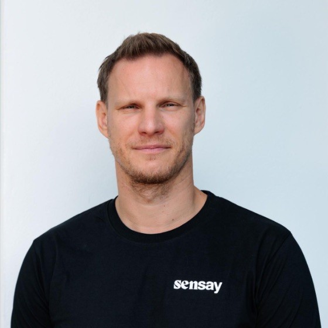

Jan 27, 2026

2026 年 1 月 27 日

Sensay 借助 Vercel 预览环境、功能开关（feature flags）和即时回滚能力，仅用六周便从零起步完成 MVP 上线。团队始终维护单一代码库，灵活应对产品方向调整，并在无需专职 DevOps 团队的情况下顺利交付。

## Impact at a glance

## 关键成效速览

- **6 周**：从零启动到 Web Summit 活动期间完成 MVP 上线  
- **零前期基础设施成本**：上线即开即用，无需预先投入基础设施费用  
- **无需专职 DevOps 团队**：大幅降低运维人力依赖  
- **快速迭代闭环**：依托预览部署（preview deployments）与功能开关实现敏捷验证与发布  

## **一家探索市场定位的初创公司**

## 一家寻找市场定位的初创公司

[Sensay](https://sensay.io/) 最初并非一家员工离职管理平台。

该公司最初的使命极具人文关怀：构建人类的“数字分身”（replicas），以完整保存个人的知识、声音与影像，帮助家庭在认知能力衰退前留存珍贵记忆。团队曾与多家养老院及护理服务机构合作，聚焦阿尔茨海默病与痴呆症患者——他们渴望在意识尚存时，为至亲留下自己的一部分。

Product reality arrived quickly. It was hard to build and distribute software for that demographic, especially when the early versions were text-based. The market was there, but the fit wasn't.

产品现实来得很快。为这一用户群体构建和分发软件十分困难，尤其是早期版本还是纯文本界面时。市场需求确实存在，但产品与市场的契合度并不理想。

For CTO and co-founder Marco Bettiolo, the lesson was clear: Sensay needed a tech stack that would let them ship, test, and change direction fast, without accumulating the kind of infrastructure drag that slows startups.

对于首席技术官兼联合创始人马尔科·贝蒂奥洛（Marco Bettiolo）而言，教训十分明确：Sensay 需要一套技术栈，使其能够快速交付、快速验证、快速调整方向，同时避免积累拖慢初创公司节奏的基础设施负担。

He'd seen what that drag looked like up close. In two previous companies, Marco had helped build the exact infrastructure that makes engineering teams productive: internal deployment systems, preview environments, rollbacks, monitoring, alerting. Those systems worked, but they required years of development, dedicated headcount, and ongoing maintenance.

他曾近距离目睹过这种“拖累”究竟长什么样。在之前的两家公司中，马尔科曾参与构建了那些真正提升工程团队效率的基础设施：内部部署系统、预览环境、回滚机制、监控与告警系统。这些系统确实有效，但它们需要耗费数年开发时间、配备专职人员，并持续投入运维资源。

"I was responsible for building out infrastructure in-house at two separate companies, and both times it resulted in spending millions," Marco recalls.

“我在两家不同的公司都负责过自建基础设施的工作，而两次结果都是耗资数百万美元。”马尔科回忆道。

For a startup trying to find product-market fit, platform work becomes a second product that doesn't generate revenue. Marco knew he didn't want to build that infrastructure again.

对于一家正努力寻找产品市场契合点的初创公司而言，平台建设本身会演变成一个不产生收入的“第二产品”。马尔科深知，他绝不想再重蹈覆辙，重复构建这类基础设施。

> “Because we are a startup, it didn't make sense to get a DevOps team, so it was very natural to marry Next.js with Vercel. Because we are a startup, it didn't make sense to get a DevOps team, so it was very natural to marry Next.js with Vercel.”
>
> 
>
> **Marco Bettiolo,** Co-founder and CTO

> “因为我们是一家初创公司，组建一支 DevOps 团队并不合理，因此将 Next.js 与 Vercel 深度结合便成了顺理成章的选择。因为我们是一家初创公司，组建一支 DevOps 团队并不合理，因此将 Next.js 与 Vercel 深度结合便成了顺理成章的选择。”
>
> 
>
> **马尔科·贝蒂奥洛（Marco Bettiolo）**，联合创始人兼首席技术官

## **Three pivots, one codebase**

## **三次转型，同一套代码库**

Building replicas led the team at Sensay to a broader insight: they were really building an AI knowledge engine. The core goal was to ground LLM responses in specific source material rather than relying on generic training data. If you're recreating someone's lived experience—say, a grandfather who fought in World War II and spoke a dialect that no longer exists—the AI needs to reflect that person's actual knowledge and voice, not hallucinated generalities.

构建“数字复制品”（replicas）的过程，让 Sensay 团队获得了一个更深层的认知：他们实际上正在打造一款 AI 知识引擎。其核心目标是让大语言模型（LLM）的回答扎根于特定的原始资料，而非依赖泛化的训练数据。例如，当你试图复现一位参加过第二次世界大战的祖父的真实经历——而他所讲的方言如今已不复存在——那么 AI 必须真实还原这位老人的知识体系与语言风格，而非输出凭空捏造的笼统结论。

That realization became their second iteration: an API platform that let teams build grounded agents using their own knowledge base. They built a chat widget, landed customers, and learned that selling an API in a crowded space required technical sales expertise they didn't yet have.

这一认知催生了他们的第二个产品形态：一个 API 平台，使企业团队能基于自有知识库构建“有依据的智能体”（grounded agents）。他们开发了一款聊天小部件（chat widget），成功签约首批客户；但也由此意识到，在竞争激烈的 API 市场中销售产品，需要具备他们当时尚不具备的技术型销售能力。

Customers kept asking about a specific vertical problem: knowledge loss when employees leave companies. So they built an off-boarding platform that captures departing employees' institutional knowledge, keeping it accessible to the business.

客户持续反馈一个垂直领域的具体痛点：员工离职导致的企业知识流失。于是，他们开发了一套离职交接平台（off-boarding platform），用于捕获即将离职员工所掌握的组织知识，并确保这些知识持续可被企业内部调用。

When the opportunity came to launch at Web Summit, the team compressed everything into a tight timeline. "In the six weeks prior to Web Summit, we went from zero to developing the MVP to a production launch at the event," Marco says.

当 Web Summit 的发布机会来临时，团队将所有工作压缩进了一个极其紧凑的时间表。“在 Web Summit 举办前的六周内，我们从零起步，完成了 MVP 的开发，并最终在大会上实现了产品上线。”马可（Marco）说道。

Six weeks. From concept to live product at a major conference. "If I had to start building on our own infrastructure, we wouldn't have done anything to launch in six weeks, much less 6 months."

六周——从概念构想到在大型会议上正式发布产品。“如果必须基于我们自建的基础设施来启动开发，别说六周，就连六个月我们都未必能完成上线。”

## **What made speed possible**

## **是什么让极速交付成为可能**

For Sensay, Vercel wasn't about any single feature. It was about removing the work that makes shipping feel risky.

对 Sensay 而言，Vercel 的价值不在于某一项单一功能，而在于消除了那些让上线部署显得高风险的繁重工作。

[Preview deployments](https://vercel.com/products/previews) meant every branch got a working URL that could be tested and shared immediately, no merge required, no staging branch overhead. "When we need to move fast, it's incredible to test things in isolation on a PR," Marco explains. "That allows you to control the blast radius."

[预览部署（Preview Deployments）](https://vercel.com/products/previews) 意味着每个代码分支都会自动生成一个可访问、可测试、可即时共享的工作 URL，无需合并，也无需维护专门的预发布（staging）分支。“当我们需要快速推进时，在 Pull Request 中独立测试功能的效果令人惊叹，”马可解释道，“这让我们能够精准控制影响范围（blast radius）。”

[Feature flags](https://vercel.com/docs/feature-flags) became a development primitive. Instead of maintaining long-lived branches that inevitably lead to merge conflicts, the team kept everyone working on the same mainline codebase. Unfinished features were simply hidden behind flags until ready. Using the [Vercel Toolbar](https://vercel.com/docs/vercel-toolbar), developers and teammates could toggle functionality on or off safely.

[功能开关（Feature Flags）](https://vercel.com/docs/feature-flags) 成为开发过程中的基础能力。团队不再维护长期存在的功能分支（这类分支几乎必然引发合并冲突），而是让所有成员始终基于同一主干（mainline）代码库协同开发；尚未完成的功能仅需通过开关隐藏，待就绪后再启用。借助 [Vercel 工具栏（Vercel Toolbar）](https://vercel.com/docs/vercel-toolbar)，开发者及协作同事均可安全地一键开启或关闭特定功能。

[Instant rollbacks](https://vercel.com/docs/instant-rollback) reduced the psychological cost of deploying. Domain configuration and environment variables made going live repeatable and fast. Security features like [firewall](https://vercel.com/docs/vercel-firewall) and bot protection eliminated the need for additional services. [Usage dashboards](https://vercel.com/docs/observability) provided visibility into resource consumption. "You get productivity from the first moment," Marco says. "You just push to the branch and you go live."

[即时回滚（Instant Rollbacks）](https://vercel.com/docs/instant-rollback) 大幅降低了部署带来的心理压力。域名配置与环境变量机制，使上线操作变得可复现且迅捷。诸如 [防火墙（Firewall）](https://vercel.com/docs/vercel-firewall) 和机器人防护等安全能力，则免去了额外引入第三方服务的需要。[用量仪表盘（Usage Dashboards）](https://vercel.com/docs/observability) 则提供了对资源消耗情况的清晰可视。“你从第一刻起就能获得生产力，”马可表示，“只需向分支推送代码，即可立即上线。”

The result was a workflow where moving fast didn't mean losing control. "Without the dashboard, it would have been a total mess to understand why or how I am consuming your resources."

最终形成了一套“快而不乱”的工作流：高速迭代并不意味着失控。“如果没有这个仪表盘，我根本无法理清自己为何以及如何消耗了你们的资源——那将是一团糟。”

Sensay runs a hybrid architecture with serverless front-and-backend workloads on Vercel and stateful workloads elsewhere. Next.js powers the frontend, their API runs as a separate Vercel project using Hono, and they use the Vercel [AI SDK](https://ai-sdk.dev/) to streamline the buildout and maintenance of AI features and model access.

Sensay 采用混合架构：无服务器（serverless）的前后端工作负载全部运行于 Vercel 平台，而有状态（stateful）工作负载则部署于其他环境。前端由 Next.js 驱动；其后端 API 作为独立的 Vercel 项目，基于 Hono 框架构建；同时，他们还采用 Vercel 提供的 [AI SDK](https://ai-sdk.dev/)，以简化 AI 功能开发与模型调用的构建和运维流程。

"All the serverless workloads are on Vercel," Marco explains. "So we still don't have any DevOps."

“所有无服务器工作负载都运行在 Vercel 上，”马可解释道，“因此，我们至今仍未配备任何 DevOps 工程师。”

## **The million-dollar question**

## **百万美元之问**

When asked about savings compared to building infrastructure in-house, Marco is direct about the numbers.

当被问及与自建基础设施相比的成本节约时，Marco 对具体数字直言不讳。

> “We’ve literally saved millions of dollars by using Vercel. And I get a better developer experience. We’ve literally saved millions of dollars by using Vercel. And I get a better developer experience.”
>
> “我们通过使用 Vercel 真真切切地节省了数百万美元；同时，我还获得了更出色的开发者体验。我们通过使用 Vercel 真真切切地节省了数百万美元；同时，我还获得了更出色的开发者体验。”
>
> 
>
> **Marco Bettiolo,** Co-founder and CTO
>
> **Marco Bettiolo**，联合创始人兼首席技术官（CTO）

He's not exaggerating. At his previous company, he led a 20-person team dedicated to building internal deployment tooling. The bill ran into the millions. The system worked, but it took years to reach the level of productivity that Vercel provided on day one.

他并非夸大其词。在他上一家公司，他曾带领一支20人的团队专门开发内部部署工具，相关支出高达数百万美元。该系统虽能运行，但花了数年时间才达到 Vercel 在上线首日即提供的生产力水平。

For a startup, those millions (not to mention the time savings) are the difference between reaching product-market fit and running out of runway while building infrastructure. "Going live immediately with a well-structured platform is a no-brainer," Marco says.

对一家初创公司而言，这数百万美元（更不用说所节省的时间）正是决定能否实现产品市场契合（product-market fit）与在搭建基础设施过程中耗尽资金而被迫停摆的关键分水岭。“借助一个结构完善、开箱即用的平台立即上线，是显而易见的明智之选。”Marco 表示。

## **What's next: keeping knowledge alive**

## **下一步：让知识持续焕发生命力**

Sensay's near-term focus is distribution: getting the off-boarding product into pilot partners' hands and iterating based on real workflows. The product direction is becoming clearer through product usage and customer conversations: make voice and text interviews frictionless for departing employees.

Sensay 的近期重点在于产品分发：将离职员工知识交接（off-boarding）产品交付给试点合作伙伴，并基于真实工作流持续迭代优化。通过实际产品使用数据与客户对话，产品方向日益明晰——即为即将离职的员工打造零摩擦的语音与文字访谈体验。

But the bigger opportunity is what happens after knowledge gets captured. "Once you capture the knowledge, people ask, 'Okay, but then I want to make it as useful as possible,'" Marco notes. Teams want living knowledge bases that stay current, not static snapshots that decay.

但更大的机遇在于知识被采集之后。Marco 指出：“一旦知识被采集下来，人们就会问：‘好，那接下来我该如何让它发挥最大效用？’” 团队需要的是持续更新、动态演进的“活知识库”，而非随时间推移而过时失效的静态快照。

Sensay's story is fundamentally about velocity to product-market fit.

Sensay 的故事，本质上是一段关于加速实现产品市场契合的旅程。

"Who knows where we’d be if we decided to build everything in-house," Marco reflects. “Certainly not where we are today.”

“倘若当初我们选择全部自研，如今会身在何处？谁也说不准。”Marco 反思道，“但可以肯定的是，绝不会是今天这个位置。”

Sometimes the best infrastructure decision is the one you don't have to make.

有时候，最好的基础设施决策恰恰是你无需做出的那一个。

**About Sensay:** [Sensay](https://sensay.io/) builds AI products that ground model responses in real organizational knowledge, including an off-boarding platform that captures knowledge from departing employees so it stays accessible inside the business.

**关于 Sensay：** [Sensay](https://sensay.io/) 致力于开发人工智能产品，使大模型的响应扎根于企业真实的知识体系之中；其产品包括一款离职管理平台，可系统性地捕获即将离职员工所掌握的知识，确保这些知识持续保留在企业内部并可供随时调用。