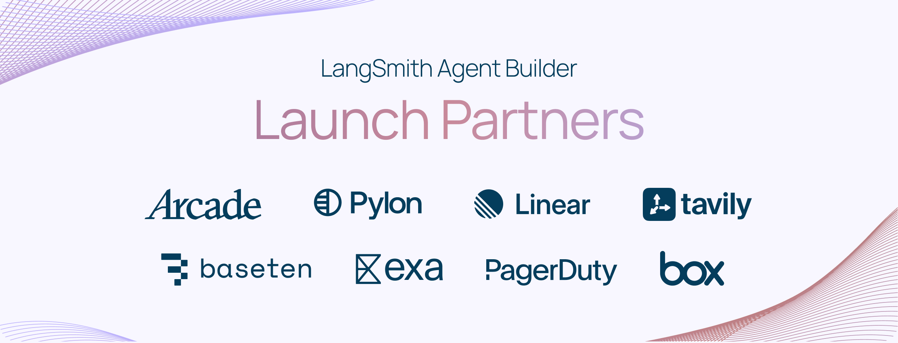
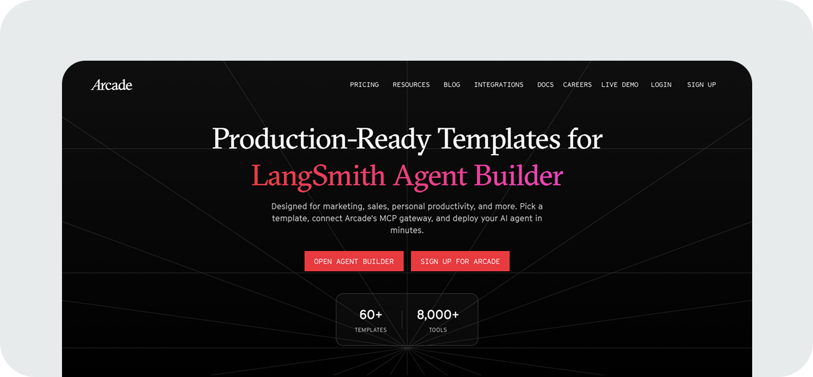

[LangSmith Agent Builder](https://www.langchain.com/langsmith/agent-builder?ref=blog.langchain.com) allows anyone to build an agent with a simple prompt. Ask it to build you a market research agent, and it will follow up with relevant questions to create what you need.

But sometimes you want to start with something that’s ready to go. Today we’re introducing the [Agent Builder Template Library](https://www.langchain.com/templates?ref=blog.langchain.com) and expanding our tool integrations to help you get from idea to working agent even faster.

Agent Builder templates are prebuilt agents for common jobs, with tools connected and agent instructions included. They’re ready to deploy and fully customizable. You can update your agent’s instructions, add tools, and set approval requirements.

Unlike traditional workflow automations, you don’t need to map every step and spend hours debugging changes. Just give your agent feedback like you would a teammate, and it learns.

/0:33

1×

We built these templates with the companies who know their domains best, including Tavily, PagerDuty, Exa, Box, and Arcade, and we're adding new templates regularly. [Explore the Template Library](https://www.langchain.com/templates?ref=blog.langchain.com)

**Try out these agent templates today:**

- **Calendar Brief (Google Calendar):** Reviews your calendar each morning and sends you a summary with research on meeting participants.
- **Email Assistant (Gmail):** Categorizes your emails and drafts replies for your approval.
- **Incident Responder (PagerDuty):** Analyzes alerts, cross-references your runbook, and recommends actions.
- **Document intake review (Box):** Reviews file submissions and prepares a summary for your approval.
- **Talent sourcing (Exa):** Searches LinkedIn based on your job description and sends recommended candidate profiles.
- **Competitor research (Tavily):** Conducts deep competitive research and delivers concise reports.
- **Social Media Monitor (X + Slack):** Monitors X and sends a daily digest to Slack with the latest news.

> _“Agents are a powerful way to turn unstructured content into usable data. Across enterprises, a lot of document work is still manual today: checking completeness, validating accuracy, and extracting context for decision making. By combining the power of Box and Agent Builder, we are making it easy to add an agent to that loop, so teams can focus their time on decisions, not busywork.”_
>
> — Ben Kus, CTO, Box

### See what’s possible with Arcade

Today, Agent Builder provides a set of ready made tool integrations and templates. However, there are a nearly infinite number of tools your team may want to connect via MCP. [Arcade](https://www.arcade.dev/?ref=blog.langchain.com)’s MCP Gateway makes an additional 8,000 tools available to Agent Builder for use cases spanning marketing, sales, recruiting, customer success, product, engineering, and general productivity.

To show what’s possible, Arcade developed a collection of 60+ ready-to-deploy Agent Builder templates, available in their own hosted gallery. Each template includes a step-by-step guide to set up and start using your agent. [Explore Arcade templates](https://www.arcade.dev/agents/langsmith-agentbuilder?ref=blog.langchain.com).

### Choose the best model for your agent

Whether you're starting from a prompt or a template, different jobs may call for different models. Cost, latency, and reasoning requirements vary depending on whether your agent is summarizing emails overnight or responding to questions in real time. That’s why Agent Builder doesn’t lock you into just one model. It supports OpenAI, Anthropic, and Google Gemini models, plus any custom or open source models that follow OpenAI or Anthropic specs.

To show what’s possible, Baseten [built an agent](https://www.baseten.co/blog/production-ai-for-non-technical-knowledge-workers-langchain-agent-builder-with-gl/?ref=blog.langchain.com) using their GLM 4.7 model that responds quickly for real-time user interaction. Connect your [preferred model provider](https://docs.langchain.com/langsmith/agent-builder-quickstart?ref=blog.langchain.com) to Agent Builder, and then you can get building.

### Turn your idea into a community template

This is only the beginning and we're building alongside the community. If you've built an agent you love, whether it's automating sales outreach, monitoring production systems, or conducting research, we’d love to hear about it.

Join our [Community Slack](https://www.langchain.com/join-community?ref=blog.langchain.com) and share it in #agent-builder-templates. We’re turning the best community agents into first-class templates.

## What's next

We’re just getting started with Agent Builder and learning every day as more people build agents. Try Agent Builder for free today and share what you build in #agent-builder-templates.

Get started:

- [Try Agent Builder free](https://smith.langchain.com/agents?skipOnboarding=true&ref=blog.langchain.com)
- [Explore the Template Library](https://www.langchain.com/templates?ref=blog.langchain.com)
- [Join the Community Slack](https://www.langchain.com/join-community?ref=blog.langchain.com)

### Tags

[agent builder](https://blog.langchain.com/tag/agent-builder/) [agents](https://blog.langchain.com/tag/agents/)