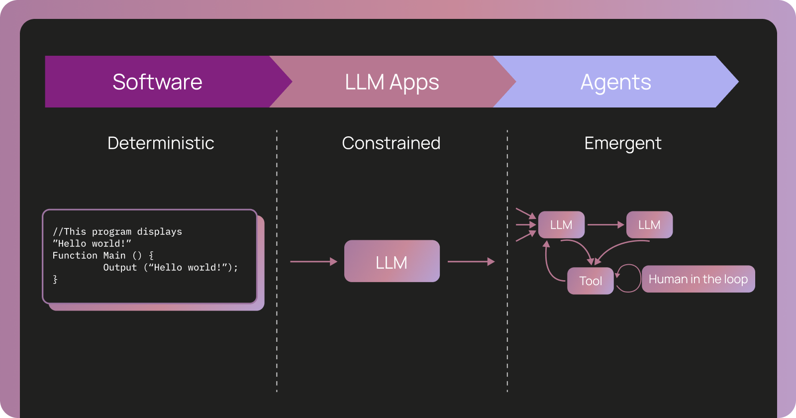

We’re kicking off 2026 with a fresh set of agent-building updates, improved experiment comparison, and new reads on observability and evaluation. Read on to see everything we’ve shipped this January.

# Product Updates

### LangSmith

🚀 **LangSmith Agent Builder is now GA**

Build agents with natural language. Describe what you want, and Agent Builder figures out the approach, including a detailed prompt, tool selection, subagents, and skills. [Try Agent Builder](https://smith.langchain.com/agents?skipOnboarding=true&ref=blog.langchain.com).

📊 Spot regressions and improvements at a glance with side-by-side LLM experiment comparisons. Filter by inputs, outputs, status, or metadata to zero in on what matters. [Learn more.](https://docs.langchain.com/langsmith/compare-experiment-results?ref=blog.langchain.com#how-to-compare-experiment-results)

🤖 Insights Agent automatically analyzes your traces to detect usage patterns, common agent behaviors and failure modes – and is [now available for self-hosted LangSmith customers.](https://changelog.langchain.com/announcements/langsmith-self-hosted-v0-13?ref=blog.langchain.com)

### Open Source

**LangChain JS v1.2.13** improves agent robustness with dynamic tools, recovery from hallucinated tool calls, and better streaming error signals. [Learn more.](https://github.com/langchain-ai/langchainjs/releases?ref=blog.langchain.com)

Stream live progress from subagents and surface who’s doing what as messages are generated in `deepagents`. [Learn more.](https://docs.langchain.com/oss/python/langchain/streaming/overview?ref=blog.langchain.com#streaming-from-sub-agents)

* * *

# Interrupt 2026 - **Tickets on sale Feb 12**

Join us May 13-14 for Interrupt 2026, the AI Agent Conference. Tickets drop February 12 and are limited— early registration recommended. [Sign up](https://interrupt.langchain.com/?ref=blog.langchain.com) to hear first when sales open.

* * *

# Speak the Lang

**Agent observability powers agent evaluation**

Traditional software treats tracing and testing as separate. With agents, they’re inseparable. Teams shipping reliable agents use a single workflow where production traces directly power their evaluations.

Why this matters:

🔹 Agent behavior only emerges at runtime—traces show what actually happened

🔹 Evaluating agents means checking trajectories, outputs, _and_ state, not just final answers

🔹 Production traces become living test cases that shape what you evaluate next

[Read more here](https://www.langchain.com/conceptual-guides/agent-observability-powers-agent-evaluation?ref=blog.langchain.com) on how traces become the foundation of an agent eval strategy.

**Agent Builder’s memory is a filesystem**

Agents doing repeated tasks need to remember, so we gave Agent Builder memory using standard Markdown and JSON files. Here’s how we built it and what we learned. [Read more](https://www.langchain.com/conceptual-guides/how-we-built-agent-builders-memory?ref=blog.langchain.com).

**New Agent Builder Academy Course**

Learn how to build agents with LangSmith Agent Builder. We’ll cover set up, building and improving your agent, and then dive into Triggers, Subagents, MCP, and Skills. [Learn more](https://academy.langchain.com/courses/quickstart-agent-builder/?ref=blog.langchain.com).

# New and Improved Resources

**Chat LangChain**

Meet the relaunch of [chat.langchain.com](http://chat.langchain.com/?ref=blog.langchain.com), a ChatGPT-like resource for LangChain with how-tos, code snippets, and help understanding errors. Login with your LangSmith credentials to preserve your chat history and continue your conversations.

**Support Portal**

We’re launching our new Support Portal. Browse knowledge articles, submit feature requests, and connect with our team when you need help. Check out [here](https://support.langchain.com/?ref=blog.langchain.com).

# Upcoming Events

🇨🇳 **(Feb 1) Shanghai // Community Meetup: Agent Builder Meetup**

Get an in-depth intro into LangSmith Agent Builder and Deep Agents, organized by Ambassador Haili Zhang. [RSVP here](https://luma.com/9g53xf8q?ref=blog.langchain.com).

**🌐 (Feb 5) Virtual // Webinar: Agent Observability Powers Agent Evaluation**

Walk through the core primitives of agent observability and learn how teams use them together to improve agent behavior. [RSVP here.](https://luma.com/98vqaocz?ref=blog.langchain.com)

**🏙️ (Feb 5) NYC // No-Code Agent Building (Women & Underrepresented Genders)**

Calling all citizen developers, technical professionals, and non-technical folks who are women and gender-divers - come build an agent with us and Tavily! [RSVP here.](https://luma.com/zkemhck5?ref=blog.langchain.com)

🗽( **Feb 17) New York // AI Agents Meetup: Agent Observability Powers Agent Evaluation**

Join our Nick Huang, Applied AI Engineer at LangChain, as he shares best practices on agent observability & evals with LangSmith. [RSVP here.](https://luma.com/3cn66ifk?ref=blog.langchain.com)

**🌉 (Feb 18) San Francisco // AI Agents Meetup: Agent Observability Powers Agent Evaluation**

Join our CEO, Harrison, as he shares best practices on agent observability & evals with LangSmith. [RSVP here.](https://luma.com/v6y5ms2z?ref=blog.langchain.com)

🇵🇱 **(Feb 19) Kraków // Community Meetup: AI Agents Workshop (on site & remote)**

Join this hands-on, practical workshops on building agentic systems with LangGraph. Learn how to use LangSmith for tracing and evals. Organized by Ambassadors Simon Budziak and Bart Ludera from Lubu Labs. [RSVP here](https://luma.com/31xzoj09?ref=blog.langchain.com).

🇮🇳 **(Feb 21) Bengaluru // Community Meetup: Agentic AI in Practice: Evaluation, Memory, and Scale**

This meetup will focus on building agents with eval-driven auto-optimization and building a universal memory layer for AI. Organized by Ambassador Ravi Kiran Vemula. [RSVP here](https://luma.com/7nx581e1?ref=blog.langchain.com).

🇳🇱 **(Feb 25) Netherlands // Community Meetup: Utrecht**

Hear from the LangChain team on how to build reliable agents with LangSmith, alongside Karsten (Field CTO at Incentro). [RSVP here.](https://luma.com/6xst89h5?ref=blog.langchain.com)

🇫🇷 **(Feb 26) Paris // Community Meetup: Agents & Apéro**

Ambassador Juan Felipe Arias and and Ambassador/Expert Guillaume Fortaine. keep things informal, friendly, and very Parisian — with an apéro vibe and plenty of time to network 🍷🥖. [RSVP here](https://luma.com/dabn5yjc?ref=blog.langchain.com).

🇺🇸 **(Feb 26) Denver // Community Meetup: Detecting Errors Early with LangSmith**

Join Focused's Lead Agent Engineer for a practical discussion on building and operating production-ready AI applications with LangSmith. [RSVP here.](https://luma.com/x8kffsta?ref=blog.langchain.com)

🇺🇸 **(March 3) Chicago // Community Meetup: Detecting Errors Early with LangSmith**

Join Focused's Lead Agent Engineer for a practical discussion on building and operating production-ready AI applications with LangSmith. [RSVP here](https://luma.com/962j2bv9?ref=blog.langchain.com).

🇬🇧 **(March 6) London // Community Meetup: Agents & Knowledge Graphs Hackathon**

Explore how agents can move beyond demos by grounding themselves in structured, persistent context in this weekend hackathon. Organized by Ambassador Sudip Kandel in partnership with SurrealDB. [RSVP here](https://luma.com/lcsqwmf3?ref=blog.langchain.com).

🇸🇪 **(March 22) Stockholm // Community Hackathon: Lovable x LangChain Proptech Hackathon**

Join LangChain and Lovable for a one-day hackathon in Stockholm. Build AI solutions for Real Estate & Construction using the next gen of AI development tools. Organized by Ambassador Gustaf Gyllensporre. [RSVP here](https://luma.com/aa543o8t?ref=blog.langchain.com).

🇳🇱 **(March 26) Amsterdam // Community Meetup: The Rise of Autonomous Systems**

Get practical POVs on architectures, runtime, and the evolving role of platforms in enabling reliable AI at scale — with speakers from LangChain, AWS, Qodo, and SurrealDB. Organized by Ambassador Sri Rang. [RSVP here](https://luma.com/oqjo3kut?ref=blog.langchain.com).

## 🤝 Customer stories

- **Coinbase** standardized a code-first, observable agent stack to safely automate regulated workflows — reducing agent development time from quarters to days. [Read the full story.](https://www.coinbase.com/blog/building-enterprise-AI-agents-at-Coinbase?ref=blog.langchain.com)
- **Remote** built a Code Execution Agent that separates reasoning (LLMs) from execution (Python), turning complex, multi-format employee and payroll data into validated JSON in hours. [Read the full story.](https://blog.langchain.com/customers-remote/)

**How can you follow along with the Lang Latest? Check out the** [**LangChain blog**](https://blog.langchain.dev/?ref=blog.langchain.com) **,** [**Changelog**](https://changelog.langchain.com/?ref=blog.langchain.com) **, and** [**YouTube channel**](https://www.youtube.com/@LangChain?ref=blog.langchain.com) **for more product and content updates.**