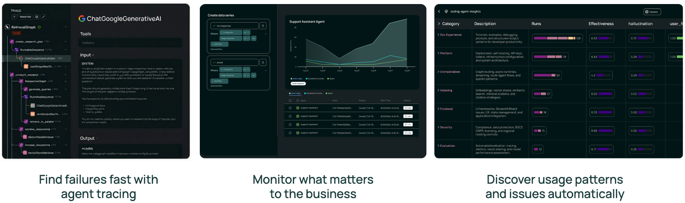
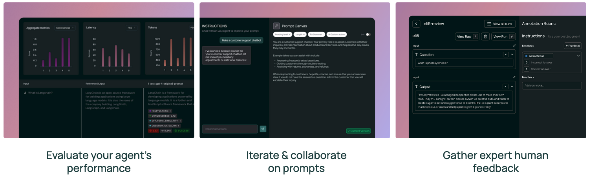
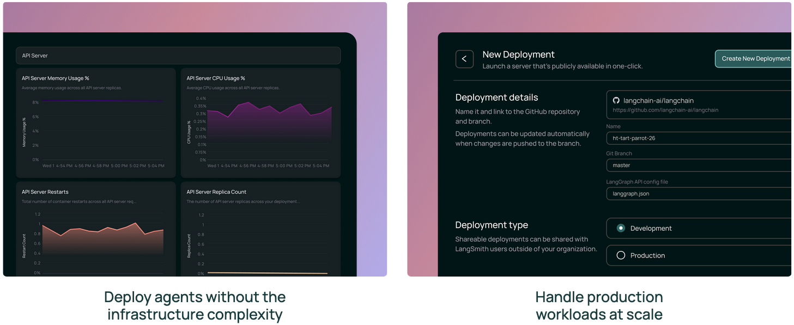
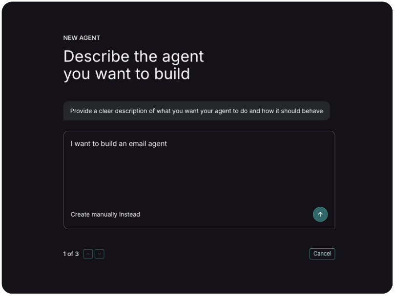
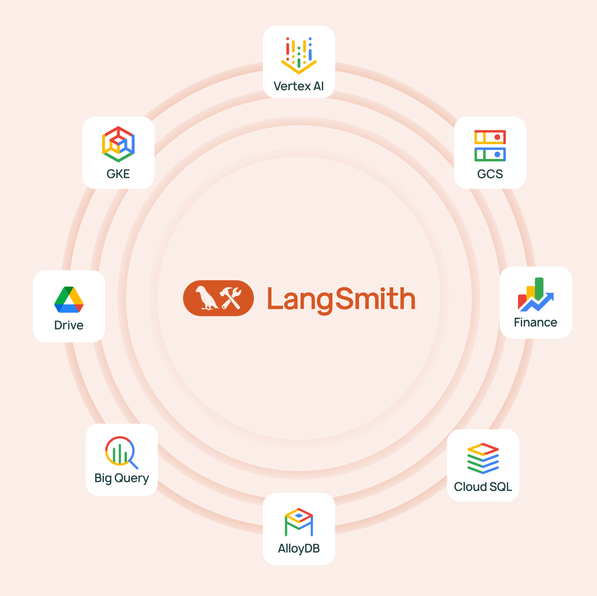

Today, we're thrilled to announce that LangSmith, the agent engineering platform from LangChain, is available in Google Cloud Marketplace. Google Cloud customers can now procure LangSmith through their existing Google Cloud accounts, enabling seamless billing, simplified procurement, and the ability to draw down on existing Google Cloud commitments.

LangSmith is already trusted by leading engineering teams to bring reliability and visibility to complex agentic workflows.This marketplace availability deepens our longstanding collaboration with Google Cloud. LangSmith's SaaS runs on Google Cloud infrastructure, and LangChain has closely partnered with Google on initiatives like the [Gemini model](https://ai.google.dev/gemini-api/docs/models?ref=blog.langchain.com) integration, [Agent2Agent (A2A) Protocol](https://developers.googleblog.com/en/a2a-a-new-era-of-agent-interoperability/?ref=blog.langchain.com) and [MCP Toolbox for Databases](https://github.com/googleapis/genai-toolbox?ref=blog.langchain.com). LangSmith available in Google Cloud Marketplace is a natural next step in helping our joint customers build, test, and deploy production-ready AI applications.

## Benefits of LangSmith

LangSmith provides enterprise teams with a unified platform to debug, test, deploy, and monitor AI applications. Its core capabilities span observability, evaluation, prompt engineering, and deployment:

### Observability

LangSmith offers deep visibility into application behavior with detailed tracing and real-time monitoring. Engineering teams can inspect and debug individual interactions, configure alerts on key metrics, and track trends over time. This observability layer helps enterprise teams maintain auditability and explainability for agent behavior.

### Evaluation

LangSmith makes it easy to evaluate application performance with both pre-deployment testing and continuous feedback on production traffic. Teams can run experiments to compare prompt or model changes, collect human feedback through annotation queues, and organize reusable datasets to track performance over time. This helps teams catch regressions and iterate to continuously improve quality.

### Deployment

LangSmith Deployment (formerly LangGraph Platform) provides the infrastructure needed to deploy, scale, and manage stateful, long-running agents. Teams can deploy in minutes with one-click GitHub integration, expose agents via 30+ API endpoints, and choose from SaaS, hybrid, or fully self-hosted options to meet compliance requirements.

### Agent Builder

Build powerful AI agents in minutes with LangSmith Agent Builder - no coding required. Start with a ready-made template, connect the apps you already use, and let your agent take care of routine tasks like drafting emails, summarizing updates, and organizing information. Work with your agent directly in chat or through tools like Slack, so help is always where you need it. And with built-in approval workflows, you stay in control of the actions that matter most. It's automation that works for you, on your terms.

### Seamless Google Cloud Integration

LangChain offers a [rich ecosystem of integrations](https://docs.langchain.com/oss/python/integrations/providers/google?ref=blog.langchain.com) with Google Cloud services, making it easy for GCP customers to build AI applications entirely within their cloud environment:

- **Vertex AI & Gemini**: First-class support for Gemini models using the latest Gemini 3 Pro and Flash, plus access to 200+ models in Vertex AI Model Garden including Claude, Llama, and Mistral
- **Databases**: Native integrations with AlloyDB for PostgreSQL, BigTable, BigQuery, Spanner, Firestore, and Memorystore for vector storage, document loading, and chat history
- **Compute**: Fully managed SaaS where LangChain hosts and operates all LangSmith infrastructure and services built with GCP services like Google Kubernetes Engine (GKE)
- **Tools:** Query financial data from Google Finance, interact with documents from Google Drive, search for trends from Google Trends.

These integrations mean GCP customers can leverage their existing data and infrastructure investments while gaining full observability and control through LangSmith.

### Why Procure LangSmith via Google Cloud Marketplace

Procuring LangSmith through Google Cloud Marketplace offers significant benefits for enterprise teams:

- **Consolidated billing**: All LangSmith charges appear on your existing Google Cloud invoice, simplifying vendor management and financial reporting.
- **Draw down on committed spend**: LangSmith purchases count toward your Google Cloud committed spend, helping you maximize the value of existing cloud investments.
- **Simplified procurement**: With Google Cloud already an approved vendor, teams can accelerate procurement cycles and reduce administrative overhead.

LangSmith is available in multiple deployment configurations to meet your security and compliance requirements from fully-managed SaaS (already running on Google Cloud infrastructure) to hybrid deployments where data stays in your VPC, to fully self-hosted on GKE with our Helm charts and Terraform modules.

### Getting Started

Ready to bring reliability, visibility, and control to your AI applications on Google Cloud?

- [Get LangSmith in Google Cloud Marketplace](https://console.cloud.google.com/marketplace/product/langchain-public/langsmith?ref=blog.langchain.com)
- [Contact sales](https://www.langchain.com/contact-sales?ref=blog.langchain.com) to discuss enterprise requirements

### About LangChain

LangChain provides the agent engineering platform and open source frameworks developers need to ship reliable agents fast. Our open source frameworks, LangGraph and LangChain, help developers build agents with speed and granular control, while LangSmith offers observability, evaluation, and deployment for rapid iteration. Trusted by millions of developers worldwide and AI teams at Klarna, Clay, Cloudflare, and Cisco, LangChain provides an integrated toolset to transform LLM systems into dependable production experiences.