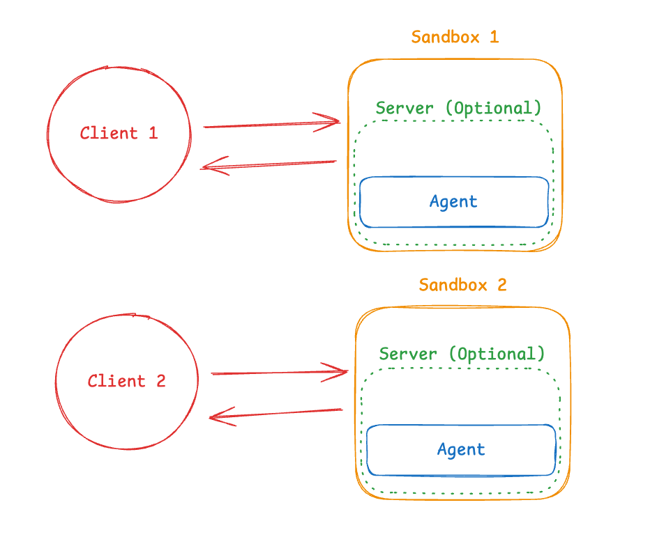
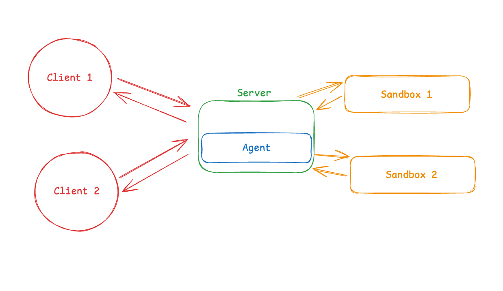

_Thank you to Nuno Campos from Witan Labs, Tomas Beran and Mikayel Harutyunyan from E2B, Jonathan Wall from Runloop, and Ben Guo from Zo Computer for their review and comments._

**TL;DR:**

- **More and more agents need a workspace: a computer where they can run code, install packages, and access files. Sandboxes provide this.**
- **There are two architecture patterns for integrating agents with sandboxes:**
  - **Pattern 1 (Agent IN Sandbox): Agent runs inside the sandbox, you communicate with it over the network. Benefits: mirrors local development, tight coupling between agent and environment.**
  - **Pattern 2 (Sandbox as Tool): Agent runs locally/on your server, calls sandbox remotely for execution. Benefits: easy to update agent logic, API keys stay outside sandbox, cleaner separation of concerns.**
- [**deepagents**](https://docs.langchain.com/oss/python/deepagents/overview?ref=blog.langchain.com) **supports both patterns with simple configuration**

* * *

An increasing number of agents need a workspace - a computer where they can run code, install packages, and access files. That workspace needs to be isolated so the agent can't access your credentials, files, or network. Sandboxes provide this isolation by creating a boundary between the agent's environment and your host system. The question teams building these agents face isn't _whether_ to use sandboxes - it's _how to integrate them_ with their agent architecture.

There are two common patterns based on where the agent runs: inside the sandbox or outside of it. Each pattern has different benefits and trade-offs.

Note: this post focuses on sandboxes that give agents a full 'computer’ - complete execution environments like Docker containers or VMs. We won't cover process-level sandboxes (like [bubblewrap](https://github.com/containers/bubblewrap?ref=blog.langchain.com)) or language-level sandboxes (like [Pyodide](https://pyodide.org/en/stable/?ref=blog.langchain.com)).

## Pattern 1: Agent Runs IN Sandbox

In this pattern, the agent runs inside the sandbox. You communicate with it over the network.



**What this looks like in practice:**

You build a Docker or VM image with your agent framework pre-installed, run it inside the sandbox, and connect from outside to send messages. The agent exposes an API endpoint (typically HTTP or WebSocket), and your application communicates with it across the sandbox boundary.

**Benefits:**

This pattern mirrors local development closely—if you run `deepagents` in your terminal locally, you run the same command in the sandbox. The agent has direct filesystem access and can modify its environment. This is useful when the agent and execution environment are tightly coupled, such as when the agent needs to interact with specific libraries or maintain complex environment state.

**Trade-offs:**

Communication across the sandbox boundary requires infrastructure. Some providers handle this in their SDK—for example, agents like OpenCode run a server inside the sandbox, and providers like E2B can expose this through a clean API. If your provider doesn't offer this, you'll need to build the WebSocket or HTTP layer yourself, including session management and error handling.

API keys must live inside the sandbox to allow the agent to make inference calls. This creates a potential security risk if the sandbox is compromised, whether through a vulnerability in the isolation technology or through prompt injection attacks that exfiltrate credentials. Note: we see providers like E2B and Runloop working on secret vault capabilities, which addresses this.

Updates require rebuilding the container image and redeploying, which can slow iteration cycles during development.

Another downside is that the sandbox must be resumed before the agent becomes active, which often requires extra logic.

For those worried about protecting the IP of their agents, if your agent is running in the sandbox it becomes much easier to exfiltrate the entire code and prompts of the agent.

Nuno Campos from Witan Labs also points out another security risk: “I’d say another downside of agent in sandbox is that effectively no part of your agent can have more privileges than the bash tool does. E.g. imagine you want an agent that has a bash tool and a tool that can do web search or web fetch, then all the LLM generated code can do unlimited web fetches (which is a big security risk). If it’s sandbox as tool then you can have tools with more permissions than you give to llm generated code (which sounds very useful for many agents) trivially, as the security boundary is around the bash tool, not the whole agent.”

## Pattern 2: Sandbox as Tool

In this pattern, the agent runs on your machine or server. When it needs to execute code, it calls a remote sandbox via API.



**What this looks like in practice:**

Your agent runs locally (or on your server), and when it generates code that needs to execute, it calls out to a sandbox provider's API (like [E2B](https://e2b.dev/?ref=blog.langchain.com), [Modal](https://modal.com/?ref=blog.langchain.com), [Daytona](https://www.daytona.io/?ref=blog.langchain.com), or [Runloop](https://runloop.ai/?ref=blog.langchain.com)). The provider's SDK handles all the communication details. From your agent's perspective, the sandbox is just another tool.

**Benefits:**

You can update agent code instantly without rebuilding container images, which speeds up iteration during development. API keys stay outside the sandbox—only execution happens in isolation. This provides cleaner separation of concerns: agent state (conversation history, reasoning chains, memory) lives where your agent runs, separate from the sandbox. This means sandbox failures don't lose your agent's state, and you can switch sandbox backends without affecting your agent's core logic.

Two other benefits of this option, as pointed out by Tomas Beran of E2B:

1. Having the option to run tasks in multiple remote sandboxes in parallel
2. Paying for sandboxes only when executing code, rather than for the whole process runtime.

Ben Guo adds a final point about the benefits of separating agent runtime from sandbox runtime: “We chose Pattern 2 for the reasons you mention, but also in preparation for a future where it makes sense to run the agent harness in a GPU machine – generally feels like the environment requirements will diverge between the persistent sandbox and the inference harness”

**Trade-offs:**

Network latency is the main downside. Each execution call crosses the network boundary. For workloads with many small executions, this can add up.

Many sandbox providers offer stateful sessions where variables, files, and installed packages persist across invocations within the same session. This can mitigate some of the latency concerns by reducing the number of round trips needed.

## Choosing Between Patterns

**Choose Pattern 1 when:**

- The agent and execution environment are tightly coupled (for example, the agent needs persistent access to specific libraries or complex environment state)
- You want production to mirror local development closely
- Your provider's SDK handles the communication layer for you

**Choose Pattern 2 when:**

- You need to iterate quickly on agent logic during development
- You want to keep API keys outside the sandbox
- You prefer cleaner separation between agent state and execution environment

## Implementation Example

To make these patterns concrete, we'll show examples using [deepagents](https://docs.langchain.com/oss/python/deepagents/overview?ref=blog.langchain.com), an open-source agent framework with built-in sandbox support. Similar patterns apply to other agent frameworks.

### Pattern 1: Agent IN Sandbox

For Pattern 1, first you build an image with your agent pre-installed:

```docker
FROM python:3.11
RUN pip install deepagents-cli
```

Then run it inside the sandbox. A complete implementation requires additional infrastructure to handle communication between your application and the agent inside the sandbox (WebSocket or HTTP server, session management, error handling). This is beyond the scope of this post, but we will have some follow up posts diving into this in more detail.

### Pattern 2: Sandbox as Tool

```python
from daytona import Daytona
from langchain_anthropic import ChatAnthropic

from deepagents import create_deep_agent
from langchain_daytona import DaytonaSandbox

# Can also do this with E2B, Runloop, Modal
sandbox = Daytona().create()
backend = DaytonaSandbox(sandbox=sandbox)

agent = create_deep_agent(
    model=ChatAnthropic(model="claude-sonnet-4-20250514"),
    system_prompt="You are a Python coding assistant with sandbox access.",
    backend=backend,
)

result = agent.invoke(
    {
        "messages": [\
            {\
                "role": "user",\
                "content": "Run a small python script",\
            }\
        ]
    }
)

sandbox.stop()
```

Here's what happens when this code runs:

1. The agent plans locally on your machine
2. It generates Python code to solve the problem
3. It calls the Runloop API, which executes the code in a remote sandbox
4. The sandbox returns the result
5. The agent sees the output and continues reasoning locally

## Conclusion

Agents need to execute code in isolated environments for security. There are two architecture patterns: running the agent inside the sandbox (mirrors local development, tight coupling) or running it outside with the sandbox as a tool (easy updates, API keys stay secure). Each has different benefits and trade-offs depending on your needs.

deepagents supports both patterns with simple configuration. [Try it out](https://github.com/langchain-ai/deepagents?ref=blog.langchain.com) to see which pattern works best for your use case.