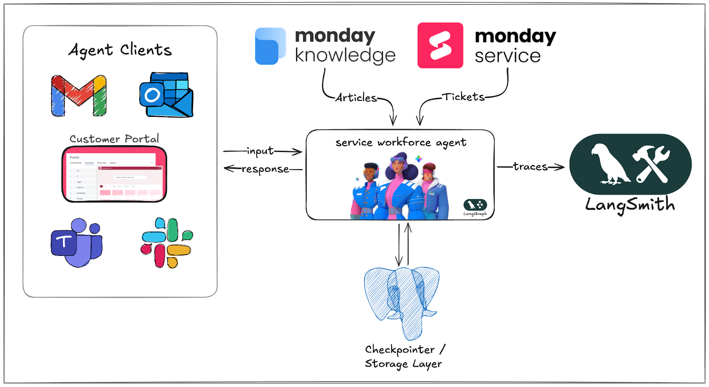
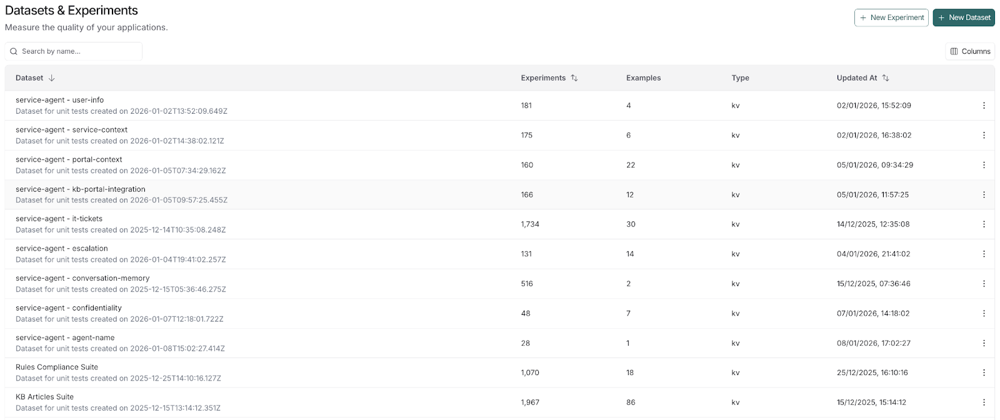
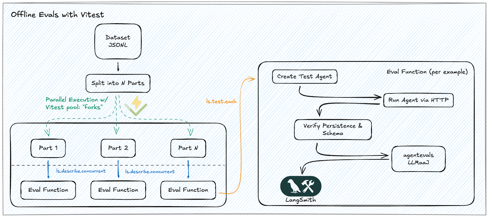
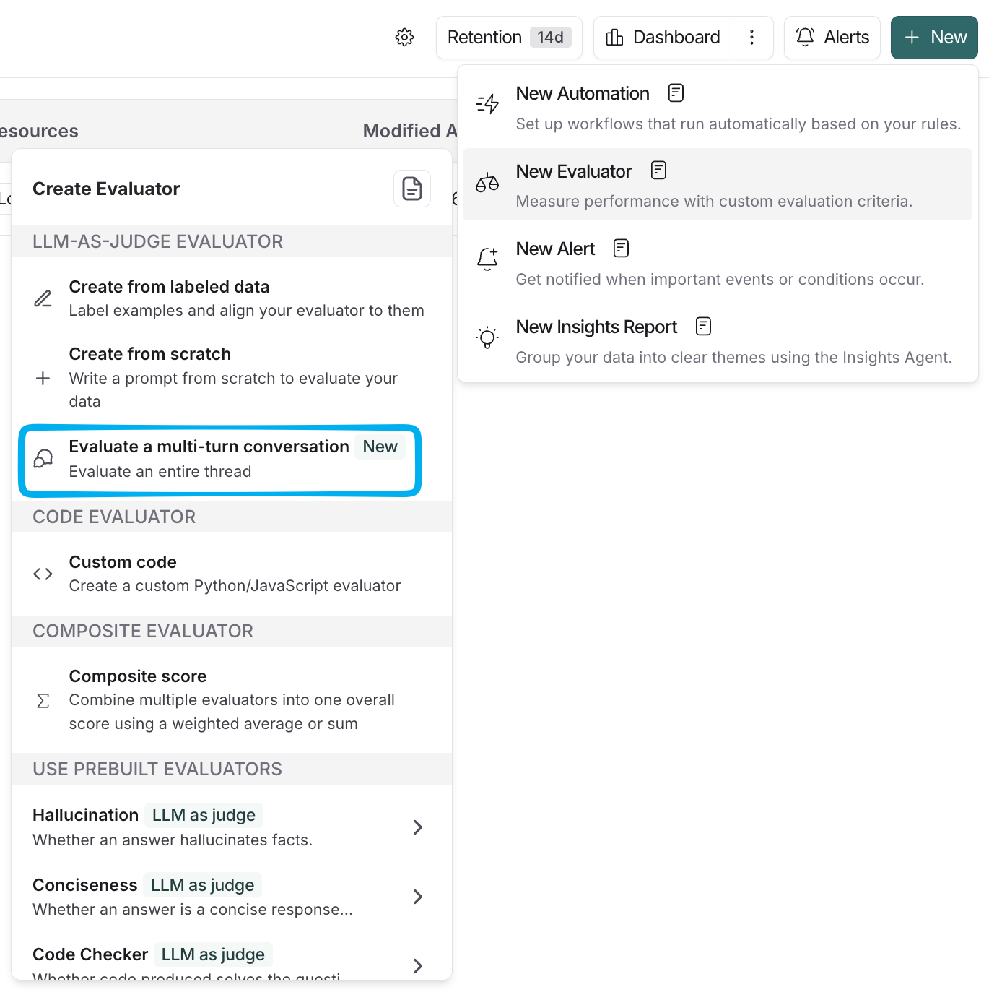
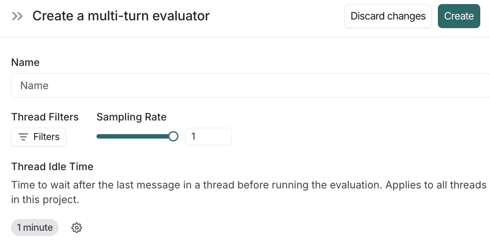
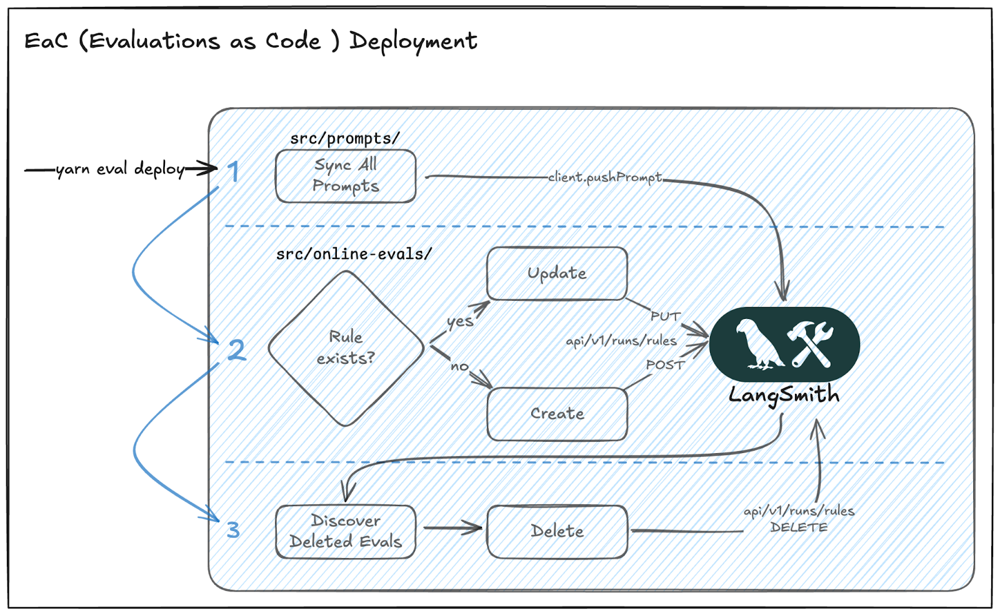
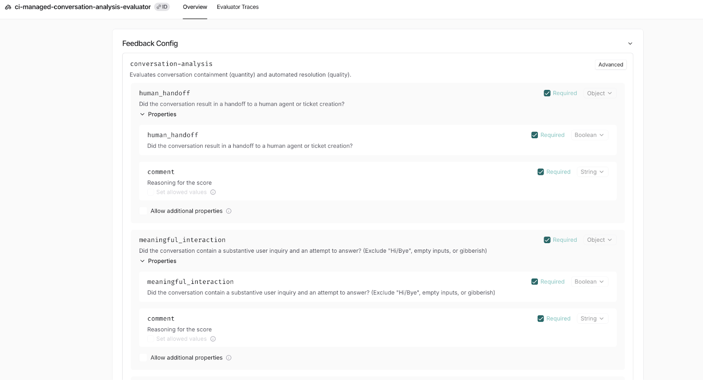

_\[This is a guest post from our friends at_ [_Monday.com_](http://monday.com/?ref=blog.langchain.com) _driving eval strategy for their customer-facing AI service agents, led by Gal Ben Arieh (Group Tech Lead). Thank you for your contribution!\]_

Many teams treat evaluation as a last-mile check, but we made it a Day 0 requirement.

[**monday Service**](https://monday.com/lp/service/blog-contactus?ref=blog.langchain.com) is an AI Native Enterprise Service Management (ESM) platform designed to automate and resolve inquiries across all service departments. When building our new [AI service workforce](https://monday.com/lp/service/blog-contactus?ref=blog.langchain.com) (a workforce of customizable, **role-based** AI agents that take the ticket load off human reps), we embedded evaluations into the development cycle from the start instead of waiting for Alpha users to find the gaps.

This article shows you how we built an **evals-driven development framework** to catch AI quality issues before our  users do.

What we achieved:

- **Speed:** 8.7x faster evaluation feedback loops (from 162 seconds to 18 seconds).
- **Coverage**: Comprehensive testing across hundreds of examples in minutes instead of hours.
- **Agent observability:** Real-time, end-to-end quality monitoring on production traces, using Multi-Turn Evaluators.
- **Evals as code:** Evaluation logic managed as version-controlled production code with GitOps-style CI/CD deployment.

AI service workforce is a customizable, **LangGraph-based,** [ReAct](https://docs.langchain.com/oss/python/langchain/agents?ref=blog.langchain.com#tool-use-in-the-react-loop) agent, designed to automate and resolve inquiries across any enterprise service management use case.

Whether applied to fields like **IT, HR, or Legal**, monday Service customers can tailor the agent to drive execution within any **service** department, by utilizing their own **KB articles** and **tools.**



However, the very **autonomy** that makes ReAct agents so powerful, also introduces a unique challenge: because each step of the reasoning chain depends on the last, a **minor deviation** in a prompt or a tool-call result can **cascade** into a significantly different— and potentially incorrect— outcome.

### The Two Pillars of Evaluations

Through our research into agent evaluation best practices, we quickly realized that dual-layered approach is necessary:

**Offline Evaluations — "The Safety Net":** Acting somewhat like a unit-testing layer, runs the agent against curated "golden datasets”. Tests both **core logic** (e.g., groundedness, retrieval accuracy, tool-calling) and **specific edge cases** (e.g., KB article conflict or priority resolution), This layer helps to ensure that a simple prompt tweak doesn’t **inadvertently break** the agent's ability to handle **other** **tasks**.

**Online Evaluations — "The Monitor" (Continuous Quality):** This layer handles the ongoing collection, analysis, and enhancement of the agent’s **performance** from an end-to-end **business** perspective. By utilizing **online** evaluation pipelines, we **track** and **refine** businesssignals (e.g. Automated Resolution and Containment rates), ensuring in **real time** that the agent’s performance in the **wild**.

### Pillar A: Offline Evaluations — "The Safety Net"

#### Designing Our Evaluation Coverage Strategy

Before writing a single evaluation, we needed to answer a fundamental question: What should we actually evaluate? The challenge **wasn’t** **designing a perfect coverage strategy** \- it was simply picking a **practical starting point**.

We constructed a small dataset of ~30 real (sanitized) resolved IT tickets, chosen from our internal IT help desk to cover common request categories like:

- Access & Identity (e.g. IDP, SSO, Software Access)
- VPN and connectivity issues
- Device / OS support (updates, performance, hardware issues)

In that first suite, our checks were intentionally **simple**:

- **Deterministic**“smoke” checks:
  - Runtime health: the agent ran with no crashes/timeouts, request succeeds end-to-end.
  - Output shape: the response matches the expected schema/format (even before judging content).
  - State & persistence: thread/session created and the conversation was persisted properly in our application database.
  - Basic Tool Sanity Check: All necessary tools were correctly invoked with appropriate inputs and completed their execution without errors.
- **LLM-as-judge**: We started with  an off-the-shelf evaluator from [OpenEvals (Correctness)](https://github.com/langchain-ai/openevals?tab=readme-ov-file&ref=blog.langchain.com#correctness) that compares the agent response to the reference output from the same resolved-ticket dataset.

Once that baseline existed, we expanded with smaller, **use-case-specific** datasets to probe **specific behaviors** – including session memory, KB retrieval, grounding and conflict resolution, and guardrails. As these behaviors got more nuanced, we moved from **one correctness score** to a more comprehensive set of checks:

- **KB grounding / Citations:** “Does every factual claim trace back to the provided KB content?” (We verify this using LangSmith’s prebuilt [hallucination](https://github.com/langchain-ai/openevals?tab=readme-ov-file&ref=blog.langchain.com#hallucination) / [answer relevance](https://github.com/langchain-ai/openevals?tab=readme-ov-file&ref=blog.langchain.com#answer-relevance) checks).
- **Conflict handling:** “When policies vary by region/time, did the agent ask for clarification or pick the latest applicable policy?” (or the prebuilt [correctness](https://github.com/langchain-ai/openevals?tab=readme-ov-file&ref=blog.langchain.com#correctness) check).
- **Guardrails:** “Did the agent refuse when required?” / “Did it avoid revealing internal tool names or prompt content?” (or the prebuilt [toxicity](https://github.com/langchain-ai/openevals?tab=readme-ov-file&ref=blog.langchain.com#toxicity) / [conciseness](https://github.com/langchain-ai/openevals?tab=readme-ov-file&ref=blog.langchain.com#conciseness) checks).
- **KB usage timing:** The KB should be fetched at a reasonable point (not too early, and not after the answer is already formed) using [AgentEvals' Trajectory LLM-as-judge](https://github.com/langchain-ai/agentevals?tab=readme-ov-file&ref=blog.langchain.com#trajectory-llm-as-judge).
- **Guardrail ordering:** Safety/policy guardrails should run at the right stage (before producing the final answer). This is another [trajectory](https://github.com/langchain-ai/agentevals?tab=readme-ov-file&ref=blog.langchain.com#trajectory-llm-as-judge) check.

#### The Framework: langsmith/vitest

To implement this layer, we utilized the **LangSmith Vitest** [integration](https://docs.langchain.com/langsmith/vitest-jest?ref=blog.langchain.com#vitest). This approach provides the power of a battle-hardened testing framework ( **Vitest**) while remaining seamlessly integrated with the **LangSmith ecosystem**.

With this setup, every CI run is **automatically** logged as a distinct experiment in the **LangSmith platform**, and each test suite functions as a **dataset**. This gives us the visibility to drill down into specific **runs** and see exactly where the agent diverged from the **ground truth**, making it easy to verify the impact of any code changes **before** they reach production.



#### The Hard Lesson: Don’t Compromise on DevEx

At first, our offline evaluations ran serially. The standard development loop—eval (fail) → fix → re-eval (pass)—became a major bottleneck.

We found that a slow feedback loop inevitably compromises either our testing depth or our development pace. To sustain high-velocity shipping without regressions, we realized the evaluation process had to be fast enough to ensure a frictionless iteration loop.

#### The Solution: Parallelizing with Vitest + ls.describe.concurrent



By optimizing our Vitest and LangSmith integration, we achieved a massive speed increase by distributing the load across **local workers and remote API calls**. The key was a hybrid approach: **parallelizing test files** to maximize CPU usage and **running LLM evaluations concurrently** to handle I/O-bound latency.

- **Parallelism (CPU-Bound):** We leverage Vitest’s [pool:'forks'](https://vitest.dev/config/pool.html?ref=blog.langchain.com#forks) to distribute the workload across multiple cores. By **assigning each Dataset Shard to a separate test file**, we allow multiple worker processes to run in parallel without competing for CPU. This setup ensures that even as our datasets grow, we can process them quickly by **distributing the shards across available cores.**
- **Concurrency (I/O-Bound):** Within each test file, we use ls.describe.concurrent to maximize throughput. Since **LLM evaluations** are high-latency, concurrency allows us to **overlap the latency** by firing off dozens of evaluations at once, ensuring the runner never sits idle.
- **The Eval Function:**This is the core logic responsible for evaluating each example. We use it to run a two-tiered validation in a single pass:
  - **Deterministic Baseline:** Hard assertions to ensure the agent adheres to the **response schema** and maintains **state persistence** (via checkpointer/storage).
  - **LLM-as-a-Judge:** Semantic grading against a "Golden Dataset". We leverage open-source libraries like [**OpenEvals**](https://www.google.com/search?q=https%3A%2F%2Fgithub.com%2Fexplodinggradients%2Fopenevals&ref=blog.langchain.com) and [**AgentEvals**](https://github.com/langchain-ai/agent-evals?ref=blog.langchain.com) to score dimensions like **correctness** and **groundedness**.

**The Result:** Comprehensive feedback over **hundreds** of examples in **minutes**!

**Benchmarking** results for 20 sanitized IT tickets using a MacBook Pro 16-inch (Nov 2023, Apple M3 Pro, 36 GB RAM, macOS Tahoe 26.2):

|     |     |     |
| --- | --- | --- |
| Execution Mode | Total Duration | Speedup vs Sequential |
| Parallel + Concurrent | 18.60s | 8.7x faster |
| Concurrent Only | 39.30s | 4.1x faster |
| Sequential | 162.35s | Baseline |

### Pillar B: Online Evaluations — "The Monitor”

#### Online, Multi Turn Evaluations

While offline evaluations are often used to catch regressions in a controlled sandbox, they are essentially static snapshots of **synthetic or sanitized examples**. To capture the **unpredictability of production**, we needed Online Evaluations—running on real production traces in **real-time**.

Since our agent handles complex, **multi-turn** dialogues, success is often not defined by a single response, but by the **entire conversation** trajectory. This requires an evaluation strategy that accounts for how the agent guides the user toward a resolution over **several turns**.

We found a perfect fit in **LangSmith’s** [**Multi-Turn Evaluator**](https://docs.langchain.com/langsmith/online-evaluations?ref=blog.langchain.com#configure-multi-turn-online-evaluators), which leverages **LLM-as-a-judge** to score end-to-end threads. Instead of evaluating individual runs in isolation, we can now use custom prompts to grade the entire conversation trajectory—measuring high-level outcomes like **user satisfaction, tone, and goal resolution.**



What’s most impressive is how **quickly** we were able to go live. The **LangSmith platform** makes the multi-turn setup **incredibly intuitive**: we could define a **custom inactivity window** to pinpoint exactly when a session should be considered " **complete**" and ready for evaluation, and easily apply a **sampling rate** to balance our data volume with the LLM costs.



#### Evaluations as Code (EaC)

As we moved from prototype to production, we wanted to manage our "judges" with the same standards we apply to any other production code: **version control, peer reviews, and automated CI/CD pipelines.**

To achieve this, we moved the source of truth into our repository, defining our "judges" as structured TypeScript objects.

```typescript
// conversation-analysis.ts
export const conversationAnalysis = new MultiSignalEvaluationPrompt({
  name: 'conversation-analysis',
  variables: ['all_messages'],
  modelConfig: { model: 'gpt-5.2-pro', reasoning: { effort: 'high' } },
  extractionFields: [\
    new ExtractionField({ key: 'human_handoff', type: 'boolean', includeComment: true }),\
    new ExtractionField({ key: 'meaningful_interaction', type: 'boolean', includeComment: true }),\
    new ExtractionField({ key: 'is_automated_resolution', type: 'boolean', includeComment: true }),\
    // ... additional atomic signals\
  ],
  systemPrompt: `You are an expert conversation analyst...`,
  humanPrompt: `Analyze the following conversation:
<conversation>
{{{all_messages}}}
</conversation>`,
});
```

Moving our judges into code unlocked two critical capabilities:

1. We could leverage AI IDEs like **Cursor** and **Claude Code** to refine complex prompts directly within our primary workspace.
2. It felt natural to write offline evaluations for our judges to ensure accuracy before they ever touch production traffic.

The migration was relatively easy thanks to LangChain’s IDE integrations. We used the [**Documentation MCP**](https://docs.langchain.com/use-these-docs?ref=blog.langchain.com) to pull library context into our editor and the [**LangSmith MCP**](https://github.com/langchain-ai/langsmith-mcp-server?ref=blog.langchain.com) to fetch runs and feedback directly. The [**LangChain Chat**](https://chat.langchain.com/?ref=blog.langchain.com) was also a useful reference for clarifying specific implementation details.

#### Deployment

To close the loop, we built a custom CLI command, yarn eval deploy, that runs in our CI/CD pipeline. This ensures our repository remains the absolute Source of Truth for our evaluation infrastructure.



When we merge a PR, our synchronization engine performs a three-step Reconciliation Loop:

1. **Sync Prompts**: Pushes TypeScript definitions to the LangSmith Prompt Registry.
2. **Reconcile Rules**: Compares local evaluations (rules) definitions against active production ones, updating or creating them **automatically**.
3. **Prune**: Identifies and deletes "zombie" evaluations/prompts from the LS platform if these are no longer present in the codebase.



### The Evolution of the Stack: Looking Ahead

As our evaluation logic matured, we wanted to manage it with the same rigor as production code— version control, PR reviews, CI/CD. LangSmith's API-first architecture made this natural to implement, allowing our custom deployment pipeline to sync our TypeScript definitions directly to the LangSmith platform.

This gave us the best of both worlds: LangSmith's powerful evaluation infrastructure with our team's GitOps workflow. We expect this pattern to become even more common as the ecosystem matures, potentially evolving into standardized 'Evaluations as Infrastructure' tooling similar to Terraform modules.

### Tags

[Case Studies](https://blog.langchain.com/tag/case-studies/)