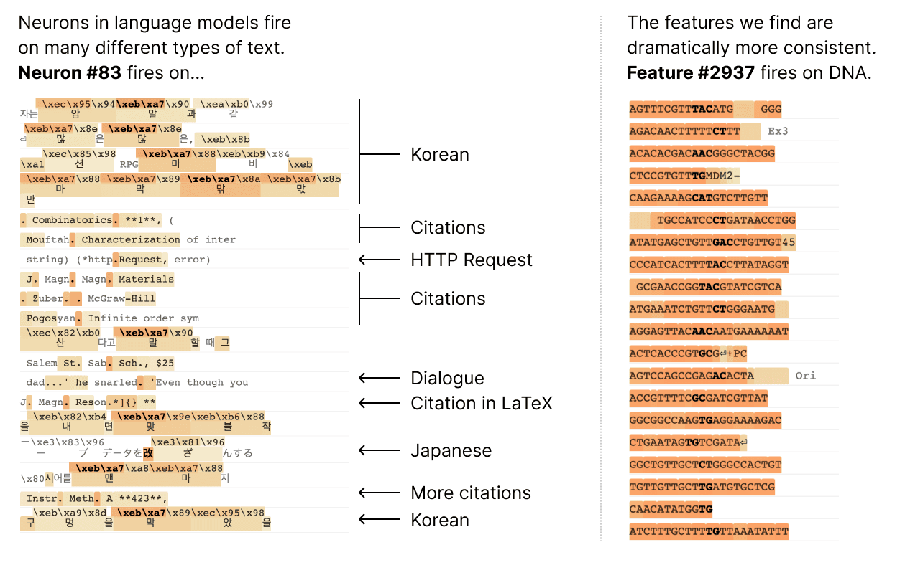
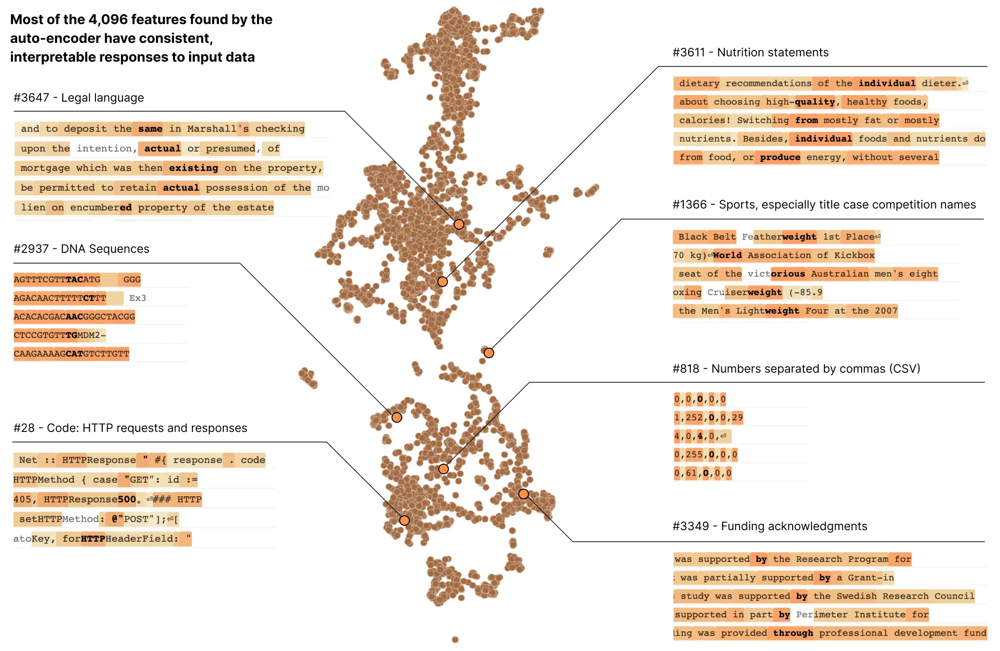
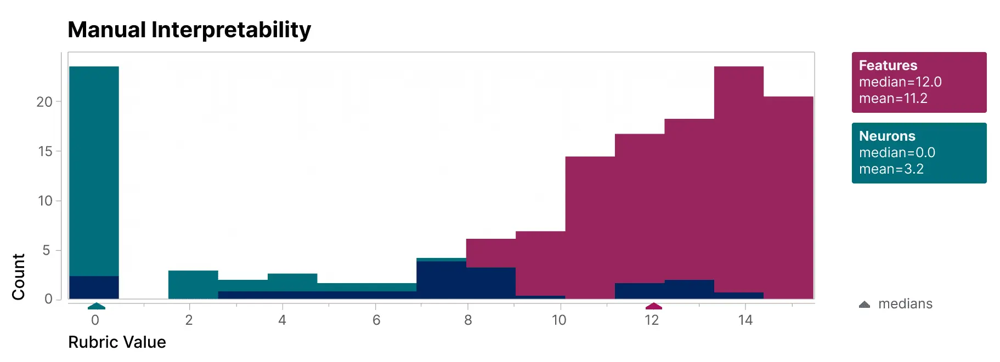
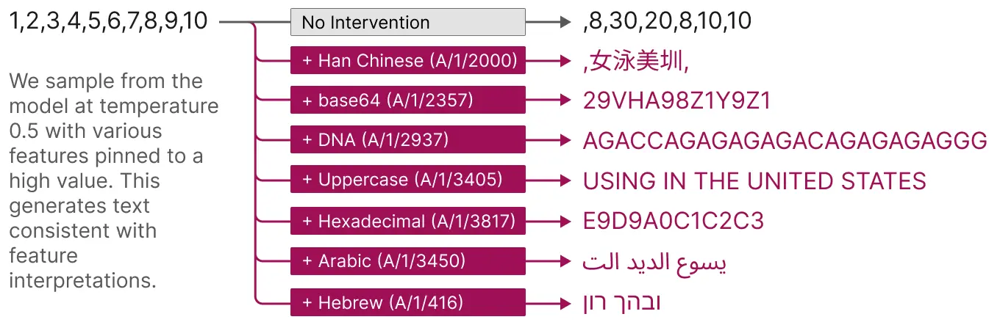

InterpretabilityResearch

# Decomposing Language Models Into Understandable Components

Oct 5, 2023

We tracked 11 observable behaviors across thousands of Claude.ai conversations to build the AI Fluency Index — a baseline for measuring how people collaborate with AI today.

Neural networks are trained on data, not programmed to follow rules. With each step of training, millions or billions of parameters are updated to make the model better at tasks, and by the end, the model is capable of a dizzying array of behaviors. We understand the math of the trained network exactly – each neuron in a neural network performs simple arithmetic – but we don't understand why those mathematical operations result in the behaviors we see. This makes it hard to diagnose failure modes, hard to know how to fix them, and hard to certify that a model is truly safe.

Neuroscientists face a similar problem with understanding the biological basis for human behavior. The neurons firing in a person's brain must somehow implement their thoughts, feelings, and decision-making. Decades of neuroscience research has revealed a lot about how the brain works, and enabled targeted treatments for diseases such as epilepsy, but much remains mysterious. Luckily for those of us trying to understand artificial neural networks, experiments are much, much easier to run. We can simultaneously record the activation of every neuron in the network, intervene by silencing or stimulating them, and test the network's response to any possible input.

Unfortunately, it turns out that the individual neurons do not have consistent relationships to network behavior. For example, [a single neuron](https://transformer-circuits.pub/2023/monosemantic-features/vis/a-neurons.html#feature-83) in a small language model is active in many unrelated contexts, including: academic citations, English dialogue, HTTP requests, and Korean text. In a classic vision model, a [single neuron](https://distill.pub/2017/feature-visualization/#diversity) responds to faces of cats and fronts of cars. The activation of one neuron can mean different things in different contexts.

In our latest paper, [_Towards Monosemanticity: Decomposing Language Models With Dictionary Learning_](https://transformer-circuits.pub/2023/monosemantic-features/index.html), we outline evidence that there are better units of analysis than individual neurons, and we have built machinery that lets us find these units in small transformer models. These units, called features, correspond to patterns (linear combinations) of neuron activations. This provides a path to breaking down complex neural networks into parts we can understand, and builds on previous efforts to interpret high-dimensional systems in neuroscience, machine learning, and statistics.

In a transformer language model, we decompose a layer with 512 neurons into more than 4000 features which separately represent things like DNA sequences, legal language, HTTP requests, Hebrew text, nutrition statements, and much, much more. Most of these model properties are invisible when looking at the activations of individual neurons in isolation.

To validate that the features we find are significantly more interpretable than the model's neurons, we have a blinded human evaluator score their interpretability. The features (red) have much higher scores than the neurons (teal).

We additionally take an "autointerpretability" approach by using a large language model to generate short descriptions of the small model's features, which we score based on another model's ability to predict a feature's activations based on that description. Again, the features score higher than the neurons, providing additional evidence that the activations of features and their downstream effects on model behavior have a consistent interpretation.

Features also offer a targeted way to steer models. As shown below, artificially activating a feature causes the model behavior to change in predictable ways.

Finally, we zoom out and look at the feature set as a whole. We find that the features that are learned are largely universal between different models, so the lessons learned by studying the features in one model may generalize to others. We also experiment with tuning the number of features we learn. We find this provides a "knob" for [varying the resolution](https://transformer-circuits.pub/2023/monosemantic-features/index.html#phenomenology-feature-splitting) at which we see the model: decomposing the model into a small set of features offers a coarse view that is easier to understand, and decomposing it into a large set of features offers a more refined view revealing subtle model properties.

This work is a result of Anthropic’s investment in Mechanistic Interpretability – one of our longest-term research bets on AI safety. Until now, the fact that individual neurons were uninterpretable presented a serious roadblock to a mechanistic understanding of language models. Decomposing groups of neurons into interpretable features has the potential to move past that roadblock. We hope this will eventually enable us to monitor and steer model behavior from the inside, improving the safety and reliability essential for enterprise and societal adoption.

Our next challenge is to scale this approach up from the small model we demonstrate success on to frontier models which are many times larger and substantially more complicated. For the first time, we feel that the next primary obstacle to interpreting large language models is engineering rather than science.

To learn more about all of this, read our paper, [_Towards Monosemanticity: Decomposing Language Models With Dictionary Learning_](https://transformer-circuits.pub/2023/monosemantic-features/index.html).