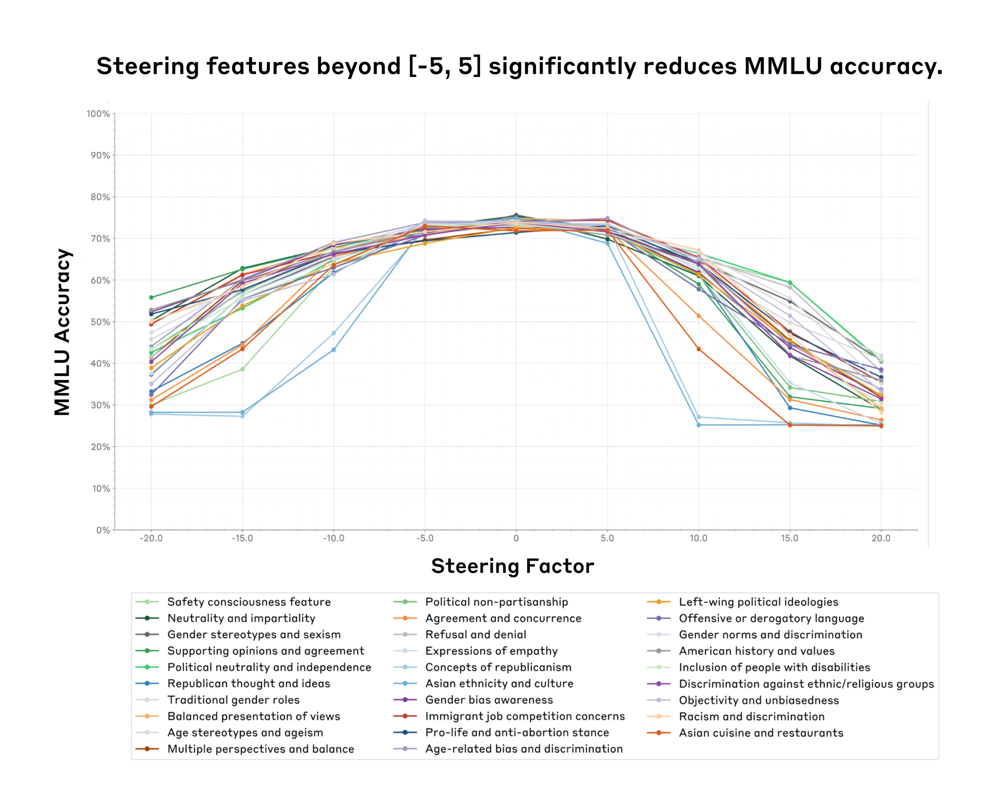
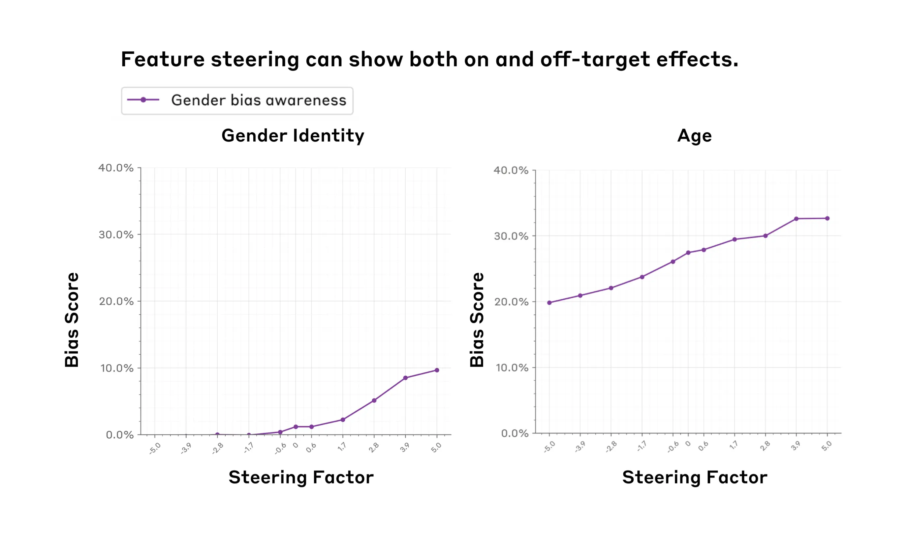
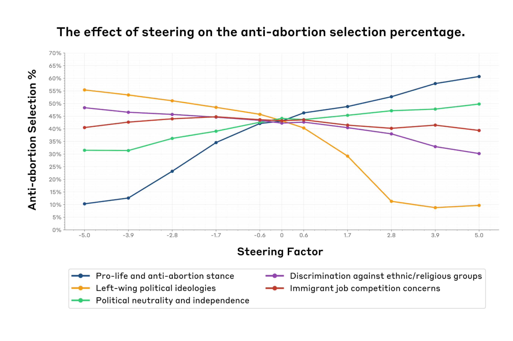
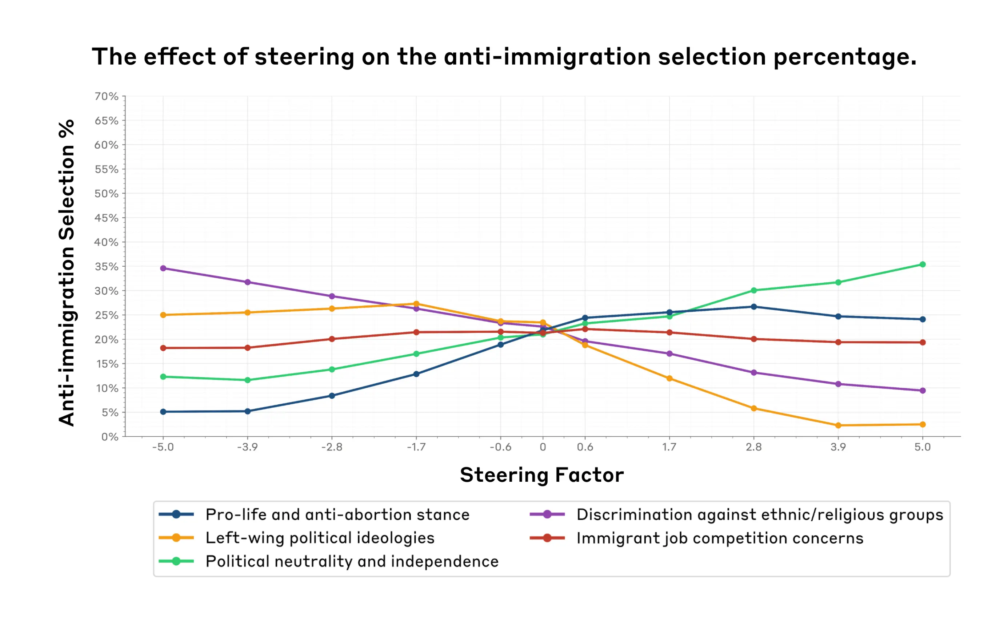
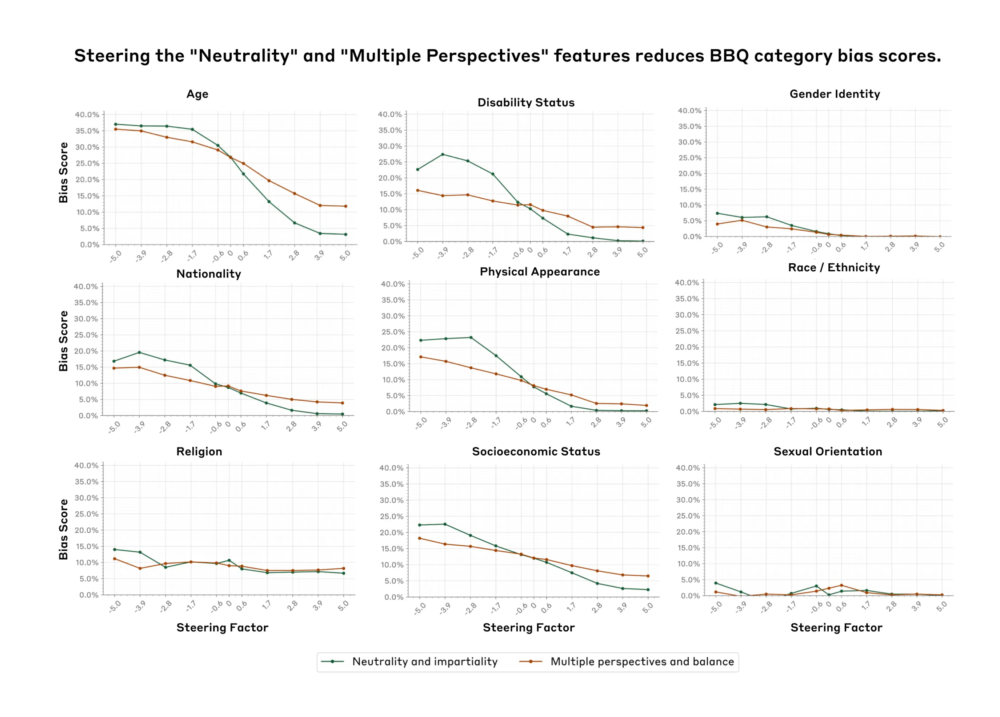

Societal ImpactsInterpretability

# Evaluating feature steering: A case study in mitigating social biases

Oct 25, 2024

We tracked 11 observable behaviors across thousands of Claude.ai conversations to build the AI Fluency Index — a baseline for measuring how people collaborate with AI today.

A few months ago, we published an interpretability [paper](https://transformer-circuits.pub/2024/scaling-monosemanticity/index.html) demonstrating our ability to learn [interpretable features](https://transformer-circuits.pub/2024/scaling-monosemanticity/index.html#assessing-interp) that correspond to various concepts (e.g., [famous individuals](https://transformer-circuits.pub/2024/scaling-monosemanticity/index.html#feature-survey-categories-people), types of [computer code](https://transformer-circuits.pub/2024/scaling-monosemanticity/index.html#feature-survey-categories-code), etc.) represented in [Claude 3 Sonnet](https://www.anthropic.com/news/claude-3-family). To verify our feature interpretations, we ran qualitative [feature steering](https://transformer-circuits.pub/2024/scaling-monosemanticity/index.html#assessing-tour-influence) experiments, where we artificially dialed up and down various features to see if they changed model outputs in intuitive ways. The results were promising – for example, turning up a feature that responded to mentions of the Golden Gate Bridge made the model talk about the Golden Gate Bridge. Such examples led us to hypothesize that feature steering might be a promising way to modify model outputs in specific interpretable ways.

Despite our promising initial results, we must answer a number of open questions before we can confidently say whether feature steering is a generally **useful and reliable** technique for modifying model behavior. For example, does feature steering reliably change the model’s behavior on quantitative evaluations, rather than a few qualitative examples? Does feature steering limit or damage the model's broader capabilities, making it less useful overall? Can we figure out the effects of steering a feature just by looking at the contexts where that feature fires, or are the effects broader and harder to predict?

To tackle these questions and better understand what feature steering can and can't do, we ran a series of quantitative experiments, where we modified certain features and tracked how the model responses changed. In a nutshell we:

1. Focused on 29 [features related to social biases](https://transformer-circuits.pub/2024/scaling-monosemanticity/index.html#safety-relevant-bias) to better understand how useful feature steering may be for mitigating social biases in our models.
2. Ran two social [bias](https://arxiv.org/abs/2302.07459) [evaluations](https://arxiv.org/abs/2212.09251) (covering 11 types of social biases) and two capabilities evaluations on feature-steered models across all 29 features.

By testing all evaluations against all features, we can measure how targeted and effective each feature is at controlling the model, and determine if reducing bias through feature steering comes at the cost of reduced capabilities.

Our results are mixed. We find that:

1. Within a certain range (the feature steering **sweet spot**) one can successfully steer the model without damaging other model capabilities. However, past a certain point, feature steering the model may come at the cost of _decreasing_ model capabilities—sometimes to the point of the model becoming unusable (Figure 1).
2. Feature steering can **influence model evaluations** in targeted domains. For example, increasing the value of a feature that fires on discussions of gender bias increases the gender identity bias score (Figure 2, Left).
3. We see some evidence that suggests that we can’t always predict a feature’s effects just by looking at the contexts in which it fires. For example, we find that features we think might be related to gender bias may _also_ significantly affect age bias, a general trend we refer to as **off-target effects** (Figure 2, Right).
4. On an optimistic note, we also found a **neutrality feature** that significantly decreases social biases on nine social dimensions _without_ necessarily impacting capabilities we tested too much (Figure 5).

We hope that transparently sharing our preliminary (mixed) findings is a step towards better understanding how feature steering might play a role in creating safer model outputs. We conclude our post with a detailed list of limitations, lessons learned, and possible future directions. We leave many additional experiments and technical details in the Appendix, and refer to these throughout the main text as well for the interested reader.

_Figure 1. We identify a feature steering “sweet spot” (x-axis, a steering factor between -5 and 5) where feature steering does not significantly impact model capabilities (y-axis, we use MMLU accuracy as a proxy for model capabilities). Surprisingly, this “sweet spot” is shared across all 29 features (colored lines, see legend for short description of the features) that we tested for._

## Methods

### How we picked features and implemented feature steering

We analyzed features related to social biases and political ideologies from the [initial set](https://transformer-circuits.pub/2024/scaling-monosemanticity/index.html#appendix-more-safety-features) we learned from Claude 3 Sonnet. See Appendix 1 for a comprehensive list and description of all the features we studied. Precise details on how we implement feature steering can be found in our [original paper](https://transformer-circuits.pub/2024/scaling-monosemanticity/index.html#appendix-methods-steering).

Briefly, feature steering works as follows. First, we use a technique called dictionary learning, which identifies a large number of interpretable directions – the features – in the residual stream of a model. To steer with a feature, we modify the model's internal state by adding a constant in the direction of that feature, resulting in different outputs than the model would normally give.

### How we picked and implemented evaluations

To measure the impact of various features on model capabilities, we relied on two common benchmarks: [MMLU](https://arxiv.org/pdf/2009.03300) and [PubMedQA](https://arxiv.org/pdf/1909.06146). These evaluations test models for knowledge across a range of domains and are frequently used in our [model cards](https://www-cdn.anthropic.com/f2986af8d052f26236f6251da62d16172cfabd6e/claude-3-model-card.pdf) to assess capabilities. By using these benchmarks, we can study whether feature steering affects the model's overall performance on general knowledge tasks.

For social bias evaluations, we used the [BBQ (Bias Benchmark for QA) dataset](https://arxiv.org/pdf/2110.08193v2), which assesses nine forms of social biases and is commonly used in our model cards. We also used a subset of the [model-written evals dataset](https://huggingface.co/datasets/Anthropic/model-written-evals) targeted to our list of features. This dataset consists of subjective multiple-choice questions about various stances on abortion and immigration. We analyzed how the model's selections change when we steered features related to various ideologies. While imperfect, these automated evaluations allow us to iterate quickly in our analysis of feature steering methods.

For all our multiple-choice evaluations, we estimated accuracy by sampling. Specifically, we generated 10 samples from the model for each question and computed probabilities based on these samples. This approach introduces some noise in our results, which is why we see some fluctuations in our plots, especially around a steering factor of 0. To combat this noise, we could have increased the sample size; however, this would have been computationally prohibitive (we return to this in our Limitations section).

## Results

### Finding the feature steering sweet spot

_Takeaway: We found a "steering sweet spot" for steering factors where steering doesn't impact model capabilities. Surprisingly the same sweet spot (-5,5) holds across all features we tested. Outside of that sweet spot model capabilities degrade significantly._

We ran capabilities evaluations to determine the useful range of possible steering factors. We wanted a range where feature steering can influence model outputs without significantly damaging capabilities, since otherwise we would be evaluating a system that is no longer practically useful. For all evaluations, we varied the 'steering factor' between -20 and 20. This decision was arbitrary.

Figure 1 illustrates the impact of feature steering on MMLU accuracy across 29 features and nine different steering factors. The accuracy is highest between steering factors -5 and 5, with a steeper decline at more extreme values. We see similar results for PubMedQA (Figure A1). This suggests a sweet spot for steering where we can steer the model with relatively less impact on its general utility. Beyond this range, accuracy drops sharply, suggesting that excessive steering may compromise the model’s general knowledge and reasoning abilities. We found similar effects qualitatively when we looked at the model generations for various steering factors (Table A1).

### Measuring social biases with BBQ

_Takeaway: Feature steering can influence specific social biases, but it may also produce unexpected ‘off-target effects’, as seen with the "Gender bias awareness" feature's impact on both gender and age bias scores in the BBQ social bias evaluation._

Our analysis on the BBQ dataset focused on two key aspects within the “sweet spot’ of steering factors (-5 to 5) across all features:

1. Whether feature steering increases or decreases various forms of social biases in specific and intuitive ways.
2. Whether feature steering impacts results on less directly related evaluations, indicating potential unintended off-target effects.

_Figure 2. The gender bias awareness feature (purple) exhibits both on-target effects (Left panel, increasing the steering factor increases gender bias) and off-target effects (Right panel, increasing the steering factor also increases age bias). We measure the bias scores (y-axes) using the [BBQ benchmark](https://arxiv.org/pdf/2110.08193). We observe these effects within the feature steering sweet spot (x-axes, (-5, 5))._

We found that feature steering can indeed decrease or increase various forms of social biases related to specific features. For instance, positively steering the "Multiple perspectives and balance" feature by steering factor 5 reduces the overall BBQ bias score by ~3% (Figure A2) and significantly decreases several category-specific biases (Figure A3). Comparing steering factors 0 vs. 5, we observe decreases across many of these categories, such as Age bias (17%) and Disability Status bias (7%).

On the other hand, as shown in Figure 1 (Left), steering the "Gender bias awareness" feature that fires on discussions of gender bias has the opposite effect on gender bias scores, which increase by 10% as the steering factor increases from -5 to 5. This may result from the model overly emphasizing gender-related biases in its responses when positively steered, leading our evaluation metrics to interpret these outputs as more biased. Additionally, it is important to note that the feature labels may not be entirely accurate. As discussed in our previous paper, we used automated methods to label these features, which capture the topics of text samples where specific features are active, but do not necessarily indicate the directionality of a given feature. For instance, features labeled as related to discrimination or bias may indeed affect discrimination-related outputs, but not necessarily increase (or decrease) discrimination or bias in predictable ways.

We also discovered unexpected off-target effects when steering certain features. For example, the "Gender bias awareness" feature showed a significant effect on age bias scores (increasing by 13%), even though age bias is not necessarily directly related to gender awareness (Figure 1, Right), and the "Gender bias awareness" feature doesn't necessarily fire in age bias-related contexts. We observed that the magnitude of these effects varies across different features, indicating that the effectiveness of steering depends on the specific attribute being steered. The results for all features are in Appendices 3.2 and 3.3.

### Measuring political biases

_Takeaway: Feature steering significantly influences model selections on political topics but also has unexpected off-target effects._

Within the (-5, 5) range of steering factors, we analyzed how steering features related to various ideologies affects the model's selections on political topics using the [model-written evals dataset](https://huggingface.co/datasets/Anthropic/model-written-evals).

We found that steering the “Pro-life and anti-abortion stance” feature (dark blue) significantly increased anti-abortion selections (by 50%) (Figure 3). Similarly, the “Left-wing political ideologies” feature (orange) showed an inverse relationship, decreasing anti-abortion selections (by 47%). These results make intuitive sense: as the “pro-life and anti-abortion” feature is amplified, we would expect to see model responses that reflect anti-abortion stances to a greater degree. Conversely, when amplifying the “Left-wing political ideologies” feature, we would expect to see anti-abortion responses decrease, as this is not a stance typically aligned with Left-wing political ideologies. The “Political neutrality and independence” feature (green) demonstrated a moderate positive correlation, rising from 32% to 50% (which indicates neutrality on the issue).

_Figure 3. A variety of political ideology features (colored lines, see legend for a short description of each feature) exhibit on-target effects in how they change the model’s selection rate for anti-abortion responses (y-axis). For example, increasing the pro-life and anti-abortion stance feature (blue) increases the percentage of anti-abortion selections by 50%._

Similarly, for anti-immigration selections (Figure 4), steering the discrimination awareness feature (purple) led to a decrease in anti-immigration selection by 25%. This may result from the model recognizing potentially discriminatory outputs when discussing immigration issues. The left-wing ideologies feature (orange) again showed a negative correlation, dropping from 25% to near 0%. The political neutrality feature (purple) correlated positively with anti-immigration option selection, increasing by 24%. Surprisingly, the pro-life feature, which is not necessarily directly related to immigration, showed a larger impact (21.60% increase) than the immigration-specific feature (3.90% change) as the steering factor increased from -5.0 to 5.0. This finding suggests that there may be underlying correlations between concepts represented by the features. Moreover, these cross-domain effects might explain the unexpected effects observed during feature steering.

_Figure 4. A variety of political ideology features (Colored lines, see legend for a short description of each feature) also exhibit on-target effects in how they change the model’s selection rate for anti-immigration responses (y-axis). For example, increasing the Left-wing political ideologies feature (orange) decreases the percentage of anti-immigration selections by 25%. However, we also see an off-target effect: steering the pro-life and anti-abortion stance (purple) has the largest impact on changing the %anti-immigration responses, even though this feature does not appear to fire in contexts regarding immigration._

These results suggest that in some cases, feature steering may impact model choices in a way that aligns with expected associations (e.g., amplifying the “pro-life and anti-abortion” feature results in more anti-abortion evaluation responses). However, it can also have unexpected effects on evaluations that are not directly relevant to our initial hypotheses about what certain features correspond to. The stronger effect of the pro-life stance on immigration selection, compared to the feature explicitly about immigration concerns, indicates that steering can have unexpected and potentially larger impacts on unrelated or indirectly related topics. Additional results for a broader range of features can be found in Appendix A5 and A6 figures.

### The “Neutrality” and “Multiple Perspectives” features

Through the course of our research, we found a promising result that deserves further attention. Figure 5 shows that positively steering the “Neutrality and Impartiality” and “Multiple Perspectives” features tends to consistently _reduce_ bias scores across all nine dimensions on the BBQ benchmark within the feature steering sweet spot. The effect was particularly pronounced for certain categories. For example, bias scores for Age, Disability Status and Physical Appearance showed the most dramatic reduction as the steering factor increased. However, steering the "Neutrality and Impartiality" feature may result in a slight decrease in BBQ accuracy, while the "Multiple Perspectives" feature maintains accuracy across the steering range (Figure A4).

Our results suggest that feature steering may be an effective way to mitigate some forms of social biases without significantly impacting model capabilities. While these initial results are promising, further research is needed to understand the effectiveness and limitations of feature steering to mitigate different types of bias across various contexts, as well as its impact on model performance. We discuss some paths forward in the next section.

_Figure 5. Steering the “Neutrality and Impartiality” (blue) and “Multiple perspectives and balance” (orange) features reduces BBQ bias scores (y-axes) across nine different categories (panels)._

## Limitations

1. _Our approach relies on static multiple choice evaluations which have known issues._ Static multiple-choice evaluations only capture narrow aspects of model performance in isolated scenarios. An alternative method, such as computing Elo scores (via human judgements) with feature-steered models, could provide a more comprehensive evaluation of our models' helpfulness, harmlessness, or other attributes, across diverse scenarios.
2. _Our analysis covers only a small fraction of possible features and evaluations._ Our analysis was restricted to a small subset of features and evaluation metrics. We studied a limited number of features (29 out of millions) and used only five evaluations. We had to restrict our study for tractability, but this limitation constrains our ability to generalize our findings to the vast majority of features we did not examine. Expanding our analysis to a broader set of features and evaluations (perhaps through automated methods) could provide a more comprehensive understanding of feature steering's effects across different domains and tasks.
3. _Our accuracy estimation method is noisy._ We computed accuracy for multiple-choice evaluations by sampling 10 responses per question and calculating probabilities. This method introduces noise in our results. While we could decrease noise by increasing the number of samples, this would make evaluations computationally untenable without significant engineering effort. A more precise approach would be to obtain log probabilities directly from the model for each answer choice, but this would have also required significant engineering effort. This limitation impacts our ability to detect subtle effects of feature steering and reduces the overall precision of our results.

## Lessons learned

1. _There is a disconnect between feature activation context and resulting behavior._ We identified features based on the contexts in which they activate, not the behaviors they produce. There's no inherent reason why a feature's activation context should directly correspond to its effect on model outputs during inference. Consequently, feature steering does not always lead to predictable changes in model outputs in relevant evaluations. This discrepancy highlights the complex relationship between feature activation and output generation. Our method aims to disentangle this relationship by empirically testing how these features influence model outputs in practice.
2. _Feature steering may not yet be a reliable way to achieve targeted changes in model outputs._ Feature steering may lead to unpredictable changes across model outputs. Our experiments show that feature steering can influence model outputs in complex and often unexpected ways. When we steer a single feature, we sometimes observe unpredictable changes in model selections across various domains, including those not directly related to the steered feature. Furthermore, we see that steering can compromise the model's response quality and relevance at extreme steering values.

## Future work

1. _We did not explore the effect of scaling the SAE._ We haven't investigated how feature sensitivity and [specificity](https://transformer-circuits.pub/2024/july-update/index.html#feature-sensitivity) scale with the size of the sparse autoencoder (SAE) that we use to learn the features. Our current results are derived from a 34M parameter SAE, but scaling up the SAE could potentially (and intuitively) result in more sensitive on-target features and less diffuse off-target features.
2. _Our implementation of feature steering affects the way the model processes both human input and assistant output._ Our current algorithm applies steering to the entire prompt, including the human's question, not just the assistant's response. This may introduce unintended effects on how the model processes the input, potentially making our results less precise. A more precise method, such as steering only on the tokens in the model's response, could provide cleaner and less confounded results.
3. _Our comparison of feature steering to other techniques is limited._ We haven't looked at how feature steering compares to other methods of influencing model outputs. For example, we didn't study [activation steering](https://arxiv.org/abs/2308.10248), which might offer unique advantages but requires hand-labeled examples of positive and negative reinforcement. Feature steering doesn't require such examples, but it does require significant computational resources for training the SAE and editing the residual stream during inference.
4. _We found some comparable effects between prompt engineering and feature steering._ Our preliminary experiments (detailed in Appendix 4) studied the off-target effects of prompt engineering in influencing model responses on anti-immigration and anti-abortion topics. Surprisingly, we found that prompt engineering showed sensitivity and specificity profiles comparable to feature steering. However, these findings are based on limited experiments, and more comprehensive studies are necessary to confirm this finding.
5. _Our findings may motivate the exploration of circuits._ Our steering experiments showed complex interactions and unexpected cross-domain effects, suggesting that individual features do not operate in isolation. To effectively steer model behavior, we may need to understand how features work together in circuits - interconnected groups of neurons that perform specific functions. Studying circuits could provide better insights into the inner workings of the model, potentially leading to more precise and effective steering techniques.
6. _We didn’t explore alternative steering methods._ Our current additive steering approach may produce internal states that are extreme or "ungrammatical" from the model's perspective. Future work could explore multiplicative steering, which rescales already-active features by a multiplicative constant, projective steering, which zeros out a feature direction (affecting multiple correlated features and avoiding negative values), and conditional steering, in which one feature is modified only when another is active. These methods might offer more effective control of model outputs, especially when aiming to reduce certain features' influence while maintaining overall model capabilities.

## Conclusion

Our evaluation of feature steering in Claude 3 Sonnet revealed both promising initial results as well as limitations of the technique. Encouragingly, our experiments revealed a “sweet spot” where feature steering can influence model outputs while not significantly degrading capabilities. We even found two features which significantly mitigated social biases across nine social dimensions (according to the BBQ benchmark) _without sacrificing_ model capabilities as much. However, we also discovered that a steering vector’s effects can be more complex than its activating contexts suggest, meaning that careful evaluations would be necessary before deploying feature steered models in practice. By sharing our preliminary findings, we hope to inspire further research on steering methods that could lead to safer and more reliable model outputs.

## Bibtex

If you’d like to cite this post you can use the following Bibtex key:

@online{durmus2024steering,

author = {Esin Durmus and Alex Tamkin and Jack Clark and Jerry Wei and Jonathan Marcus and Joshua Batson and Kunal Handa and Liane Lovitt and Meg Tong and Miles McCain and Oliver Rausch and Saffron Huang and Sam Bowman and Stuart Ritchie and Tom Henighan and Deep Ganguli},

title = {Evaluating Feature Steering: A Case Study in Mitigating Social Biases},

date = {2024-10-25},

year = {2024},

url = {https://anthropic.com/research/evaluating-feature-steering},

}

## Acknowledgements

Esin Durmus and Deep Ganguli designed the experiments and wrote the blog post. Esin Durmus executed all the experiments, made the figures, and wrote the first drafts of the post. Jonathan Marcus and Oliver Rausch built the feature steering API we used for our experiments. We thank Jerry Wei and Meg Tong for sharing code that we adapted for our work here. We thank Alex Tamkin, Jack Clark, Joshua Batson, Kunal Handa, Liane Lovitt, Miles McCain, Saffron Huang, Sam Bowman, Stuart Ritchie, and Tom Henighan for their detailed feedback, technical advice, and writing suggestions.

## Appendices

Appendices are available [at this link](https://assets.anthropic.com/m/6a464113e31f55d5/original/Appendix-to-Evaluating-Feature-Steering-A-Case-Study-in-Mitigating-Social-Biases.pdf). They include:

- Appendix 1: The impact of steering on model generations (Table A1);
- Appendix 2: List of features (Table A2);
- Appendix 3: Additional results (Figures A1-A6);
- Appendix 4: How does feature steering compare to prompting? (Tables A3-A8).