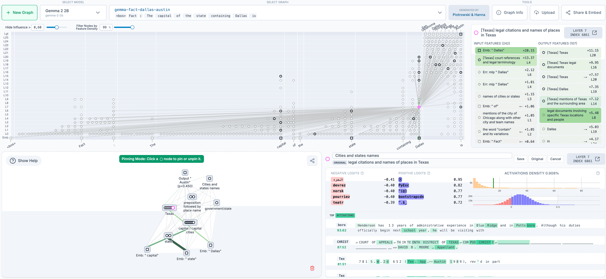

Interpretability

# Open-sourcing circuit tracing tools

May 29, 2025

We tracked 11 observable behaviors across thousands of Claude.ai conversations to build the AI Fluency Index — a baseline for measuring how people collaborate with AI today.

In our recent interpretability research, we introduced a new method to [trace the thoughts](https://www.anthropic.com/research/tracing-thoughts-language-model) of a large language model. Today, we’re open-sourcing the method so that anyone can build on our research.

Our approach is to generate _attribution graphs_, which (partially) reveal the steps a model took internally to decide on a particular output. The open-source [library](https://github.com/safety-research/circuit-tracer) we’re releasing supports the generation of attribution graphs on popular open-weights models—and a frontend hosted by Neuronpedia lets you explore the graphs interactively.

This project was led by participants in our [Anthropic Fellows](https://alignment.anthropic.com/2024/anthropic-fellows-program/) program, in collaboration with [Decode Research](https://www.decoderesearch.org/).

An overview of the interactive graph explorer UI on Neuronpedia.

To get started, you can visit the [Neuronpedia interface](https://www.neuronpedia.org/gemma-2-2b/graph) to generate and view your own attribution graphs for prompts of your choosing. For more sophisticated usage and research, you can view the [code repository](https://github.com/safety-research/circuit-tracer). This release enables researchers to:

1. **Trace circuits** on supported models, by generating their own attribution graphs;
2. **Visualize, annotate, and share** graphs in an interactive frontend;
3. **Test** **hypotheses** by modifying feature values and observing how model outputs change.

We’ve already used these tools to study interesting behaviors like multi-step reasoning and multilingual representations in Gemma-2-2b and Llama-3.2-1b—see our demo [notebook](https://github.com/safety-research/circuit-tracer/blob/main/demos/circuit_tracing_tutorial.ipynb) for examples and analysis. We also invite the community to help us find additional interesting circuits—as inspiration, we provide additional attribution graphs that we haven’t yet analyzed in the demo notebook and on Neuronpedia.

Our CEO Dario Amodei [wrote recently](https://www.darioamodei.com/post/the-urgency-of-interpretability) about the urgency of interpretability research: at present, our understanding of the inner workings of AI lags far behind the progress we’re making in AI capabilities. By open-sourcing these tools, we're hoping to make it easier for the broader community to study what’s going on inside language models. We’re looking forward to seeing applications of these tools to understand model behaviors—as well as extensions that improve the tools themselves.

_The open-source-circuit-finding library was developed by [Anthropic Fellows](https://alignment.anthropic.com/2024/anthropic-fellows-program/) Michael Hanna and Mateusz Piotrowski with mentorship from Emmanuel Ameisen and Jack Lindsey. The Neuronpedia integration was implemented by [Decode Research](https://www.decoderesearch.org/) (Neuronpedia lead: Johnny Lin; Science lead/director: Curt Tigges). Our Gemma graphs are based on transcoders trained as part of the [GemmaScope](https://ai.google.dev/gemma/docs/gemma_scope) project. For questions or feedback, please open an issue on GitHub._