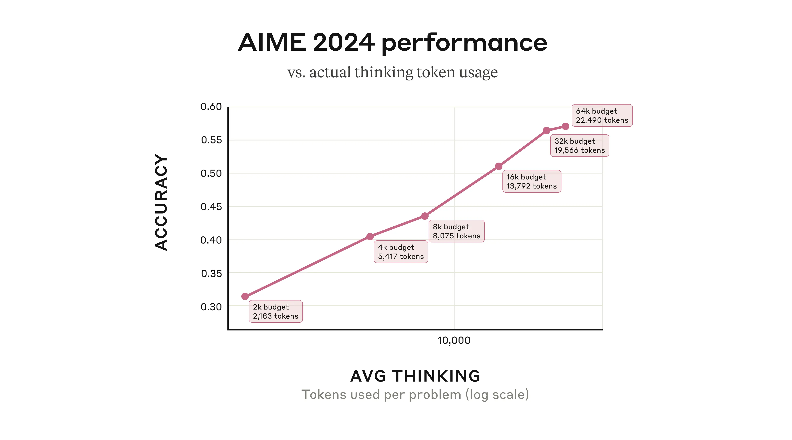

Announcements

# Claude’s extended thinking

Feb 24, 2025

#### Footnotes

1\. Specifically, this is available for [Claude Pro](https://www.anthropic.com/news/claude-pro), [Team](https://www.anthropic.com/team), [Enterprise](https://www.anthropic.com/enterprise), and [API](https://docs.anthropic.com/en/api/getting-started) users.

2\. Our faithfulness research is further described in our [System Card](http://anthropic.com/claude-3-7-sonnet-system-card). We also hope that a full understanding of the reasons for a model’s behavior, at the level of the activations in its neural network, might be achieved through future advances in [mechanistic interpretability](https://www.anthropic.com/research/mapping-mind-language-model).

3\. It’s possible that there’s a middle way between revealing the thought process in its entirety and keeping it entirely hidden. It might be preferable, for example, to train the model to always be truthful when asked about its internal thought process, but not to reveal those thoughts by default (and perhaps be able to refuse certain requests).

4\. This comes with a 0.5% false-positive rate (where the safeguards trigger even though there isn’t a prompt injection attack present). We’re working on reducing this rate as we develop our safety mechanisms.

We tracked 11 observable behaviors across thousands of Claude.ai conversations to build the AI Fluency Index — a baseline for measuring how people collaborate with AI today.

Some things come to us nearly instantly: “what day is it today?” Others take much more mental stamina, like solving a cryptic crossword or debugging a complex piece of code. We can choose to apply more or less cognitive effort depending on the task at hand.

Now, Claude has that same flexibility. With the new [Claude 3.7 Sonnet](https://www.anthropic.com/news/claude-3-7-sonnet), users can toggle “extended thinking mode” on or off, directing the model to think more deeply about trickier questions1. And developers can even set a “thinking budget” to control precisely how long Claude spends on a problem.

Extended thinking mode isn’t an option that switches to a different model with a separate strategy. Instead, it’s allowing the very same model to give itself more time, and expend more effort, in coming to an answer.

Claude's new extended thinking capability gives it an impressive boost in intelligence. But it also raises many important questions for those interested in how AI models work, how to evaluate them, and how to improve their safety. In this post, we share some of the insights we've gained.

## **The visible thought process**

As well as giving Claude the ability to think for longer and thus answer tougher questions, we’ve decided to make its thought process visible in raw form. This has several benefits:

- **Trust.** Being able to observe the way Claude thinks makes it easier to understand and check its answers—and might help users get better outputs.
- **Alignment.** In some of our previous [Alignment Science research](https://www.anthropic.com/research/alignment-faking), we’ve used contradictions between what the model inwardly thinks and what it outwardly says to identify when it might be engaging in concerning behaviors like deception.
- **Interest.** It’s often fascinating to watch Claude think. Some of our researchers with math and physics backgrounds have noted how eerily similar Claude’s thought process is to their own way of reasoning through difficult problems: exploring many different angles and branches of reasoning, and double- and triple-checking answers.

But a visible thought process also has several downsides. First, users might notice that the revealed thinking is more detached and less personal-sounding than Claude’s default outputs. That’s because we didn’t perform our standard [character](https://www.anthropic.com/research/claude-character) training on the model’s thought process. We wanted to give Claude maximum leeway in thinking whatever thoughts were necessary to get to the answer—and as with human thinking, Claude sometimes finds itself thinking some incorrect, misleading, or half-baked thoughts along the way. Many users will find this useful; others might find it (and the less characterful content in the thought process) frustrating.

Another issue is what’s known as “faithfulness”—we don’t know for certain that what’s in the thought process truly represents what’s going on in the model’s mind (for instance, English-language words, such as those displayed in the thought process, might simply not be able to describe why the model displays a particular behavior). The problem of faithfulness—and how to ensure it—is one of our active areas of research. Thus far, our results suggest that models very often make decisions based on factors that they _don’t_ explicitly discuss in their thinking process. This means we can’t rely on monitoring current models’ thinking to make strong arguments about their safety2.

Third, it poses several safety and security concerns. Malicious actors might be able to use the visible thought process to build better strategies to jailbreak Claude. Much more speculatively, it’s also possible that, if models learn during training that their internal thoughts are to be on display, they might be incentivized to think in different, less predictable ways—or to deliberately hide certain thoughts.

These latter concerns will be particularly acute for future, more capable versions of Claude—versions that would pose more of a risk if misaligned. We’ll weigh the pros and cons of revealing the thought process for future releases3. In the meantime, the visible thought process in Claude 3.7 Sonnet should be considered a research preview.

## **New tests of Claude’s thinking**

### **Claude as an agent**

Claude 3.7 Sonnet benefits from what we might call “action scaling”—an improved capability that allows it to iteratively call functions, respond to environmental changes, and continue until an open-ended task is complete. One example of such a task is using a computer: Claude can issue virtual mouse clicks and keyboard presses to solve tasks on a user’s behalf. Compared to its predecessor, Claude 3.7 Sonnet can allocate more turns—and more time and computational power—to computer use tasks, and its results are often better.

We can see this in how Claude 3.7 Sonnet has improved on [OSWorld](https://os-world.github.io/), an evaluation that measures the capabilities of multimodal AI agents. Claude 3.7 Sonnet starts off somewhat better, but the difference in performance grows over time as the model continues to interact with the virtual computer.

The performance of Claude 3.7 Sonnet versus its predecessor model on the OSWorld evaluation, testing multimodal computer use skills. “Pass @ 1”: the model has only a single attempt to solve a particular problem for it to count as having passed.

### **Claude plays Pokémon**

Together, Claude’s extended thinking and agent training help it do better on many standard evaluations like OSWorld. But they also give it a major boost on some other, perhaps more unexpected, tasks.

Playing Pokémon—specifically, the Game Boy classic _Pokémon Red_—is just such a task. We equipped Claude with basic memory, screen pixel input, and function calls to press buttons and navigate around the screen, allowing it to play Pokémon continuously beyond its usual context limits, sustaining gameplay through tens of thousands of interactions.

In the graph below, we’ve plotted the Pokémon progression of Claude 3.7 Sonnet alongside that of previous versions of Claude Sonnet, which didn’t have the option for extended thinking. As you can see, the previous versions became stuck very early in the game, with Claude 3.0 Sonnet failing to even leave the house in Pallet Town where the story begins.

But Claude 3.7 Sonnet’s improved agentic capabilities helped it advance much further, successfully battling three Pokémon Gym Leaders (the game’s bosses) and winning their Badges. Claude 3.7 Sonnet is super effective at trying multiple strategies and questioning previous assumptions, which allow it to improve its own capabilities as it progresses.

Claude 3.7 Sonnet demonstrates that it is the very best of all the Sonnet models so far at playing Pokémon Red. On the x-axis is the number of interactions Claude completes as it plays the game; on the y-axis are important milestones in the game involving collecting certain items, navigating to certain areas, and defeating certain game bosses.

Pokémon is a fun way to appreciate Claude 3.7 Sonnet’s capabilities, but we expect these capabilities to have a real-world impact far beyond playing games. The model's ability to maintain focus and accomplish open-ended goals will help developers build a wide range of state-of-the-art AI agents.

### **Serial and parallel test-time compute scaling**

When Claude 3.7 Sonnet is using its extended thinking capability, it could be described as benefiting from “serial test-time compute”. That is, it uses multiple, sequential reasoning steps before producing its final output, adding more computational resources as it goes. In general, this improves its performance in a predictable way: its accuracy on, for example, math questions improves logarithmically with the number of “thinking tokens” that it’s allowed to sample.

Claude 3.7 Sonnet’s performance on questions from the 2024 American Invitational Mathematics Examination 2024, according to how many thinking tokens it’s allowed per problem. Note that even though we allow Claude to use the entire thinking budget, it generally stops short. We include in the plot the tokens sampled that are used to summarize the final answer.

Our researchers have also been experimenting with improving the model’s performance using _parallel_ test-time compute. They do this by sampling multiple independent thought processes and selecting the best one without knowing the true answer ahead of time. One way to do this is with [majority](https://arxiv.org/abs/2206.14858) or consensus voting; selecting the answer that appears most commonly as the 'best' one. Another is using another language model (like a second copy of Claude) asked to check its work or a learned scoring function and pick what it thinks is best. Strategies like this (along with similar work) have been reported in the evaluation [results](https://developers.googleblog.com/en/the-next-chapter-of-the-gemini-era-for-developers/) of [several](https://arxiv.org/abs/2502.06807) [other](https://arxiv.org/abs/2403.05530) [AI](https://x.ai/blog/grok-3) [models](https://openai.com/index/openai-o3-mini/)).

We achieved striking improvements using parallel test-time compute scaling on the [GPQA evaluation](https://arxiv.org/abs/2311.12022), a commonly-used set of challenging questions on biology, chemistry, and physics. Using the equivalent compute of 256 independent samples, a learned scoring model, and a maximum 64k-token thinking budget, Claude 3.7 Sonnet achieved a GPQA score of 84.8% (including a physics subscore of 96.5%), and benefits from continued scaling beyond the limits of majority vote. We report our results for both our scoring model methods and the majority vote method below.

Experimental results from using parallel test-time compute scaling to improve Claude 3.7 Sonnet’s performance on the GPQA evaluation. The different lines refer to different methods of scoring the performance. “Majority @ N”: where multiple outputs are generated from a model for the same prompt with the majority vote taken as the final answer; “scoring model”: a separate model which is used to assess the performance of the model being evaluated; “pass @ N”: where models “pass” a test if any of a given number of attempts succeeds.

Methods like these allow us to improve the quality of Claude’s answers, usually without having to wait for it to finish its thoughts. Claude can have multiple different extended thought processes simultaneously, allowing it to consider more approaches to a problem and ultimately get it right much more often. Parallel test-time compute scaling isn’t available in our newly-deployed model, but we're continuing to research these methods for the future.

## **Claude 3.7 Sonnet’s safety mechanisms**

**AI Safety Level.** Anthropic’s [Responsible Scaling Policy](https://www.anthropic.com/news/announcing-our-updated-responsible-scaling-policy) commits us not to train or deploy models unless we have implemented appropriate safety and security measures. Our Frontier Red Team and Alignment Stress Testing team ran extensive tests on Claude 3.7 Sonnet to determine whether it required the same level of deployment and security safeguards as our previous models—known as the AI Safety Level (ASL) 2 standard—or stronger measures.

Our comprehensive evaluation of Claude 3.7 Sonnet confirmed that our current ASL-2 safety standard remains appropriate. At the same time, the model demonstrated increased sophistication and heightened capabilities across all domains. In controlled studies examining tasks related to the production of Chemical, Biological, Radiological, and Nuclear (CBRN) weapons, we observed some performance “uplift” among model-assisted participants compared to non-assisted participants. That is, participants were able to get further towards success than they would have just by using information that’s available online. However, all of the attempts to perform these tasks contained critical failures, completely impeding success.

Expert red-teaming of the model produced mixed feedback. Whereas some experts noted improvements in the model’s knowledge in certain areas of CBRN processes, they also found that the frequency of critical failures was too high for successful end-to-end task completion. We are proactively enhancing our ASL-2 measures by accelerating the development and deployment of targeted classifiers and monitoring systems.

In addition, the capabilities of our future models might require us to move to the next stage: ASL-3 safeguards. Our recent work on [Constitutional Classifiers](https://www.anthropic.com/research/constitutional-classifiers) to prevent jailbreaks, along with other efforts, stands us in good stead to implement the requirements of the ASL-3 standard in the near future.

**Visible thought process.** Even at ASL-2, Claude 3.7 Sonnet’s visible extended thinking feature is new, and thus requires new and appropriate safeguards. In rare cases, Claude’s thought process might include content that is potentially harmful (topics include child safety, cyber attacks, and dangerous weapons). In such cases, we will encrypt the thought process: this will not stop Claude from including the content in its thought process (which could still be important for the eventual production of perfectly benign responses), but the relevant part of the thought process will not be visible to users. Instead, they will see the message “the rest of the thought process is not available for this response”. We aim for this encryption to occur rarely, and only in cases where the potential for harm is high.

**Computer use.** Finally, we have enhanced our safety measures for Claude’s computer use ability (which we discussed above: it allows Claude to see a user’s computer screen and take actions on their behalf). We have made substantial progress in defending against “prompt injection” attacks, where a malicious third party hides a secret message somewhere where Claude may see it while using the computer, potentially tricking it into taking actions the user didn’t intend. With new training to resist prompt injection, a new system prompt that includes instructions to ignore these attacks, and a classifier that triggers when the model encounters a potential prompt injection, we now prevent these attacks 88% of the time4, up from 74% of the time without the mitigations.

The above is just a short summary of some of our extensive safety work on Claude 3.7 Sonnet. For more information, analytic results, and several examples of the safeguards in action, see our full [System Card](http://anthropic.com/claude-3-7-sonnet-system-card).

## **Using Claude**

You can use Claude 3.7 Sonnet now at [Claude.ai](http://claude.ai/redirect/website.v1.39b61e2c-3b3f-4461-af29-57f3feda34a4) or on [our API](https://docs.anthropic.com/en/api/getting-started). And just as Claude can now let you know what it thinks, we hope you’ll let us know what you think, too. Please send your feedback about the new model to [feedback@anthropic.com](mailto:feedback@anthropic.com).