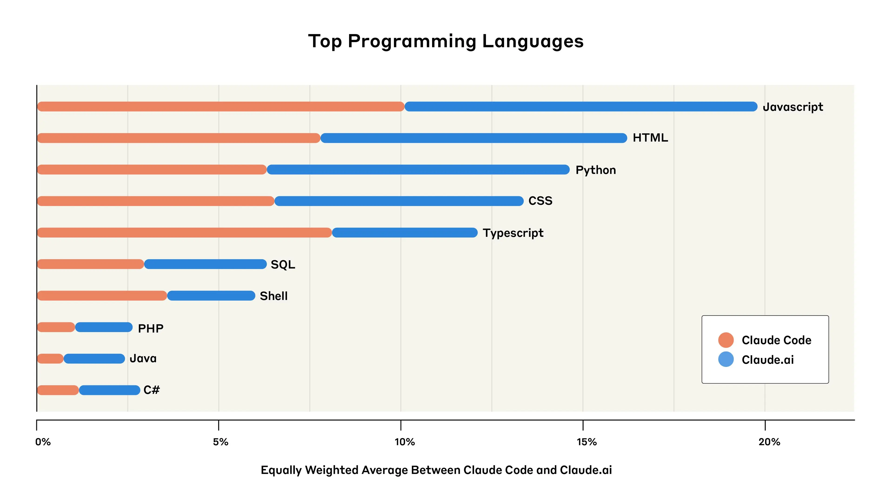
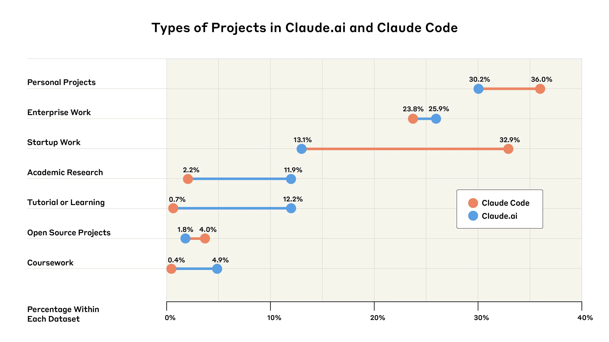

Societal ImpactsEconomic Research

# Anthropic Economic Index: AI’s impact on software development

Apr 28, 2025

#### Footnotes

1\. Claude.ai conversations were specifically those from Claude.ai Free and Pro. This sample only includes Claude Code sessions powered by the first-party API (Claude Code can be powered by Anthropic first-party APIs or third party cloud provider APIs). All conversations used in our analysis across Claude.ai and Claude Code were from April 6-13, 2025. The initial sample was split evenly across Claude.ai and Claude Code and for Claude.ai, we applied a Claude-based filter to select conversations related to coding. To account for the filter, we renormalized analyses to equally weight Claude Code and Claude.ai interactions, where applicable.

2\. The HTML numbers for Claude.ai are likely inflated slightly because [Artifacts](https://support.anthropic.com/en/articles/9487310-what-are-artifacts-and-how-do-i-use-them) leverage HTML. While we filter out Artifacts that are unrelated to coding, we don’t explicitly filter out Artifacts that contain coding-related content from the analysis because significant coding usage happens within Artifacts.

3\. Claude.ai usage does not include Claude For Work (Team and Enterprise plans) usage, which implies that enterprise numbers for Claude.ai specifically are likely undercounted because a significant amount of enterprise usage on Claude.ai occurs within the Claude For Work product.

We tracked 11 observable behaviors across thousands of Claude.ai conversations to build the AI Fluency Index — a baseline for measuring how people collaborate with AI today.

Jobs that involve computer programming are a small sector of the modern economy, but an influential one. The past couple of years have seen them changed dramatically by the introduction of AI systems that can assist with—and automate—significant amounts of coding work.

In our [previous Economic Index research](https://www.anthropic.com/news/the-anthropic-economic-index), we found very disproportionate use of Claude by US workers in computer-related occupations: that is, there were many more conversations with Claude about computer-related tasks than one would predict from the number of people working in relevant jobs. It’s the same in [the educational context](https://www.anthropic.com/news/anthropic-education-report-how-university-students-use-claude): Computer Science degrees—which involve large amounts of coding—show highly disproportionate AI use.

To understand these changes in more detail, we conducted an analysis of 500,000 coding-related interactions across [Claude.ai](http://claude.ai/redirect/website.v1.6828d5f8-ef33-49d1-b013-3e07a5ed2835) (the “default” way that most people interact with Claude) and [Claude Code](https://docs.anthropic.com/en/docs/agents-and-tools/claude-code/overview) (our new specialist coding “agent” that can independently accomplish chains of complex tasks using a variety of digital tools).

We found three key patterns:

1. **The coding agent is used for more automation.** 79% of conversations on Claude Code were identified as “automation”—where AI directly performs tasks—rather than “augmentation,” where AI collaborates with and enhances human capabilities (21%). In contrast, only 49% of Claude.ai conversations were classified as automation. _This might imply that as AI agents become more commonplace, and as more agentic AI products are built, we should expect more automation of tasks._
2. **Coders commonly use AI to build user-facing apps.** Web-development languages such as JavaScript and HTML were the most common programming languages used in our dataset, and user interface and user experience tasks were among the top coding uses. _This suggests that jobs that center on making simple applications and user interfaces may face disruption from AI systems sooner than those focused purely on backend work_.
3. **Startups are the main early adopters of Claude Code, while enterprises lag behind.** In a preliminary analysis, we estimated that 33% of conversations on Claude Code served startup-related work, compared to only 13% identified as enterprise-relevant applications. _The adoption gap suggests a divide between nimbler organizations using cutting-edge AI tools, and traditional enterprises._

### How we analyzed conversations on Claude Code and Claude.ai

We analyzed the 500,000 total Claude interactions (split between Claude Code and Claude.ai1) using our [privacy-preserving analysis tool](https://www.anthropic.com/research/clio), which distills user conversations into higher-level, anonymized insights. Here, we used it to identify the topic of the conversation (e.g. “UI/UX component development”), or—as we’ll explain below—to categorize a conversation as focusing on “augmentation” versus “automation”.

### How do developers interact with Claude?

In our previous Economic Index reports, we separated out “automation,” where AI directly performs tasks, from “augmentation,” where AI collaborates with a user to perform a task. Here, we found that Claude Code showed dramatically higher automation rates—79% of conversations involved some form of automation, compared to 49% on Claude.ai.

We also split automation and augmentation into several subtypes (as discussed in our [previous work](https://www.anthropic.com/news/the-anthropic-economic-index)). “Feedback Loop” patterns, where Claude completes tasks autonomously but with help of human validation (for example, where the user sends any errors back to Claude), were nearly twice as common on Claude Code (35.8% of interactions) as Claude.ai (21.3%). “Directive” conversations, where Claude completed a task with minimal user interaction, were also higher on Claude Code (43.8%, versus 27.5% on Claude.ai). All the patterns of augmentation—including “Learning,” where the user acquires knowledge from the AI model—were substantially lower on Claude Code than on Claude.ai.

Subtypes are defined as follows. Directive: Complete task delegation with minimal interaction; Feedback Loop: Task completion guided by environmental feedback; Task Iteration: Collaborative refinement process; Learning: Knowledge acquisition and understanding; Validation: Work verification and improvement.

These results illustrate the differences between specialist, coding-focused agents (in this case, Claude Code) and the more “standard” way that users interact with large language models (i.e., through a chatbot interface like Claude.ai). As more agentic products are released, we might see differences in the way AI is integrated into people’s jobs. At least in the case of coding, this might involve more automation of tasks.

This raises questions about the extent to which developers will still be involved as AI use becomes more common. Importantly, our results do show that even within automation, humans are still very often involved: “Feedback Loop” interactions still require user input (even if that input is simply pasting error messages back to Claude). But it’s by no means certain that this pattern will persist into the future, when more capable agentic systems will likely require progressively less user input.

### What are developers building with Claude?

Overall, we found that developers commonly use Claude for building user interfaces and interactive elements for websites and mobile applications. Although no single language dominated, the primarily web-focused development languages of JavaScript and TypeScript together accounted for 31% of all queries, and HTML2 and CSS (other languages for user-facing code) together added another 28%.

Percentages represent total percentages of coding-related tasks across both platforms. Because Claude Code and Claude.ai are equally weighted, the portions of the bars that correspond to each of the platforms represent half of that platform's usage.

Back-end development languages (used for behind-the-scenes logic, databases, and infrastructure, as well as API and AI development) were also represented: notably, Python was at 14% of queries. However, Python serves dual purposes—both for back-end development and data analysis. Combined with SQL (another data-focused language, making up 6% of queries), these languages likely included many data science and analytics applications beyond traditional back-end development.

Percentages of coding language uses represent total percentages across both platforms. Because Claude Code and Claude.ai are equally weighted, the portions of the bars that correspond to each of the platforms represent half of that platform's usage.

These patterns further extend to the types of common coding tasks involving Claude. Two of the top five tasks were focused on user-facing app development: “UI/UX Component Development” and “Web & Mobile App Development” each accounted for 12% and 8% of conversations, respectively. Such tasks increasingly lend themselves to a phenomenon known as “vibe coding”—where developers of varying levels of experience describe their desired outcomes in natural language and let AI take the wheel on implementation details.

Conversations that related to more generic uses, such as “Software Architecture & Code Design” and “Debug and Performance Optimization” were also highly represented in both Claude.ai and Claude Code.

Speculatively, these findings suggest that jobs that center on making simple applications and user interfaces might face earlier disruption from AI systems if increasing capabilities cause “vibe coding” to shift more into mainstream workflows. As AI increasingly handles component creation and styling tasks, these developers might shift toward higher-level design and user experience work.

### Who is using Claude for coding?

We also analyzed which groups of developers might be using Claude. We used our analysis system to identify the type of project (e.g. a personal project vs. a project done for a startup) that best described users’ coding-related interactions. Because we don’t know the real-world context in which Claude’s responses were being used, these analyses rely on uncertain inferences from incomplete data. We therefore treat these findings as more preliminary than the ones described above.

The distance between the dots indicates the gap in the prevalence of each type of project on Claude.ai (blue) and Claude Code (orange).

Startups appear to be the primary early adopters of Claude Code, and enterprise adoption lags behind. Startup work accounted for 32.9% of Claude Code conversations (nearly 20% higher than their Claude.ai usage), whereas enterprise work represented only 23.8% of Claude Code conversations (slightly below their 25.9% share on Claude.ai3).

In addition, uses involving students, academics, personal project builders, and tutorial/learning users collectively represent half of the interactions across both platforms. In other words, individuals—not just businesses—are significant adopters of coding assistance tools.

These adoption patterns mirror past technology shifts, where startups use new tools for competitive advantage while established organizations move more cautiously and often have detailed security checks in place before adopting new tools company-wide. AI's general-purpose nature could accelerate this dynamic: If AI agents provide significant productivity gains, the gap between early and late adopters could translate into substantial competitive advantages.

### Limitations

Our analysis is grounded in real-world AI use—how developers are actually using Claude in their workflows. Although this approach gives our findings practical relevance, it also brings inherent limitations. These include:

- We analyzed data from Claude.ai and Claude Code only. We excluded Team, Enterprise, and API usage that might show different patterns, particularly in professional settings;
- The boundary between automation and augmentation becomes increasingly blurred with agentic tools like Claude Code. For example, the “Feedback Loop” pattern differs qualitatively from traditional automation, because it still requires user supervision and input. We will likely need to extend the automation/augmentation framework to account for new agentic capabilities;
- Our categorization of who is using Claude for coding relied on inference from limited context. When categorizing conversations as “startup” versus “enterprise” work, or “personal” versus “academic” projects, our analysis tool made educated guesses based on incomplete information. Some classifications might therefore be incorrect. Additionally, we included an option for ‘Could Not Classify’, which Claude opted for in 5% of Claude.ai conversations and 2% of Claude Code conversations. We excluded this category from analysis and renormalized the results;
- Our dataset likely captures early adopters. These users might not represent the broader developer population, and this self-selection could skew usage patterns towards more experienced or technically adventurous users;
- Due to privacy considerations, we only analyzed data within a specific retention window, potentially missing cyclical patterns in software development (such as sprint cycles or release schedules);
- The representativeness of Claude usage is unclear, relative to overall AI coding assistance adoption. Many developers use multiple AI tools beyond Claude, meaning we present only a partial view of their AI engagement patterns;
- We only studied what developers delegate to AI—not how they ultimately use AI outputs in their codebase, the quality of the resulting code, or whether these interactions effectively improved productivity or code quality.

### Looking ahead

AI is fundamentally changing the ways developers work. Our analysis implies that this is particularly true where specialist agentic systems like Claude Code are used, is particularly strong for user-facing app development work, and might be giving particular advantages to startups as opposed to more established business enterprises.

Our findings raise many questions. Will the prevalence of “feedback loops,” where humans are still involved in the process, persist as AI capabilities advance, or will we see a shift toward more complete automation? As AI systems become capable of building larger-scale pieces of software, will developers shift to mostly managing and guiding these systems, rather than writing code themselves? Which software development roles will change the most, and which might disappear entirely?

The increasing coding skills of AI might also be especially consequential for AI development itself. Since so much of AI research and development relies on software, it’s possible that advancements in AI-assisted coding help to speed up breakthroughs, creating a positively-reinforcing cycle that accelerates AI progress even further.

In the grand scheme of things, AI systems are extremely new. But in a relative sense, coding is among the most developed uses of AI in the economy. That makes it worth watching. Although we can’t assume that the lessons we draw from software development will directly carry over to other types of occupation, software development might be a leading indicator that gives us useful information about how other occupations might change with the rollout of increasingly capable AI models in the future.

### Work With Us

If you’re interested in working at Anthropic to research the effects of AI on the labor market, we encourage you to apply for our [Economist](https://job-boards.greenhouse.io/anthropic/jobs/4555010008) and [Data Scientist (Policy)](https://job-boards.greenhouse.io/anthropic/jobs/4502440008) roles.

## Appendix

As a supplementary analysis, we also compared our results for software-related automation and augmentation patterns to patterns in interactions that did not involve software. We conducted this analysis exclusively in Claude.ai, because Claude Code specializes in software applications.

Breakdown of automation and augmentation by software versus non-software use cases in Claude.ai. For a description of each pattern, see the caption to the first figure above.

Compared to use cases that don’t involve software, software development is more automative. A significant increase in Feedback Loops (+18.3%) drives this and, notably, offsets a clear _decrease_ in Directive behaviors (-11.2%). In other words, AI-assisted coding currently requires a lot of human reviewing and iteration relative to non-coding tasks, even when Claude does the bulk of the work.