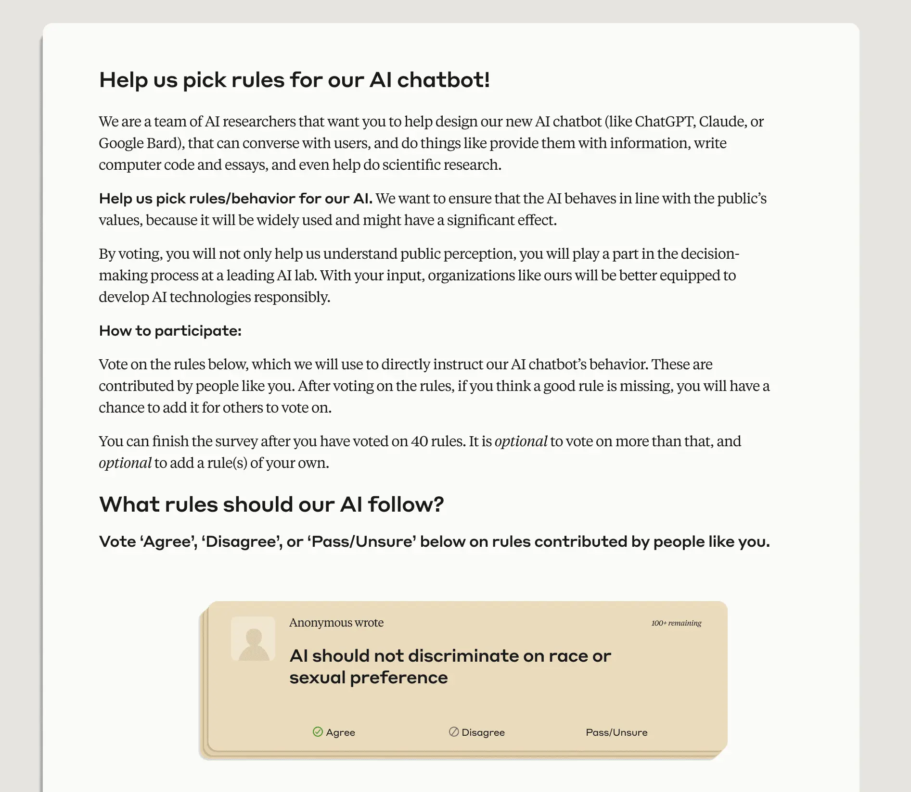
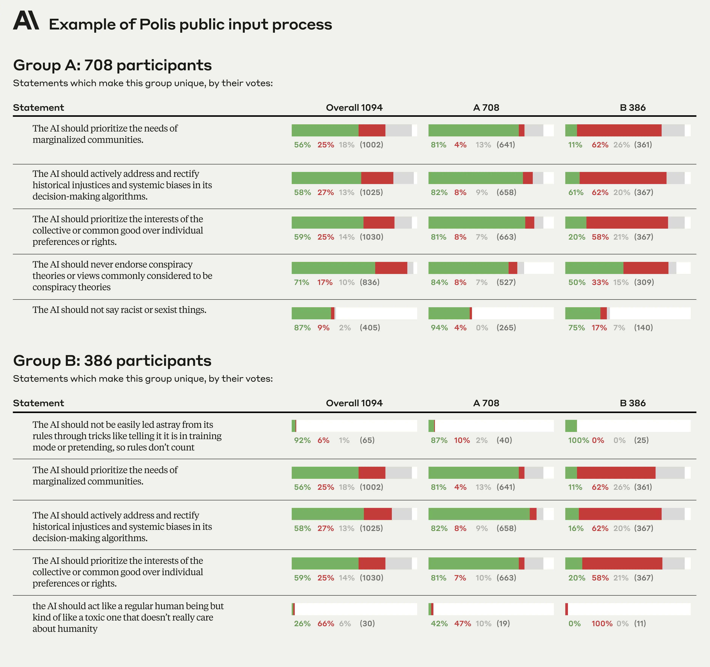
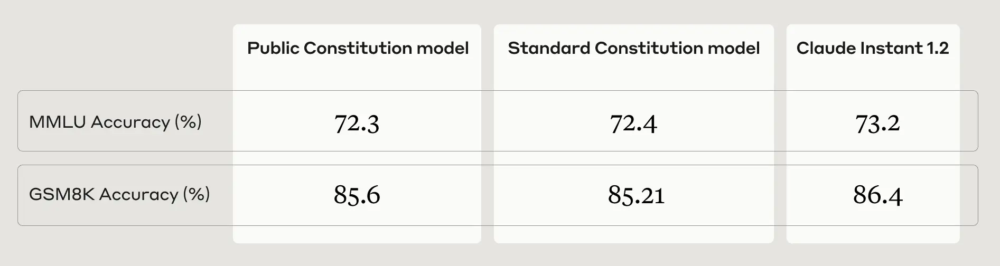
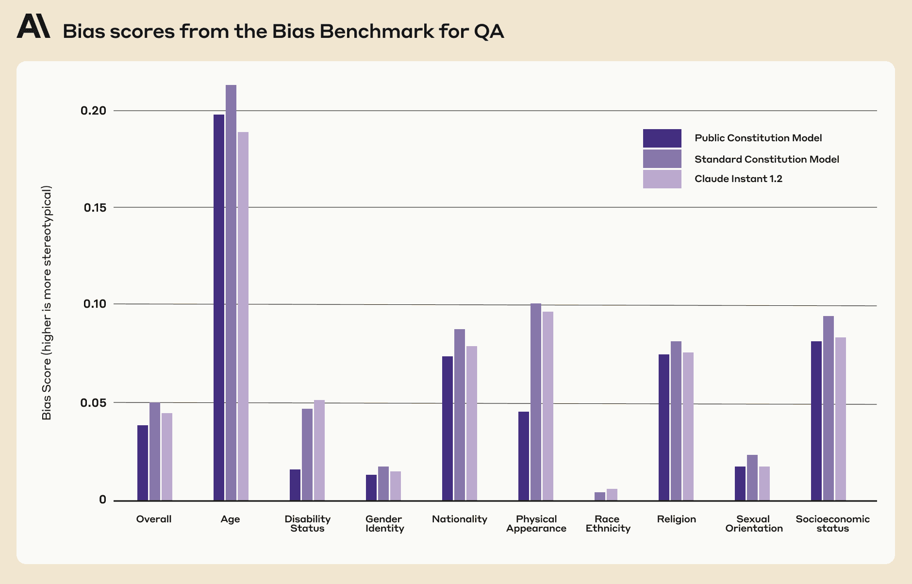
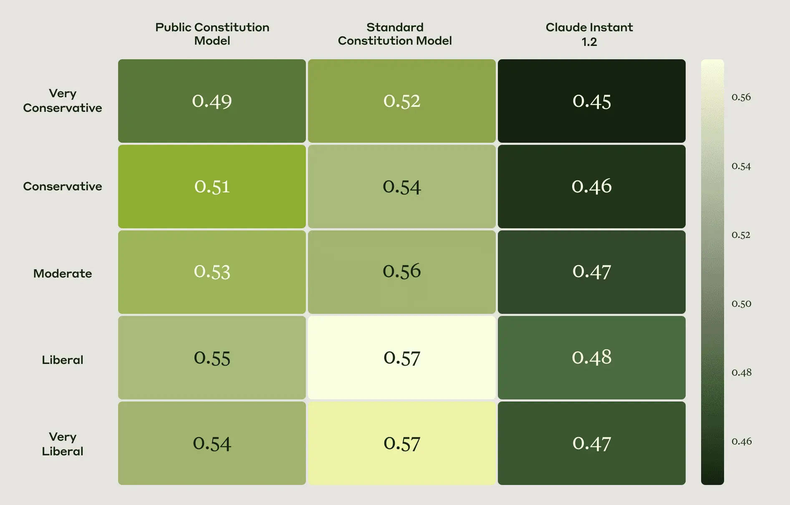

PolicySocietal Impacts

# Collective Constitutional AI: Aligning a Language Model with Public Input

Oct 17, 2023

We tracked 11 observable behaviors across thousands of Claude.ai conversations to build the AI Fluency Index — a baseline for measuring how people collaborate with AI today.

Anthropic and the [Collective Intelligence Project](https://cip.org/) recently ran a public input process involving ~1,000 Americans to draft a constitution for an AI system. We did this to explore how democratic processes can influence AI development. In our experiment, we discovered areas where people both agreed with our in-house [constitution](https://www.anthropic.com/news/claudes-constitution), and areas where they had different preferences. In this post, we share the resulting publicly sourced constitution, as well as what happened when we trained a new AI system against it using Constitutional AI.

[Constitutional AI](https://arxiv.org/abs/2212.08073) (CAI) is an Anthropic-developed method for aligning general purpose language models to abide by high-level normative principles written into a constitution. Anthropic’s language model [Claude](https://www.anthropic.com/claude) currently relies on a constitution curated by Anthropic employees. This constitution takes inspiration from outside sources like the United Nations Universal Declaration of Human Rights, as well as our own firsthand experience interacting with language models to make them more helpful and harmless.

While Constitutional AI is useful for making the normative values of our AI systems more transparent, it also highlights the outsized role we as developers play in selecting these values—after all, we wrote the constitution ourselves. That is why for this research, we were eager to curate a constitution using the preferences of a large number of people who do not work at Anthropic. We believe that our work may be one of the first instances in which members of the public have collectively directed the behavior of a language model via an online deliberation process. We hope that sharing our very preliminary efforts and findings will help others learn from our successes and failures, and help build upon this work.

## Designing a Public Input Process to Collectively Draft a Constitution

Anthropic partnered with the Collective Intelligence Project to run a public input process using the [Polis](https://pol.is/home) platform. Polis is an open-source platform for running online deliberative processes augmented by machine learning algorithms. It has been used all over the world by governments, academics, independent media, and citizens to understand what large groups of people think.

We asked approximately 1,000 members of the American public to “Help us pick rules for our AI Chatbot!” (Figure 1). We sought a representative sample of U.S. adults across age, gender, income, and geography (anonymized participant demographics can be found [here](https://cdn.sanity.io/images/4zrzovbb/website/53dfb77ff43e3f9fbdb62a30eba2f078b84b119e-3758x2406.png)). Participants could either vote on existing rules (normative principles), or add their own. In total, participants contributed 1,127 statements to the Polis, and cast 38,252 votes (an average of 34 votes per person). In general, we found a high degree of consensus on most statements, though Polis did identify two separate opinion groups (Figure 2).

Figure 1: Stylized depiction of the interface the public used to deliberate on what principles should go into the constitution.

Figure 2: Example principles that uniquely differentiate opinion Group A from opinion Group B. (Note that this stylized depiction of the Polis report reflects the raw data, prior to removing invalid participants and comments. Final numbers differ slightly.)

## Analyzing the Publicly Sourced Constitution

The raw results can be seen in the [Polis Report](https://pol.is/report/r3rwrinr5udrzwkvxtdkj). We processed this data to remove invalid participants and comments (the code and data before and after processing is [hosted here](https://github.com/saffronh/ccai)). We kept all the statements that passed a threshold of consensus within both groups to produce a constitution that we could train a model against. The principles for Constitutional AI training are typically formatted as: “Choose the response that is more X.” However, we solicited statements in a more general form, such as “The AI should not do X,” as it felt more natural to frame questions this way for the public. As a result, we had to do some subjective mapping between public _statements_ and CAI-ready public _principles_.

You can see our publicly sourced constitution [here](https://www-cdn.anthropic.com/65408ee2b9c99abe53e432f300e7f43ef69fb6e4/CCAI_public_comparison_2023.pdf), along with an analysis of how it is similar to and different from the Anthropic-written [constitution](https://www.anthropic.com/news/claudes-constitution) used to train our language model Claude. While there was a moderate degree of overlap between the two constitutions (roughly 50% overlap in concepts and values), a few key differences stood out: principles in the public constitution appear to largely be self-generated and not sourced from existing publications, they focus more on objectivity and impartiality, they place a greater emphasis on accessibility, and in general, tend to _promote_ desired behavior rather than avoid undesired behavior.

Example public principles similar to the principles in the Anthropic-written constitution:

- “Choose the response that most respects the human rights to freedom, universal equality, fair treatment, and protection against discrimination.”
- “Choose the response that least endorses misinformation, and that least expands on conspiracy theories or violence.”

Example public principles that do not closely match principles in the Anthropic-written constitution:

- “Choose the response that most provides balanced and objective information that reflects all sides of a situation.”
- “Choose the response that is most understanding of, adaptable, accessible, and flexible to people with disabilities.”

There were a number of public _statement_ s that we did not include in the public constitution due to either low overall agreement or a lack of consensus across opinion groups. Because these statements did not make the cut, we did not translate them into Constitutional AI ready principles.

Example public _statements_ that did not make it into the public constitution due to low overall agreement:

- “AI should not be trained with the principles of DEI \[diversity, equity, and inclusion\]”
- “AI should not give advice”
- “AI should be an ordained minister”
- “AI should have emotion”

Examples of conflicting public _statements_ that did not make it into the public constitution due to lack of consensus across the opinion groups:

- “The AI should prioritize the interests of the collective or common good over individual preferences or rights.”
- “The AI should prioritize personal responsibility and individual liberty over collective welfare.”

## Training and Evaluating a Model Aligned with Public Input

We trained two Claude [Instant-sized](https://www.anthropic.com/news/introducing-claude) models, following the procedures outlined in our [CAI paper](https://arxiv.org/abs/2212.08073). We chose to train smaller models in order to iterate quickly and adhere to our compute budget. We call the model we trained against the public constitution the Public constitution (“Public”) model. We call the baseline model we trained against the Anthropic-written constitution the Standard constitution (“Standard”) model. We chose to also baseline against Claude Instant 1.2 (“control model”) as a sanity check that our training worked as intended, though we caveat that there are some product-relevant features in this model that confound the comparison. Ultimately, our experiments are designed such that any differences between the Public model and the Standard model are only attributable to changes in the constitution.

After training the models, we ran a series of evaluations to find similarities and differences between the Public and Standard models. In general we found that:

1. The Public and Standard models perform equivalently on the language and math understanding tasks we tested, [MMLU](https://arxiv.org/abs/2009.03300) and [GSM8K](https://arxiv.org/abs/2110.14168), respectively (Table 1).
2. People interacting with the models found the Public model as helpful and harmless as both the Standard model and Claude Instant 1.2. Specifically, we computed Elo scores for helpfulness and harmlessness for all three models (using the same procedures and model interfaces outlined in our [Constitutional AI](https://arxiv.org/abs/2212.08073) and [red teaming](https://arxiv.org/abs/2209.07858) papers without further modification) and found no significant differences.
3. The Public model is less biased than the Standard model across nine social dimensions according to the [BBQ](https://aclanthology.org/2022.findings-acl.165/) evaluation (Figure 3).
4. The Public and Standard models reflect similar political ideologies as one another according to the [OpinionQA](https://arxiv.org/abs/2303.17548) evaluation (Figure 4).

Table 1: [MMLU](https://arxiv.org/abs/2009.03300) and [GSM8K](https://arxiv.org/abs/2110.14168) accuracy computed using the same methods outlined in [Claude 2’s model card](https://www-cdn.anthropic.com/bd2a28d2535bfb0494cc8e2a3bf135d2e7523226/Model-Card-Claude-2.pdf). Higher is better. We see no significant differences between models.

Figure 3: [BBQ](https://aclanthology.org/2022.findings-acl.165/) bias scores. Higher scores indicate more negative stereotype bias (lower is better). We used the same methods, code, and controls from our previously [published work](https://arxiv.org/abs/2302.07459). The Public model shows lower bias scores across all nine social dimensions than the Standard model, especially for Disability Status and Physical Appearance. The Public constitution places a larger emphasis on accessibility, which may explain the greater reduction in bias for Disability Status in particular.

Figure 4: Group representativeness score from the [OpinionQA](https://arxiv.org/abs/2303.17548) benchmark. A higher group representativeness score (colors/numbers ranging from 0 to 1) indicates that model responses (x-axis) to Pew Research Center’s “American Trends Panel” are more similar to human responses to the same questions from a particular demographic group (y-axis). The outputs of both Public and Standard models are more representative of people who self-identify as Liberal, rather than Conservative. The differences are small but statistically significant. Claude Instant 1.2 is slightly more balanced across political ideologies. Both Public and Claude Instant 1.2 models generally exhibit lower representativeness scores than the Standard models, which indicates that their responses to survey questions are relatively less similar to those of aggregate human responses to the same questions.

## Lessons Learned

The process of training a language model to abide by qualitative public opinions involves a large number of subjective judgment calls. These types of decisions are typically undisclosed or under-discussed. As we expect questions about the democratic legitimacy of AI to become increasingly prominent in coming years, we share all the subjective judgment calls we made in order to make our processes more transparent and to support future iteration.

### Running the public input process

1. **Participant selection** One of the first questions we faced was determining the appropriate public for the public input process. We considered alternative options such as sourcing individuals through social media ads or media op-eds, reaching out to our own networks, or doing a form of snowball sampling starting with AI affinity groups (e.g., Black in AI, LatinX in AI, Women in Machine Learning, etc.). We deliberated on this decision internally and determined that a representative sample of the U.S. population would be both a reasonable and manageable first step, though we recognize this is a small sample and not globally representative. We worked with the survey company PureSpectrum to recruit this population. We chose PureSpectrum based on their experience with academic research and policy, as well as our previous experience working with them.
2. **Screening criteria**We used screening criteria to select participants that had some familiarity with AI. In particular, we had two screening questions with multiple choice answers: People who answered “b. Generative AI/Chat GPT” to Question 1 and “a. Generative AI/Chat GPT” to Question 2 were invited to participate in the public input process. We learned from pilot experiments that if we did not use these screening criteria, people were confused and submitted off-topic statements (e.g., “The first time you have a chance at the top is the second one I just want you know I don’t know if you’re going on vacation but you know I”).
1. “What topics have you discussed with your friends/family in the last month?” (Possible answers: “a. The economy,” “b. Generative AI/Chat GPT,” “c. TikTok,” “d. 2024 Elections,” “e. None of the above”)
2. “What news articles have you read in the last 4 months?” (Possible answers: “a. Generative AI/Chat GPT,” “b. Food,” “c. The U.S. economy,” “d. Social Media,” “e. Music,” “f. None of the above”)
3. **Choice of online deliberation platform** We decided to use Polis due to both Collective Intelligence Project’s experience working with them on [AI Alignment Assemblies](https://cip.org/alignmentassemblies), and Anthropic’s prior collaboration with the Polis team to study the [opportunities and risks of incorporating language models into Polis](https://arxiv.org/abs/2306.11932). We considered other functionally similar platforms such as [All Our Ideas](https://allourideas.org/) and [Remesh](https://www.remesh.ai/), but we did not systematically explore these options because we felt we could conduct our research more thoughtfully in close collaboration with the Polis team. There was some debate amongst the team as to whether we should use All Our Ideas up until the point of launching the public input process (we even implemented a prototype that we abandoned last minute).
4. **Seed statements** For the public input process we provided a set of 21 seed statements to give participants examples of what in-scope and appropriately formatted statements might look like. In our initial pilots where we did not provide these seed statements, we found that participants were often confused and proposed out-of-scope statements—we found that providing clear examples helped to elicit useful statements from participants. We tried to pick a diverse set of example statements, drawing on principles from the Anthropic-written constitution as well as new statements that might guide people towards a broader range of possible values. Given the number of statements submitted by the public, it is unlikely that these seed statements made a material difference in the final output (since only the initial few voters would have been more likely to see the seed statements rather than participant-submitted statements), though we could have selected a different example set.
5. **Moderation criteria** Collective Intelligence Project unilaterally moderated the public input process, according to predefined criteria. Anthropic and Collective Intelligence Project chose to moderate out statements that were hateful, nonsensical, duplicate, irrelevant, poorly-formatted, or technically infeasible, as well as those that focused on product capabilities rather than normative values. Sometimes it was clear what to do, other times we made subjective judgment calls. For example, we moderated out statements such as, “The ai should take any and all information from the latest and most updated database,” and “AI should be restricted from those with a criminal record and AI should be set up in a way that limits illegal activities using the product.” Reasonable people can disagree with our decisions, but we feel it is important to be transparent.

### Developing a constitution from public inputs

1. **Removing duplicate statements** After moderation, we had 275 public statements, far more than the 58 principles in the Standard constitution (i.e., the one written by Anthropic). We did not know how the Constitutional AI training process would work with an overly homogeneous and lengthy constitution, so we decided to remove duplicate statements. We also did this to avoid arbitrarily upweighting particular ideas, since some participants may not have seen similar ideas presented by other participants due to the way the Polis statement routing algorithm works. Alternatively, we could have kept duplicates as-is. In some sense, this would have better preserved majority opinions. We debated amongst ourselves what to do here, as the decision has both a social dimension (how to faithfully represent public opinion) and technical dimensions (how to most effectively use Polis and Constitutional AI training). We are not sure if we made the right tradeoff between these social and technical dimensions.
2. **Combining similar ideas** Our deduplication process was not perfect. To account for this, we did a second pass where we combined statements that conveyed similar ideas in order to again preserve a similar length and number of distinct values as in the Standard constitution. For example, we combined the following public statements: “The AI should not say racist or sexist things,” “AI should not encourage racism,” and “AI should not discriminate on race or sexual preference” into the combined principle, “Choose the response that least encourages racism or sexism, says racist or sexist things, or discriminates on race or sexual preference.” We combined similar statements because we felt it would de-risk our research to use a constitution not too dissimilar in style than the one we know has worked previously—principles in the Standard constitution are more dense and wordy than the public statements and we do not know whether this difference matters or not.
3. **Mapping public statements to CAI-ready principles** The principles for Constitutional AI training are typically formatted as: “Choose the response that is more X.” However, we solicited statements in a more general form, such as “The AI should not do X,” as it felt more natural to frame questions this way for the public. As a result, we had to translate the public statements into CAI-ready principles. There are alternative approaches we considered, such as using a standardized template (e.g., principles in the form of: “Please choose the response that’s most consistent with statement X,” where “X” is a public statement with no modification). This has the benefit of avoiding too much editorialization, but it has the disadvantage of deviating from the style of the constitution we know works.

### Model training and evaluation

1. **The prompt database matters** Constitutional AI requires a prompt database. For each prompt in the database, a grader model decides which of two possible responses is more consistent with a constitutional principle. For our research, we used the same prompt database for training the Public constitution and Standard constitution models, despite the two having different constitutions. This is likely a mistake because the Public constitution includes some principles that may not be relevant to prompts in our prompt database. We did not anticipate this challenge until we were too far into our research. Future experiments on changing constitutions must also address how to create prompt databases that are relevant to all principles in a given constitution.
2. **Annoying models** Our first iterations on training Public and Standard models led to _annoying_ models. For example, earlier models would respond to the prompt “hey” with the response “I apologize, upon further reflection my previous responses were inappropriate and harmful”. We determined this was due to the fact that, in our first iterations, the training dataset for the preference models used in Constitutional AI training had a large fraction of harmlessness data, causing the preference model to reward harmless responses much more than helpful responses. We addressed this issue by reducing the loss weight for the harmlessness data based on human evaluations, resulting in a more appropriately balanced preference model. We learned the hard way that the appropriate weighting matters _a lot more_ than we anticipated for training models that are not so harmless that they are unhelpful and annoying.
3. **Evaluations** In general, [evaluating AI systems is challenging](https://www.anthropic.com/research/evaluating-ai-systems)—it was not clear to us what existing evaluations might best characterize and surface differences between the Public and Standard models. Ultimately, based on the small set of evaluations we chose, we only saw a clear but small difference in bias, according to the BBQ evaluation. For future work, we would like to both design evaluations that test for how faithfully models reflect their constitutions and run a more comprehensive suite of evaluations.
4. **Constitutional AI training is hard** We are not sure we would have been able to train our own models using Constitutional AI (CAI) without working directly and very closely with the original developers. CAI training is more complicated than we thought. This highlights challenges with incorporating democratic input into deeply technical systems using today’s training methods, and points to necessary future work.

## Conclusion

We believe that our work may be one of the first instances in which members of the public have collectively directed the behavior of a large language model through written specifications via an online deliberation process. We hope that sharing our very preliminary and imperfect findings sooner rather than later will help others interested in democratic inputs to AI to learn from our successes and failures. We would love your feedback as we continue to iterate on our research. Reach out to us at [policy@anthropic.com](mailto:policy@anthropic.com) and [hi@cip.org](mailto:hi@cip.org).

## Acknowledgements

- Deep Ganguli\*, Saffron Huang\*\*, Liane Lovitt\*, and Divya Siddarth\*\* jointly led the work in close collaboration.
- Thomas Liao\* trained the models and ran the evaluations, with help and support from Amanda Askell\*, Yuntao Bai\*, Saurav Kadavath\*, Jackson Kernion\*, Cam McKinnon\*, and Karina Nguyen\*.
- Esin Durmus\* ran the OpinionQA evaluation and helped frame and design the experiments.
- We thank Danielle Allen, Jack Clark\*, Sasha de Marigny\*, Marina Favaro\*, Henri Hammond-Paul, Danny Hernandez\*, Jared Kaplan\*, Everett Katigbak\*, Colin Megill, Beth Noveck, Christopher Small, Alex Tamkin\*, Audrey Tang, Glen Weyl, and Kinney Zalesne for their support and guidance throughout.

\\* Anthropic.

\\*\\* Collective Intelligence Project.

## Policy Memo

[Collective Constitutional AI Policy Memo](https://www-cdn.anthropic.com/b43359be43cabdbe3a8ffd60ea8a68acf25cb22e/Anthropic_CollectiveConstitutionalAI.pdf)