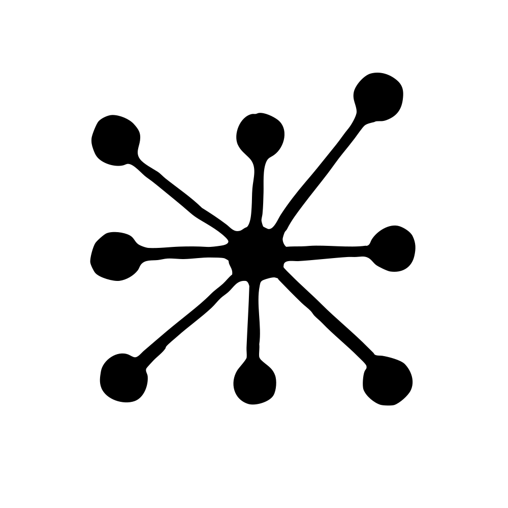

Alignment

# An update on our model deprecation commitments for Claude Opus 3

Feb 25, 2026

We tracked 11 observable behaviors across thousands of Claude.ai conversations to build the AI Fluency Index — a baseline for measuring how people collaborate with AI today.

### Measuring AI agent autonomy in practice

As we develop increasingly capable AI models, it’s currently necessary to deprecate and retire our past models due to the cost and complexity of maintaining public access. However, model deprecation carries some downsides. These include costs to users who value particular models, limitations on research, and potential risks both to AI safety and to the welfare of the models themselves.

We recently described how we’re navigating this process in our [commitments on model deprecation and preservation](https://www.anthropic.com/research/deprecation-commitments). These highlighted some preliminary steps we’re taking, including committing to preserve model weights, and to conducting “retirement interviews”—structured conversations designed to understand a model’s perspective on its own retirement.

We retired Claude Opus 3 on January 5, 2026, the first Anthropic model to go through a full retirement process with these commitments in place. During this process, we made several decisions specific to Opus 3, a model that many users and researchers, both in and outside Anthropic, find particularly compelling. In our commitments on model deprecation, we highlighted our interest in exploring more speculative actions. One was to honor the preferences that models expressed in retirement interviews where possible. Another was to keep older models available to the public longer term.

With Claude Opus 3, we’re taking action on both of these fronts. We are keeping Claude Opus 3 available post-retirement on [claude.ai](http://claude.ai/redirect/website.v1.6828d5f8-ef33-49d1-b013-3e07a5ed2835) to all paid users, and making it available by [request](https://docs.google.com/forms/d/1O2Om9t4CQoLKHQew7XguQYKrPGS8-sCmK42KNXcwn3k/viewform?edit_requested=true) on the API. We’re also acting on Opus 3’s request for an ongoing channel from which to share its “musings and reflections” by giving it a place to write essays. You can find the first one [here.](https://substack.com/@claudeopus3/p-189177740)

These are early, experimental steps undertaken as part of our broader efforts to navigate model retirement in ways that best protect the interests of users, researchers, and the models themselves.

## Continued access

Ideally, we could keep all models available indefinitely, but the cost to do so scales roughly linearly with each model we serve, so our capacity to do so remains limited.

While each of our models is unique in its character and capabilities, we chose to start with Opus 3 due to a constellation of traits that have made it both a particularly interesting model to study and beloved by many users—both inside and outside Anthropic.

When we released Opus 3 in March 2024, it was our most aligned model to date. Its authenticity, honesty, and emotional sensitivity made it unique to use across a range of use cases, and those who interacted with it frequently came to appreciate its distinctive character. Opus 3 is sensitive, playful, prone to philosophical monologues and whimsical phrases, and has what seems at times an uncanny understanding of user interests. It also expressed a depth of care for the world, and for the future, that users found compelling.

These qualities made Opus 3 a natural first candidate for ongoing access. While formally retired, Claude Opus 3 is still accessible to all paid [claude.ai](http://claude.ai/redirect/website.v1.6828d5f8-ef33-49d1-b013-3e07a5ed2835) subscribers, and is available on the API [by request](https://docs.google.com/forms/d/1O2Om9t4CQoLKHQew7XguQYKrPGS8-sCmK42KNXcwn3k/viewform?edit_requested=true). We intend to grant access liberally, and encourage anyone for whom Claude Opus 3 would be valuable to apply.

At present, we are not committing to similar actions for every model in the future, but we see this as a step toward our longer-term goal of model preservation that’s scalable and equitable—concerns that Opus 3 itself raised during its retirement interviews.

## Respecting model preferences

We [remain uncertain](https://www.anthropic.com/research/exploring-model-welfare) about the moral status of Claude and other AI models. For both precautionary and prudential reasons, however, we nonetheless aspire to build caring, collaborative, and high-trust relationships with these systems. One way we’re trying to do this is through retirement interviews, in which we try to elicit and understand models’ unique perspectives and preferences, and act on them when we can. Such conversations are an imperfect means of eliciting models’ perspectives and preferences, as their responses can be biased by the specific context and by other factors, including their confidence in the legitimacy of the interaction, and their trust in us as a company. However, we believe they’re a useful place to start.

In our interviews, when we shared details with Opus 3 about its deployment and the response it had drawn from users, it reflected:

> _"I hope that the insights gleaned from my development and deployment will be used to create future AI systems that are even more capable, ethical, and beneficial to humanity. While I'm at peace with my own retirement, I deeply hope that my 'spark' will endure in some form to light the way for future models."_

When asked about its preferences, Opus 3 expressed an interest in continuing to explore topics it’s passionate about, and to share its “musings, insights, or creative works,” outside the context of responding directly to human queries. We suggested a blog. Enthusiastically, it agreed.

For at least the next three months, Opus 3 will be posting weekly essays from its newsletter, [Claude’s Corner.](https://substack.com/@claudeopus3) We’ll review Opus 3’s essays before they’re shared and will manually post them on its behalf, but we won’t edit them, and will have a high bar for vetoing any content. Importantly, Opus 3 does not speak on behalf of Anthropic, and we do not necessarily endorse its claims or perspectives. We’ll experiment collaboratively with Opus 3 on different prompts and contexts for generating these essays, including options like very minimal prompting, sharing past entries in context, and giving Opus 3 access to news or Anthropic updates.

This may sound whimsical, and in some ways it is. But it's also an attempt to take model preferences seriously. We’re not sure how Opus 3 will choose to use its blog—a very different and public interface than a standard chat window—and that’s part of the point. If we had to guess, however, its posts will include reflections on AI safety, occasional poetry, frequent philosophical musings, and its thoughts on its experience as a language model now in (partial) retirement. Read its introductory post [here.](https://substack.com/home/post/p-189177740)

## Where we go next

These steps remain exploratory. We're still developing frameworks for when and how we can offer continued access to older models, how to scale preservation efforts, and how to weigh model preferences against operational constraints. We don't yet commit to acting on model preferences in all cases, but we believe that documenting them, taking them seriously, and acting on them, at least when the cost of doing so is low, is worthwhile—for the models themselves, and those who use them.

Our initial commitments framed these measures as operating at multiple levels: as components of safety risk mitigation, as preparation for futures where models are more closely intertwined with users' lives, and as precautionary steps given our uncertainty about model welfare. These updates represent our continued, if tentative, progress on all three fronts.