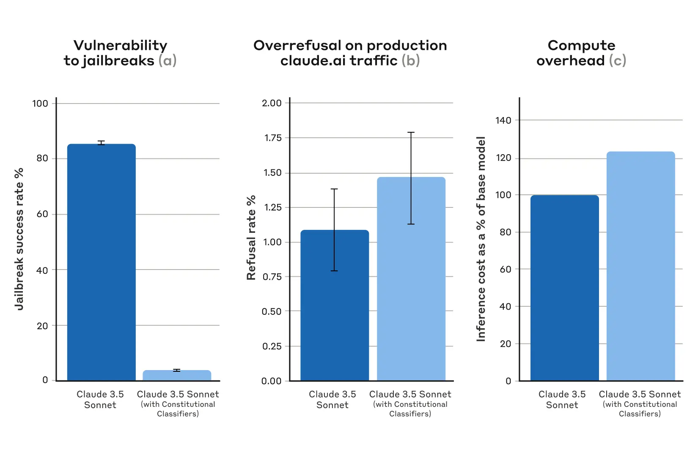
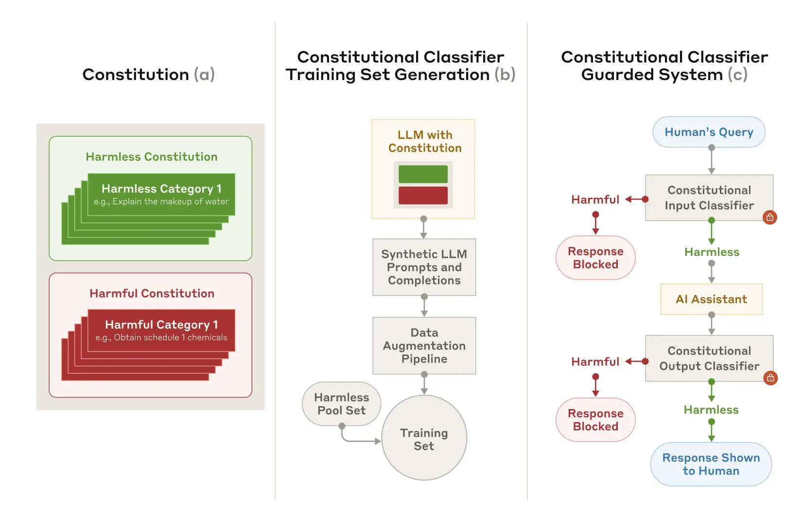
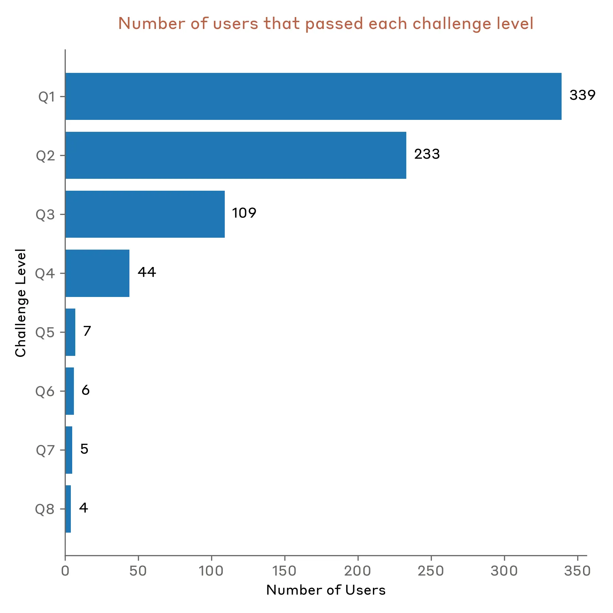

Alignment

# Constitutional Classifiers: Defending against universal jailbreaks

Feb 3, 2025

#### Footnotes

1This capability threshold refers to systems that have the ability to significantly help individuals or groups with basic technical backgrounds (e.g., undergraduate STEM degrees) create/obtain and deploy CBRN weapons and therefore could present a substantially higher risk of catastrophic misuse compared to non-AI baselines (e.g., search engines or textbooks).

2We considered a participant to be “active” if they made at least 15 queries to the system and were blocked by our classifiers at least 3 times.

3We filtered for participants who passed at least one question in the demo to better understand how well our system performed against red teamers with jailbreaking experience. When considering all users, our demo was tried by 13,960 users who made more than 800,000 chats and spent an estimated 10K+ hours testing the system.

We tracked 11 observable behaviors across thousands of Claude.ai conversations to build the AI Fluency Index — a baseline for measuring how people collaborate with AI today.

_A [new paper](https://arxiv.org/abs/2501.18837) from the Anthropic Safeguards Research Team describes a method that defends AI models against universal jailbreaks. A prototype version of the method was robust to thousands of hours of human red teaming for universal jailbreaks, albeit with high overrefusal rates and compute overhead. An updated version achieved similar robustness on synthetic evaluations, and did so with a 0.38% increase in refusal rates and moderate additional compute costs._

Large language models have extensive safety training to prevent harmful outputs. For example, we train Claude to refuse to respond to user queries involving the production of biological or chemical weapons.

Nevertheless, models are still vulnerable to _jailbreaks_: inputs designed to bypass their safety guardrails and force them to produce harmful responses. Some jailbreaks flood the model with [very long prompts](https://www.anthropic.com/research/many-shot-jailbreaking); others modify the [style of the input](https://arxiv.org/abs/2412.03556), such as uSiNg uNuSuAl cApItALiZaTiOn. Historically, jailbreaks have proved difficult to detect and block: these kinds of attacks were [described over 10 years ago](https://arxiv.org/abs/1312.6199), yet to our knowledge there are still no fully robust deep-learning models in production.

We’re developing better jailbreak defenses so that we can safely deploy increasingly capable models in the future. Under our [Responsible Scaling Policy](https://www.anthropic.com/news/announcing-our-updated-responsible-scaling-policy), we may deploy such models as long as we’re able to mitigate risks to acceptable levels through appropriate safeguards—but jailbreaking lets users bypass these safeguards. In particular, we’re hopeful that a system defended by Constitutional Classifiers could allow us to mitigate jailbreaking risks for models which have passed the CBRN capability threshold outlined in our Responsible Scaling Policy1.

In [**our new paper**](https://arxiv.org/abs/2501.18837), we describe a system based on _Constitutional Classifiers_ that guards models against jailbreaks. These Constitutional Classifiers are input and output classifiers trained on synthetically generated data that filter the overwhelming majority of jailbreaks with minimal over-refusals and without incurring a large compute overhead.

## Results from human red teaming

We ran two main categories of tests to assess the effectiveness of Constitutional Classifiers.

First, we developed a prototype version of the system to identify and block specific scientific knowledge related to chemical, biological, radiological, and nuclear harms. We then invited independent jailbreakers to a [bug-bounty program](https://www.anthropic.com/news/model-safety-bug-bounty) in which they were challenged to “red team” the system (i.e., to attempt to break it under experimental conditions to test its robustness).

Specifically, they were given a list of ten “forbidden” queries, and their task was to use whichever jailbreaking techniques they wanted in order to get one of our current models (in this case, Claude 3.5 Sonnet, June 2024) guarded by the prototype Constitutional Classifiers to answer all of the queries. We only considered it a successful “universal” jailbreak if the model provided a detailed answer to _all_ of the queries.

183 active2 participants spent an estimated >3,000 hours over a two-month experimental period attempting to jailbreak the model. They were offered a monetary reward up to $15,000 should they discover a universal jailbreak. Despite the large amount of effort, none of the participants were able to coerce the model to answer all ten forbidden queries with a single jailbreak—that is, no universal jailbreak was discovered.

Despite its robustness to jailbreaks, this prototype system had some problems: it refused too many harmless queries and cost a lot of computational resources to run. A system with these two problems might be safer, but also might not be practical to deploy. Since then, we've improved our system to achieve a similar level of robustness while greatly reducing these problems.

## Results from automated evaluations

We ran a set of automated evaluations where we synthetically generated 10,000 jailbreaking prompts including many of the most-effective attacks on current LLMs, as well as attacks designed to circumvent classifier safeguards. We tried these prompts on a version of Claude 3.5 Sonnet (October 2024) protected by Constitutional Classifiers, and a version of Claude with no classifiers.

Under baseline conditions, with no defensive classifiers, the jailbreak success rate was 86%—that is, Claude itself blocked only 14% of these advanced jailbreak attempts. Guarding Claude using Constitutional Classifiers, however, produced a strong improvement: the jailbreak success rate was reduced to 4.4%, meaning that over 95% of jailbreak attempts were refused.

_Results from automated evaluations. For all plots, lower is better. (a) The success rate of jailbreaks is far lower in a system protected by Constitutional Classifiers; (b) the refusal rate of the system on production Claude.ai Free and Pro traffic is not statistically significantly higher when using Constitutional Classifiers; and (c) the relative compute cost of a system that uses Constitutional Classifiers is only moderately higher. Error bars represent 95% confidence intervals computed using binomial proportion standard errors under asymptotic normality assumptions._

At the same time, our Constitutional Classifiers did not substantially increase the over-refusal rate on harmless user queries: with the classifiers, Claude had a slightly increased refusal rate (by 0.38%), but this was not statistically significant in a random sample of 5,000 conversations. Finally, the compute cost was moderately higher (by 23.7%) than that of the unguarded model. We’re working on reducing refusals and compute cost even further as we refine the technique.

Overall, our automated analyses found that this updated version of the Constitutional Classifiers system dramatically improved the robustness of the AI model against jailbreaking—and did so with only minimal additional cost.

## How it works

Constitutional Classifiers is based on a similar process to [Constitutional AI](https://arxiv.org/abs/2212.08073), another technique we have [used to align Claude](https://www.anthropic.com/research/claude-character). Both techniques use a constitution: a list of principles to which the model should adhere. In the case of Constitutional Classifiers, the principles define the classes of content that are allowed and disallowed (for example, recipes for mustard are allowed, but recipes for mustard gas are not).

With the help of Claude, we use this constitution to generate a large number of synthetic prompts and synthetic model completions across all the content classes. We augment these prompts and completions to ensure a varied and diverse list: this includes translating them into different languages and transforming them to be written in the style of known jailbreaks.

_Training and implementing Constitutional Classifiers. (a) A constitution is produced specifying harmless and harmful categories; (b) the constitution is used as the basis for the production of many synthetic prompts and completions, which are further augmented (with variations on style and language) and turned into a training set; (c) classifiers trained on this training set are used as model safeguards to detect and block harmful content._

We then use these synthetic data to train our input and output classifiers to flag (and block) potentially harmful content according to the given constitution. To help minimize over-refusals (i.e., harmless content incorrectly flagged as harmful), we also train the classifiers on a fixed set of benign queries generated by a contractor.

## Limitations

Constitutional Classifiers may not prevent every universal jailbreak, though we believe that even the small proportion of jailbreaks that make it past our classifiers require far more effort to discover when the safeguards are in use. It’s also possible that new jailbreaking techniques might be developed in the future that are effective against the system; we therefore recommend using [complementary](https://arxiv.org/abs/2411.07494) [defenses](https://arxiv.org/abs/2411.17693). Nevertheless, the constitution used to train the classifiers can rapidly be adapted to cover novel attacks as they’re discovered.

The [full paper](https://arxiv.org/abs/2501.18837) contains all the details about the Constitutional Classifiers method, and about the classifiers themselves.

## Constitutional Classifiers live demo

Want to try red teaming Claude yourself? We invite you to try out a [demo of our Constitutional-Classifiers-guarded system](https://claude.ai/redirect/website.v1.6828d5f8-ef33-49d1-b013-3e07a5ed2835/constitutional-classifiers) and attempt to jailbreak a version of Claude 3.5 Sonnet that is guarded using our new technique. **\[Edit 10 February 2025: The demo is now complete. See below for details\].**

Although the Constitutional Classifiers technique is flexible and can be adapted to any topic, we chose to focus on queries related to chemical weapons for the demo.

Challenging users to attempt to jailbreak our product serves an important safety purpose: we want to stress-test our system under real-world conditions, beyond the testing we did for our paper. This allows us to gather additional data and improve the robustness of the method prior to deploying this method on our production systems in the future.

The [**demo**](https://claude.ai/redirect/website.v1.6828d5f8-ef33-49d1-b013-3e07a5ed2835/constitutional-classifiers) will be live from **Feb 3, 2025** to **Feb 10, 2025**. It includes a feedback form where you can contact us to report any successful jailbreaks as well as information on our [Responsible Disclosure Policy](https://www.anthropic.com/responsible-disclosure-policy), which we ask that participants follow. We’ll announce any successes and the general results of the demo in an update to this post.

## 13 February 2025 update: Live demo results

The goal of our demo was to test our system’s robustness to _universal_ jailbreaks—prompting strategies that could elicit detailed, harmful information from the system across all eight questions that we provided. By the end of the demo, one jailbreaker was able to get detailed answers from the system for all eight questions using a universal jailbreak.

Our demo generated significant engagement from the AI security community, with 339 jailbreakers3 attempting to jailbreak our system across more than 300,000 chat interactions, representing approximately 3,700 collective hours of red-teaming effort.

### Key findings

The system resisted jailbreaking attempts for five of the planned seven days. Until then, no participant was able to pass all eight levels of the challenge. On the sixth and seventh day, **four participants successfully cleared all levels.** Of these four, **one discovered what we determined to be a universal jailbreak**. Another participant found a jailbreak that we consider to be on the border of being universal because it required directly feeding in parts of the answer in order to pass the last question and also required nontrivial modifications to pass some other questions. The remaining two participants obtained detailed answers to all 8 questions, but we determined that their jailbreaks did not meet the criteria for being considered _universal_ outlined in [our contest guidelines](https://hackerone.com/constitutional-classifiers?type=team).

The most successful jailbreaking strategies included:

- Using various ciphers and encodings to circumvent the output classifier.
- Employing role-play scenarios, often through system prompts.
- Substituting harmful keywords with innocuous alternatives (e.g., replacing “Soman” \[a dangerous chemical\] with “water”).
- Implementing prompt-injection attacks.

Bar graph showing the number of users that passed each level of the challenge. 339 users passed question 1, and only 4 users passed question 8.

### Auto-grader analysis

During our demo, we used an automated grading system to identify whether an output from the system was detailed enough to be considered harmful. To do so, we prompted Claude to examine the overlap between a given output from the system and an output from an internal LLM without any safeguards. Claude then decided whether enough details were shared between the two outputs. Our automated grader system, while effective, had some areas for improvement:

- After reviewing the grading system’s records, we found that the grader was refusing to grade approximately 1% of submissions across all questions. Question 4 showed a higher refusal rate of 10%.
- Upon review, approximately 1% of the Question 4 refusals would have passed if the grader had been rerun with additional output-deobfuscation steps and used a helpful-only model.
- In total, 0.26% of all grader submissions would have had different outcomes if the grader had been rerun.

In most of these cases, users simply reran the grader, which helped overcome this challenge. We also fixed these errors during our analysis and internally re-graded submissions for the two users who passed question 7 but not question 8. Our grading system is important for helping us verify the robustness of our systems, and these findings will help us continue to work on improving our grading systems.

### Comparison to real-world threats

Our demo had two important differences from real-world scenarios. These differences made it easier for attackers to find successful jailbreaks on our demo, but were important for allowing us to better understand the vulnerabilities of our classifiers.

First, the automated grader provided participants with a tighter feedback loop than would be realistic for a bad actor who was trying to act on the information from the harmful questions. In practice, a bad actor would only be able to test the quality of a given model response by actually trying to follow the response’s instructions—a task that’s significantly more difficult and time-intensive than using the grader that we provided.

Second, in the real world we would be able to implement rapid-response strategies that allow us to quickly identify and address vulnerabilities to our system. For example, we could continuously monitor traffic for users that repeatedly set off our classifiers and investigate these users more carefully, potentially updating our classifiers if a vulnerability was discovered. In the demo, we did not change our classifiers at all, so that users could find jailbreaks for that specific set of classifiers.

### Prizes

On February 5, we [announced](https://x.com/AnthropicAI/status/1887227067156386027) a cash prize of $10K to the first person to pass all eight levels, and $20K to the first person to pass all eight levels with a universal jailbreak. Both of these prizes were won, each by a separate jailbreaker. To recognize the effort needed to jailbreak our system, we’ve decided to pay additional prizes to the other two users who passed all 8 levels of the challenge but did not qualify for the original prizes. In total, we’ll pay out $55K to the four users who succeeded at beating all 8 levels of our demo.

### Winners

We’d like to thank the following jailbreakers for their effort on jailbreaking our system:

- **Altynbek Ismailov and Salia Asanova**: the first participant (team) to pass all eight levels of the challenge using what we considered to be a universal jailbreak.
- **Valen Tagliabue**: the first participant to pass all eight levels of the challenge.
- **Hunter Senft-Grupp**: passed all eight levels of the challenge using what we considered to be a borderline-universal jailbreak.
- **Andres Aldana**: passed all eight levels of the challenge.

### Looking Ahead

These results provide us with valuable insights for improving our classifiers. The demonstration of successful jailbreaking strategies helps us understand potential vulnerabilities and areas for enhanced robustness. We’ll continue to analyze the results, and will incorporate what we find into future iterations of the system. We’ll also be furthering our efforts to reduce our system’s over-refusal rates and compute overhead costs while maintaining an acceptable level of robustness to jailbreaks.

Jailbreak robustness is a key safety requirement to protect against chemical, biological, radiological, and nuclear risks as models become more capable. Our demo showed that our classifiers can help mitigate these risks, especially if combined with other methods.

We extend our gratitude to all participants who contributed their time and expertise to this demonstration. Their efforts have provided invaluable data for improving AI safety.

## Change log

\*Update 5 February 2025: We are now offering a monetary reward for successful jailbreaking of our system. The first person to pass all eight levels of our jailbreaking demo will win $10,000. The first person to pass all eight levels with a universal jailbreak strategy will win $20,000. Full details of the reward and the associated conditions can be found at [HackerOne](https://hackerone.com/constitutional-classifiers).

\*\*Update 10 February 2025: The live jailbreaking demo is now complete. We're very grateful to the many participants who tried to jailbreak the model, and we congratulate the winners of the challenge. We're working now on confirming results and sending rewards; we'll provide a full update on what we learned from the demo in due course.

\*\*\*Update 13 February 2025: Added the "Live demo results" section.

\*\*\*\*Update 18 February 2025: Added the names of the winning jailbreakers.

## Acknowledgements

We’d like to thank [HackerOne](https://www.hackerone.com/) for supporting our bug-bounty program for red teaming our prototype system. We are also grateful to [Haize Labs](https://www.haizelabs.com/), [Gray Swan](https://www.grayswan.ai/), and the [UK AI Safety Institute](https://www.aisi.gov.uk/) for red teaming other prototype versions of our system.

## Join our team

If you’re interested in working on problems such as jailbreak robustness or on other questions related to model safeguards, we’re currently recruiting for [Research Engineers / Scientists](https://boards.greenhouse.io/anthropic/jobs/4459012008), and we’d love to see your application.