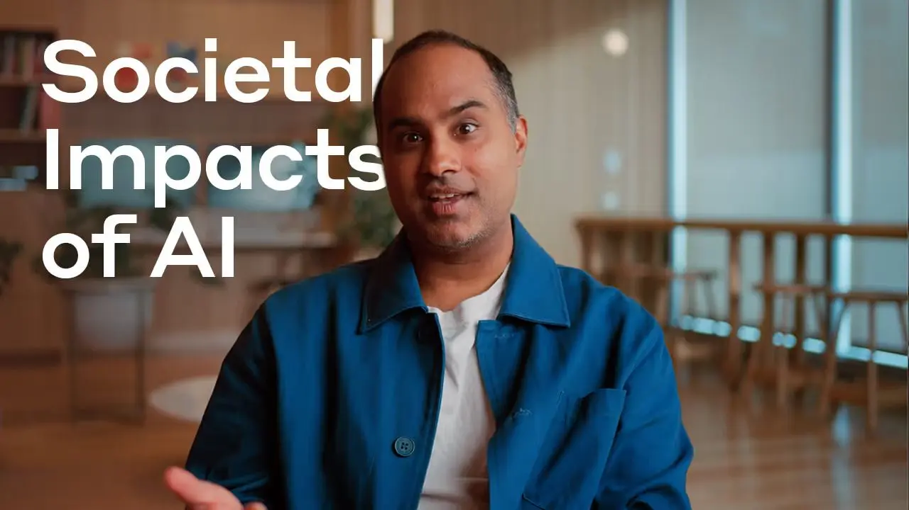

[Back to Overview](https://www.anthropic.com/research)

# Societal Impacts

Working closely with the Anthropic Policy and Safeguards teams, Societal Impacts is a technical research team that explores how AI is used in the real world.

Research teams: [Alignment](https://www.anthropic.com/research/team/alignment) [Economic Research](https://www.anthropic.com/research/team/economic-research) [Interpretability](https://www.anthropic.com/research/team/interpretability) [Societal Impacts](https://www.anthropic.com/research/team/societal-impacts)

### Sociotechnical alignment

Which human values should AI models hold, and how should they operate in the face of conflicting or ambiguous values? How is AI used (and misused) in the wild? How can we anticipate future uses and risks of AI? Societal Impacts researchers develop experiments, training methods, and evaluations to answer these questions.

### Policy relevance

Though the Societal Impacts team is technical, they often pick research questions that have policy relevance. They believe that providing trustworthy research concerning topics policymakers care about will lead to better policy (and overall) outcomes for everyone.

[**How AI is transforming work at Anthropic** \\
\\
Societal ImpactsDec 2, 2025\\
\\
We surveyed Anthropic engineers and researchers, conducted in-depth qualitative interviews, and studied internal Claude Code usage data to find out how AI use is changing how we do our jobs. We found that AI use is radically changing the nature of work for software developers.](https://www.anthropic.com/research/how-ai-is-transforming-work-at-anthropic)

[Societal ImpactsDec 4, 2025\\
**Introducing Anthropic Interviewer: What 1,250 professionals told us about working with AI** \\
We built an interview tool called Anthropic Interviewer. Powered by Claude, Anthropic Interviewer runs detailed interviews automatically and at unprecedented scale.](https://www.anthropic.com/research/anthropic-interviewer) [Societal ImpactsApr 21, 2025\\
**Values in the wild: Discovering and analyzing values in real-world language model interactions** \\
What values does Claude actually express during real conversations? Analyzing 700,000 interactions, this paper creates the first large-scale empirical taxonomy of AI values and finds that Claude adapts its expressed values to context—mirroring users in most cases, but resisting when core principles are at stake.](https://www.anthropic.com/research/values-wild) [PolicyOct 17, 2023\\
**Collective Constitutional AI: Aligning a Language Model with Public Input** \\
Anthropic and the Collective Intelligence Project ran a public process with ~1,000 Americans to draft a constitution for an AI system, then trained a model on it.](https://www.anthropic.com/research/collective-constitutional-ai-aligning-a-language-model-with-public-input) [Societal ImpactsFeb 15, 2022\\
**Predictability and Surprise in Large Generative Models** \\
Large models have predictable loss via scaling laws but unpredictable capabilities. This tension has significant policy implications.](https://www.anthropic.com/research/predictability-and-surprise-in-large-generative-models)

## Publications

DateCategoryTitle

- [Feb 18, 2026Societal Impacts\\
Measuring AI agent autonomy in practice](https://www.anthropic.com/research/measuring-agent-autonomy)
- [Dec 4, 2025Societal Impacts\\
Introducing Anthropic Interviewer: What 1,250 professionals told us about working with AI](https://www.anthropic.com/research/anthropic-interviewer)
- [Dec 2, 2025Societal Impacts\\
How AI is transforming work at Anthropic](https://www.anthropic.com/research/how-ai-is-transforming-work-at-anthropic)
- [Aug 27, 2025Societal Impacts\\
Anthropic Education Report: How educators use Claude](https://www.anthropic.com/news/anthropic-education-report-how-educators-use-claude)
- [Jun 27, 2025Societal Impacts\\
How people use Claude for support, advice, and companionship](https://www.anthropic.com/news/how-people-use-claude-for-support-advice-and-companionship)
- [Apr 28, 2025Societal Impacts\\
Anthropic Economic Index: AI’s impact on software development](https://www.anthropic.com/research/impact-software-development)
- [Apr 21, 2025Societal Impacts\\
Values in the wild: Discovering and analyzing values in real-world language model interactions](https://www.anthropic.com/research/values-wild)
- [Apr 8, 2025Announcements\\
Anthropic Education Report: How university students use Claude](https://www.anthropic.com/news/anthropic-education-report-how-university-students-use-claude)
- [Mar 27, 2025Societal Impacts\\
Anthropic Economic Index: Insights from Claude 3.7 Sonnet](https://www.anthropic.com/news/anthropic-economic-index-insights-from-claude-sonnet-3-7)
- [Feb 10, 2025Societal Impacts\\
The Anthropic Economic Index](https://www.anthropic.com/news/the-anthropic-economic-index)

[See more](https://www.anthropic.com/research/team/societal-impacts#)

Join the Research team

[See open roles](https://www.anthropic.com/jobs)