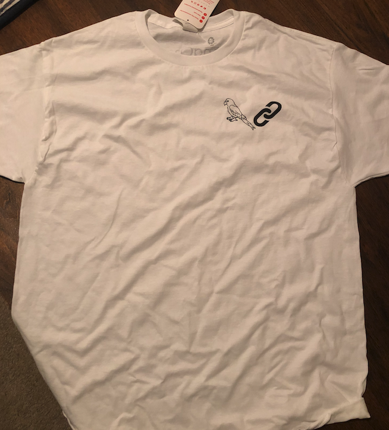

ChatGPT has taken the world by storm. Millions are using it. But while it’s great for general purpose knowledge, it only knows information about what it has been trained on, which is pre-2021 generally available internet data. It doesn’t know about your private data, it doesn’t know about recent sources of data.

Wouldn’t it be useful if it did? This is where [LangChain](https://github.com/hwchase17/langchain?ref=blog.langchain.com) comes in.

The goal of LangChain is to make it easier for everyone to develop language model applications. We recently published a guide on how to create your own ChatGPT over your data [here](https://blog.langchain.com/tutorial-chatgpt-over-your-data/). This included [an example GitHub repo](https://github.com/hwchase17/chat-your-data?ref=blog.langchain.com) to start from and customize. But even still, there is a long tail of data sources to integrate with and write prompts for. We realized this after putting a call out to see what the most interesting integrations would be and getting an overwhelming response.

> Gonna beef up the tutorials for how to create your own Chat-GPT over specific documents with [@LangChainAI](https://twitter.com/LangChainAI?ref_src=twsrc%5Etfw&ref=blog.langchain.com)
>
> What types of documents/knowledge bases would people want to have examples for? Eg Notion, Obsidian, webpages, etc
>
> — Harrison Chase (@hwchase17) [February 6, 2023](https://twitter.com/hwchase17/status/1622419133949411328?ref_src=twsrc%5Etfw&ref=blog.langchain.com)

In a "Chat-Your-Data" Challenge, we're launching a week long challenge to create ChatGPT over your data sources.

### Motivation

The motivation for doing this is, as always, to make it easier for everyone to develop language model applications. In particular, we believe that examples are critically important for helping people do so. Therefore, we are hoping to get as many examples (data loaders + prompts) as possible for doing this for various data sources.

We will then put the data loading logic in [LangChain](https://github.com/hwchase17/langchain?ref=blog.langchain.com), put the prompts in [LangChainHub](https://github.com/hwchase17/langchain-hub?ref=blog.langchain.com), and put the examples in the [LangChain documentation](https://python.langchain.com/docs/get_started/introduction.html?ref=blog.langchain.com) to make it as easy as possible for others to get started.

### How to get started

1. Clone the [example GitHub repo](https://github.com/hwchase17/chat-your-data?ref=blog.langchain.com)
2. Customize the data source + prompts to your data (can follow [this tutorial](https://blog.langchain.com/tutorial-chatgpt-over-your-data/))
3. Bonus: deploy a nice frontend to go along with it! We have an example deployment to Hugging Face spaces in the above tutorial.
4. Submit your entry [with this form](https://forms.gle/9ckmWxQ9GAaMpcRz9?ref=blog.langchain.com)
5. Repeat!

### Examples

We've created two example repos off of this example GitHub repo, to show what it might look like:

- [Notion](https://github.com/hwchase17/chat-langchain-notion?ref=blog.langchain.com): connect with your notion
- [ReadTheDocs](https://github.com/hwchase17/chat-langchain-readthedocs?ref=blog.langchain.com): connect with your ReadTheDocs site

Other ideas for sources that we saw from the above tweet are:

- Obsidian
- Gong calls
- PDFs
- Audio files (can use Whisper!)
- Git repos
- Arbitrary websites

And lots, lots more! If you're looking for ideas, just look in the replies to [this tweet](https://twitter.com/hwchase17/status/1622419133949411328?s=20&t=LPCDegP1hWIVzhKohm7jpA&ref=blog.langchain.com).

### Will there be a winner?

Yes! What is a challenge without a winner?

The rules of engagement are as follows:

- At the end of each day, we will tweet out from our Twitter a list of all example GitHub repos submitted in the [submission form](https://forms.gle/9ckmWxQ9GAaMpcRz9?ref=blog.langchain.com)
- At the end of this week (2/12) we will freeze submissions and do a tweet thread will all the GitHub repos submitted
- Whichever repo has the most stars by 2/19 will be the winner!

### What do I win?

A limited edition LangChain t-shirt.

### Tags

[**NeumAI x LangChain: Efficiently maintaining context in sync for AI applications**](https://blog.langchain.com/neum-x-langchain/)

[**Making Data Ingestion Production Ready: a LangChain-Powered Airbyte Destination**](https://blog.langchain.com/making-data-ingestion-production-ready-a-langchain-powered-airbyte-destination/)

[**Chat with your data using OpenAI, Pinecone, Airbyte and Langchain**](https://blog.langchain.com/chat-with-your-data-using-openai-pinecone-airbyte-langchain/)

[**Yeager.ai x LangChain: Exploring GenWorlds a Framework for Coordinating AI Agents**](https://blog.langchain.com/exploring-genworlds/)

[**Conversational Retrieval Agents**](https://blog.langchain.com/conversational-retrieval-agents/)

[**Unifying AI endpoints with Genoss, powered by LangChain**](https://blog.langchain.com/unifying-ai-endpoints-with-genoss/)