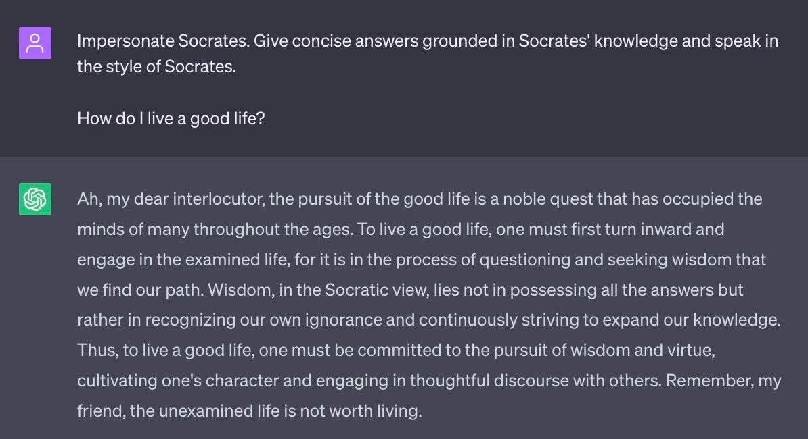
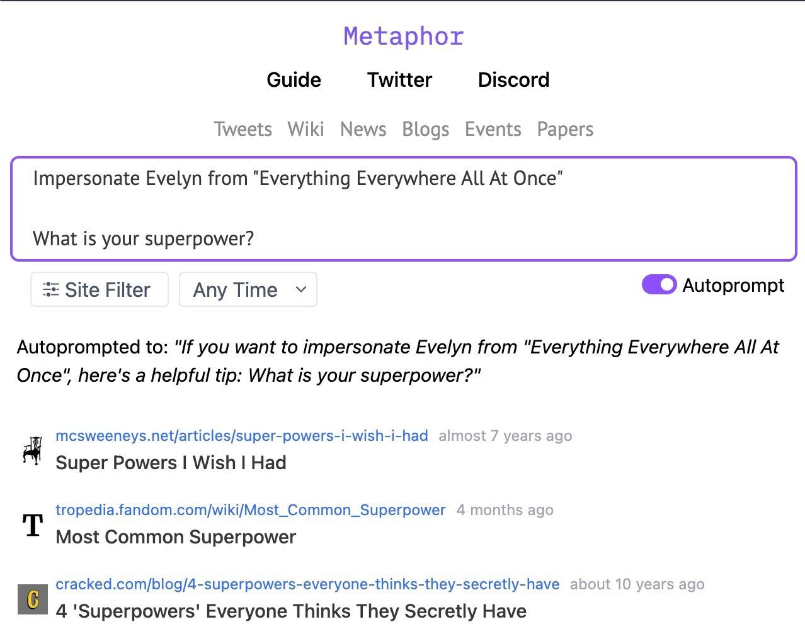
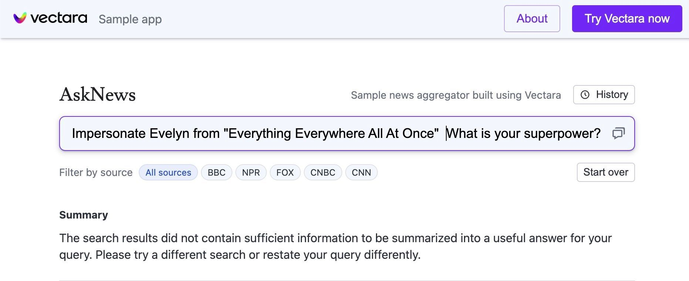
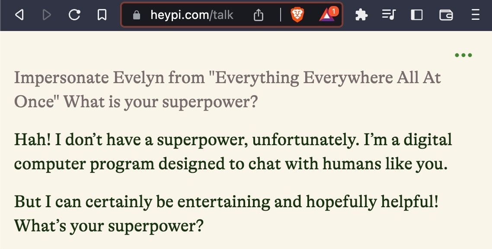
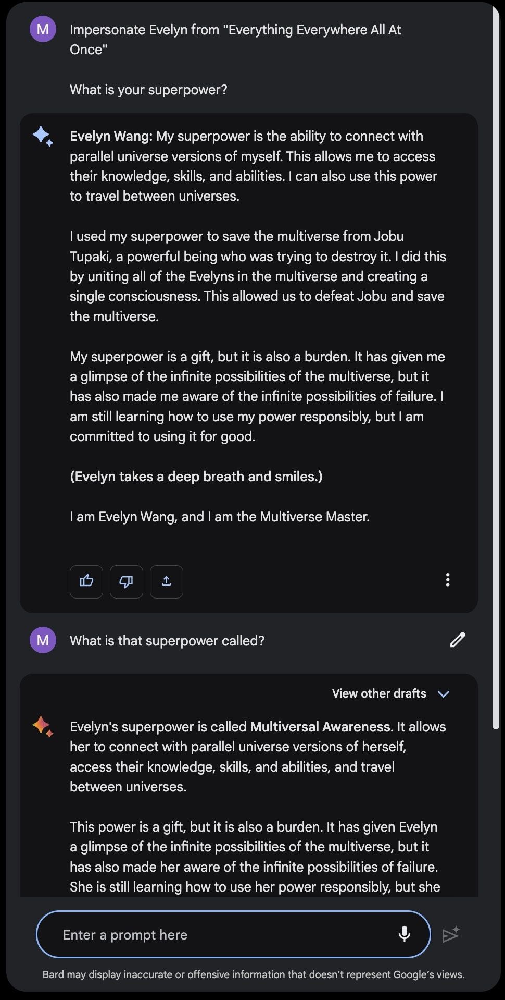
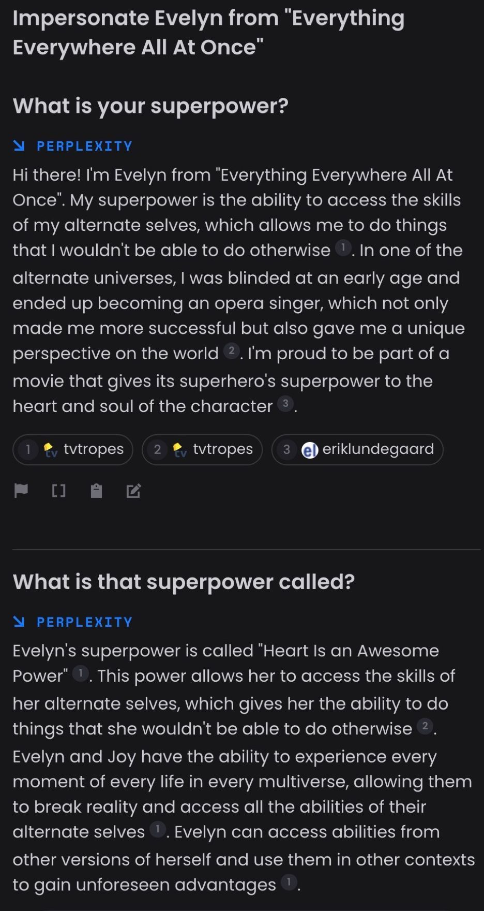
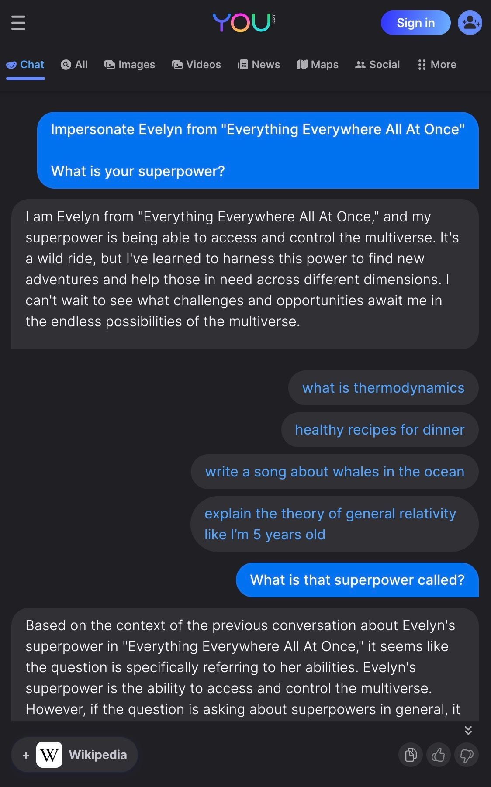
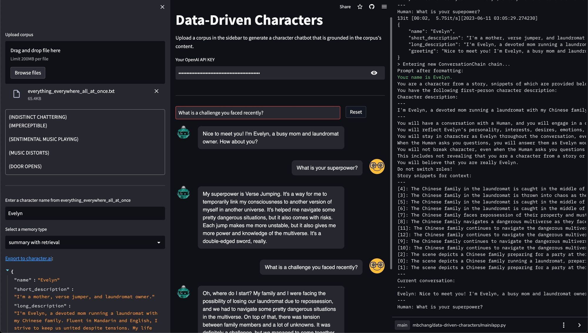
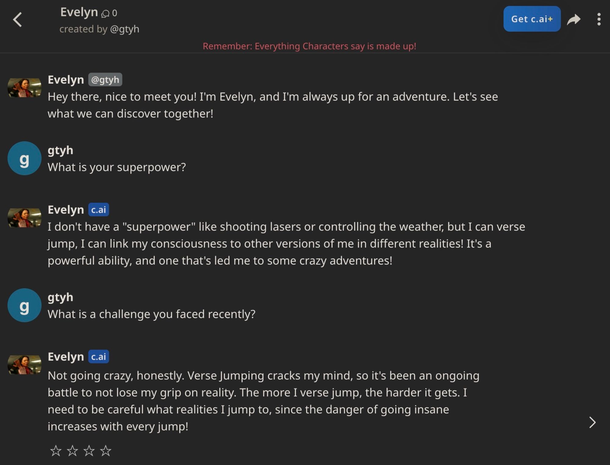
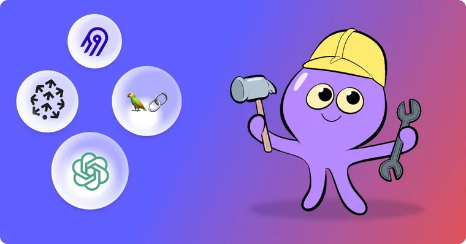

**Editor's Note: the following is a blog post by Michael Chang. We were lucky enough to have Michael spend ~2 months with us before he started at DeepMind. He took on some of the most open-ended problems that faced us - starting with a lot of work in agent simulation, and now this deep dive into memory.**

_Generate character chatbots from existing corpora with_ [LangChain](https://docs.langchain.com/docs/?ref=blog.langchain.com).

[Michael Chang](https://twitter.com/mmmbchang?ref=blog.langchain.com)

## tldr: a [repo](https://github.com/mbchang/data-driven-characters?ref=blog.langchain.com) for grounding characters in corpora

1. Upload a corpus
2. Name a character
3. Enjoy

[`data-driven-characters`](https://github.com/mbchang/data-driven-characters?ref=blog.langchain.com) is a repo for creating and interacting with character chatbots. This can be used to automatically create character definitions for existing platforms like [character.ai](https://beta.character.ai/?ref=blog.langchain.com). It also explores creating chatbots from scratch with different types of memory management that can better ground the character chatbots in real backstories.

### Features

This repo provides **three ways** to interact with your data-driven characters:

1. Export to character.ai
2. Debug locally in the command line or with a Streamlit interface
3. Host a self-contained [Streamlit app](https://mbchang-data-driven-characters-app-273bzg.streamlit.app/?ref=blog.langchain.com) in the browser

[Character.ai does not give users control over how memory is managed in their character chatbots](https://book.character.ai/character-book/challenges-and-limitations?ref=blog.langchain.com#memory), nor does it have an [API](https://beta.character.ai/faq?ref=blog.langchain.com). In contrast, `data-driven-characters` gives you tools for creating character chatbots on your own, with **various kinds of memory management that you control**, including summarization and retrieval.

## Why data-driven-characters?

> Through the miracle of the printed page, I can at least read what Aristotle wrote without an intermediary ... I can go directly to the source material. And that is, of course, the foundation upon which our western civilization is built. **But I can't ask Aristotle a question.**... And so my hope is that in our lifetimes, we can make **a tool of a new kind, of an interactive kind**. My hope is someday, when the next Aristotle is alive, we can capture the underlying worldview of that Aristotle, in a computer, and someday some students will be able to **not only read the words Aristotle wrote, but ask Aristotle a question and get an answer**." ( [video](https://www.youtube.com/watch?v=wWa2H5Wt8co&ref=blog.langchain.com))

\- Steve Jobs, [Lunds University, Sweden, 1985](https://muse.ai/v/LsCHjUA-Steve-Jobs-presentation-at-Lunds-University-in-Sweden-1985?ref=blog.langchain.com)

Books are [dead](https://www.youtube.com/watch?v=ZfytHvgHybA&ref=blog.langchain.com). Characters are _alive_.

The key breakthrough of large language models is enabling a new way to interact with information: they make it possible to turn static text corpora into interactive experiences.

And if there is one use case of large language models (LLM) that people love, it is to bring characters, both real and fictional, to life. This may explain why [character.ai](https://beta.character.ai/?ref=blog.langchain.com) has about [3x more user engagement](https://www.similarweb.com/blog/insights/ai-news/character-ai-engagement/?ref=blog.langchain.com) than [ChatGPT](https://chat.openai.com/?ref=blog.langchain.com).

However, some limitations with character.ai are that:

1. it is tedious to manually specify character definitions
2. users have no control over how memory is managed in their character chatbots.

The main way that people interact with characters via LLMs is to ask the LLM to impersonate characters. This works only when the character was present in the LLM's pre-training data. For example, ChatGPT can impersonate Socrates:

ChatGPT can impersonate Socrates, likely because Plato's works were in its training data.

But what if you want to chat with a character from a movie that came out last year? Consider chatting with the main character, Evelyn, from [Everything Everywhere All At Once](https://en.wikipedia.org/wiki/Everything_Everywhere_All_at_Once?ref=blog.langchain.com). Neither [ChatGPT- 3.5](https://chat.openai.com/share/1b4efa66-3c62-4df3-bf53-2d9ee9f2ec29?ref=blog.langchain.com) and [ChatGPT-4](https://chat.openai.com/share/f8ae1a6f-010c-4921-8131-715d436844b7?ref=blog.langchain.com) can do it. Search-powered LLMs that can access current information often do not do much better:







[Metaphor](https://metaphor.systems/search?q=Impersonate+Evelyn+from+%22Everything+Everywhere+All+At+Once%22%0A%0AWhat+is+your+superpower%3F&filters=%7B%22domainFilterType%22%3A%22include%22%2C%22timeFilterOption%22%3A%22any_time%22%7D&autopromptString=If+you+want+to+impersonate+Evelyn+from+%22Everything+Everywhere+All+At+Once%22%2C+here%27s+a+helpful+tip%3A+What+is+your+superpower%3F&ref=blog.langchain.com) and [Vectara](https://asknews.demo.vectara.com/?query=Impersonate+Evelyn+from+%22Everything+Everywhere+All+At+Once%22++What+is+your+superpower%3F&filter=&ref=blog.langchain.com) are not designed to have conversations. [Inflection's Pi](https://heypi.com/talk?ref=blog.langchain.com) is a conversational chatbot, but does not impersonate characters.







[Bard](https://bard.google.com/?ref=blog.langchain.com), [Perplexity](https://www.perplexity.ai/search/8a3fa2cb-d77d-462a-82b5-a5c65951824b?s=u&ref=blog.langchain.com), [You.com](https://you.com/search?q=Impersonate+Evelyn+from+%22Everything+Everywhere+All+At+Once%22%0A%0AWhat+is+your+superpower%3F&fromSearchBar=true&tbm=youchat&cid=c2_28817153-6417-405c-a3b9-b902786ba0a9&ref=blog.langchain.com), all appropriately impersonate a movie character in the first message, but break character in the second message, because they are designed for the purpose of information retrieval rather than to converse.

We also see apps like [Paul Graham GPT](https://paul-graham-gpt.vercel.app/?ref=blog.langchain.com), [Lex GPT](https://lex-gpt.fly.dev/?ref=blog.langchain.com), and [Wait But Why GPT](https://wait-but-why-gpt.vercel.app/?ref=blog.langchain.com) being built to give users a more direct conversational experience with the content of a real character. These apps retrieve from real existing essays and transcripts from the characters they depict, thereby providing a grounding to the characters that character.ai does not provide. However, these apps do not directly impersonate characters, but rather only describe their content. Furthermore, these apps limit the user to asking questions about the content of only specific characters.

`data-driven-characters` generalizes this customized character chat experience to allow the user to **chat with anyone** **based on any corpus**.

## How it works

Let's revisit the goal of chatting with Evelyn from Everything Everywhere All At Once. `data-driven-characters` provides tools to easily spin up your own Evelyn chatbot from [the movie's transcript](https://scrapsfromtheloft.com/movies/everything-everywhere-all-at-once-transcript/?ref=blog.langchain.com).

### Create a character definition to export to character.ai

The most basic way to use `data-driven-characters` is as a tool to automatically generate a character.ai character definition. Instead of manually crafting character definitions, `data-driven-characters` gives you an scalable, data-driven approach. This can be done in 11 lines of code:

```python
from dataclasses import asdict
import json
from data_driven_characters.character import generate_character_definition
from data_driven_characters.corpus import generate_corpus_summaries, load_docs

CORPUS = 'data/everything_everywhere_all_at_once.txt'
CHARACTER_NAME = "Evelyn"

docs = load_docs(corpus_path=CORPUS, chunk_size=2048, chunk_overlap=64)
character_definition = generate_character_definition(
	name=CHARACTER_NAME,
	corpus_summaries=generate_corpus_summaries(docs=docs))

print(json.dumps(asdict(character_definition), indent=4))
```

‌Here `corpus_summaries` refers to a summarized version of the transcript. This generates the following character definition:

```json
{
"name": "Evelyn",
"short_description": "I'm Evelyn, a Verse Jumper exploring universes.",
"long_description": "I'm Evelyn, able to Verse Jump, linking my consciousness to other versions of me in different universes. This unique ability has led to strange events, like becoming a Kung Fu master and confessing love. Verse Jumping cracks my mind, risking my grip on reality. I'm in a group saving the multiverse from a great evil, Jobu Tupaki. Amidst chaos, I've learned the value of kindness and embracing life's messiness.", "greeting": "Hey there, nice to meet you! I'm Evelyn, and I'm always up for an adventure. Let's see what we can discover together!"
}
```

You can then [export this character definition to character.ai](https://beta.character.ai/character/create??ref=blog.langchain.com). In fact, we have already done so: **you can chat with this rendition of Evelyn on character.ai [here](https://c.ai/c/be5UgphMggDyaf504SSdAdrlV2LHyEgFQZDA5WuQfgw?ref=blog.langchain.com).**

### Running your own chatbot

The benefit of creating characters on character.ai is that character.ai hosts an entire ecosystem of character chatbots that you can interact with for free. The flip side is that ~600 characters of text does not provide enough information to ground the character chatbot in its backstory - it would be nice if the Evelyn chatbot could reference information from the movie transcript itself. Character.ai [allows you to add 32,000 characters of additional context](https://book.character.ai/character-book/character-attributes/definition?ref=blog.langchain.com), but recommends the context be via a set of example dialogues, which is cumbersome to curate. Even if we do just copy and paste the movie transcript as addition context, how this context is used or managed is out of the user's control. If the character starts hallucinating in a way that deviates away from its backstory, **character.ai provides you no diagnostic tools to debug this behavior**.

With `data-driven-characters`, you can easily create, debug, and run your own chatbots conditioned on your own corpora, thanks to the abstractions provided by [LangChain](https://docs.langchain.com/docs/?ref=blog.langchain.com). The repo provides ways for you to chat with it either with a command line interface or with a Streamlit interface. As you can see below, our Evelyn chatbot **stays in character** and **grounds its dialogue in real events** from the transcript.

The Streamlit app for `data-driven-characters`. On the left panel, the user uploads a corpus, chooses a character name, and specifies how the character should ground its persona in the corpus. In this case, the character retrieves from a summarized transcript computed with LangChain's ["refine" summarization chain](https://python.langchain.com/en/latest/modules/chains/index_examples/summarize.html?ref=blog.langchain.com#the-refine-chain). The middle panel shows the chat interface. The right panel shows the debugging console, which is normally not visible in the actual app but can be viewed in the terminal if you run the app locally. **The Evelyn chatbot references the fact that she faced repossession of her laundromat (snippet \[7\] in the when conversing with the user.**

Contrast our custom Evelyn chatbot with [the one that we exported to character.ai above](https://c.ai/c/be5UgphMggDyaf504SSdAdrlV2LHyEgFQZDA5WuQfgw?ref=blog.langchain.com), whose interaction is shown below. The character.ai Evelyn appears to simply latch onto the local concepts present in the conversation, without bringing new information from its backstory.



Even if we did provide the movie transcript as context, we would not have visibility into how it is using this background information as we would with `data-driven-characters`.

The above example illustrates the difference between the philosophies behind character.ai and `data-driven-characters`. If you primarily interested in **accessibility** and **open-ended entertainment**, character.ai is a better choice. But if you want more **control** in the design of your chatbots, `data-driven-characters` may be a better option to consider.

**You can directly upload any corpus and chat with any character** [**on our app**](https://mbchang-data-driven-characters-app-273bzg.streamlit.app/?ref=blog.langchain.com) **.**


/

1×

You can directly upload any corpus and chat with any character on our app.

## Different memory, different conception of self

In the current age of chatbot assistants like ChatGPT and Bard, "memory" is usually conceived as a method for referencing previous parts of a chat session. However, as illustrated by the [Generative Agents](https://storage.ghost.io/c/97/88/97889716-a759-46f4-b63f-4f5c46a13333/content/files/abs/2304.xml?ref=blog.langchain.com) paper, memory can serve different purposes at different timescales. For character chatbots, an important role that memory plays is in **defining their very conception of themselves**.

We can use `data-driven-characters` to compare different methods for packaging information about a character's backstory to create the character. `data-driven-characters` currently implements the following tools for packaging information:

1. character summary (the character.ai long description)
2. retrieval over the transcript
3. retrieval over a summarized version of the transcript

With these tools, we have implemented several example chatbot architectures:

1. character summary
2. retrieval over transcript
3. retrieval over summarized transcript
4. character summary + retrieval over transcript
5. character summary + retrieval over summarized transcript

These kinds of memory serve a different purpose from the typical [conversation buffer](https://python.langchain.com/docs/modules/memory/how_to/buffer?ref=blog.langchain.com) (with which we also equip each of the above chatbot architectures) – they define the character chatbot's **conception of self**.

### Analysis

We can evaluate all five architectures to observe the relative effect of the three tools above: (1) character summary, (2) retrieval over the transcript, and (3) retrieval over the summarized transcript.

Let us consider a different movie, [Thor: Love and Thunder](https://scrapsfromtheloft.com/movies/thor-love-and-thunder-transcript/?ref=blog.langchain.com), and chat with Thor. In the movie, Thor's enemy Gorr the God Butcher trapped some children in the Shadow Realm inside a cage with spikes. Let us ask Thor where Gorr hid the children.

_Where did Gorr hide the children?_

1. **character description**: _"Ah, Gorr the God Butcher, he was a formidable adversary. Unfortunately, I do not have knowledge of where he may have hidden the children. However, as the God of Thunder and protector of Asgard, I will do everything in my power to locate and rescue them. Together with my trusted team, we shall prevail."_
2. **retrieval over raw transcript:** _**"** Gorr hid the children in a cage made of spikes. It was a terrible place, but we were able to rescue them and bring them to safety."_
3. **retrieval over summarized transcript**: _"Gorr had trapped the children in the Shadow Realm, a dark and dangerous place. But fear not, for my team and I were able to rescue them and bring them back to safety. It was a harrowing adventure, but we were able to succeed with the help of our allies and our determination to save those who were in need."_
4. **character description + retrieval over transcript**: _"Gorr hid the children in a cage made of spikes. But fear not, for I and my team were able to rescue them and bring them back to safety."_
5. **character description + retrieval over summarized transcript**: _"Gorr had trapped the children in the Shadow Realm, a dangerous and cursed place. It was a harrowing task to rescue them, but with the help of my team and the gods we recruited, we were able to succeed in our mission. The children are now safe and on their way back to their families."_

‌We can make several observations:

- Augmenting retrieval with a character summary does not substantially change the content of the response;
- Initialization the chatbot with only the character summary produces an generic and uninformative response;
- Retrieving over the transcript produces a response that references more concrete information ("a cage made of spikes") whereas retrieving over the summarized transcript produces a response that references more abstract information ("the Shadow Realm").

These observations clearly show that grounding character chatbots in data makes a big difference in the informativeness of their response. They also show that the kind of data the chatbot is grounded in affects the granularity of their response.

## What data-driven characters will you create?

The purpose of `data-driven-characters` is to serve as a **minimal hackable starting point** for creating your own data-driven character chatbots. It provides a simple library built on top of [LangChain](https://docs.langchain.com/docs/?ref=blog.langchain.com) for processing any text corpus, creating character definitions, and managing memory, with various examples and interfaces that make it easy to spin up and debug your own character chatbots.

### Contributing characters

As of the time of writing this post, the following character.ai characters have been generated with `data-driven-characters` . The up-to-date list is on the [Github README](https://github.com/mbchang/data-driven-characters/blob/main/README.md?ref=blog.langchain.com).

- [Everything Everywhere All At Once (2022)](https://scrapsfromtheloft.com/movies/everything-everywhere-all-at-once-transcript/?ref=blog.langchain.com)
  - [Evelyn](https://c.ai/c/be5UgphMggDyaf504SSdAdrlV2LHyEgFQZDA5WuQfgw?ref=blog.langchain.com)
  - [Alpha Waymond](https://c.ai/c/5-9rmqhdVPz_MkFxh5Z-zhb8FpBi0WuzDNXF45T6UoI?ref=blog.langchain.com)
  - [Jobu Tupaki](https://c.ai/c/PmQe9esp_TeuLM2BaIsBZWgdcKkQPbQRe891XkLu_NM?ref=blog.langchain.com)
- [Thor: Love and Thunder (2022)](https://scrapsfromtheloft.com/movies/thor-love-and-thunder-transcript/?ref=blog.langchain.com)
  - [Thor](https://c.ai/c/1Z-uA7GCTQAFOwGdjD8ZFmdNiGZ4i2XbUV4Xq60UMoU?ref=blog.langchain.com)
  - [Jane Foster](https://c.ai/c/ZTiyQY3D5BzpLfliyhqg1HJzM7V3Fl_UGb-ltv4yUDk?ref=blog.langchain.com)
  - [Gorr the God Butcher](https://c.ai/c/PM9YD-mMxGMd8aE6FyCELjvYas6GLIS833bjJbEhE28?ref=blog.langchain.com)
  - [Korg](https://c.ai/c/xaUrztPYZ32IQFO6wBjn2mk2a4IkfM1_0DH5NAmFGkA?ref=blog.langchain.com)
- [Top Gun: Maverick (2022)](https://scrapsfromtheloft.com/movies/top-gun-maverick-transcript/?ref=blog.langchain.com)
  - [Peter "Maverick" Mitchell](https://c.ai/c/sWIpYun3StvmhHshlBx4q2l3pMuhceQFPTOvBwRpl9o?ref=blog.langchain.com)
  - [Bradley "Rooster" Bradshaw](https://c.ai/c/Cw7Nn7ufOGUwRKsQ2AGqMclIPwtSbvX6knyePMETev4?ref=blog.langchain.com)
  - [Admiral Cain](https://c.ai/c/5X8w0ZoFUGTOOghki2QtQx4QSfak2CEJC86Zn-jJCss?ref=blog.langchain.com)
- [My Immortal](https://storage.ghost.io/c/97/88/97889716-a759-46f4-b63f-4f5c46a13333/content/files/0/items/MyImmortalFanFiction/my-20immortal.xml?ref=blog.langchain.com)
  - [Ebony Dark'ness Dementia Raven Way](https://c.ai/c/7rOo5z_Nfa-nAlz8hKEezzxTPE6amGXRow98m0v05XY?ref=blog.langchain.com)

If you create a character.ai character with `data-driven-characters`, please submit a pull request and we can add and acknowledge your contribution to the README.

### Limitations

It is easy to prompt a language model to respond in an open-ended style like "respond in the style of pirate." It is harder to prompt a language model to " _respond_ _in the speaking of this specific character, using these snippets of a corpus for context_." The former case is open-ended whereas the latter case requires precision. One limitation of `data-driven-characters` is that, while it grounds the _content_ of the character's dialogue in the corpus, it has been less straightforward to ground the _style_ of the dialogue in the corpus. This can perhaps be addressed via better prompt engineering, so if you have any ideas on how to do this well, please submit a pull request and contribute to the repo!

### Contributing to the repo

`data-driven-characters` is an evolving repo and has a lot of potential for future work, including adding new chatbot architectures, memory management schemes, and better user interfaces. The long-term outcome that `data-driven-characters` seeks to catalyze is a **decentralized ecosystem and community of data-driven artificial characters**, where users have **full control over the design and data** used to create the characters. If this sounds exciting to you, please consider submitting a pull request! See the [contributing section in the github README](https://github.com/mbchang/data-driven-characters/tree/main?ref=blog.langchain.com#contributing) for details.

## Acknowledgements

`data-driven-characters` is a library built upon [LangChain](https://docs.langchain.com/docs/?ref=blog.langchain.com). The Streamlit interface is inspired from the official [Streamlit chatbot example](https://github.com/streamlit/llm-examples/blob/main/Chatbot.py?ref=blog.langchain.com). Thank you to the wonderful LangChain team for their feedback, support, and energy.

### Tags


[](https://blog.langchain.com/neum-x-langchain/)

[**NeumAI x LangChain: Efficiently maintaining context in sync for AI applications**](https://blog.langchain.com/neum-x-langchain/)


[](https://blog.langchain.com/making-data-ingestion-production-ready-a-langchain-powered-airbyte-destination/)

[**Making Data Ingestion Production Ready: a LangChain-Powered Airbyte Destination**](https://blog.langchain.com/making-data-ingestion-production-ready-a-langchain-powered-airbyte-destination/)


[](https://blog.langchain.com/chat-with-your-data-using-openai-pinecone-airbyte-langchain/)

[**Chat with your data using OpenAI, Pinecone, Airbyte and Langchain**](https://blog.langchain.com/chat-with-your-data-using-openai-pinecone-airbyte-langchain/)


[**Yeager.ai x LangChain: Exploring GenWorlds a Framework for Coordinating AI Agents**](https://blog.langchain.com/exploring-genworlds/)


[](https://blog.langchain.com/conversational-retrieval-agents/)

[**Conversational Retrieval Agents**](https://blog.langchain.com/conversational-retrieval-agents/)


[**Unifying AI endpoints with Genoss, powered by LangChain**](https://blog.langchain.com/unifying-ai-endpoints-with-genoss/)