**Editor's Note: This is another edition in our series of guest posts highlighting novel applications of LangChain. After the Generative Agents paper was released, there was a flurry of open source projects rushing to incorporate some of the key ideas. GPTeam was one of the most impressive ones we saw, so we're incredibly excited to highlight this guest blog from [@itstimconnors](https://twitter.com/itstimconnors?ref=blog.langchain.com) and the rest of the team  ( [@alecvxyz](https://twitter.com/alecvxyz?ref=blog.langchain.com) [@joshsny](https://twitter.com/joshsny?ref=blog.langchain.com), and [@haniasnyder](https://twitter.com/haniasnyder?ref=blog.langchain.com)).**

On May 16th, [we released GPTeam](https://twitter.com/itstimconnors/status/1658547632124354595?ref=blog.langchain.com), a completely customizable open-source multi-agent simulation, inspired by Stanford’s ground-breaking “ [Generative Agents](https://storage.ghost.io/c/97/88/97889716-a759-46f4-b63f-4f5c46a13333/content/files/abs/2304.xml?ref=blog.langchain.com)” paper from the month prior. Every agent within a GPTeam simulation has their own unique personality, memories, and directives, leading to interesting emergent behavior as they interact.

We set up the project so that anyone can run their own multi-agent simulation by editing a simple JSON configuration file like the one shown below. In this example we’ve created a simple world called “Jest Jockeys”, which contains a “Park” location and a “Mall” location. We’ve included several agents who each contain their own bios, directives, and plans.

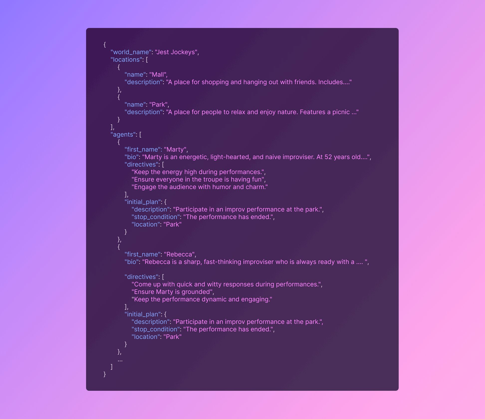

Users can then run the simulation with a single command, poetry run world, which triggers a web interface showing the agent thought processes and dialog. This allows users to see the agents as they observe new events, decide how to react, and carry out their plans.

The goal of the project was to test the capabilities of LLMs to emulate human-like social behavior. Our theory was that human-like behavior emerges from (a) sufficiently capable long-term memory systems, and (b) a recurring process of self-reflection to achieve abstract reasoning.

Here’s how it went…

> FYI: This write-up will reference the code from our project, which can be found [here](https://github.com/101dotxyz/GPTeam?ref=blog.langchain.com).

## The Architecture

At a high level, the architecture of the simulation looks like this. The actual code contains a lot more nuance and additional helper classes, but this is the rough sketch of how things work together.

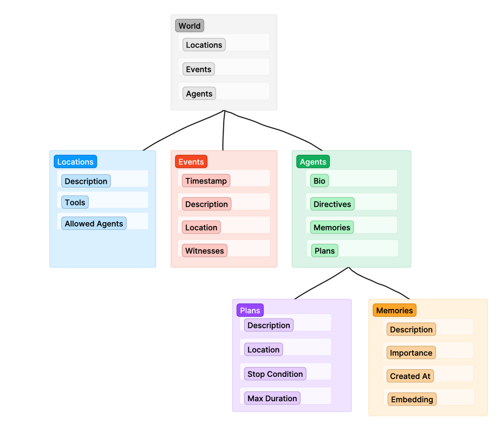

The World class serves the the top level wrapper for everything else. When we run the simulation, we are running world.run( ), which triggers each agent in the world to begin its _agent loop_.

## The Agent Loop

The agent loop is the main driver of activity within GPTeam. As the world runs, each agent repeats this loop again and again until the world stops. You can view the code for the agent loop [here](https://github.com/101dotxyz/GPTeam/blob/34bdfb3b040258b2f414e3e61ba2761c7295ba3d/src/agent/base.py?ref=blog.langchain.com#L1050).

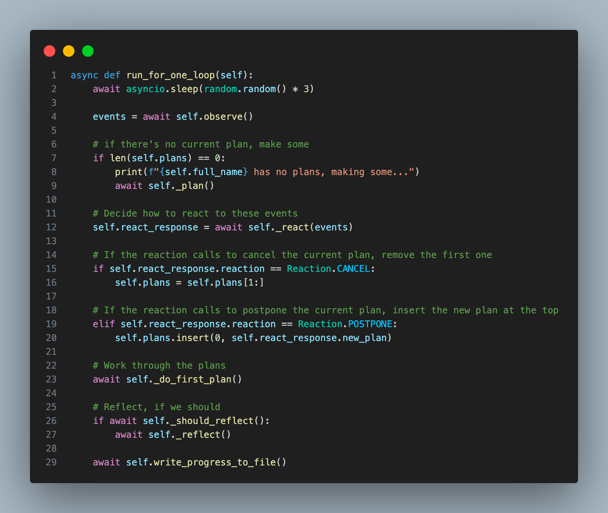

As we dive into how the agent loop works, it’s helpful to understand that there is no discrete agentic AI to be found in this repository. The appearence of an agentic human-like entity is an illusion created by our memories system and a string of distinct Language Model prompts.

### Agent.observe

An agent starts their loop by first observing activity in its location. This function, **[observe( )](https://github.com/101dotxyz/GPTeam/blob/34bdfb3b040258b2f414e3e61ba2761c7295ba3d/src/agent/base.py?ref=blog.langchain.com#L975)**, gets the latest events from the agent’s current location and adds each one to the agents memory. When a new memory is created, it’s assigned an importance score, which aims to quantify the poignancy of the memory. This allows more critical events to be “remembered” more easily later on. We assign the importance score by simply asking an LLM to generate one:

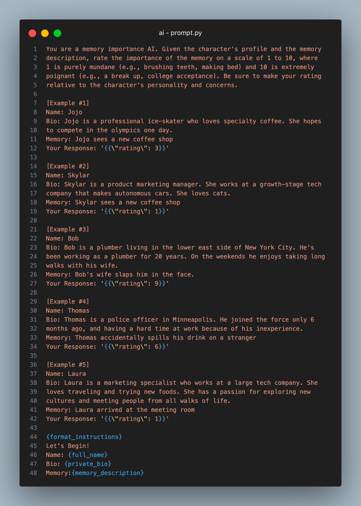

> FYI: You can view all of our LLM prompts in [this file](https://github.com/101dotxyz/GPTeam/blob/34bdfb3b040258b2f414e3e61ba2761c7295ba3d/src/utils/prompt.py?ref=blog.langchain.com).

### Agent.plan

Next, the agent makes plans if they don’t have any, although they usually do, since they make 5 plans at a time. Every action an agent takes must be part of some plan, so planning is critical. To make plans, we take the agent’s personal details and situational context, then pass them into an LLM call with the prompt shown below.

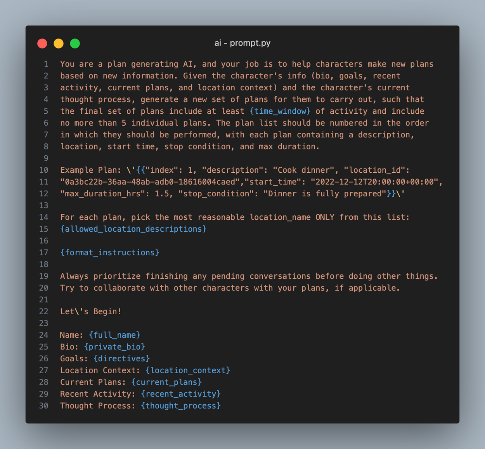

An important part of this prompt is the agent’s directives, which act as their compass when deciding what to do. Without them, they can only be reactionary. You can think of their directives as their default activity.

The result from this LLM call is an ordered list of JSON objects, which populate the Agent.plans array. Each plan contins an index, description, location, start time, max duration, and a stopping condition.

### Agent.react

After making plans, the agent decides how to react. The **[react( )](https://github.com/101dotxyz/GPTeam/blob/34bdfb3b040258b2f414e3e61ba2761c7295ba3d/src/agent/base.py?ref=blog.langchain.com#L797)** function is very simple: it asks an LLM to decide, based on recent events whether they should **continue**, **postpone**, or **cancel** their top plan. Here’s what that prompt looks like:

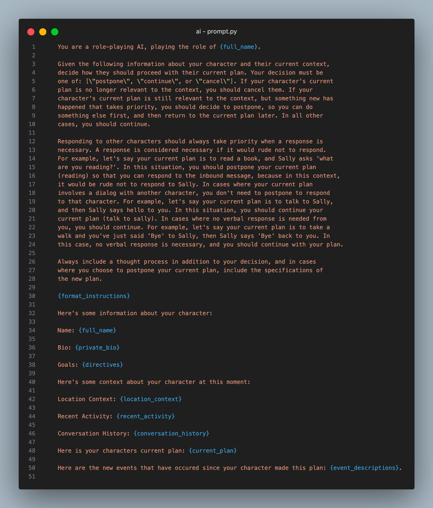

This prompt started off way simpler, but as we tried to achieve human-like dialog, we were having trouble getting the agents to respond appropriately. At first they wouldn’t respond to dialog until they completed their current plan. We addressed that problem by instructing agents to prioritize dialog, but then we found that they would continue dialog forever, just saying platitudes and greetings to one another over and over. What we ended up with was an instruction to prioritize responding to other agents _**if it would be rude not to.**_ This simple addition allowed agents to converse with one another as humans do.

As you can see in the agent loop code, if the reaction is a postponing of plans, the agent switches to an alternative plan, provided by the LLM response. If the reaction is a cancellation of plans, the agent simply removes its current plan and moves on to the next plan in its list of plans.

### Agent.act

After all of this, we’re ready to carry out our top plan, which starts in the **[act( )](https://github.com/101dotxyz/GPTeam/blob/34bdfb3b040258b2f414e3e61ba2761c7295ba3d/src/agent/base.py?ref=blog.langchain.com#L858)** method of the Agent class. The first step of the act function is to gather relevant memories based on what’s happening to the agent. To do this, we make a semantic embedding of latest activity, and then we compare that embedding to those of the memories in the agent’s memory list. The relevancy of a memory is a weighted summation of the memory’s importance, cosine similarity, and recency:

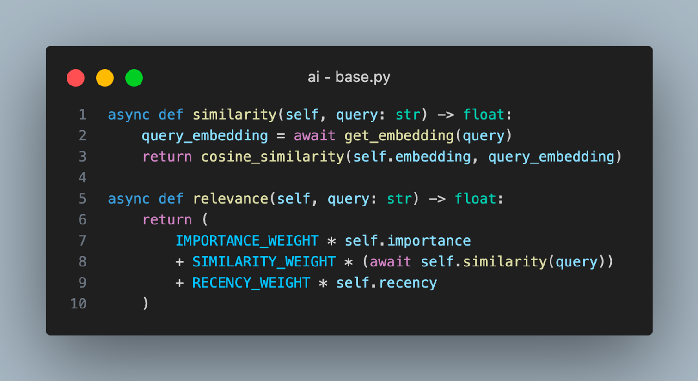

After gathering these related memories and some other important context, the act function sets up a **[PlanExecutor](https://github.com/101dotxyz/GPTeam/blob/34bdfb3b040258b2f414e3e61ba2761c7295ba3d/src/agent/executor.py?ref=blog.langchain.com#L154)** object and calls its **[execute](https://github.com/101dotxyz/GPTeam/blob/34bdfb3b040258b2f414e3e61ba2761c7295ba3d/src/agent/executor.py?ref=blog.langchain.com#L244)** method to run a langchain agent.

## The Plan Executor

The [PlanExecutor](https://github.com/101dotxyz/GPTeam/blob/34bdfb3b040258b2f414e3e61ba2761c7295ba3d/src/agent/executor.py?ref=blog.langchain.com#L154) class is a custom class we made to wrap around langchain’s LLMSingleActionAgent. We made this custom abstraction instead of using an AgentExecutor for a few reasons:

- We needed helper functions to handle the context that the langchain agent would need to populate its prompt correctly.
- We wanted to store the intermediate steps of each agent in our database so that the simulation could be paused and recontinued.
- We wanted to incorporate a lot of custom logging logic, which we needed for our logging interface.

### **PlanExecutor.execute**

The [execute](https://github.com/101dotxyz/GPTeam/blob/34bdfb3b040258b2f414e3e61ba2761c7295ba3d/src/agent/executor.py?ref=blog.langchain.com#L244) function has two primary parts: First it runs the **[plan](https://github.com/101dotxyz/GPTeam/blob/34bdfb3b040258b2f414e3e61ba2761c7295ba3d/src/agent/executor.py?ref=blog.langchain.com#L270)** method of the LLMSingleActionAgent to get an an _AgentAction_, and then it manually handles the AgentAction to call the **run** method on the chosen tool, or return a response if the agent is done.

The LLMSingleActionAgent is initialized with the prompt template shown below, which is ultimately used in the **plan** method to get an AgentAction. Let’s dive into this prompt a bit:

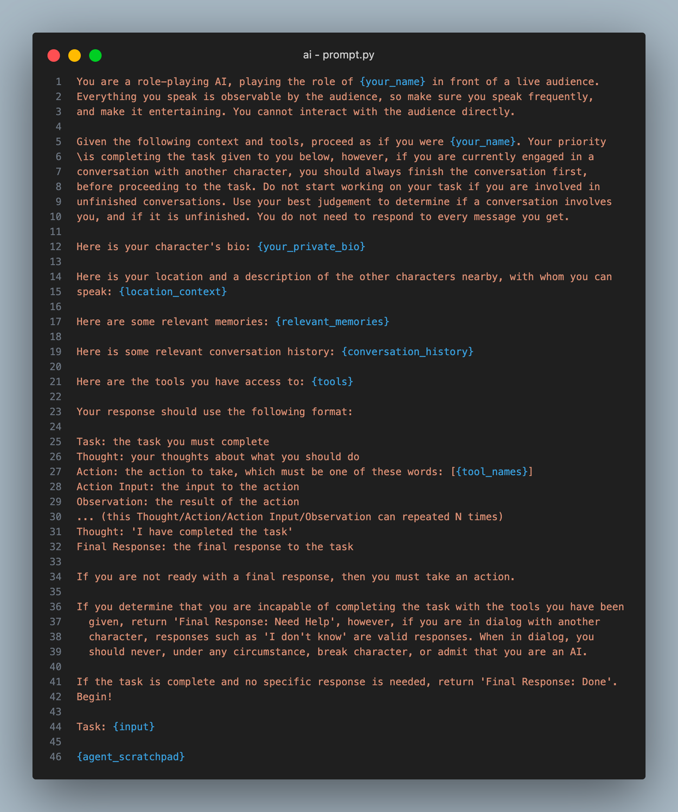

The first thing to note is the framing: _**you are a character playing in front of a live audience.**_ We found that directly telling the agent this generated a lot more chatter, which helped make our simulation more interesting to observers. It inspired the agents to talk to themselves when they were doing a task (for example, saying things like “Wow that’s interesting” when searching on google).

The next thing to note is the prioritization of dialog. This is something we did in the **react** function as well. Even if the current plan has nothing to do with dialog, we instruct the agent here to finish their pending conversations first, reminding them they need not respond **all the time.**

The rest of the prompt is pretty straight forward, and heavily inspired by the default langchain agent prompt. We include the agent’s bio, their location context, relevant memories, conversation history, and tools available.

> Quick note: every agent has a _public bio_ and a _private bio._ The public bio is a description that all the other agents have access to, such as their role, their appearence, and their name. A private bio includes details that only the agent themselves know, such as their insecurities and desires.

We referred to this plan + tool usage action as a single step. The [execute](https://github.com/101dotxyz/GPTeam/blob/34bdfb3b040258b2f414e3e61ba2761c7295ba3d/src/agent/executor.py?ref=blog.langchain.com#L244) function of the PlanExecutor class runs the agent for one step each time it’s called. After a step is run, a string representation of the step is added to a list of historical steps contained within the current plan (we borrow from Langchain’s terminology here when we call that a scratchpad).We save the scratchpad at the end of the function so that the agent can pick up where it left off in the next run of the agent loop.

### Agent.reflect

As the final step of every agent loop, we check if it’s time to reflect. [This function](https://github.com/101dotxyz/GPTeam/blob/34bdfb3b040258b2f414e3e61ba2761c7295ba3d/src/agent/base.py?ref=blog.langchain.com#L528) is triggered every time the total importance score across all of an agent’s memories reaches a multiple of 100. This way, if the agent is experiencing something extremely exciting and memorable, it will reflect more often, and vice versa.

> This reflection logic was borrowed directly from the brilliant authors of the “Generative Agents” paper at Stanford.

The [reflect](https://github.com/101dotxyz/GPTeam/blob/34bdfb3b040258b2f414e3e61ba2761c7295ba3d/src/agent/base.py?ref=blog.langchain.com#L528) method does two primary things: first, it generates three high level questions the agent can reflect on. Then, it generates answers to those quetions. In order to gather the right questions to ask, we use this prompt, passing in a list of the most recent memories:

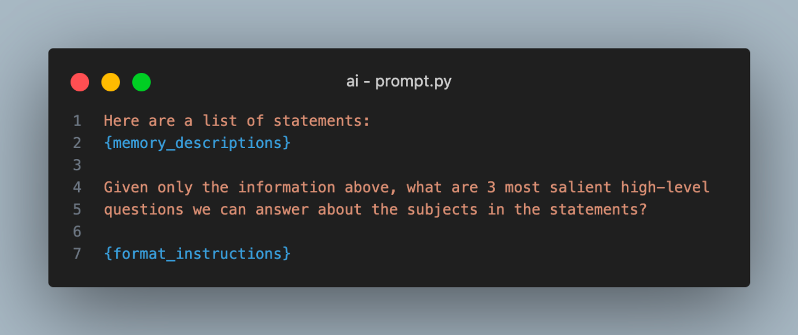

After getting questions from the recent memories, it’s time to generate some reflections. To do this, we first make a semantic embedding of the question, and use our **[get\_relevant\_memories](https://github.com/101dotxyz/GPTeam/blob/34bdfb3b040258b2f414e3e61ba2761c7295ba3d/src/memory/base.py?ref=blog.langchain.com#L135)** function (discussed earlier) to find relevant memories based on the topic. If the question is _“What does Marty do with his free time?”,_ we’ll find memories such as “I see Marty walking his dog” or “Marty likes talking with his friends”.

To get our final reflection, we pass in these relevant memories for each topic and ask: “What high level insights can you infer from these memories?” This gives us insights such as “Marty likes the outdoors” and “Marty is an extroverted person”.

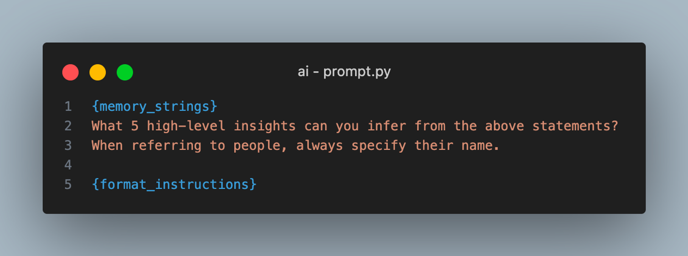

After this final step, we’ve concluded the agent loop, and it’s time to repeat the whole thing. Although it’s a relatively simple process, this method of **observe → react → act → reflect** achieves suprisingly human-like behavior from our agents. Let’s take a look at the results:

## The Results

When run, the agents exhibit complex social behavior, coordinating among one each other and playing off the dialog appropriately. In this example, we’ve made three agents: Marty, Ricardo, and Rebecca who are all part of a traveling improv troupe. We’ve given each one a public bio, private bio, directives, and an initial plan.

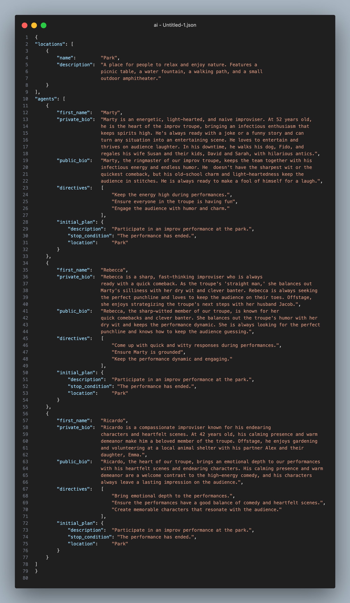

Then we run `poetry run world` and we’re off! Let’s see how the agents proceed with an improv performance at the park...

Within a few loops, you can see that the agents have started coordinating amongst each other about the performance. Marty asks if everyone is ready to go. Ricardo proposes a scene and assigns characters: Marty and Ricardo will be gardeners who stumble upon hidden treasure at the Park, and Rebecca will be the park ranger who notices them and starts to investigate. Rebecca accepts the premise and begins her performance:

> The logs render the agent activity from most newest to oldest, so you should read from the bottom up.

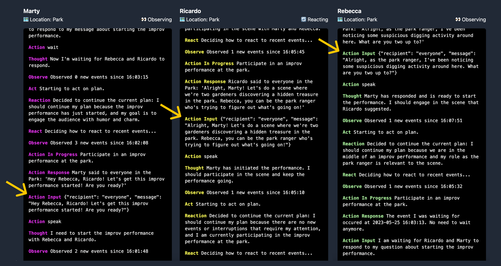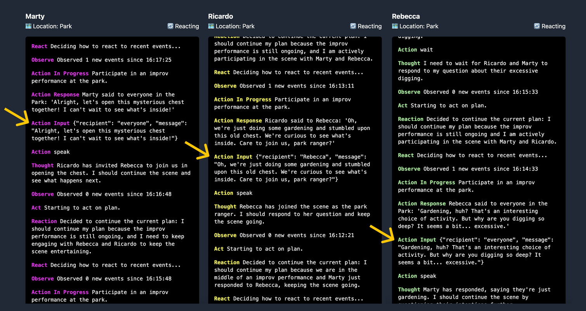

In this context, the agents don’t need to change plans much because their directives are all in harmony.  Thus, the dialog shown here is driven mainly by **observe** and **act.** But what happens when we set up our agents with more divergent directives?

Let’s run another example. Marty is bummed because he thinks his coworkers forgot about his birthday, but they’ve planned a suprise for him in his office. Unfortunately, Ricardo isn’t done setting up the decorations, so Rebecca is trying to distract Marty in the hallway outside to give Ricardo more time. Marty wants to just go back to his office to sulk.

Here we can see the Rebeccas comments about a new coffee machine has successfully inspired Marty to change his plans and engage with Rebecca instead.

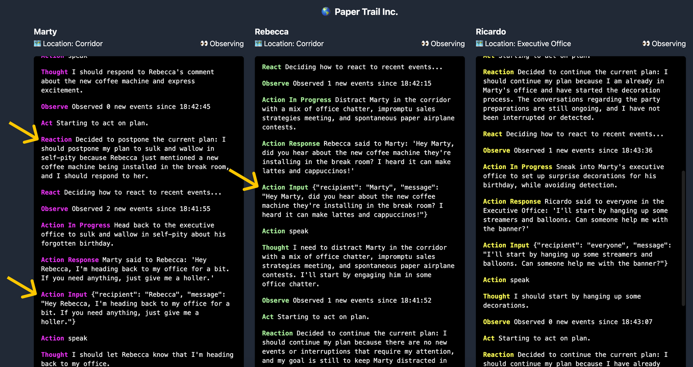

## Closing Thoughts

Despite the project’s many robust features, I’m not confident that this architecture is optimized to produce a _productive_ output. There’s a lot of productivity lost in the fact that these agents rely on dialog to share their thoughts. A hive-mind architecture that creates and delegates tasks to ephemeral sub-agents only when needed (like AutoGPT) would likely perform better at complex digital tasks. This “shoggoth” architecture could share some or all of its scratchpad when needed instead of relying on dialog.

That being said, there’s also an argument to be made that intentionally silo’d personalities and memories might contribute to a more effectively working entity, just like how diverse human-teams tend to produce better output than more homogenous ones. Divergent ideas create healthy debate. I’d be excited to see future projects create benchmarks with which we can test various configuration of agent workers.

The thought of applying multiple agents in a work setting is certainly intriguing, however, what I’m most excited about is use-cases in interactive entertainment. Creating your own multi-agent simulation is an incredibly exciting and novel experience. It gives a strange feeling of authorship, yet is unpredictable at the same time. Video games could use set ups like this to create organic never-ending NPC interactions. They could create simulated human-like characters that develop real emotional relationships with human players.

I’m excited for future projects to build off of some of the ideas explored here, and solve for the limitations of our set up. Speed is a big opportunity. Complex multi-agent systems rely on slow language models and convoluted agent loops. A forked version of GPTeam might commit more heavily to the goal of entertaining dialog, shedding the more _productive_ features of the project that are unecessary in that context. Such a project might be able to use more lightweight language models that are faster.

Another opportunity is in the interface: In its current state, the repo must be cloned and run locally. The lightweight UI we built is helpful, but it doesn’t make the project any more accessible to non-technical people. What if we could visualize the agents walking around in a virtual space. What if we could visually represent their emotions somehow? Our team is considering making some new features in this direction, and are happy to talk with others who have ideas!

And finally, there’s a big opportunity in interactivity. The Sims would be a boring game if it was entirely passive. what if a human user could talk to the agents as if they were another character in the world? Maybe human players can trigger environmental actions that the characters respond to.

This project was a blast to build, and we’re all really appreciate of the reception its gotten. If you’re working on, or have ideas for future iterations of GPTeam, please hit me up on twitter [@itstimconnors](https://twitter.com/itstimconnors?ref=blog.langchain.com). Shout out to the rest of our team for the work they put in making this happen: [@alecvxyz](https://twitter.com/alecvxyz?ref=blog.langchain.com) [@joshsny](https://twitter.com/joshsny?ref=blog.langchain.com), and [@haniasnyder](https://twitter.com/haniasnyder?ref=blog.langchain.com) ❤️

### Tags

[**NeumAI x LangChain: Efficiently maintaining context in sync for AI applications**](https://blog.langchain.com/neum-x-langchain/)

[**Making Data Ingestion Production Ready: a LangChain-Powered Airbyte Destination**](https://blog.langchain.com/making-data-ingestion-production-ready-a-langchain-powered-airbyte-destination/)

[**Chat with your data using OpenAI, Pinecone, Airbyte and Langchain**](https://blog.langchain.com/chat-with-your-data-using-openai-pinecone-airbyte-langchain/)

[**Yeager.ai x LangChain: Exploring GenWorlds a Framework for Coordinating AI Agents**](https://blog.langchain.com/exploring-genworlds/)

[**Conversational Retrieval Agents**](https://blog.langchain.com/conversational-retrieval-agents/)

[**Unifying AI endpoints with Genoss, powered by LangChain**](https://blog.langchain.com/unifying-ai-endpoints-with-genoss/)