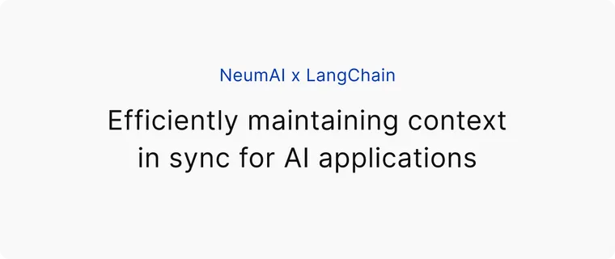
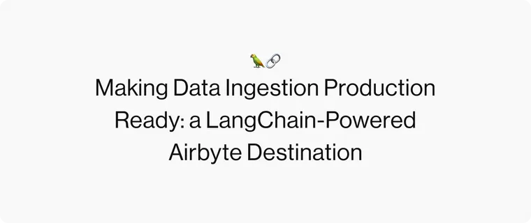

**\[Editor's Note\]: This is the first of hopefully many guest posts. We intend to highlight novel applications building on top of LangChain. If you are interested in working with us on such a post, please reach out to harrison@langchain.dev.**

**This post by [Akash Samant](https://twitter.com/AkashSamant4?ref=blog.langchain.com) highlights an application that we believe achieves user-level personalization in a novel, reproducible, and under-explored way.**

**GPTwitter:** The first personalized AI generated Social Media Platform. Access it here: [https://gptwitter-neon.vercel.app/](https://gptwitter-neon.vercel.app/?ref=blog.langchain.com)

* * *

Nowadays everyone’s media feed feels like a personal bubble– yours is probably comprised of every topic, pop culture reference, or online personality that you might think to enjoy. And you do enjoy it (probably). But all this content is limited. It’s finite, and if everyone that you or I followed suddenly stopped posting – what would you do? I would _hope_ that I would put my phone back down and pick up unaffected, but I’m not sure I _could_ do that, and I’m not convinced most of you would either.

Over the past week, Sean, Bagatur, and I have been thinking about this “end-of-the-world” scenario and how we could do something to fix it with Large Language Models (LLMs). I mean, if Elon Musk isn’t posting, GPT-3 is probably good enough! We’ve been especially interested in creating an experience that learns from your interactions and produces tweets like those you would see on your own feed – all without any explicit personal guidance. We’re happy to present GPTwitter – the product of our semi-dystopian ruminations.

## What is GPTwitter?

[GPTwitter](https://gptwitter-neon.vercel.app/?ref=blog.langchain.com) is a social media platform that learns from your like history and generates personalized tweets just for you, so that you never have to leave the safety of your social media bubble.

Once you login, you can generate tweets, like them, and share them. After you like one of our tweets we’ll make sure to tailor our future ones a bit more specifically to your interests. **But watch** **out**– **you might end up down a rabbit hole of identical tweets and topics.**

It’s likely something you’ll enjoy, so don’t worry, but if you want to escape – _just hit the reset button_, although you might be sad that you did.

## In All Seriousness, What Have We Learned?

Working with LLMs for creative purposes is very different from functional, practical purposes – it demands spontaneity, diversity, and consistency– three things which don’t fit together neatly in model output. Our experiments with GPTwitter, using Langchain AI, revolved around each of these, and we’d like to share them with you.

### \#1: It’s all in the latent space

Early on, we decided to scrap piecemeal methods of generating tweets from discrete topics and styles. They often lead to nonsensical results with little correlation between generated tweets. Instead, we decided to sample directly from the latent space. The prompts we built GPTwitter with only use text from previously generated tweets to create new ones. We were unsure what the result would be – the decision is still up to you, but we’ve been pleasantly surprised with how consistently all the pieces of a tweet thatwould make it unique – length, reference style, topics, hashtag usage, tone, etc. – are inferred by GPT-3.

Specifically, using LangChain terminology, we achieved this by using a [custom example selector](https://python.langchain.com/docs/modules/model_io/prompts/example_selectors/?ref=blog.langchain.com) that selected example tweets probabilistically. A user's initial profile is seeded with 100 tweets, each with an associated weight. For each generated tweet, a certain limited number of tweets (2-5) are selected with probability proportional to their weight. If a generated tweet is liked, we add it to the list of possible tweets to be selected, and increase the weight of the tweets that were used to generate that tweet. In this way, the example selector over time selects tweets that are more representative (in some way) of what you've liked in the past.

As an aside, before deciding to do everything in the latent space, we experimented with generating the tweets in a more controlled manner by specifying the style and content of the example tweets explicitly. Typically, the best results occurred when the data we fed to the model was limited in some way – if the reference tweets we used were similar eg. style, topic, or if we only used a limited number of tweets (2-5). In these scenarios, the LLM was able to extrapolate and identify patterns more easily – spinning topics and styles into interesting mashups.

Some of the best results came from mixing pop culture reference, like this tweet that references Back to the Future:

In the absence of control, we found very erratic nonsensical results – typically mashing topics that wouldn’t make sense with one another.

These issues highlight areas that we’re excited to experiment more with. Specifically, leveraging larger corpuses of reference data to produce _more consistent_ results.

### \#2: Hallucinations can be useful

Despite our disparagement of LLM consistency, we’ve found hallucinations and LLM inconsistency to be interesting sources of output and diversity. Broadly speaking, hallucinations are not useful in most applications because they are not useful as factual pieces of information, so we understand the concern around limiting them.

It’s a good thing GPTwitter isn’t a factual site because we turned the temperature up on our models all the way to 1.0. This is a standard technique for improving output variance and it worked well in producing novel generations from previous tweets.

Here’s a great example of GPT-3 crafting a response from tweets about taxes and crypto:

In general, we think that hallucinations are underused. They indicate that LLMs have creative output capabilities, and for creative workflows, they can be incredibly useful. One of the problems we faced was producing more valuable hallucinations – higher variance, higher quality tweets at a higher frequency. Our compromise was to tighten our selection process, but we haven’t explored all our options nor arrived at our ideal solution. We think inducing _chains of thought_ used in other problem-solving areas, perhaps tailored for the creative process, could be an interesting avenue to look to in the future.

## Final Thoughts

We had a fun time building GPTwitter, and we hope you enjoy it as much as we have.

It’s exciting to think of all the changes that are underway as LLM technologies develop – we’ll be continuing to experiment with applications of LLMs, to augment and improve the personal creative process. You can find [Bagatur](https://twitter.com/baga_tur?ref=blog.langchain.com), [Sean](https://twitter.com/_seanyneutron?ref=blog.langchain.com), or [Akash](https://twitter.com/AkashSamant4?ref=blog.langchain.com) on Twitter.

We’ll leave you with one of our favorite generated inspirational tweets below:

### Tags

[**NeumAI x LangChain: Efficiently maintaining context in sync for AI applications**](https://blog.langchain.com/neum-x-langchain/)

[**Making Data Ingestion Production Ready: a LangChain-Powered Airbyte Destination**](https://blog.langchain.com/making-data-ingestion-production-ready-a-langchain-powered-airbyte-destination/)

[**Chat with your data using OpenAI, Pinecone, Airbyte and Langchain**](https://blog.langchain.com/chat-with-your-data-using-openai-pinecone-airbyte-langchain/)

[**Yeager.ai x LangChain: Exploring GenWorlds a Framework for Coordinating AI Agents**](https://blog.langchain.com/exploring-genworlds/)

[**Conversational Retrieval Agents**](https://blog.langchain.com/conversational-retrieval-agents/)

[**Unifying AI endpoints with Genoss, powered by LangChain**](https://blog.langchain.com/unifying-ai-endpoints-with-genoss/)