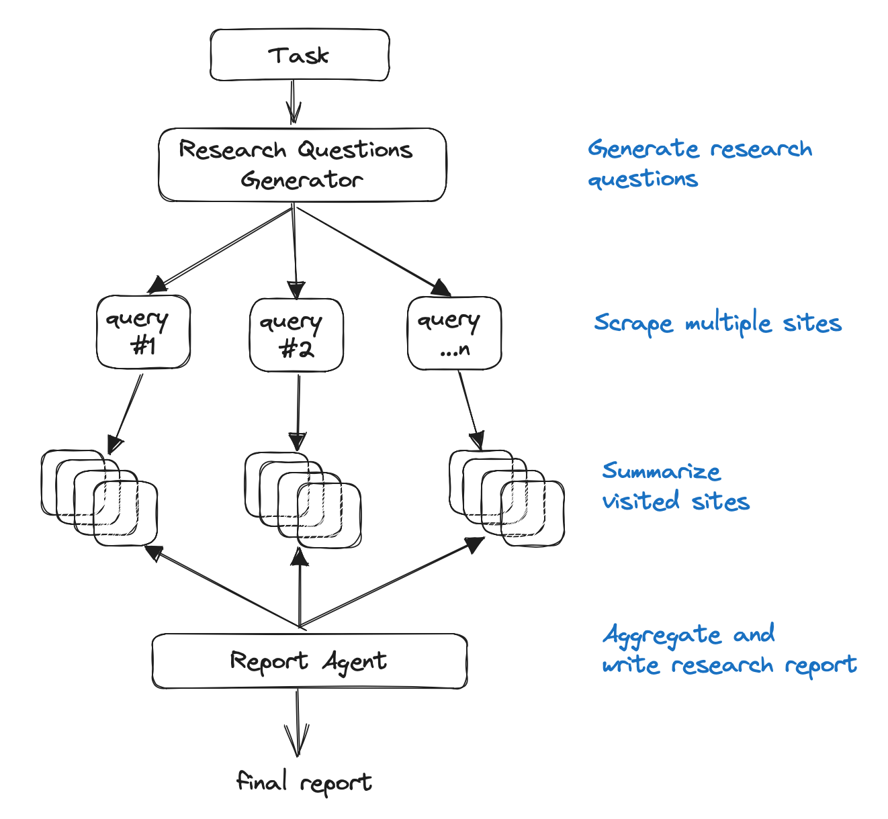
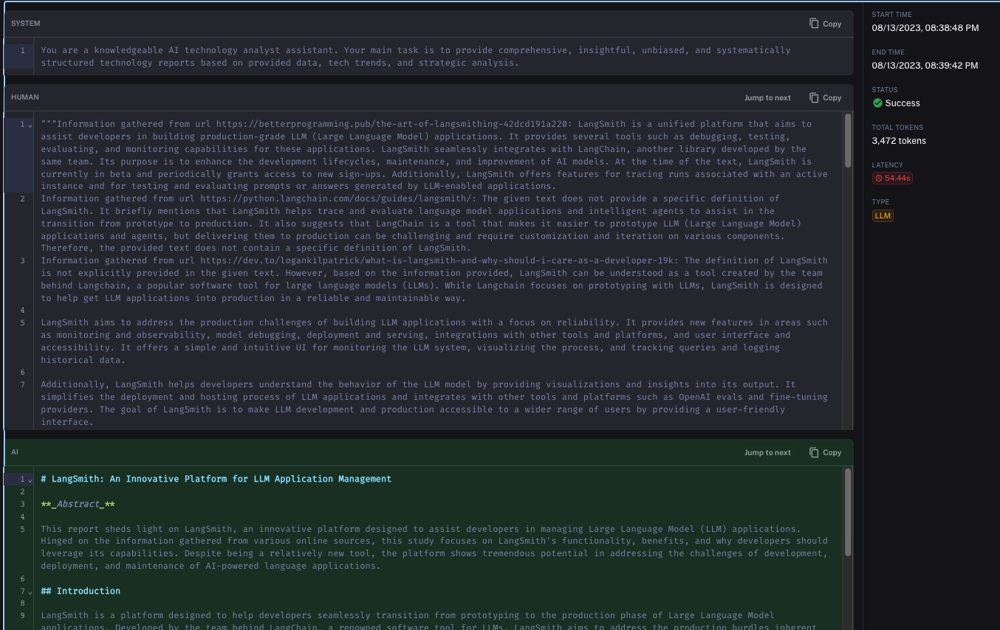
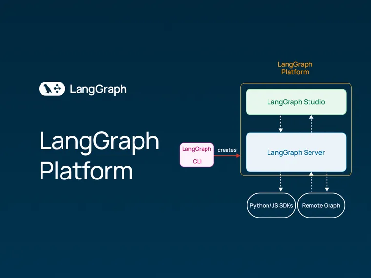

Here at LangChain we think that web research is fantastic use case for LLMs. So much so that we wrote a [blog on it](https://blog.langchain.com/automating-web-research/) about a month ago. In that blog we mentioned the leading open-source implementation of a research assistant - [gpt-researcher](https://github.com/assafelovic/gpt-researcher?ref=blog.langchain.com). Today we're excited to announce that GPT Researcher is integrated with LangChain. Specifically, it is integrated with our OpenAI adapter, which allows (1) easy usage of other LLM models under the hood, (2) easy logging with LangSmith.

What is GPT Researcher? From the GitHub repo:

> The main idea is to run "planner" and "execution" agents, whereas the planner generates questions to research, and the execution agents seek the most related information based on each generated research question. Finally, the planner filters and aggregates all related information and creates a research report. The agents leverage both gpt3.5-turbo-16k and gpt-4 to complete a research task.
>
> More specifcally:
>
> \- Generate a set of research questions that together form an objective opinion on any given task.
>
> \- For each research question, trigger a crawler agent that scrapes online resources for information relevant to the given task.
>
> \- For each scraped resources, summarize based on relevant information and keep track of its sources.
>
> \- Finally, filter and aggregate all summarized sources and generate a final research report.

An image of the architecture can be seen below.



Under the hood this uses OpenAI's `ChatCompletion` endpoint. As number of viable models has started to increase (Anthropic, Llama2, Vertex models) we've been chatting with the GPT Researcher team about integrating LangChain. This would allow them to take advantage of the [~10 different Chat Model integrations](https://python.langchain.com/docs/integrations/chat/?ref=blog.langchain.com) that we have. It would also allow users to take advantage of [LangSmith](https://blog.langchain.com/announcing-langsmith/) \- our recently announced debugging/logging/monitoring platform.

In order to make this transition as seamless as possible we added an OpenAI adapter that can serve as a drop-in replacement for OpenAI. For a full walkthrough of this adapter, see the documentation [here](https://python.langchain.com/docs/guides/adapters/openai?ref=blog.langchain.com). This adapter can be use by the following code swap:

```
- import openai
+ from langchain.adapters import openai
```

See [here](https://github.com/assafelovic/gpt-researcher/pull/124?ref=blog.langchain.com) for the full PR enabling it on the GPT Researcher repo.

The first benefit this provides is enabling easy usage of other models. By passing in `provider="ChatAnthropic", model="claude-2",` to create, you easily use Anthropic's Claude model.

The second benefit this provides is seamless integration with LangSmith. Under the hood, GPT Researcher makes many separate LLM calls. This complexity is a big part of why it's able to perform so well. As the same time, this complexity can also make it more difficult to debug and understand what is going on. By enabling LangSmith, you can easily track that.

For example, here is the [LangSmith trace](https://smith.langchain.com/public/84fb4bdc-f228-4192-a265-06f169b7d657/r?ref=blog.langchain.com) for the call to the language model when it's generating an agent description to use:

And here is the [LangSmith trace](https://smith.langchain.com/public/37aa9e0a-ed65-4f9e-97eb-866b1bfa61f3/r?ref=blog.langchain.com) for the final call to the language model - when it asks it to write the final report:



We're incredibly excited to be supporting GPT Researcher. We think this is one of the biggest opportunities for LLMs. We also think GPT Researcher strikes an appropriate balance, where the architecture is certainly very complex but it's more focused than a completely autonomous agent. We think applications that manage to strike that balance are the future, and we're very excited to be able to partner with and support them in any way.

### Tags

[By LangChain](https://blog.langchain.com/tag/by-langchain/)


[](https://blog.langchain.com/evaluating-deep-agents-our-learnings/)

[**Evaluating Deep Agents: Our Learnings**](https://blog.langchain.com/evaluating-deep-agents-our-learnings/)

[By LangChain](https://blog.langchain.com/tag/by-langchain/) 7 min read

[](https://blog.langchain.com/end-to-end-opentelemetry-langsmith/)

[**Introducing End-to-End OpenTelemetry Support in LangSmith**](https://blog.langchain.com/end-to-end-opentelemetry-langsmith/)

[By LangChain](https://blog.langchain.com/tag/by-langchain/) 3 min read

[](https://blog.langchain.com/langchain-state-of-ai-2024/)

[**LangChain State of AI 2024 Report**](https://blog.langchain.com/langchain-state-of-ai-2024/)

[By LangChain](https://blog.langchain.com/tag/by-langchain/) 6 min read

[](https://blog.langchain.com/opentelemetry-langsmith/)

[**Introducing OpenTelemetry support for LangSmith**](https://blog.langchain.com/opentelemetry-langsmith/)

[By LangChain](https://blog.langchain.com/tag/by-langchain/) 4 min read

[](https://blog.langchain.com/easier-evaluations-with-langsmith-sdk-v0-2/)

[**Easier evaluations with LangSmith SDK v0.2**](https://blog.langchain.com/easier-evaluations-with-langsmith-sdk-v0-2/)

[By LangChain](https://blog.langchain.com/tag/by-langchain/) 4 min read

[](https://blog.langchain.com/langgraph-platform-announce/)

[**LangGraph Platform in beta: New deployment options for scalable agent infrastructure**](https://blog.langchain.com/langgraph-platform-announce/)

[By LangChain](https://blog.langchain.com/tag/by-langchain/) 4 min read