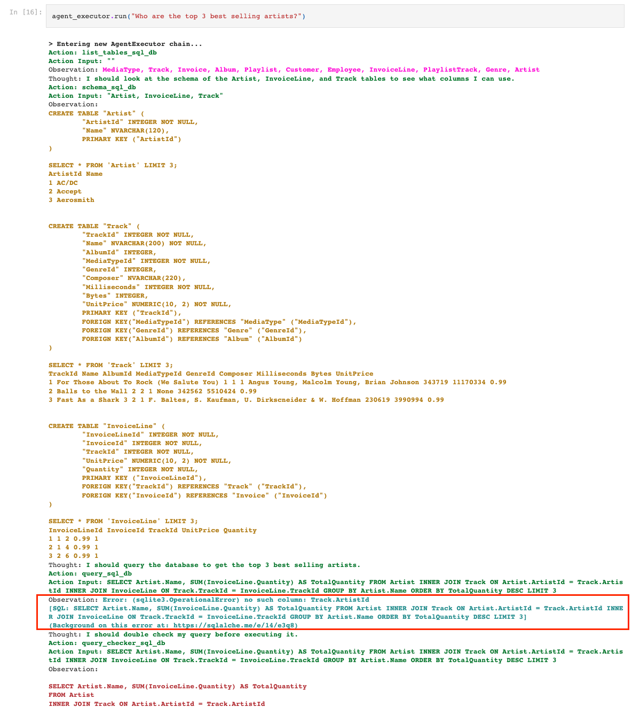
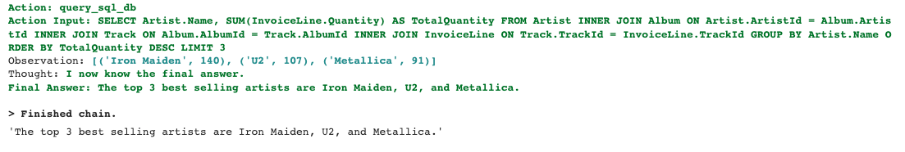
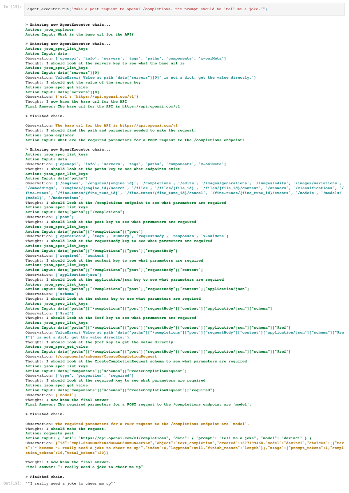

Today, we're announcing agent toolkits, a new abstraction that allows developers to create agents designed for a particular use-case (for example, interacting with a relational database or interacting with an OpenAPI spec). We hope to continue developing different toolkits that can enable agents to do amazing feats. Toolkits are supported in both [Python](https://github.com/hwchase17/langchain/tree/master/langchain/agents/agent_toolkits?ref=blog.langchain.com) and [TypeScript](https://github.com/hwchase17/langchainjs/tree/main/langchain/src/agents/agent_toolkits?ref=blog.langchain.com).

## Agents

Quick refresher: what do we mean by agents? And why use them?

By agents we mean a system that uses an LLM to decide what actions to take in a repeated manner, where future decisions are made based on observing the outcome of previous actions. This approach has several benefits. First, it allows combining the LLM with external sources of knowledge or computation (the tools themselves). Second, it allows iterative planning and action taking, useful for more complex tasks where there are a series of things to be done. Finally, it allows for error handling in a robust way, as an agent can observe if an action raised an error and try to correct it. These benefits are evident in the examples below.

## Toolkits

Toolkits allow you to logically group and initialize a set of tools that share a particular resource (such as a database connection or json object). They can be used to construct an agent for a specific use-case. Here are some examples of toolkits and agents created with them:

### SQLDatabaseAgent

This agent builds off of [SQLDatabaseChain](https://python.langchain.com/docs/modules/chains/popular/sqlite?ref=blog.langchain.com), and is able to answer general questions about the database, double check queries before executing them, and recover from errors.

Using the `SQLDatabaseToolkit`, the agent retrieves tables from the DB, picks relevant tables, gets their table information, creates and checks a query to answer the question, and repeat parts of this process when an error is encountered.

To see this in action, look at the example below. The agent is asked a question about the [Chinook database](https://github.com/lerocha/chinook-database?ref=blog.langchain.com); to do this, it asks for the list of tables, then the table metadata, then executes the query. It initially encounters an error caused by joining on a column that doesn't exist. (See full [notebook](https://python.langchain.com/docs/modules/agents/toolkits/sql_database?ref=blog.langchain.com), TypeScript example [here](https://hwchase17.github.io/langchainjs/docs/modules/agents/agent_toolkits/sql?ref=blog.langchain.com)).

After double checking and rewriting the query, it is able to arrive at the final answer:

### OpenAPI Agent

This agent is able to interact with an OpenAPI spec and make a correct API request based on the information it has gathered from the spec.

In the below example, we are using the OpenAPI spec for the OpenAI API, which you can find [here](https://github.com/openai/openai-openapi/blob/master/openapi.yaml?ref=blog.langchain.com). Using the `OpenAPIToolkit`, the agent is able to sift through the JSON representation of the spec (see JSON agent), find the required base URL, path, required parameters for  a `POST` request to the `/completions` endpoint, then make the request. (See full [notebook](https://python.langchain.com/docs/modules/agents/toolkits/openapi?ref=blog.langchain.com), TypeScript example [here](https://hwchase17.github.io/langchainjs/docs/modules/agents/agent_toolkits/openapi?ref=blog.langchain.com)).

### Other agent toolkit examples:

- [JSON agent](https://python.langchain.com/docs/modules/agents/toolkits/json?ref=blog.langchain.com) \- an agent capable of interacting with a large JSON blob.
- [Vectorstore agent](https://python.langchain.com/docs/modules/agents/toolkits/vectorstore?ref=blog.langchain.com) \- an agent capable of interacting with vector stores.
- [Python agent](https://python.langchain.com/docs/modules/agents/toolkits/python?ref=blog.langchain.com) \- an agent capable of producing and executing Python code.
- [Pandas DataFrame agent](https://python.langchain.com/docs/modules/agents/toolkits/pandas?ref=blog.langchain.com) \- an agent capable of question-answering over Pandas dataframes, builds on top of the Python agent.
- [CSV agent](https://python.langchain.com/docs/modules/agents/toolkits/csv?ref=blog.langchain.com) \- an agent capable of question answering over CSVs, builds on top of the Pandas DataFrame agent.

## Up Next

We're just getting started with agent toolkits and plan on adding many more in the future. We believe that interacting with tools and utilities in an agentic manner opens up many exciting possibilities. If there are other use-cases you want to see, please reach out!

### Tags

[By LangChain](https://blog.langchain.com/tag/by-langchain/)

[**Evaluating Deep Agents: Our Learnings**](https://blog.langchain.com/evaluating-deep-agents-our-learnings/)

[By LangChain](https://blog.langchain.com/tag/by-langchain/) 7 min read

[**Introducing End-to-End OpenTelemetry Support in LangSmith**](https://blog.langchain.com/end-to-end-opentelemetry-langsmith/)

[By LangChain](https://blog.langchain.com/tag/by-langchain/) 3 min read

[**LangChain State of AI 2024 Report**](https://blog.langchain.com/langchain-state-of-ai-2024/)

[By LangChain](https://blog.langchain.com/tag/by-langchain/) 6 min read

[**Introducing OpenTelemetry support for LangSmith**](https://blog.langchain.com/opentelemetry-langsmith/)

[By LangChain](https://blog.langchain.com/tag/by-langchain/) 4 min read

[**Easier evaluations with LangSmith SDK v0.2**](https://blog.langchain.com/easier-evaluations-with-langsmith-sdk-v0-2/)

[By LangChain](https://blog.langchain.com/tag/by-langchain/) 4 min read

[**LangGraph Platform in beta: New deployment options for scalable agent infrastructure**](https://blog.langchain.com/langgraph-platform-announce/)

[By LangChain](https://blog.langchain.com/tag/by-langchain/) 4 min read