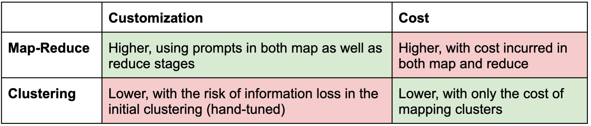
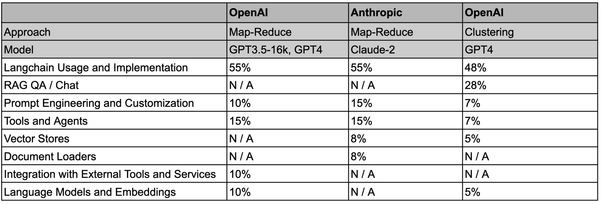

### Introduction

We're strongly committed to consistently enhancing our [documentation](https://python.langchain.com/docs/get_started/introduction.html?ref=blog.langchain.com) and its navigability. Using [Mendable](https://www.mendable.ai/?ref=blog.langchain.com), a AI-enabled chat application, users can search our documentation using keywords or questions. Over time, Mendable has collected a large dataset of questions that highlights areas for documentation improvement.

### Challenge

Distilling common themes from tens of thousands of questions per month is a significant challenge. Manual labeling can be effective, but is slow and laborious. [Statistical methods](https://en.wikipedia.org/wiki/Latent_Dirichlet_allocation?ref=blog.langchain.com) can analyze word distributions to infer common topics, but may not capture the semantic richness and context of the questions.

### Proposal

LLMs can help us [summarize](https://www.youtube.com/watch?v=qaPMdcCqtWk&ref=blog.langchain.com)  and identify documentation gaps from the questions collected by [Mendable](https://www.mendable.ai/?ref=blog.langchain.com). We experimented with two methods to pass large question datasets to an LLM: 1) Group similar questions via clustering before summarizing each group and 2) Apply a map-reduce approach that splits questions into small segments, summarizes each, and then combines them into a final synthesis.

Approaches for summarizing large datasets of user questions

There are tradeoffs between the approaches, which we wanted to examine:

Trade-offs between clustering and map-reduce

### Results

We tested an end-to-end LLM summarization pipeline that uses [LangChain’s map-reduce chain](https://python.langchain.com/docs/modules/chains/popular/summarize?ref=blog.langchain.com) to split questions into groups based on the context window of either [GPT-3.5-16k](https://openai.com/blog/function-calling-and-other-api-updates?ref=blog.langchain.com) (16k tokens) or [Claude-2](https://www.anthropic.com/index/claude-2?ref=blog.langchain.com) (100k tokens), summarize each (map), and then distill the group summaries into a final synthesis (reduce).

We also tested [k-Means clustering](https://en.wikipedia.org/wiki/K-means_clustering?ref=blog.langchain.com) of embedded questions followed by [GPT-4](https://openai.com/research/gpt-4?ref=blog.langchain.com) to summarize each cluster, an approach [similar to what OpenAI](https://github.com/openai/openai-cookbook/blob/main/examples/Clustering.ipynb?ref=blog.langchain.com) reported in one of their cookbooks. For consistency, we use the same input dataset as map-reduce.

We open sourced the notebooks and the data (see repo [here](https://github.com/mendableai/QA_clustering?ref=blog.langchain.com)) so that this analysis can be reproduced. [Here](https://docs.google.com/spreadsheets/d/1z-LakOhgP7Oskf29Q3nmud0e6fQqjraSAmFrvI_5UGM/edit?usp=sharing&ref=blog.langchain.com) is a sheet with detailed results, which we summarize in the table below; we asked both methods to summarize the major question themes being asked by users with a proportion of questions that fall into each bucket:

Distribution of question themes summarized in different experiments

Specific themes can be interrogated using alternative summarization prompts; for example, using map-reduce was can ask the reduce stage to return top questions on a specific theme (e.g., data processing). For example, using this reduce prompt:

```
The following is a list of summaries for questions entered into a Q+A system:
{question_summaries}

Take these and distill it into a final, consolidated list with:
(1) the top 10 question related to loading, processing, and manipulating different types of data and documents.
(2) estimate the proportion of each question
```

We get granular thematic breakdown of the Top 10 Questions Related to Loading, Processing, and Manipulating Different Types of Data and Documents:

```
1. "How can I load a PDF file and split it into chunks using langchain?" - 15%`
2. "How do I load and process a CSV file using Langchain?" - 12%
3. "How do I use the 'readfiletool' to load a text file?" - 11%
4. "How do I use Langchain to summarize a PDF document using the LLM model?" - 10%
5. "What are the different data loaders available in Langchain, and how do I choose the right one for my use case?" - 9%
6. "How do I load and process multiple PDFs?" - 9%
7. "How do I load all documents in a folder?" - 8%
8. "How do I split a string into a list of words in Python?" - 8%
9. "How do I load and process HTML content using BeautifulSoup?" - 8%
10. "How can I add metadata to the Pinecone upsert?" - 10%
```

To get better diagnostic analysis of the cost, we use soon-to-launch LangChain tooling to compare diagnostics (token usage, etc) for the approaches. For example, we quantify token usage, which shows that map-reduce indeed has higher cost:

- ~500k tokens
- ~80k tokens (~8k / cluster with 10 clusters)

### Summary

As expected, there are trade-offs between the approaches. Map-Reduce provides high customizability because questions can be split into arbitrarily granular groups and summarized with tunable map-reduce prompts. However, the cost may be considerably higher as noted by token usage. Clustering risks information loss due to hand-tuning (e.g., of the cluster number) in the preprocessing stage, but it offers lower cost and may be a sensible way to quickly compressive very large datasets prior to more granular (and high cost) LLM summarization. The thoughtful union of these two methods offers considerable promise for addressing this challenge.

### Tags

[By LangChain](https://blog.langchain.com/tag/by-langchain/)


[](https://blog.langchain.com/evaluating-deep-agents-our-learnings/)

[**Evaluating Deep Agents: Our Learnings**](https://blog.langchain.com/evaluating-deep-agents-our-learnings/)

[By LangChain](https://blog.langchain.com/tag/by-langchain/) 7 min read

[](https://blog.langchain.com/end-to-end-opentelemetry-langsmith/)

[**Introducing End-to-End OpenTelemetry Support in LangSmith**](https://blog.langchain.com/end-to-end-opentelemetry-langsmith/)

[By LangChain](https://blog.langchain.com/tag/by-langchain/) 3 min read

[](https://blog.langchain.com/langchain-state-of-ai-2024/)

[**LangChain State of AI 2024 Report**](https://blog.langchain.com/langchain-state-of-ai-2024/)

[By LangChain](https://blog.langchain.com/tag/by-langchain/) 6 min read

[](https://blog.langchain.com/opentelemetry-langsmith/)

[**Introducing OpenTelemetry support for LangSmith**](https://blog.langchain.com/opentelemetry-langsmith/)

[By LangChain](https://blog.langchain.com/tag/by-langchain/) 4 min read

[](https://blog.langchain.com/easier-evaluations-with-langsmith-sdk-v0-2/)

[**Easier evaluations with LangSmith SDK v0.2**](https://blog.langchain.com/easier-evaluations-with-langsmith-sdk-v0-2/)

[By LangChain](https://blog.langchain.com/tag/by-langchain/) 4 min read

[](https://blog.langchain.com/langgraph-platform-announce/)

[**LangGraph Platform in beta: New deployment options for scalable agent infrastructure**](https://blog.langchain.com/langgraph-platform-announce/)

[By LangChain](https://blog.langchain.com/tag/by-langchain/) 4 min read