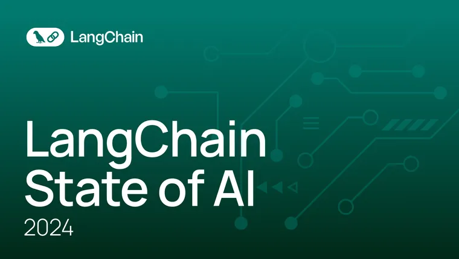

We’re excited to roll out initial asynchronous support in LangChain by leveraging the [asyncio](https://docs.python.org/3/library/asyncio.html?ref=blog.langchain.com) library. Asyncio uses uses coroutines and an event loop to perform non-blocking I/O operations; these coroutines are able to “pause” (`await`) while waiting on their ultimate result and let other routines run in the meantime. To learn more about asyncio and how it compares to multithreading and multiprocessing, check out this [awesome tutorial](https://realpython.com/async-io-python/?ref=blog.langchain.com).

## Motivation

Since LangChain applications tend to be fairly I/O and network bound (calling LLM APIs and interacting with data stores), asyncio offers significant advantages by allowing you to run LLMs, chains, and agents concurrently: while one agent is waiting for an LLM call or tool to complete, another one can continue to make progress. Async support in LangChain also allows you to more seamlessly integrate your async chains and agents into frameworks that support asyncio, such as [`FastAPI`](https://fastapi.tiangolo.com/?ref=blog.langchain.com).

Check out the async agent [docs](https://python.langchain.com/docs/modules/agents/how_to/async_agent?ref=blog.langchain.com) in particular to see how significantly concurrent execution can speed things up!

## Usage

As a starting point, we’ve implemented async support for:

`LLM` via `agenerate` (see [docs](https://python.langchain.com/docs/modules/model_io/models/llms/how_to/async_llm?ref=blog.langchain.com)):

- `OpenAI`

`Chain` via `arun` and `acall` (see [docs](https://python.langchain.com/docs/modules/chains/how_to/async_chain?ref=blog.langchain.com)):

- `LLMChain`
- `LLMMathChain`

`Agent` and `Tool` via `arun` (see [docs](https://python.langchain.com/docs/modules/agents/how_to/async_agent?ref=blog.langchain.com)):

- `SerpAPIWrapper`
- `LLMMathChain`

## Up Next

We’re just getting started with asyncio. In the near future, we hope to add:

- Async support for more LLMs, Chains, and Agent tools
- Ability to run multiple tools concurrently for a single action input
- Async support for callback handlers
- More seamless support with tracing

### Tags

[By LangChain](https://blog.langchain.com/tag/by-langchain/)

[**Evaluating Deep Agents: Our Learnings**](https://blog.langchain.com/evaluating-deep-agents-our-learnings/)

[By LangChain](https://blog.langchain.com/tag/by-langchain/) 7 min read

[**Introducing End-to-End OpenTelemetry Support in LangSmith**](https://blog.langchain.com/end-to-end-opentelemetry-langsmith/)

[By LangChain](https://blog.langchain.com/tag/by-langchain/) 3 min read

[**LangChain State of AI 2024 Report**](https://blog.langchain.com/langchain-state-of-ai-2024/)

[By LangChain](https://blog.langchain.com/tag/by-langchain/) 6 min read

[**Introducing OpenTelemetry support for LangSmith**](https://blog.langchain.com/opentelemetry-langsmith/)

[By LangChain](https://blog.langchain.com/tag/by-langchain/) 4 min read

[**Easier evaluations with LangSmith SDK v0.2**](https://blog.langchain.com/easier-evaluations-with-langsmith-sdk-v0-2/)

[By LangChain](https://blog.langchain.com/tag/by-langchain/) 4 min read

[**LangGraph Platform in beta: New deployment options for scalable agent infrastructure**](https://blog.langchain.com/langgraph-platform-announce/)

[By LangChain](https://blog.langchain.com/tag/by-langchain/) 4 min read