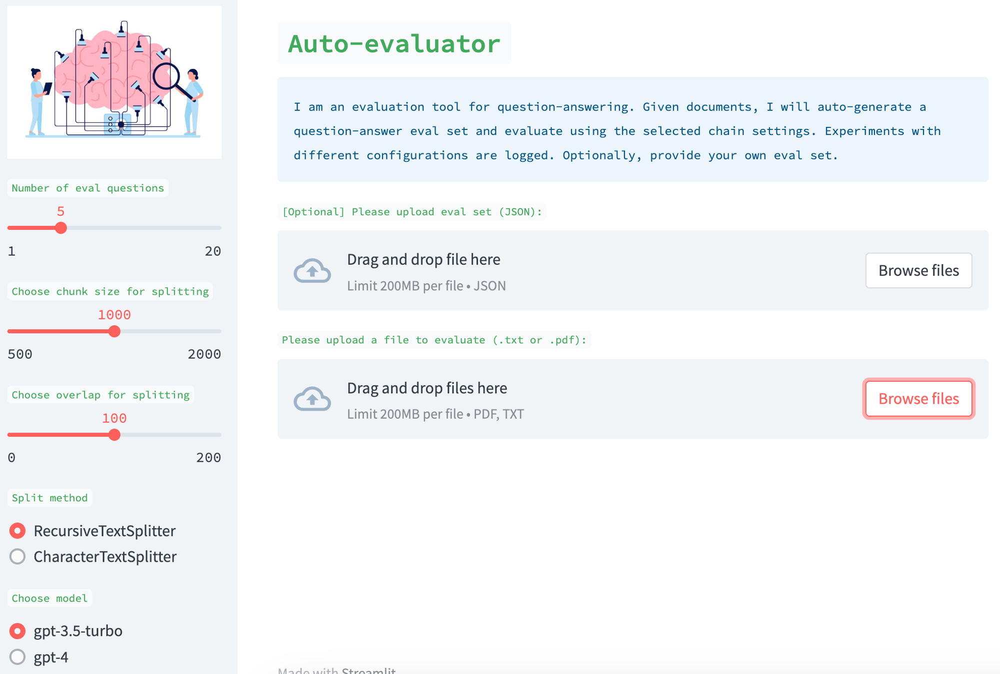
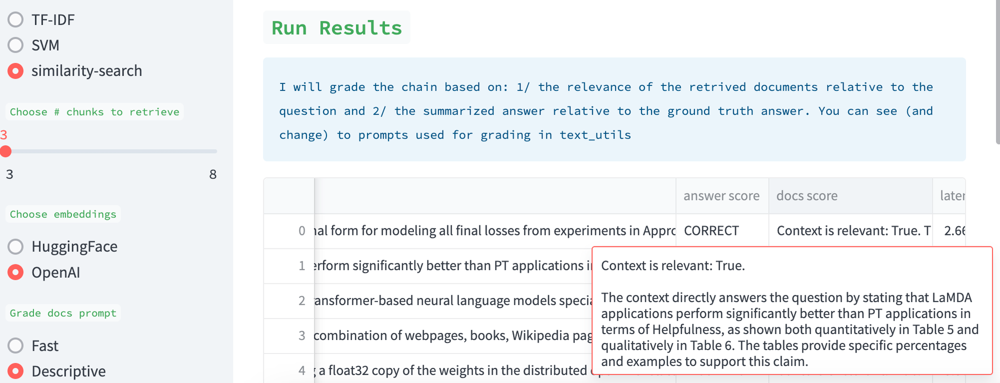
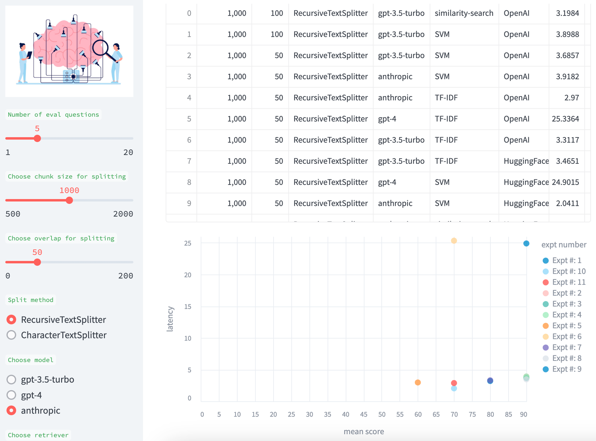
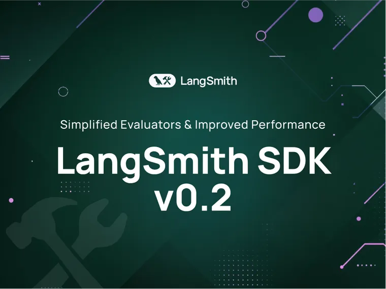

By [Lance Martin](https://twitter.com/RLanceMartin?ref=blog.langchain.com)

**Context**

LLM ops platforms, such as [LangChain](https://python.langchain.com/docs/get_started/introduction?ref=blog.langchain.com), make it easy to assemble LLM components (e.g., models, document retrievers, data loaders) into chains. [Question-Answering](https://python.langchain.com/docs/use_cases/question_answering/?ref=blog.langchain.com) is one of the most popular applications of these chains. But it is often not always obvious to determine what parameters (e.g., chunk size) or components (e.g., model choice, VectorDB) yield the best QA performance.

Here, we introduce a simple tool for evaluating QA chains ( [see the code here](https://github.com/PineappleExpress808/auto-evaluator?ref=blog.langchain.com)) called `auto-evaluator`

- Ask the user to input a set of documents of interest
- Use an LLM (`GPT-3.5-turbo`) to auto-generate `question-answer` pairs from these docs
- Generate a question-answering chain with a specified set of UI-chosen configurations
- Use the chain to generate a response to each `question`
- Use an LLM (`GPT-3.5-turbo`) to score the response relative to the `answer`
- Explore scoring across various chain configurations

**User Inputs**

This is implemented as a  [Streamlit](https://streamlit.io/?ref=blog.langchain.com) app where a user can supply a set of documents. Optionally, the user can also supply a corresponding set of question-answer pairs (see example [here](https://github.com/PineappleExpress808/auto-evaluator/tree/main/docs/karpathy-lex-pod?ref=blog.langchain.com)). If the user does not supply this, the app with auto-generate an eval set using `QAGenerationChain`. You can see the prompt used for this [here](https://github.com/hwchase17/langchain/blob/master/langchain/evaluation/qa/generate_prompt.py?ref=blog.langchain.com), which selects question-answer pairs from random chunks for the input.

**Chain**

The UI has various [knobs](https://github.com/PineappleExpress808/auto-evaluator?ref=blog.langchain.com) that can be used to create a QA chain. For example, you can pick from newer document retrievers (e.g., an [SVM](https://twitter.com/hwchase17/status/1647328542529843200?s=20&ref=blog.langchain.com)) or you can use similarity search on a vectorstore. You can select various document split methods, split sizes, and split overlap. You can also select the LLM used for final summarization of the answer to the question from the retrieved docs. These different pieces can be quickly and easily assembled using Langchain into a chain for evaluation.

**Scoring**

We use an LLM (`GPT-3.5-turbo`) to score the quality of the retrieved docs, which is an idea inspired by discussion with Jerry Liu at LLama-Index ( [here](https://github.com/jerryjliu/llama_index/blob/main/examples/test_wiki/TestNYC-Benchmark-GPT4.ipynb?ref=blog.langchain.com)). We also use an LLM to score the quality of the answers relative to the evaluation set. In both cases, we expose the [prompts](https://github.com/PineappleExpress808/auto-evaluator/blob/main/text_utils.py?ref=blog.langchain.com). Users can easily engineer them. We also expose the results for human inspection; the `Descriptive` prompt can be used to ask the LLM grader for a detailed explanation of its assessment.

**Comparison**

We accumulate experimental results for easy comparison across the various tests, with a table and a scatter plot of the mean score (answer and retrieval) versus the model latency (in sec).

**Future directions**

Feedback and contributions are welcome; for example, we would like to include other retrievers (such as LLama-Index) and other models (e.g., various HuggingFace models). We’d like to improve the performance (e.g., in particular, the latency) of various stages in the eval process and offer this as a free hosted tool (since some users will not have access to GPT-4 or Claude today). Finally, we’d like to extend this to other tasks (e.g., chat) and automate the process of best chain assembly (e.g., using agents) given a user-specified objective (e.g., chat or QA goals).

### Tags

[By LangChain](https://blog.langchain.com/tag/by-langchain/)

[**Evaluating Deep Agents: Our Learnings**](https://blog.langchain.com/evaluating-deep-agents-our-learnings/)

[By LangChain](https://blog.langchain.com/tag/by-langchain/) 7 min read

[**Introducing End-to-End OpenTelemetry Support in LangSmith**](https://blog.langchain.com/end-to-end-opentelemetry-langsmith/)

[By LangChain](https://blog.langchain.com/tag/by-langchain/) 3 min read

[**LangChain State of AI 2024 Report**](https://blog.langchain.com/langchain-state-of-ai-2024/)

[By LangChain](https://blog.langchain.com/tag/by-langchain/) 6 min read

[**Introducing OpenTelemetry support for LangSmith**](https://blog.langchain.com/opentelemetry-langsmith/)

[By LangChain](https://blog.langchain.com/tag/by-langchain/) 4 min read

[**Easier evaluations with LangSmith SDK v0.2**](https://blog.langchain.com/easier-evaluations-with-langsmith-sdk-v0-2/)

[By LangChain](https://blog.langchain.com/tag/by-langchain/) 4 min read

[**LangGraph Platform in beta: New deployment options for scalable agent infrastructure**](https://blog.langchain.com/langgraph-platform-announce/)

[By LangChain](https://blog.langchain.com/tag/by-langchain/) 4 min read