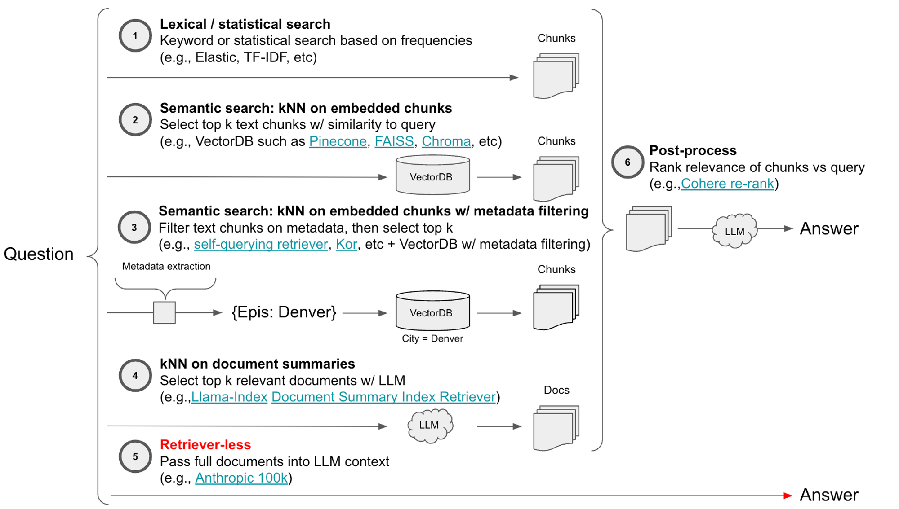
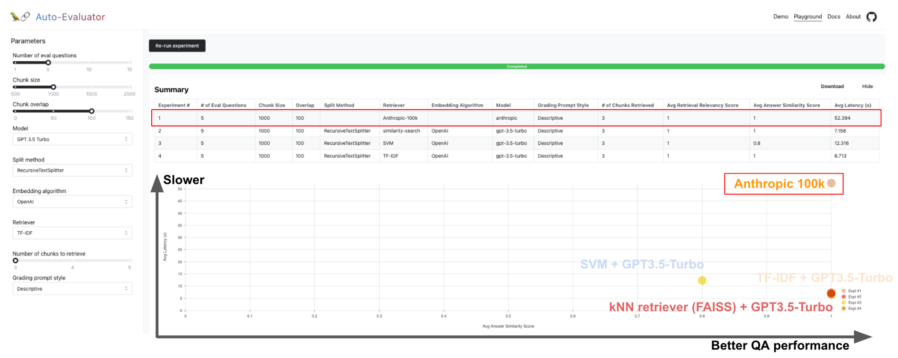
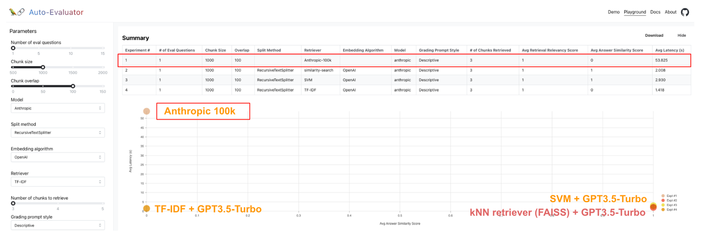
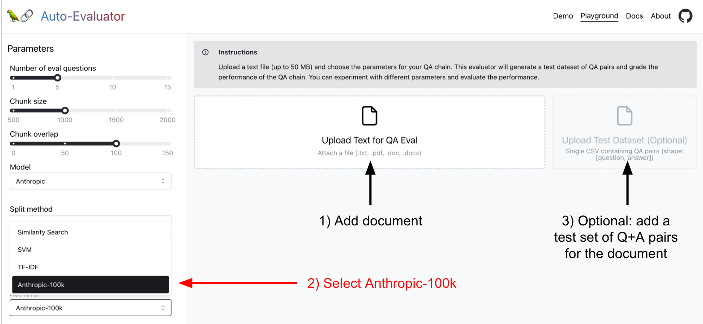

[Lance Martin](https://twitter.com/RLanceMartin?ref=blog.langchain.com)

### Retrieval Architectures

LLM question answering (Q+A) typically involves **retrieval** of documents relevant to the question followed by **synthesis** of the retrieved chunks into an answer by an LLM.  In practice, the retrieval step is necessary because the LLM context window is limited relative to the size of most text corpus of interest (e.g., LLM context windows range from ~2k-4k tokens for many models and [up 8k-32k for GPT4](https://www.reddit.com/r/ChatGPT/comments/125fi1h/gpt4_context_window_and_token_limit/?ref=blog.langchain.com)). Anthropic [recently released](https://www.anthropic.com/index/100k-context-windows?ref=blog.langchain.com) a Claude model with a 100k token context window.  With the advent of models with larger context windows, it is reasonable to wonder whether the document retrieval stage is necessary for many Q+A or chat use-cases.

Here’s a taxonomy of retriever architectures with this retriever-less option highlighted:

- **Lexical / Statistical**: [TF-IDF](https://towardsdatascience.com/tf-idf-explained-and-python-sklearn-implementation-b020c5e83275?ref=blog.langchain.com), [Elastic](https://www.elastic.co/what-is/elasticsearch?ref=blog.langchain.com), etc
- **Semantic**: [Pinecone](https://support.pinecone.io/hc/en-us/articles/9500075821981-Differences-between-Lexical-and-Semantic-Search-regarding-relevancy?ref=blog.langchain.com), [Chroma](https://www.trychroma.com/?ref=blog.langchain.com), etc
- **Semantic with metadata filtering**: [Pinecone](https://docs.pinecone.io/docs/metadata-filtering?ref=blog.langchain.com), etc with filtering tools ( [self-querying](https://python.langchain.com/docs/modules/data_connection/retrievers/how_to/self_query/?ref=blog.langchain.com), [kor](https://github.com/eyurtsev/kor?ref=blog.langchain.com), etc)
- **kNN on document summaries**: [Llama-Index](https://www.google.com/url?q=https://medium.com/llamaindex-blog/a-new-document-summary-index-for-llm-powered-qa-systems-9a32ece2f9ec&sa=D&source=editors&ust=1683909530941725&usg=AOvVaw2Sonxx4fbHJe7EnvuxOrPi), etc
- **Post-processing**: [Cohere re-rank](https://txt.cohere.com/rerank/?ref=blog.langchain.com), etc
- **Retriever-less**: Anthropic [100k context](https://www.anthropic.com/index/100k-context-windows?ref=blog.langchain.com) window, etc

### Evaluation strategy

We previously introduced [auto-evaluator](https://blog.langchain.com/auto-evaluator-opportunities/), a [hosted app](https://autoevaluator.langchain.com/playground?ref=blog.langchain.com) and [open-source](https://github.com/langchain-ai/auto-evaluator?ref=blog.langchain.com) repo for grading LLM question-answer chains. This provides an good testing ground for comparing Anthropic 100k for Q+A against other retrieval methods, such as kNN on a VectorDB, [SVMs](https://github.com/karpathy/randomfun/blob/master/knn_vs_svm.ipynb?ref=blog.langchain.com), etc.

### Results

On a test set of 5 questions for the 75 page GPT3 paper ( [here](https://github.com/langchain-ai/auto-evaluator/tree/main/api/docs/gpt3?ref=blog.langchain.com)), we see that the `Anthropic 100k` model performs as well as `kNN (FAISS) + GPT3.5-Turbo`. Of course, this is impressive because the full pdf doc is simply passed to Anthropic 100k directly in the prompt. But, we can also see that this comes at the cost of latency (e.g., ~50s for `Anthropic 100k` vs < ~10s for others).

We also tested on a 51 page PDF of [building codes](https://www.notion.so/906c128e8d494c33a642667d12316473?ref=blog.langchain.com) for San Francisco and asked a specific permitting question that [has been used in prior evals](https://www.notion.so/906c128e8d494c33a642667d12316473?ref=blog.langchain.com). Here we see `Anthropic 100k` fall short of SVM and kNN retrievers; see the detailed results [here](https://docs.google.com/spreadsheets/d/1zYZt0rmyKMUTySz-meEQGLy3uEGGUeCIonWqSzEm04o/edit?usp=sharing&ref=blog.langchain.com). `Anthropic 100k` produces a more verbose and close-to-correct answer (stating that a permit is required for a backyard shed > 120 sqft whereas the correct answer is > 100 sqft). One drawback of retriever-less architectures is that we cannot inspect the retrieved chunks to debug why model yielded the incorrect answer.

### Testing for yourself

We have deployed Anthropic 100k in [our hosted app](https://autoevaluator.langchain.com/?ref=blog.langchain.com), so you can try it for yourself and benchmark it relative to other approaches. See our [README](https://github.com/langchain-ai/auto-evaluator?ref=blog.langchain.com) for more details, but in short:

- Add a document of interest
- Select `Anthropic-100k` retriever
- Optionally, add your own test set (the app will [auto-generate one](https://blog.langchain.com/auto-evaluator-opportunities/) if you do not supply it)

### Conclusion

The retriever-less architecture is compelling due to its simplicity and promising performance on a few challenges that we have tried. Of course, there are a few caveats: 1) it has higher latency than retriever-based approaches and 2) many (e.g., production) applications will have a corpus that is still far larger than the 100k token context window. For applications where latency is not critical and corpus is reasonably small (Q+A over a small set of docs), retriever-less approaches have appeal, especially as the context window of LLMs grows and the models get faster.

### Tags

[By LangChain](https://blog.langchain.com/tag/by-langchain/)

[**Evaluating Deep Agents: Our Learnings**](https://blog.langchain.com/evaluating-deep-agents-our-learnings/)

[By LangChain](https://blog.langchain.com/tag/by-langchain/) 7 min read

[**Introducing End-to-End OpenTelemetry Support in LangSmith**](https://blog.langchain.com/end-to-end-opentelemetry-langsmith/)

[By LangChain](https://blog.langchain.com/tag/by-langchain/) 3 min read

[**LangChain State of AI 2024 Report**](https://blog.langchain.com/langchain-state-of-ai-2024/)

[By LangChain](https://blog.langchain.com/tag/by-langchain/) 6 min read

[**Introducing OpenTelemetry support for LangSmith**](https://blog.langchain.com/opentelemetry-langsmith/)

[By LangChain](https://blog.langchain.com/tag/by-langchain/) 4 min read

[**Easier evaluations with LangSmith SDK v0.2**](https://blog.langchain.com/easier-evaluations-with-langsmith-sdk-v0-2/)

[By LangChain](https://blog.langchain.com/tag/by-langchain/) 4 min read

[**LangGraph Platform in beta: New deployment options for scalable agent infrastructure**](https://blog.langchain.com/langgraph-platform-announce/)

[By LangChain](https://blog.langchain.com/tag/by-langchain/) 4 min read