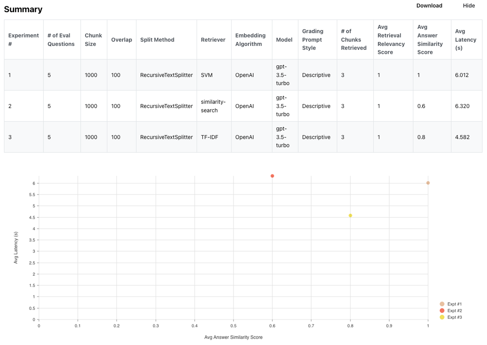

**Editor's Note: this is a guest blog post by [Lance Martin](https://twitter.com/RLanceMartin?s=20&ref=blog.langchain.com).**

### **TL;DR**

We recently open-sourced an [auto-evaluator](https://blog.langchain.com/auto-eval-of-question-answering-tasks/) tool for grading LLM question-answer chains. We are now releasing an [open source](https://github.com/langchain-ai/auto-evaluator?ref=blog.langchain.com), free to use [hosted app](https://autoevaluator.langchain.com/?ref=blog.langchain.com) and [API](https://github.com/langchain-ai/auto-evaluator/tree/main/api?ref=blog.langchain.com) to expand usability. Below we discuss a few opportunities to further improve this.

### **Context**

Document [Question-Answering](https://python.langchain.com/docs/use_cases/question_answering?ref=blog.langchain.com) is a popular LLM use-case. LangChain makes it easy to assemble LLM components (e.g., models and retrievers) into chains that support question-answering: input documents are split into chunks and stored in a retriever, relevant chunks are retrieved given a user `question` and passed to an LLM for synthesis into an `answer`.

### Problem

The quality of QA systems can vary considerably; [we have seen](https://www.notion.so/Lex-GPT-a3ad671766d34f4a9a078da7adf9d382?ref=blog.langchain.com) cases of hallucination and poor answer quality due specific parameter settings. But, it is not always obvious to (1) evaluate the answer quality and (2) use this evaluation to guide improved QA chain settings (e.g., chunk size, retrieved docs count) or components (e.g., model or retriever choice).

### **App**

The `auto-evaluator` aims to address these limitations. It is inspired by work in two areas: 1) recent [work](https://storage.ghost.io/c/97/88/97889716-a759-46f4-b63f-4f5c46a13333/content/files/abs/2212.xml?ref=blog.langchain.com) from Anthropic has used model-written evaluation sets and 2) OpenAI [has shown](https://github.com/openai/evals/blob/main/evals/registry/modelgraded/closedqa.yaml?ref=blog.langchain.com)  model-graded evaluation. This app combines both of these ideas into a single workspace, auto-generating a QA test set for a given input doc and auto-grading the result of the user-specified QA chain. Langchain’s abstraction make it easy to configure QA with modular components for testing (show in colors below).

### **Usage**

We are now releasing an [open source](https://github.com/langchain-ai/auto-evaluator?ref=blog.langchain.com), free to use [hosted app](https://autoevaluator.langchain.com/?ref=blog.langchain.com) and [API](https://github.com/langchain-ai/auto-evaluator/tree/main/api?ref=blog.langchain.com) to expand usability. The app can be used in two ways (see the [README](https://github.com/langchain-ai/auto-evaluator?ref=blog.langchain.com) for more details):

- `Demo`: We pre-loaded a document (a [transcript](https://youtu.be/OYsYgzzsdT0?ref=blog.langchain.com) of the Lex Fridman podcast with Andrej Karpathy) and a set of 5 [question-answer pairs](https://github.com/langchain-ai/auto-evaluator/blob/main/api/docs/karpathy-lex-pod/karpathy-pod-eval.csv?ref=blog.langchain.com) from the podcast. You can configure QA chain(s) and run experiments to evaluate the relative performance.
- `Playground`: Inspired by the [nat.dev](https://blog.langchain.com/auto-evaluator-opportunities/nat.dev) playground, a user can input a document to evaluate various QA chan(s) on. Optionally, a user can include a test set of question-answer pairs related to the document; see examples [here](https://github.com/langchain-ai/auto-evaluator/tree/main/api/docs/karpathy-lex-pod?ref=blog.langchain.com) and [here](https://github.com/langchain-ai/auto-evaluator/tree/main/api/docs/gpt3?ref=blog.langchain.com).

### **Opportunities** for improvement

**File handling**

File transfer from client to back-end is slow. For 2 files (39MB), the transfer is ~40 sec:

|  | Prod | Local |
| --- | --- | --- |
|  | OAI embedding | OAI embedding |
| Stage | Elapsed time | Elapsed time |
| Transfer file | 37 sec | 0 sec |
| Reading file | 5 sec | 1 sec |
| Splitting docs | 3 sec | 3 sec |
| Making LLM | 1 sec | 1 sec |
| Make retriever | 6 sec | 2 sec |
| Success | ✅ | ✅ |

Images bloat the files and may be be stripped prior to transfer from the client:

|  | Prod | Prod | Prod | Prod |
| --- | --- | --- | --- | --- |
|  | 1.3 MB, 40 pg | 3.5 MB, 42 pg | 7.7MB, 42 pg | 32MB, 54 pg |
| Stage | Elapsed time | Elapsed time | Elapsed time | Elapsed time |
| Transfer file | 1 sec | 3 sec | 5 sec | 35 sec |
| Reading file | 5 sec | 4 sec | 6 sec | 7 sec |
| Splitting docs | 0 sec | 0 sec | 0 sec | 1 sec |
| Making LLM | 1 sec | 1 sec | 1 sec | 1 sec |
| Make retriever | 3 sec | 3 sec | 3 sec | 4 sec |
| Success | ✅ | ✅ | ✅ | ✅ |

**Model-written-evaluations**

[Anthropic](https://storage.ghost.io/c/97/88/97889716-a759-46f4-b63f-4f5c46a13333/content/files/abs/2212.xml?ref=blog.langchain.com) and others have published on model-written evaluations. Here, we do something extremely naive for the sake of speed: we [pick random selections](https://github.com/langchain-ai/auto-evaluator/blob/43833787b2d754321da6ff0637bf130e0986b498/api/evaluator_app.py?ref=blog.langchain.com#L48) of the input context and generate QA pairs from them. See more detail in our blog post [here](https://blog.langchain.com/auto-eval-of-question-answering-tasks/). There is opportunity to improve on this considerably (e.g., questions informed by the overall context of the input).

**Retrievers**

The LangChain [retriever abstraction](https://blog.langchain.com/retrieval/) includes several approaches for document retrieval. k-Nearest Neighbor look-up on embeddings from vectorDBs (e.g., [FAISS](https://github.com/facebookresearch/faiss?ref=blog.langchain.com), [Chroma](https://www.trychroma.com/?ref=blog.langchain.com), etc) is a popular approach, but there are alternatives. For example, Karpathy recently discussed using [SVMs](https://twitter.com/karpathy/status/1647025230546886658?s=20&ref=blog.langchain.com) as a retriever and statistical approaches like [TF-IDF](https://en.wikipedia.org/wiki/Tf%E2%80%93idf?ref=blog.langchain.com) are options to consider. Auto-evaluator makes it easy to add and / or test various retrievers. We built a test set composed of 15 papers from Kipply’s excellent [transformer taxonomy](https://kipp.ly/blog/transformer-taxonomy/?ref=blog.langchain.com). Here is the test set, which of course could be improved:

| Question | Answer |
| --- | --- |
| What corpus of data was GPT-3 trained on? | GPT-3 was trained on a 300B token dataset consisting mostly of filtered Common Crawl, along with some books, webtext and Wikipedia. |
| What is in-context learning? | The broad set of skills and pattern recognition abilities gained during pre-training can be used at inference time to perform novel tasks given only input-output examples without any weight update. It is a an emergent behavior in large language models (LMs). |
| How much better is Galatica than GPT-3 on LaTex equations? | On LaTeX equations, Galatica achieves a score of 68.2% versus the latest GPT-3’s 49.0%. |
| What was the BLOOM model trained on? | BLOOM was trained on the ROOTS corpus, a composite collection of 498 Hugging Face datasets amounting to 1.61 terabytes of text that span 46 natural languages and 13 programming languages. |
| What does the Chinchilla paper argue is important for compute optimal training? | Chinchilla paper finds that for compute-optimal training, the model size and the number of training tokens should be scaled equally: for every doubling of model size the number of training tokens should also be doubled. |

Here are the summary results. You can see the detailed results [here](https://docs.google.com/spreadsheets/d/1pfo_ChvSJgLNT-GuRJFZB02RNf2FHwS-DK-gjWBlCrU/edit?usp=sharing&ref=blog.langchain.com).

In short, both TF-IDF and SVM perform on par (and in fact, a bit better) than k-NN for this particular case. Of course, this is not always true, but the point is that retrieval has many options that are worth considering.

**Model-Graded Eval**

**Scoring prompts**

The central idea is to use a prompt to grade model-generated answers (and retrieved docs) relative to a ground truth  answer. We tested several prompts, which you can see [here](https://github.com/langchain-ai/auto-evaluator/blob/main/api/text_utils.py?ref=blog.langchain.com). You can see results (question, answer, and grade justification) from each prompt [here](https://docs.google.com/spreadsheets/d/1pfo_ChvSJgLNT-GuRJFZB02RNf2FHwS-DK-gjWBlCrU/edit?ref=blog.langchain.com#gid=1013204299) and summary:

| Prompt | Answer score (fraction correct) |
| --- | --- |
| Fast | 5 / 5 |
| Descriptive | 4 / 5 |
| Descriptive with bias | 5 / 5 |
| [https://github.com/openai/evals/blob/main/evals/registry/modelgraded/closedqa.yaml](https://github.com/openai/evals/blob/main/evals/registry/modelgraded/closedqa.yaml?ref=blog.langchain.com) | 2 / 5 |

In short, answer scoring varies across prompts (e.g., OpenAI grading is the most stringent). Future work should focus on refining the prompts for model-graded-evaluation.

**Variability**

The app currently uses `GPT-3.5-turbo` as the grader, but discussion with OpenAI indicates that [GPT4 is preferable](https://twitter.com/RLanceMartin/status/1650544176772296704?s=20&ref=blog.langchain.com). Here is one example: the grader appears to be confused by a double negative and produces a non-deterministic output for the same input answer question.

| Experiment | Answer | Grade | Justification |
| --- | --- | --- | --- |
| 1 | A building permit is not required for a one-story detached accessory building or structure used as a tool and storage shed, playhouse, or similar use, provided the projected roof area does not exceed 100 square feet. | GRADE: Incorrect | JUSTIFICATION: The student answer is incorrect because it states that a building permit is not required for a structure with a projected roof area of 100 square feet or less, while the true answer states that a permit is required for any structure larger than 100 square feet. |
| 2 | A building permit is not required for one-story detached accessory buildings or structures used as tool and storage sheds, playhouses, and similar uses, provided the projected roof area does not exceed 100 square feet (9.29 m2). | GRADE: Correct | JUSTIFICATION: The student answer accurately states that a building permit is not required for structures under 100 square feet, which is true. |

### Conclusion

Feel free to contribute to the [open source](https://github.com/langchain-ai/auto-evaluator?ref=blog.langchain.com) repo or test the free [hosted app](https://autoevaluator.langchain.com/?ref=blog.langchain.com). Contributions related to file handling, prompts (e.g., for QA generation, grading, or QA), models (e.g., addition of open source models from Hugging Face), or retrievers are a few of the highest impact areas.

### Tags

[By LangChain](https://blog.langchain.com/tag/by-langchain/)

[**Evaluating Deep Agents: Our Learnings**](https://blog.langchain.com/evaluating-deep-agents-our-learnings/)

[By LangChain](https://blog.langchain.com/tag/by-langchain/) 7 min read

[**Introducing End-to-End OpenTelemetry Support in LangSmith**](https://blog.langchain.com/end-to-end-opentelemetry-langsmith/)

[By LangChain](https://blog.langchain.com/tag/by-langchain/) 3 min read

[**LangChain State of AI 2024 Report**](https://blog.langchain.com/langchain-state-of-ai-2024/)

[By LangChain](https://blog.langchain.com/tag/by-langchain/) 6 min read

[**Introducing OpenTelemetry support for LangSmith**](https://blog.langchain.com/opentelemetry-langsmith/)

[By LangChain](https://blog.langchain.com/tag/by-langchain/) 4 min read

[**Easier evaluations with LangSmith SDK v0.2**](https://blog.langchain.com/easier-evaluations-with-langsmith-sdk-v0-2/)

[By LangChain](https://blog.langchain.com/tag/by-langchain/) 4 min read

[**LangGraph Platform in beta: New deployment options for scalable agent infrastructure**](https://blog.langchain.com/langgraph-platform-announce/)

[By LangChain](https://blog.langchain.com/tag/by-langchain/) 4 min read