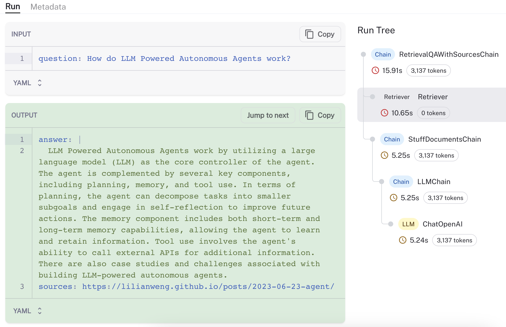
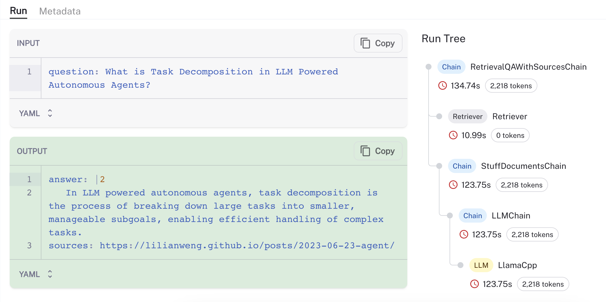
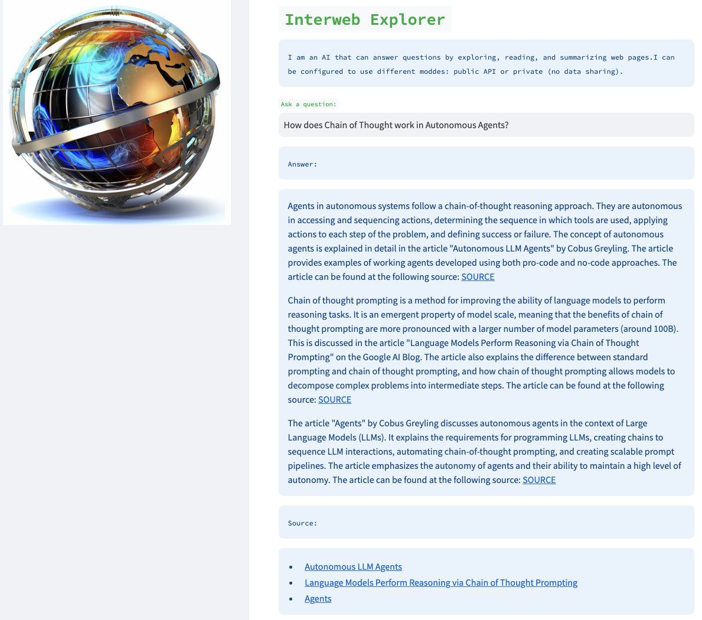

## Key Links

- [Web Researcher Repo](https://github.com/langchain-ai/web-explorer/tree/main?ref=blog.langchain.com)
- [New LangChain Retriever](https://github.com/langchain-ai/langchain/pull/8102?ref=blog.langchain.com) and [Documentation](https://python.langchain.com/docs/modules/data_connection/retrievers/web_research?ref=blog.langchain.com)
- [Hosted Streamlit App](https://web-explorer.streamlit.app/?ref=blog.langchain.com)

## Motivation

Web research is one of the killer LLM applications: Greg Kamradt [highlighted it as one of his top desired AI tools](https://twitter.com/GregKamradt/status/1679913813297225729?s=20&ref=blog.langchain.com) and OSS repos like [gpt-researcher](https://github.com/assafelovic/gpt-researcher?ref=blog.langchain.com) are growing in popularity. We decided to take a stab at it, initially setting out like many others to build a web research agent. But, we landed somewhere different: a fairly simple retriever proved to be effective and easily configurable (e.g., to run in private mode as popularized by projects like [PrivateGPT](https://github.com/imartinez/privateGPT?ref=blog.langchain.com)) . In this blog we talk about our exploration and thought process, how we built it, and the next steps.

## Exploration

Abovementioned projects like [gpt-researcher](https://github.com/assafelovic/gpt-researcher?ref=blog.langchain.com) and AI search engines ( [perplexity.ai](https://www.perplexity.ai/?ref=blog.langchain.com)) offer an early glimpse into how web research may be re-imagined. Like many, we first devised an agent that could be given a prompt, a set of tools, and then would set forth to scour the web [autonomously](https://github.com/Significant-Gravitas/Auto-GPT?ref=blog.langchain.com)! For this, it clearly needed tools to:

- Search and return pages
- Scrape the full content of the pages returned
- Extract relevant information from the pages

With those tools, the agent could approximate what a human does: search a topic, choose selected links, skim the link for useful pieces of information, and return to the search in an iterative exploration. We made an agent, gave it these tools ... but found it slowly fumbled thought the iterative search process, much like a human!

## Improvements

We noticed a central advantage that AIs can uniquely exploit: kick off many searches in parallel and, in turn, "read" many pages in parallel. Of course, this risks inefficiency if the first article in a sequential search has all of the necessary information. But for complex questions that warrant an AI researcher, this risk is somewhat mitigated. We added some [basic](https://python.langchain.com/docs/integrations/document_loaders/async_html?ref=blog.langchain.com) [tools](https://python.langchain.com/docs/integrations/document_transformers/html2text?ref=blog.langchain.com) to support this process.

With a heap of information collected in parallel from a set of pages, it seemed reasonable to fetch the most relevant chunks from each page and load them into the context window of an LLM for synthesis. Of course, at this point we realized that our agent was morphing into a retriever! (NOTE: we still think that agentic properties can further benefit this retriever, as discussed at the end.)

## Retrieval

What exactly would this retriever do under the hood? Our thinking was:

- Use an LLM to generate multiple relevant search queries (one LLM call)
- Execute a search for each query
- Choose the top K links per query  (multiple search calls in parallel)
- Load the information from all chosen links (scrape pages in parallel)
- Index those documents into a vectorstore
- Find the most relevant documents for each original generated search query

Collectively, these steps fall into [the flow](https://python.langchain.com/docs/use_cases/question_answering/?ref=blog.langchain.com) used for retrieval augmented generation:

And yet the logic is similar to the agentic architecture for [gpt-researcher](https://github.com/assafelovic/gpt-researcher?ref=blog.langchain.com):

Even though this isn't an agent, the similarity in logic is a useful sanity check on the approach. We created a new LangChain [retriever](https://github.com/langchain-ai/langchain/pull/8102?ref=blog.langchain.com) and provide documentation on [usage](https://python.langchain.com/docs/modules/data_connection/retrievers/web_research?ref=blog.langchain.com) with configurations. For an example question ( _How do LLM Powered Autonomous Agents work?_), we can use [LangSmith](https://blog.langchain.com/announcing-langsmith/) to visualize and validate the process (see trace [here](https://smith.langchain.com/public/a789cbad-648b-4dca-8d65-21edd66dbd58/r?ref=blog.langchain.com)), observing that the retriever loads and retrieves chunks from a reasonable source (Lilian Weng's blog [post on agents](https://lilianweng.github.io/posts/2023-06-23-agent/?ref=blog.langchain.com)):

As noted in the documentation, the same process can be trivially configured to run it "private" mode using, for example, [LlamaV2 and GPT4all embeddings](https://python.langchain.com/docs/modules/data_connection/retrievers/web_research?ref=blog.langchain.com) (below is a [trace](https://smith.langchain.com/public/39a1fa89-a7fc-4115-a0ec-67e4c087e492/r?ref=blog.langchain.com) from a run executed on my Mac M2 Max GPU ~50 tok / sec):

## Application

We wrapped the retriever with a simple [Streamlit](https://streamlit.io/?ref=blog.langchain.com) IU (only ~50 lines of code [here](https://github.com/langchain-ai/web-explorer/blob/main/web_explorer.py?ref=blog.langchain.com)) that can be configured with any LLM, vectorstore, and search tool of choice.

## Conclusion

What started as an attempt to build an autonomous web research agent, evolved into a fairly simple / efficient and customizable retriever. Still, this was just a first step. This project could benefit from adding in many agentic properties, such as:

- Asking an LLM if more information is needed after the initial search
- Using multiple "write" and "revision" agents to construct the final answer

If any of those additions sound interesting, please open a PR against the [base repo](https://github.com/langchain-ai/web-explorer/tree/main?ref=blog.langchain.com) and we'll work with you to get them in!

While hosted AI search from large models like [Bard](https://bard.google.com/?ref=blog.langchain.com) or [Perplexity.ai](https://www.perplexity.ai/?ref=blog.langchain.com) are extremely performant, smaller lightweight tools for web research also have important merits such as privacy (e.g., the ability to run locally on your laptop without sharing any data externally), configurability (e.g., the ability to select the specific open source components to use), and observability (e.g., peer into what is happening "under the hood" using tools such as LangSmith).

### Tags

[By LangChain](https://blog.langchain.com/tag/by-langchain/)

[**Evaluating Deep Agents: Our Learnings**](https://blog.langchain.com/evaluating-deep-agents-our-learnings/)

[By LangChain](https://blog.langchain.com/tag/by-langchain/) 7 min read

[**Introducing End-to-End OpenTelemetry Support in LangSmith**](https://blog.langchain.com/end-to-end-opentelemetry-langsmith/)

[By LangChain](https://blog.langchain.com/tag/by-langchain/) 3 min read

[**LangChain State of AI 2024 Report**](https://blog.langchain.com/langchain-state-of-ai-2024/)

[By LangChain](https://blog.langchain.com/tag/by-langchain/) 6 min read

[**Introducing OpenTelemetry support for LangSmith**](https://blog.langchain.com/opentelemetry-langsmith/)

[By LangChain](https://blog.langchain.com/tag/by-langchain/) 4 min read

[**Easier evaluations with LangSmith SDK v0.2**](https://blog.langchain.com/easier-evaluations-with-langsmith-sdk-v0-2/)

[By LangChain](https://blog.langchain.com/tag/by-langchain/) 4 min read

[**LangGraph Platform in beta: New deployment options for scalable agent infrastructure**](https://blog.langchain.com/langgraph-platform-announce/)

[By LangChain](https://blog.langchain.com/tag/by-langchain/) 4 min read