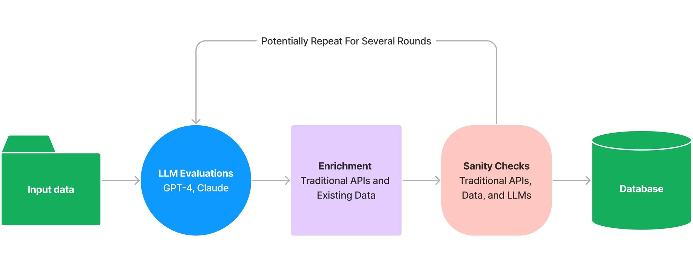

By [Jacob Lee](https://twitter.com/hacubu?lang=en&ref=blog.langchain.com)

Over the past few months, I had the opportunity to do some cool exploratory work for a client that integrated LLMs like GPT-4 and Claude into their internal workflow, rather than exposing them through a chat interface. The general idea was to take some input data, analyze it using an LLM, enrich the LLM's output using existing data sources, and then sanity check it using both traditional tools and LLMs. This process could repeat several times until finally storing a final result in a database. I've been thinking of it as a pipeline that mixes LLMs with more mundane APIs where the output of one step feeds directly into the next.



## **The Problem**

While building such pipelines, I quickly realized that while natural language is an excellent interface for a chatbot, it's quite a difficult one to use with existing APIs.

To illustrate this, let's say you wanted to generate and store a list of countries in Airtable. Naively asking an LLM `Give me a list of 5 countries` results in a numbered list of countries:

```text
'1. United States\n' +
'2. Canada\n' +
'3. United Kingdom\n' +
'4. Australia\n' +
'5. Japan'
```

There are a few problems here - while the above output happens to be a numbered list, there is no guarantee of that. Also, you would need to write some awkward custom string parsing logic to extract the data for use in the next step of the pipeline.

The solution is to prompt the LLM to output data in some structured format, but it's not quite that simple. For example, asking, `Give me a list of 5 countries, formatted as Airtable records` might result in something like this:

```text
'Airtable records require a unique ID and field values in a JSON format. Here is a list of 5 countries formatted as Airtable records:\n' +
'\n' +
'1. {\n' +
'  "id": "rec1",\n' +
'  "fields": {\n' +
'    "Country": "United States",\n' +
'    "Continent": "North America"\n' +
'  }\n' +
'}\n' +
'2. {\n' +
'  "id": "rec2",\n' +
'  "fields": {\n' +
'    "Country": "Canada",\n' +
'    "Continent": "North America"\n' +
'  }\n' +
'}\n' +
...
```

Though the LLM (in this case GPT-4) impressively knows the general schema of an Airtable record, this is even worse than the original attempt. There is conversational text at the top that must be parsed out, and the output format is still a numbered list. Additionally, the LLM has assumed the field names of your Airtable schema, which likely do not match your internal definitions.

I experimented with a few custom prompting strategies like `Output only an array of JSON objects containing X, Y, and Z`, but adding such language to all my prompts quickly became tedious. Furthermore, this was somewhat unreliable due to the non-deterministic nature of LLMs, particularly with long, complex prompts and higher temperatures.

## **The Solution**

I had already been using [LangChainJS](https://github.com/hwchase17/langchainjs?ref=blog.langchain.com), an open-source framework that helps with building complex applications around LLMs, for various pieces of the project. After asking around their Discord community, I discovered an elegant, built-in solution: [output fixing parsers](https://js.langchain.com/docs/modules/prompts/output_parsers/?ref=blog.langchain.com#output-fixing-parser)!

Output fixing parsers contain two components:

1. An easy, consistent way of generating output formatting instructions (using a popular TypeScript validation framework, [Zod](https://github.com/colinhacks/zod?ref=blog.langchain.com)).
2. An LLM-powered recovery mechanism for handling badly formatted outputs using a more focused prompt.

You could use one to solve the earlier problem like this (note that you will need to run `yarn add langchain` and `yarn add zod` if they aren't already in your dependencies):

```typescript
import { z } from "zod";
import { ChatOpenAI } from "langchain/chat_models/openai";
import { PromptTemplate } from "langchain/prompts";
import { LLMChain } from "langchain/chains";
import {
  StructuredOutputParser,
  OutputFixingParser
} from "langchain/output_parsers";

const outputParser = StructuredOutputParser.fromZodSchema(
  z.array(
    z.object({
      fields: z.object({
        Name: z.string().describe("The name of the country"),
        Capital: z.string().describe("The country's capital")
      })
    })
  ).describe("An array of Airtable records, each representing a country")
);

const chatModel = new ChatOpenAI({
  modelName: "gpt-4", // Or gpt-3.5-turbo
  temperature: 0 // For best results with the output fixing parser
});

const outputFixingParser = OutputFixingParser.fromLLM(
  chatModel,
  outputParser
);

const prompt = new PromptTemplate({
  template: `Answer the user's question as best you can:\n{format_instructions}\n{query}`,
  inputVariables: ['query'],
  partialVariables: {
    format_instructions: outputFixingParser.getFormatInstructions()
  }
});

// For those unfamiliar with LangChain, a class used to call LLMs
const answerFormattingChain = new LLMChain({
  llm: chatModel,
  prompt: prompt,
  outputKey: "records", // For readability - otherwise the chain output will default to a property named "text"
  outputParser: outputFixingParser
});

const result = await answerFormattingChain.call({
  query: "List 5 countries."
});

console.log(JSON.stringify(result.records, null, 2));
```

Clean and readable! And here's an example of what the results look like:

```typescript
[\
  {\
    "fields": {\
      "Name": "United States",\
      "Capital": "Washington, D.C."\
    }\
  },\
  {\
    "fields": {\
      "Name": "Canada",\
      "Capital": "Ottawa"\
    }\
  },\
  {\
    "fields": {\
      "Name": "Germany",\
      "Capital": "Berlin"\
    }\
  },\
  {\
    "fields": {\
      "Name": "Japan",\
      "Capital": "Tokyo"\
    }\
  },\
  {\
    "fields": {\
      "Name": "Australia",\
      "Capital": "Canberra"\
    }\
  }\
]
```

Success! The result will already be typed as an array of objects, so there's no need for `JSON.parse()` calls or any further parsing.

Note that the output fixing parser will throw an error if, for whatever reason, it can't generate an output matching the provided Zod schema. You could even pipe it directly into an Airtable API call!

## **Additional Tips**

Descriptions provided with `.describe()` are optional, but give the LLM helpful context when populating individual fields. The LLM will also use clues like the field name and the overall structure of the provided schema.

- If you're struggling to generate output in the right format, adding descriptions or tweaking the language in these descriptions can help.
- You can use different model instances in the output fixing parser and whatever chain you're using, allowing you to mix and match temperatures and even providers for best results.

## **Thanks for Reading!**

I hope this post helps you better use the power of LLMs in your projects!

I've actually enjoyed building with LLMs and specifically [LangChain](https://js.langchain.com/?ref=blog.langchain.com) so much that I recently joined their team, so expect to see more related content over the coming months! And if you have any questions or have ideas for what you'd like me to write about next, reach out to me on Twitter [@Hacubu](https://twitter.com/hacubu?lang=en&ref=blog.langchain.com). I'll be active in the JS channels of [LangChain's community Discord server](https://discord.com/invite/6adMQxSpJS?ref=blog.langchain.com) as well.

Happy prompting!

### Tags

[By LangChain](https://blog.langchain.com/tag/by-langchain/)


[](https://blog.langchain.com/evaluating-deep-agents-our-learnings/)

[**Evaluating Deep Agents: Our Learnings**](https://blog.langchain.com/evaluating-deep-agents-our-learnings/)

[By LangChain](https://blog.langchain.com/tag/by-langchain/) 7 min read

[](https://blog.langchain.com/end-to-end-opentelemetry-langsmith/)

[**Introducing End-to-End OpenTelemetry Support in LangSmith**](https://blog.langchain.com/end-to-end-opentelemetry-langsmith/)

[By LangChain](https://blog.langchain.com/tag/by-langchain/) 3 min read

[](https://blog.langchain.com/langchain-state-of-ai-2024/)

[**LangChain State of AI 2024 Report**](https://blog.langchain.com/langchain-state-of-ai-2024/)

[By LangChain](https://blog.langchain.com/tag/by-langchain/) 6 min read

[](https://blog.langchain.com/opentelemetry-langsmith/)

[**Introducing OpenTelemetry support for LangSmith**](https://blog.langchain.com/opentelemetry-langsmith/)

[By LangChain](https://blog.langchain.com/tag/by-langchain/) 4 min read

[](https://blog.langchain.com/easier-evaluations-with-langsmith-sdk-v0-2/)

[**Easier evaluations with LangSmith SDK v0.2**](https://blog.langchain.com/easier-evaluations-with-langsmith-sdk-v0-2/)

[By LangChain](https://blog.langchain.com/tag/by-langchain/) 4 min read

[](https://blog.langchain.com/langgraph-platform-announce/)

[**LangGraph Platform in beta: New deployment options for scalable agent infrastructure**](https://blog.langchain.com/langgraph-platform-announce/)

[By LangChain](https://blog.langchain.com/tag/by-langchain/) 4 min read